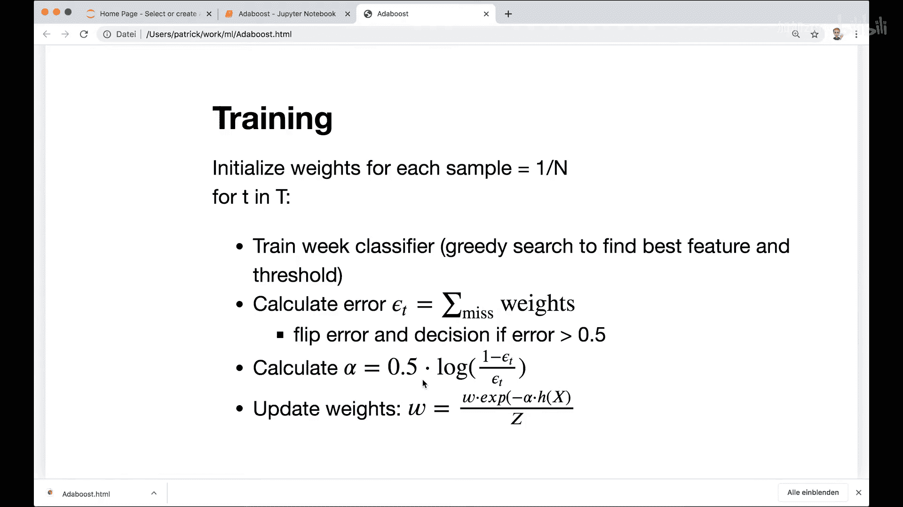
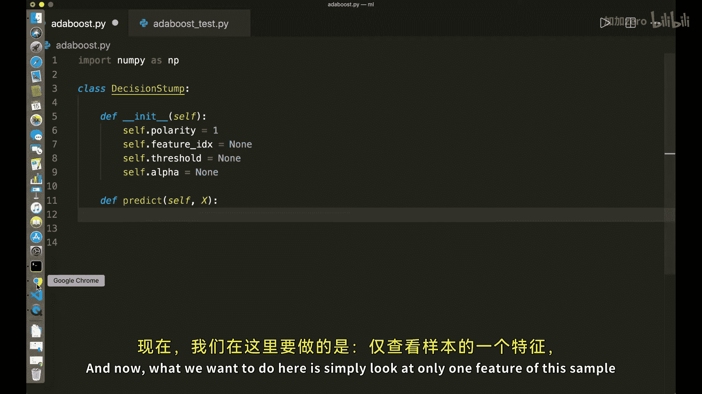
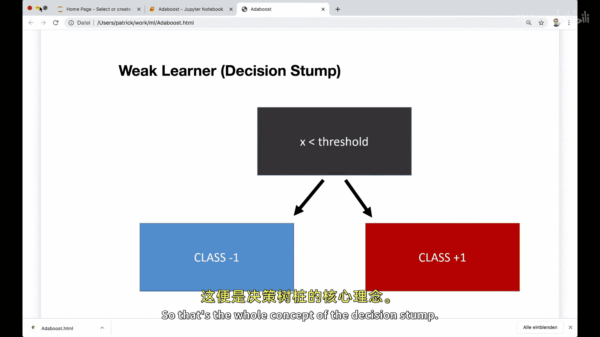
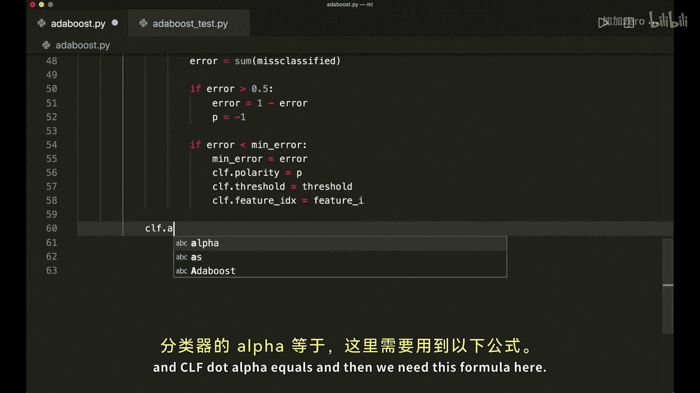
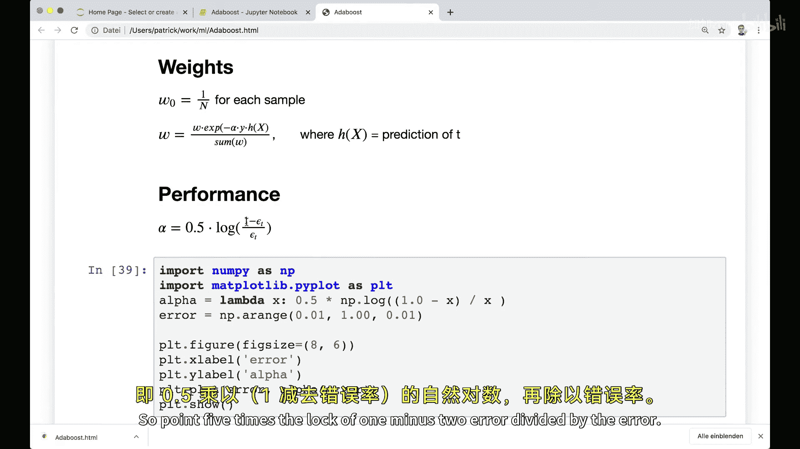
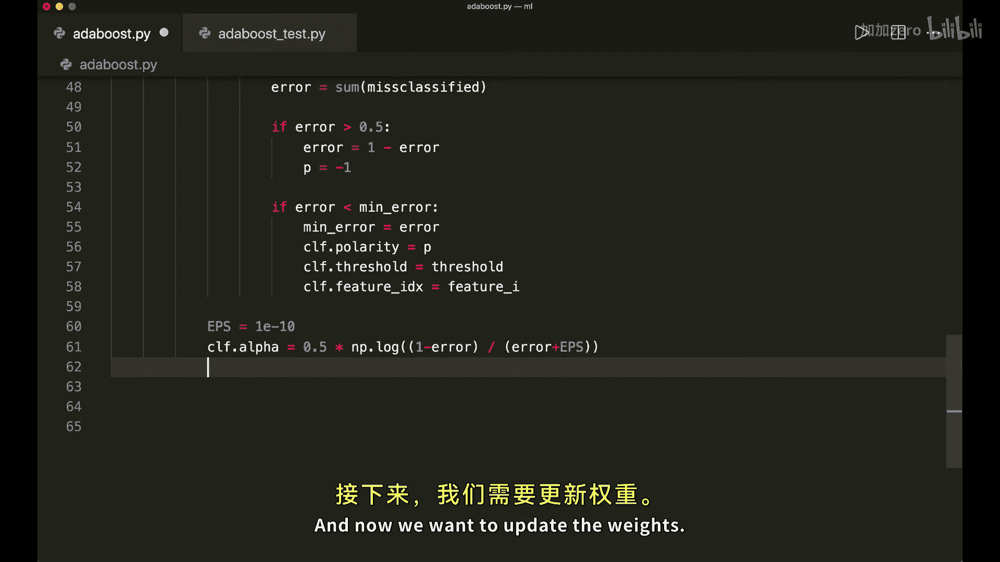
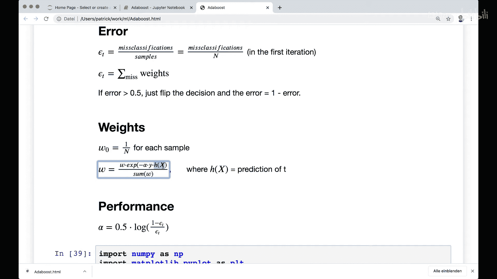
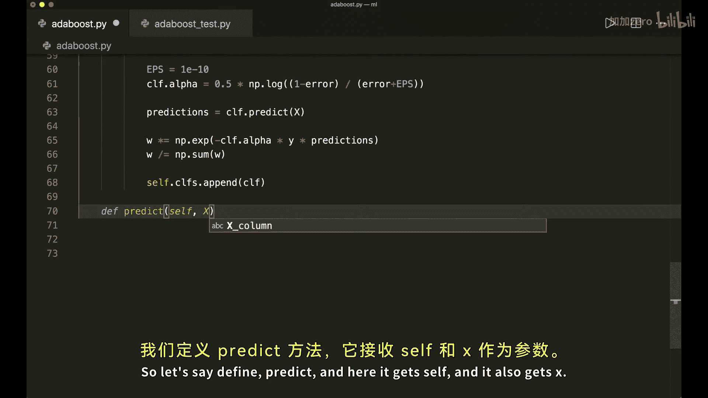
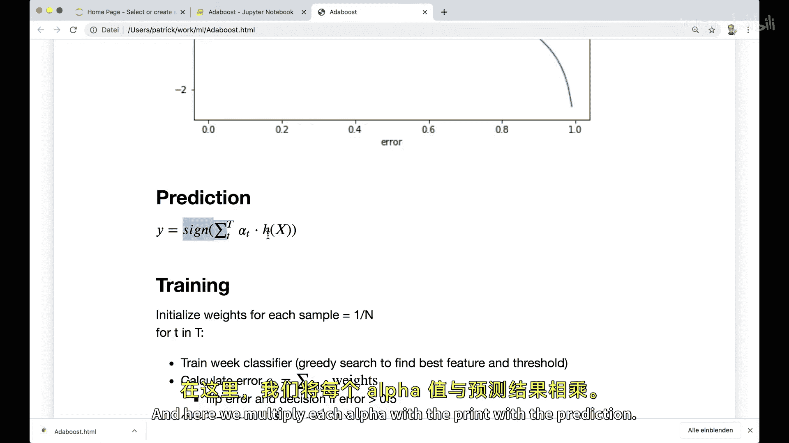
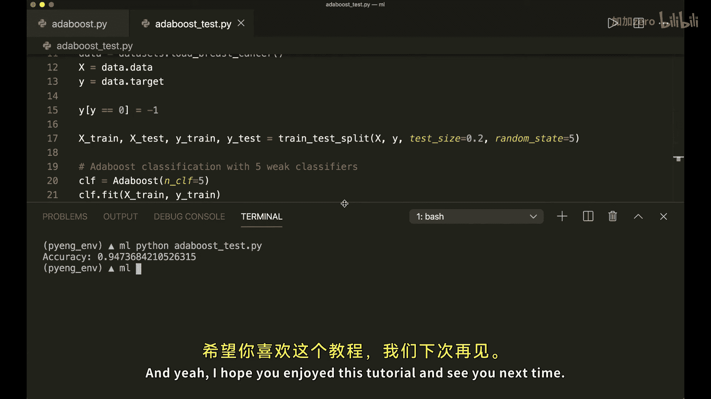

# 013：AdaBoost算法Python实现教程 🚀

在本节课中，我们将学习并实现AdaBoost算法。AdaBoost是一种集成学习方法，其核心思想是将多个“弱”分类器组合成一个“强”分类器。我们将仅使用NumPy和Python内置模块来完成代码实现。

## 概述 📖

AdaBoost采用“提升”方法。其基本流程是：首先训练一个弱分类器，然后根据其分类错误调整样本权重，使得被错误分类的样本在下一轮训练中获得更多关注。接着，基于新的权重训练下一个弱分类器。重复此过程，最后将所有弱分类器的预测结果进行加权投票，得到最终预测。

## 核心概念与数学原理 🔢

### 弱学习器：决策树桩
AdaBoost通常使用**决策树桩**作为弱学习器。决策树桩是一个仅做一次分裂的决策树，它只考察一个特征和一个阈值。

其预测规则可以用以下伪代码描述：
```python
if 特征值 < 阈值:
    预测为 -1
else:
    预测为 +1
```
或者根据“极性”进行翻转。

### 误差计算
初始时，每个样本的权重 `w_i` 被设置为 `1/N`，其中 `N` 是样本总数。

对于第一个分类器，误差 `E` 简单地计算为错误分类的样本数除以总样本数。

从第二个分类器开始，误差计算需考虑样本权重：
`E = sum(错误分类样本的权重)`

如果计算出的误差 `E > 0.5`，则需要“翻转”决策：将分类器的预测极性取反（即把-1和+1对调），同时误差更新为 `1 - E`。

### 分类器性能（Alpha）
每个弱分类器都有一个性能权重 `alpha`，它决定了该分类器在最终投票中的话语权。`alpha` 由以下公式计算：
`alpha = 0.5 * ln((1 - E) / E)`

其中 `ln` 是自然对数。误差 `E` 越小，`alpha` 值越大，意味着这个分类器越可靠，在最终决策中的权重越高。

### 权重更新规则
训练完一个分类器后，需要更新每个样本的权重，为下一个分类器的训练做准备。更新公式为：
`w_i_new = w_i_old * exp(-alpha * y_i * h(x_i))`

其中：
*   `y_i` 是样本的真实标签（-1或+1）。
*   `h(x_i)` 是当前弱分类器对样本的预测（-1或+1）。
*   `exp` 是指数函数。

更新后，需要对所有权重进行归一化，使其和为1。这个公式确保被错误分类的样本（`y_i * h(x_i)` 为负）会获得更高的权重。



### 最终预测
对于一个新的样本，最终的预测是所有弱分类器预测的加权和，再取符号：
`最终预测 = sign( sum( alpha_k * h_k(x) ) )`

即，每个弱分类器用自己的 `alpha` 加权投票，最后看加权和的符号是正还是负。

## 代码实现步骤 💻

上一节我们介绍了AdaBoost的核心数学原理，本节中我们来看看如何将这些步骤转化为具体的Python代码。





以下是完整的训练步骤，我们将据此编写代码：

1.  **初始化权重**：为每个训练样本分配初始权重 `1/N`。
2.  **循环训练弱分类器**：对于预设数量的弱分类器，进行以下操作：
    *   **训练决策树桩**：遍历所有特征和所有可能的阈值，找到能使加权误差最小的特征和阈值组合。
    *   **计算误差**：使用找到的最佳决策树桩计算加权误差 `E`。
    *   **误差翻转**：如果 `E > 0.5`，则翻转该决策树桩的预测极性和误差。
    *   **计算性能Alpha**：根据公式 `alpha = 0.5 * ln((1-E)/E)` 计算当前分类器的权重。
    *   **更新样本权重**：根据公式 `w_i = w_i * exp(-alpha * y_i * h(x_i))` 更新每个样本的权重，并进行归一化。
    *   **保存分类器**：将训练好的决策树桩（包含其特征索引、阈值、极性和alpha值）保存起来。
3.  **进行预测**：对于新样本，让所有保存的弱分类器进行预测，计算加权和 `sum(alpha_k * prediction_k)`，然后取该和的符号作为最终预测结果。

## Python代码实现 🐍

现在，让我们开始动手实现。首先，我们需要实现两个类：`DecisionStump`（决策树桩）和 `AdaBoost`。

### 1. 决策树桩类

这个类代表一个弱学习器，它根据单个特征和阈值做出决策。

```python
import numpy as np

class DecisionStump:
    def __init__(self):
        self.polarity = 1  # 决定预测规则的极性：1 表示“小于阈值为-1”， -1 表示“大于阈值为-1”
        self.feature_idx = None # 用于分裂的特征索引
        self.threshold = None   # 分裂阈值
        self.alpha = None       # 该分类器的权重（性能）

    def predict(self, X):
        """预测方法"""
        n_samples = X.shape[0]
        # 取出该决策树桩所使用的特征列
        X_column = X[:, self.feature_idx]

        # 初始化预测结果为全1数组
        predictions = np.ones(n_samples)

        # 根据极性应用不同的规则
        if self.polarity == 1:
            # 如果极性为1：特征值 < 阈值 的样本预测为 -1
            predictions[X_column < self.threshold] = -1
        else:
            # 如果极性为-1：特征值 > 阈值 的样本预测为 -1
            predictions[X_column > self.threshold] = -1

        return predictions
```

### 2. AdaBoost 类

这个类是算法的主体，负责协调多个弱分类器的训练和预测。

```python
class AdaBoost:
    def __init__(self, n_clf=5):
        self.n_clf = n_clf      # 弱分类器的数量
        self.clfs = []          # 用于存储训练好的决策树桩列表

    def fit(self, X, y):
        """训练方法"""
        n_samples, n_features = X.shape

        # 1. 初始化样本权重
        w = np.full(n_samples, (1 / n_samples))

        # 2. 循环训练多个弱分类器
        for _ in range(self.n_clf):
            clf = DecisionStump()
            min_error = float('inf') # 初始化最小误差为无穷大

            # 2.1 贪心搜索：寻找最佳特征和阈值
            for feature_i in range(n_features):
                X_column = X[:, feature_i]
                thresholds = np.unique(X_column) # 该特征所有唯一值作为候选阈值

                for threshold in thresholds:
                    # 尝试极性为1
                    polarity = 1
                    predictions = np.ones(n_samples)
                    predictions[X_column < threshold] = -1

                    # 计算加权误差
                    misclassified = w[y != predictions]
                    error = sum(misclassified)

                    # 如果误差大于0.5，则翻转极性和误差
                    if error > 0.5:
                        error = 1 - error
                        polarity = -1

                    # 如果找到更低的误差，则更新最佳参数
                    if error < min_error:
                        min_error = error
                        clf.polarity = polarity
                        clf.threshold = threshold
                        clf.feature_idx = feature_i

            # 2.2 计算该弱分类器的性能权重 alpha
            # 添加一个极小值 epsilon 防止除以0
            epsilon = 1e-10
            clf.alpha = 0.5 * np.log((1.0 - min_error + epsilon) / (min_error + epsilon))

            # 2.3 获取当前分类器的预测，用于更新权重
            predictions = clf.predict(X)

            # 2.4 更新样本权重
            # 根据公式: w_i = w_i * exp(-alpha * y_i * prediction_i)
            w *= np.exp(-clf.alpha * y * predictions)
            # 归一化权重，使其和为1
            w /= np.sum(w)

            # 2.5 保存训练好的弱分类器
            self.clfs.append(clf)

    def predict(self, X):
        """预测方法"""
        # 计算所有弱分类器的加权预测和
        # sum( alpha_k * h_k(x) )
        clf_preds = [clf.alpha * clf.predict(X) for clf in self.clfs]
        y_pred = np.sum(clf_preds, axis=0)

        # 取符号作为最终预测 (-1 或 1)
        y_pred = np.sign(y_pred)
        return y_pred
```

## 测试算法 ✅

我们已经完成了AdaBoost的核心实现，现在让我们用一个真实数据集来测试它的效果。

以下是一个简单的测试脚本：





```python
# test_adaboost.py
from sklearn import datasets
from sklearn.model_selection import train_test_split
from sklearn.metrics import accuracy_score
from adaboost import AdaBoost # 假设代码保存在 adaboost.py 文件中

# 1. 加载数据
bc = datasets.load_breast_cancer()
X, y = bc.data, bc.target

# 2. 将标签从 (0, 1) 转换为 (-1, 1)，这是AdaBoost的要求
y[y == 0] = -1





# 3. 划分训练集和测试集
X_train, X_test, y_train, y_test = train_test_split(X, y, test_size=0.2, random_state=42)

# 4. 创建并训练AdaBoost分类器
clf = AdaBoost(n_clf=5)
clf.fit(X_train, y_train)

# 5. 进行预测并计算准确率
y_pred = clf.predict(X_test)
acc = accuracy_score(y_test, y_pred)





print(f"AdaBoost 分类准确率: {acc:.3f}")
```
运行此脚本，你可能会看到类似 `AdaBoost 分类准确率: 0.947` 的输出，这表明我们的实现是有效的。

## 总结 🎯

本节课中，我们一起学习了AdaBoost算法的原理与实现。

*   **核心思想**：通过迭代训练多个弱分类器（决策树桩），并调整样本权重以关注难分类的样本，最后加权组合成一个强分类器。
*   **关键步骤**：包括初始化权重、贪心搜索最佳弱分类器、计算分类器权重 `alpha`、更新样本权重以及进行加权投票预测。
*   **代码实现**：我们使用纯NumPy实现了 `DecisionStump` 和 `AdaBoost` 两个类，完整地还原了算法流程。
*   **测试验证**：在乳腺癌数据集上的测试表明，即使只有5个弱分类器，我们的实现也能获得不错的分类性能。



AdaBoost是理解集成学习Boosting思想的经典算法。希望本教程能帮助你掌握其核心概念，并具备从零开始实现它的能力。