# 014：线性判别分析（LDA）Python实现

在本节课中，我们将要学习并实现线性判别分析算法。LDA是一种降维技术，也是机器学习流程中常用的预处理步骤。我们将仅使用Python和NumPy库来完成实现。

上一节我们介绍了主成分分析，本节中我们来看看另一种降维方法——线性判别分析。LDA与PCA有诸多相似之处，但核心目标不同。

## LDA核心概念

LDA的目标是特征降维，即将数据集投影到更低维度的空间，并寻求最佳的**类别分离**。

以下是PCA与LDA的核心区别：
*   **PCA（主成分分析）**：目标是找到新的坐标轴，使得数据投影后的**方差最大化**。这是一种**无监督**技术。
*   **LDA（线性判别分析）**：目标是找到新的坐标轴，使得不同**类别之间的分离度最大化**。这是一种**有监督**技术，因为我们需要知道数据的标签。

简单来说，PCA关心数据的“散布”情况，而LDA在关心数据“散布”的同时，更关注如何让不同类别的数据点分得更开。

## 数学原理

LDA的计算涉及两个关键矩阵：**类内散度矩阵**和**类间散度矩阵**。

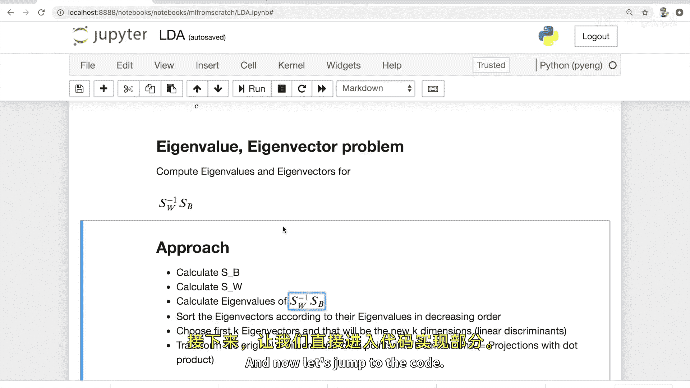

*   **类内散度矩阵**：确保同一类别内的数据点足够分散（方差大）。
    *   公式为：`S_W = Σ_c Σ_{x_i in c} (x_i - μ_c) (x_i - μ_c)^T`
    *   其中，`μ_c`是类别`c`中所有样本的均值向量。
*   **类间散度矩阵**：确保不同类别之间的均值差异足够大。
    *   公式为：`S_B = Σ_c n_c (μ_c - μ) (μ_c - μ)^T`
    *   其中，`n_c`是类别`c`的样本数，`μ`是所有样本的总体均值向量。

得到这两个矩阵后，我们需要求解以下特征值和特征向量问题：
`S_W^{-1} * S_B * w = λ * w`

求解出的特征向量（按对应特征值降序排列）被称为**线性判别式**。我们选择前`k`个特征向量，即可将原始数据投影到这`k`个新维度上。

## 算法步骤

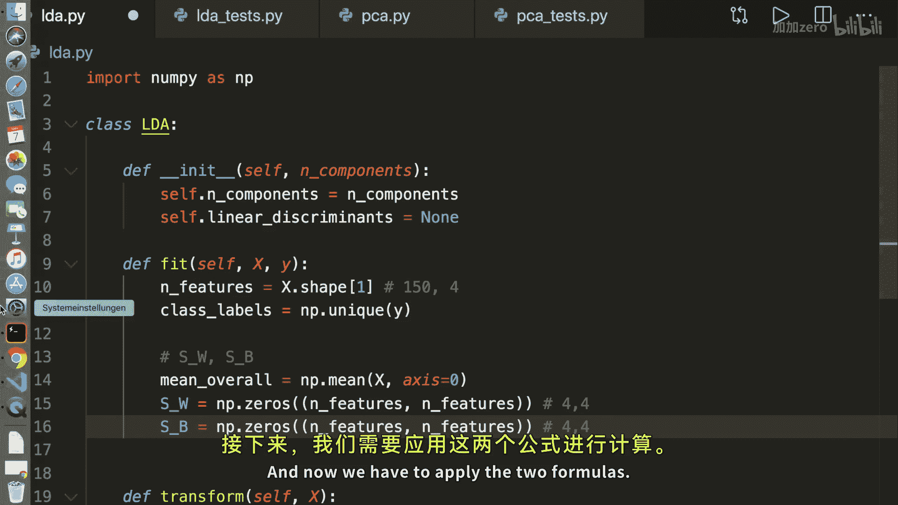

以下是LDA算法的完整步骤：
1.  计算**类内散度矩阵** `S_W` 和**类间散度矩阵** `S_B`。
2.  计算 `S_W` 的逆矩阵，并与 `S_B` 相乘得到矩阵 `A`。
3.  计算矩阵 `A` 的**特征值**和**特征向量**。
4.  将特征向量按照对应的特征值**降序排序**。
5.  选取前 `k` 个特征向量作为**线性判别式**。
6.  将原始数据点通过点乘运算**投影**到这 `k` 个新维度上。

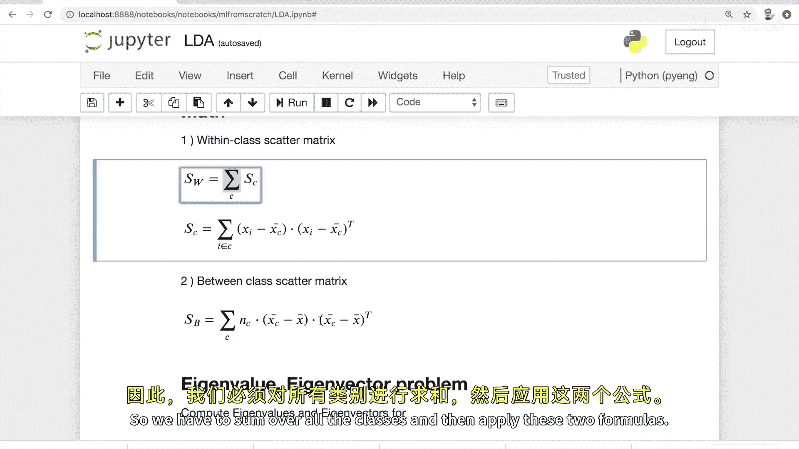

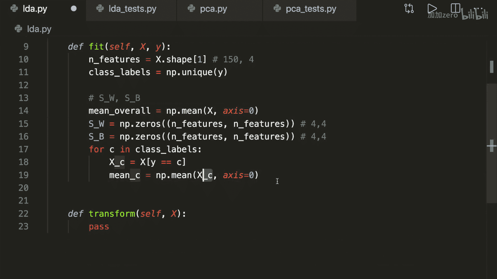

## Python代码实现

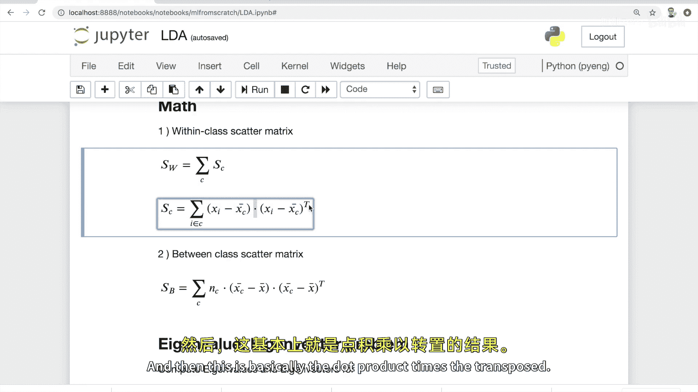

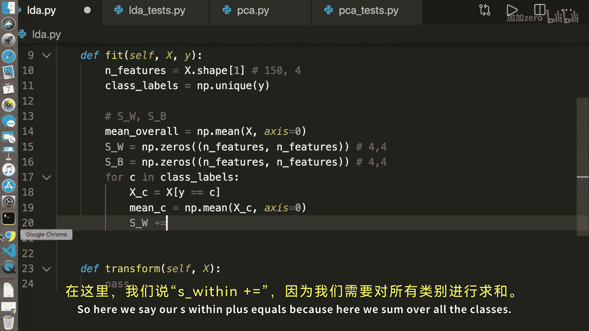

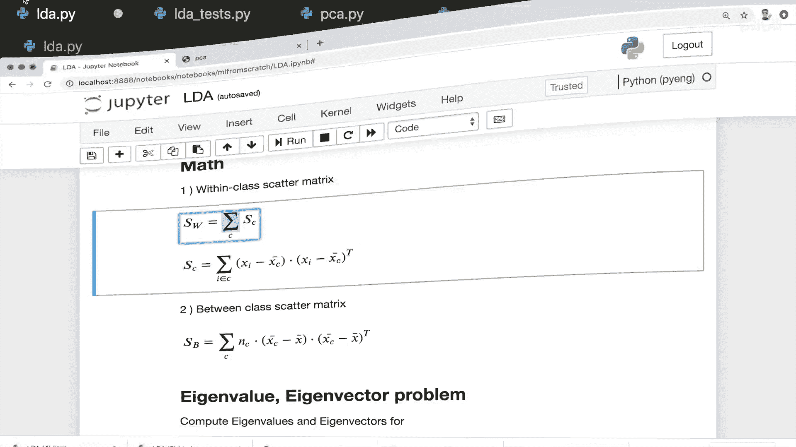

现在，让我们将上述步骤转化为代码。我们将创建一个名为 `LDA` 的类。

```python
import numpy as np

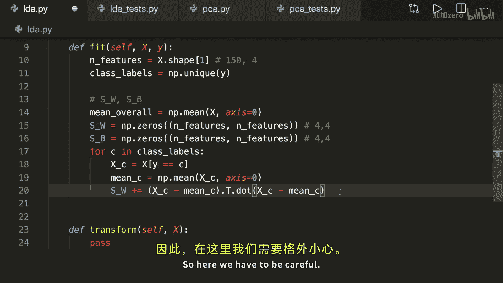

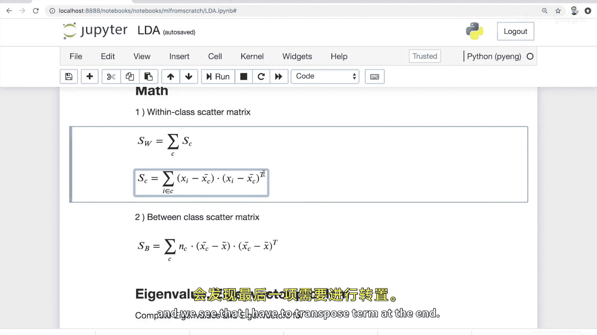

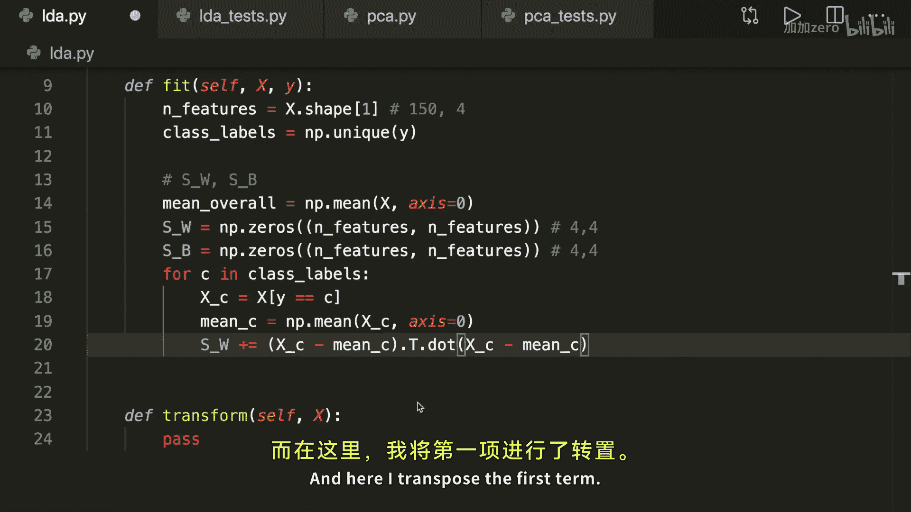

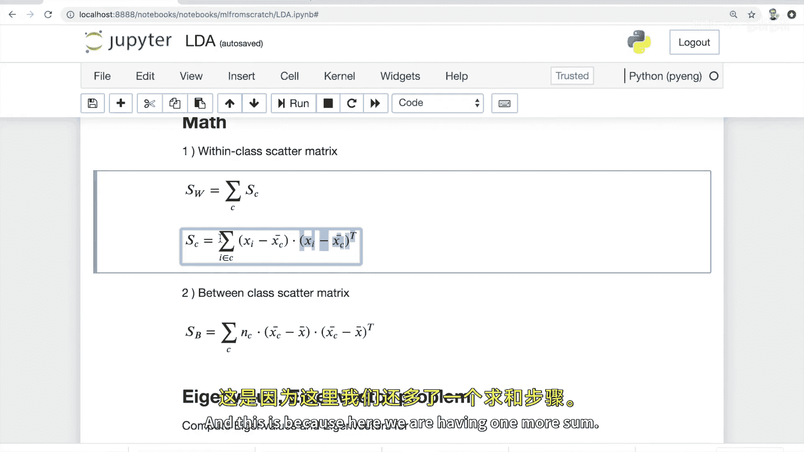

class LDA:
    def __init__(self, n_components):
        self.n_components = n_components
        self.linear_discriminants = None

    def fit(self, X, y):
        n_features = X.shape[1]
        class_labels = np.unique(y)

        # 计算总体均值
        mean_overall = np.mean(X, axis=0)

        # 初始化散度矩阵
        S_W = np.zeros((n_features, n_features))
        S_B = np.zeros((n_features, n_features))

        for c in class_labels:
            # 获取当前类别的所有样本
            X_c = X[y == c]
            # 计算当前类别的均值
            mean_c = np.mean(X_c, axis=0)

            # 计算类内散度矩阵 (公式: S_W += Σ (x - μ_c)^T (x - μ_c))
            # 注意维度变换，确保最终得到 n_features x n_features 的矩阵
            S_W += (X_c - mean_c).T.dot((X_c - mean_c))

            # 计算类间散度矩阵 (公式: S_B += n_c * (μ_c - μ)^T (μ_c - μ))
            n_c = X_c.shape[0]
            mean_diff = (mean_c - mean_overall).reshape(n_features, 1)
            S_B += n_c * (mean_diff).dot(mean_diff.T)

        # 求解广义特征值问题： S_W^{-1} S_B
        A = np.linalg.inv(S_W).dot(S_B)

        # 计算特征值和特征向量
        eigenvalues, eigenvectors = np.linalg.eig(A)
        # 转换特征向量矩阵，便于排序
        eigenvectors = eigenvectors.T

        # 按特征值降序排序
        idxs = np.argsort(abs(eigenvalues))[::-1]
        eigenvalues = eigenvalues[idxs]
        eigenvectors = eigenvectors[idxs]

        # 存储前 k 个线性判别式（特征向量）
        self.linear_discriminants = eigenvectors[0:self.n_components]

    def transform(self, X):
        # 将数据投影到线性判别式上
        return np.dot(X, self.linear_discriminants.T)
```

## 代码测试

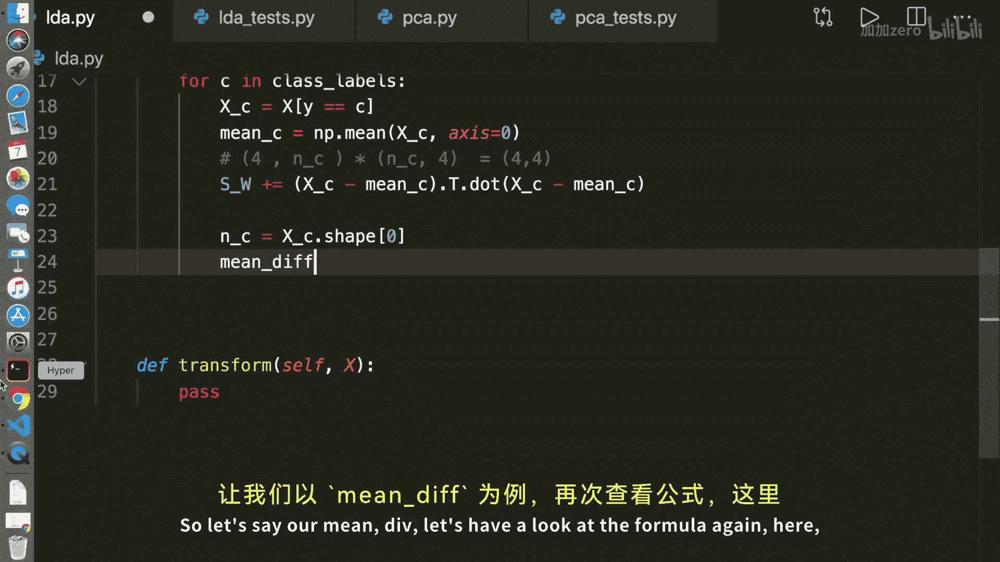

我们可以使用经典的鸢尾花数据集来测试我们的LDA实现。

```python
# 测试脚本示例 (lda_test.py)
import matplotlib.pyplot as plt
from sklearn import datasets
from lda import LDA  # 假设上面的类保存在 lda.py 文件中

# 加载数据
data = datasets.load_iris()
X = data.data
y = data.target

# 创建LDA模型并降维
lda = LDA(n_components=2)
lda.fit(X, y)
X_projected = lda.transform(X)

print('原始数据形状:', X.shape)
print('降维后数据形状:', X_projected.shape)

# 可视化结果
plt.figure()
plt.scatter(X_projected[:, 0], X_projected[:, 1],
            c=y, edgecolor='none', alpha=0.8,
            cmap=plt.cm.get_cmap('viridis', 3))
plt.xlabel('Linear Discriminant 1')
plt.ylabel('Linear Discriminant 2')
plt.colorbar()
plt.title('LDA of Iris Dataset')
plt.show()
```

运行测试脚本后，你将看到鸢尾花的三类数据在二维空间中被清晰地分离开来，这证明了我们的LDA实现是有效的。

## 总结

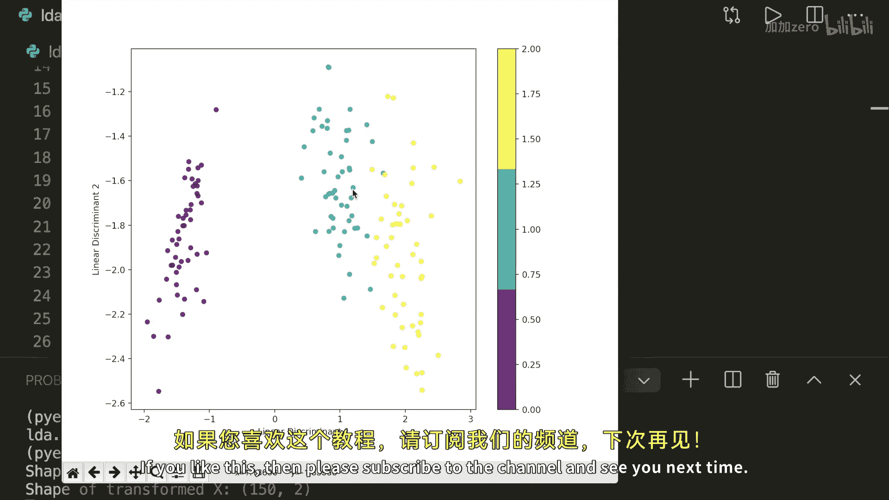

本节课中我们一起学习了线性判别分析。我们理解了LDA作为一种有监督降维方法，其核心目标是最大化类间分离度。我们推导了类内散度矩阵和类间散度矩阵的公式，并一步步实现了完整的LDA算法。最后，我们使用鸢尾花数据集验证了代码的正确性，成功将四维数据降至二维并保持了良好的类别区分。