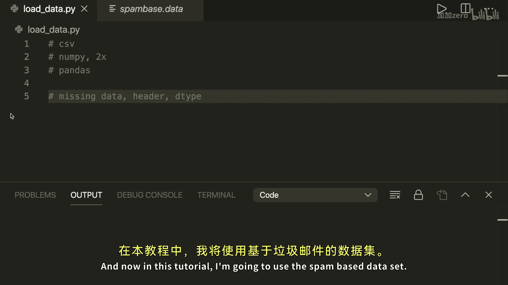
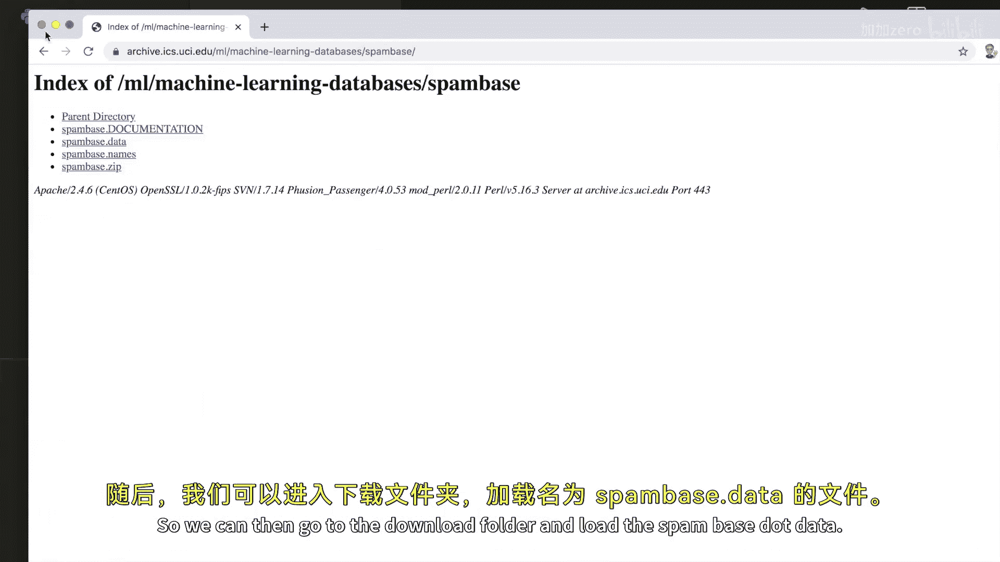
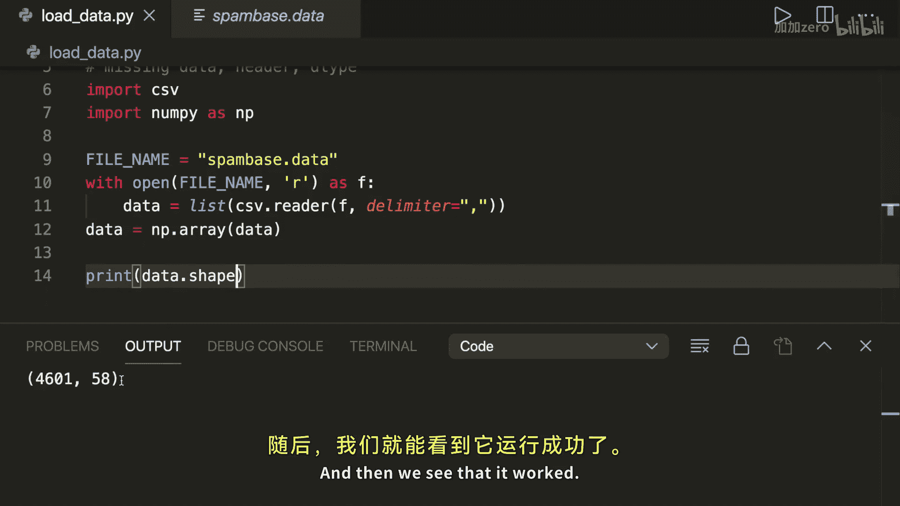
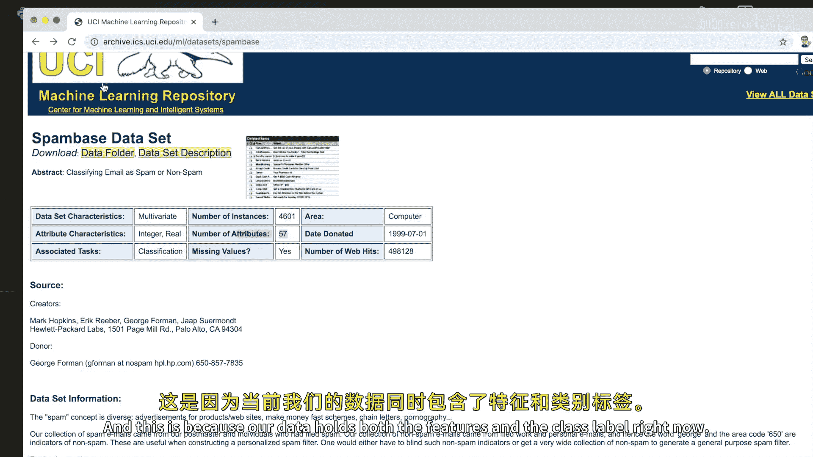
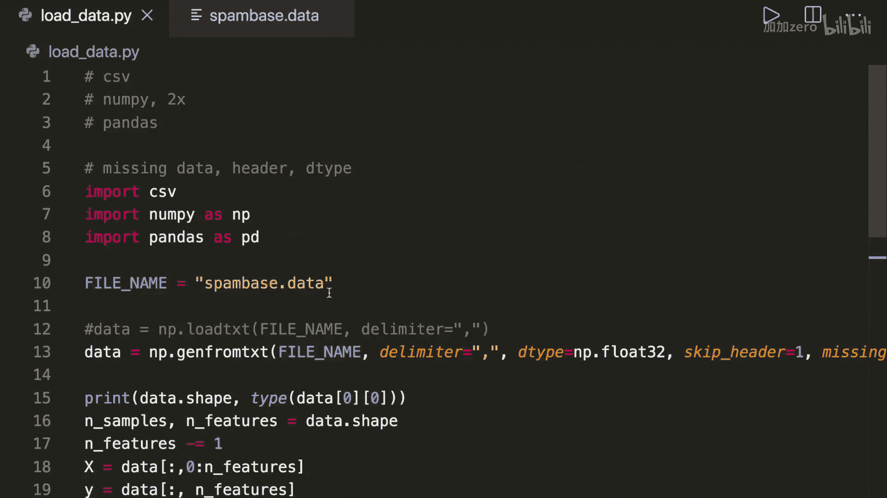

# 015：如何在Python中从文件加载机器学习数据 📁

在本节课中，我们将学习如何从文件中加载你自己的数据集到Python中。我们将介绍四种不同的方法：使用纯Python、两种使用NumPy的方法以及一种使用Pandas库的方法。此外，我们还将探讨如何处理数据头、缺失值以及如何指定正确的数据类型。

---

## 使用纯Python和CSV模块

首先，我们来看如何使用Python内置的`csv`模块加载数据。这种方法虽然直接，但通常比其他方法更慢且需要更多代码。



以下是具体步骤：
1.  导入`csv`模块。
2.  使用`open`函数以读取模式打开文件。
3.  使用`csv.reader`读取文件内容，并指定分隔符（本例中为逗号）。
4.  将读取器对象转换为列表。
5.  使用NumPy将列表转换为数组，以便后续处理。



```python
import csv
import numpy as np

filename = 'spambased.data'
with open(filename, 'r') as f:
    data = list(csv.reader(f, delimiter=','))

data = np.array(data)
print(data.shape)  # 输出数据形状
```

为了将数据拆分为特征（X）和标签（y），我们可以使用数组切片：



```python
n_samples, n_features = data.shape
n_features -= 1  # 最后一列是标签



X = data[:, :n_features]  # 所有行，前n_features列
y = data[:, -1]           # 所有行，最后一列
print(X.shape, y.shape)
```

---

## 使用NumPy加载数据

上一节我们手动处理了数据加载和分割。本节中我们来看看如何使用NumPy更高效地完成这个任务。NumPy提供了更简洁、更快速的方法。

### 方法一：`np.loadtxt`

`np.loadtxt`函数可以一行代码完成加载。

```python
import numpy as np

data = np.loadtxt('spambased.data', delimiter=',')
print(data.shape)
```

### 方法二：`np.genfromtxt`（推荐）

`np.genfromtxt`是更推荐的方法，因为它提供了更多参数来处理复杂情况，例如缺失值。

```python
data = np.genfromtxt('spambased.data', delimiter=',')
print(data.shape)
```

---

## 使用Pandas加载数据

如果你熟悉Pandas，使用它来加载数据也是一个非常好的选择。Pandas的`DataFrame`结构为数据操作提供了极大的灵活性。

以下是使用Pandas的步骤：
1.  导入`pandas`库。
2.  使用`pd.read_csv`函数读取文件。**注意**：如果文件没有表头，需要设置`header=None`。
3.  将`DataFrame`转换为NumPy数组以进行机器学习建模。

```python
import pandas as pd
import numpy as np

df = pd.read_csv('spambased.data', delimiter=',', header=None)
data = df.to_numpy()
print(data.shape)
```

---

## 处理数据加载中的常见问题

掌握了基本的数据加载方法后，我们还需要了解如何处理一些常见问题，以确保数据能被正确使用。

### 1. 指定数据类型

明确指定数据类型（如`np.float32`）是良好的实践，可以提升加载速度并避免自动推断可能导致的错误。

**在NumPy中：**
```python
data = np.genfromtxt('spambased.data', delimiter=',', dtype=np.float32)
```

**在Pandas中：**
```python
df = pd.read_csv('spambased.data', delimiter=',', header=None, dtype=np.float32)
```

如果需要后续转换：
```python
data = np.array(data, dtype=np.float32)
```

### 2. 跳过文件表头

如果数据文件包含描述性的表头行，需要在加载时跳过它。

**在NumPy中：**
使用`skip_header`参数。
```python
data = np.genfromtxt('file_with_header.csv', delimiter=',', skip_header=1)
```

**在Pandas中：**
使用`skiprows`参数。
```python
df = pd.read_csv('file_with_header.csv', delimiter=',', skiprows=1)
```

### 3. 处理缺失值

数据中可能存在空值或无效字符串，需要妥善处理。

**自动识别：** `np.genfromtxt`和`pd.read_csv`通常能自动将空值识别为`NaN`。

**指定缺失值标记：** 如果缺失值被标记为特定字符串（如`hello`），可以显式指定。

**在NumPy中：**
使用`missing_values`参数。
```python
data = np.genfromtxt('file.csv', delimiter=',', missing_values=['hello'], filling_values=0)
```

**在Pandas中：**
使用`na_values`参数指定，然后用`fillna`方法填充。
```python
df = pd.read_csv('file.csv', delimiter=',', na_values=['hello'])
df = df.fillna(0)
```

---

## 总结

本节课中我们一起学习了在Python中加载机器学习数据的多种方法：
1.  使用纯Python的`csv`模块进行基础加载。
2.  使用NumPy的`np.loadtxt`和更强大的`np.genfromtxt`函数。
3.  使用Pandas的`pd.read_csv`函数，并结合`DataFrame`进行操作。

对于大多数应用，我们推荐使用**NumPy的`np.genfromtxt`**或**Pandas的`pd.read_csv`**。关键是要记得：
*   **指定数据类型**以提升效率和准确性。
*   **正确处理表头**（`skip_header`/`skiprows`）。
*   **识别并填充缺失值**（`missing_values`/`na_values`与`filling_values`/`fillna`）。



确保数据被正确、完整地加载是成功构建机器学习模型的第一步。