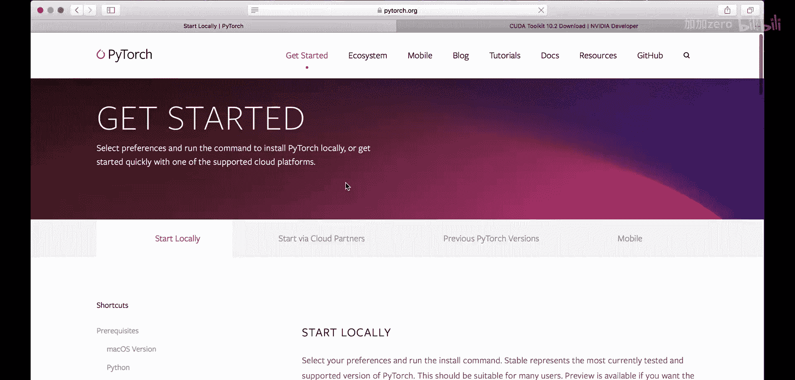
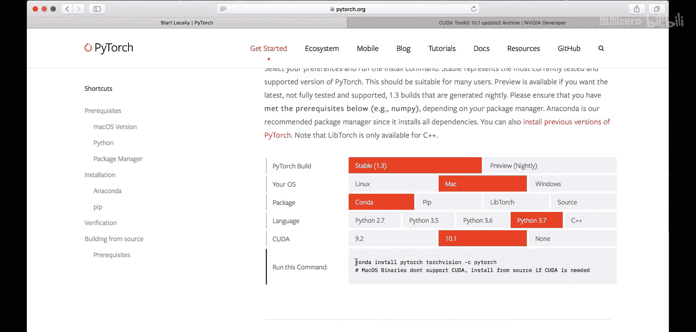
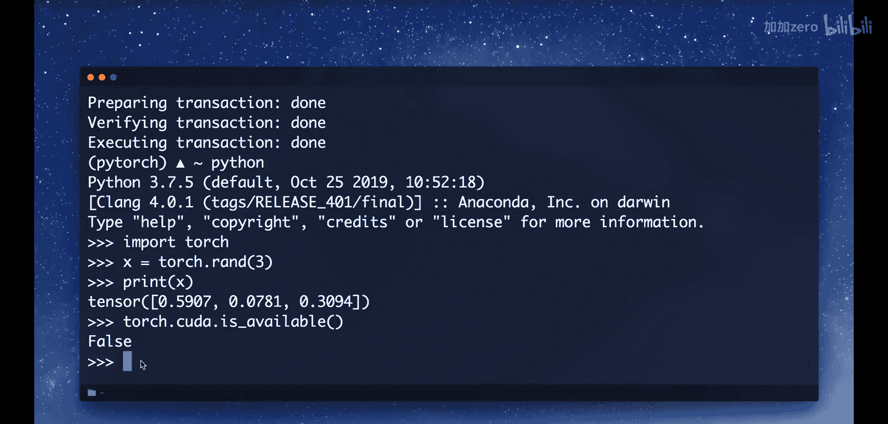

PyTorch入门教程：01：安装与环境配置 🚀

在本节课中，我们将学习如何安装PyTorch，这是一个非常流行的机器学习和深度学习框架。我们将从访问官方网站开始，根据你的操作系统和需求选择合适的安装选项，并最终验证安装是否成功。

---

### 访问官方网站

首先，我们需要访问PyTorch的官方网站：`pytorch.org`。在网站上，点击“Get Started”按钮开始安装流程。

### 选择配置

接下来，你需要根据你的系统配置进行选择。以下是具体步骤：

1.  **选择PyTorch版本**：目前最新版本是1.3，请选择它。
2.  **选择操作系统**：根据你的电脑系统选择，例如Windows、macOS或Linux。
3.  **选择包管理器**：强烈推荐使用Anaconda进行安装和管理。如果你还没有安装Anaconda，可以参考其他教程进行安装。
4.  **选择Python版本**：建议选择最新的Python 3.7版本。
5.  **选择计算平台**：
    *   对于macOS用户，目前只能安装CPU版本。
    *   对于Windows或Linux用户，如果你的电脑配备了NVIDIA GPU并希望使用GPU加速，则需要额外安装CUDA工具包。

### 关于CUDA工具包

上一节我们介绍了基本的配置选择，本节中我们来看看如何为GPU支持做准备。CUDA工具包是用于创建高性能GPU加速应用程序的开发环境。

要使用GPU版本的PyTorch，你需要：
1.  确保你的电脑拥有NVIDIA GPU。
2.  访问NVIDIA开发者网站（`developer.nvidia.com/cuda-downloads`）下载CUDA工具包。
3.  **重要**：目前PyTorch支持的最新CUDA版本是10.1。请务必在网站的“Legacy Releases”部分找到并下载CUDA Toolkit 10.1，而不是最新的10.2版本。
4.  根据你的操作系统（例如Windows 10）下载安装程序，并按照指示完成安装。安装程序会自动检测你的系统是否兼容。

### 安装PyTorch

配置选择完成后，网站会生成一个安装命令。请复制这个命令。

现在，我们打开终端（或Anaconda Prompt）来执行安装。建议为PyTorch创建一个独立的虚拟环境。

以下是具体操作步骤：

1.  **创建虚拟环境**：输入命令 `conda create -n pytorch python=3.7` 并回车。这会创建一个名为“pytorch”且包含Python 3.7的新环境。
2.  **激活环境**：环境创建完成后，使用命令 `conda activate pytorch` 激活它。激活后，命令行提示符前会出现 `(pytorch)` 字样。
3.  **执行安装命令**：粘贴你从PyTorch官网复制的安装命令，然后回车。系统将开始安装PyTorch及其依赖包，这可能需要一些时间。

### 验证安装

安装完成后，我们需要验证PyTorch是否已正确安装。

请按照以下步骤进行验证：

1.  在已激活的 `(pytorch)` 环境中，输入 `python` 启动Python解释器。
2.  尝试导入torch模块：输入 `import torch`。如果没有出现“ModuleNotFoundError”错误，则说明导入成功。
3.  进行简单测试：你可以创建一个张量来测试，例如输入 `x = torch.rand(3)`，然后输入 `print(x)` 查看输出。
4.  检查GPU支持（可选）：输入 `torch.cuda.is_available()`。如果返回 `True`，说明GPU版本的PyTorch已成功安装并可调用；如果返回 `False`，则表示当前安装的是CPU版本，或者GPU驱动/CUDA未正确配置。

---

本节课中我们一起学习了PyTorch的完整安装流程：从访问官网、根据系统配置选择安装选项，到使用Anaconda创建虚拟环境并执行安装，最后验证安装是否成功。现在，你的PyTorch开发环境已经准备就绪，可以开始后续的学习和开发了。