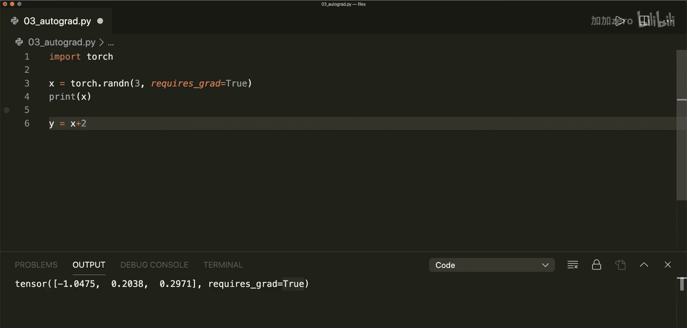
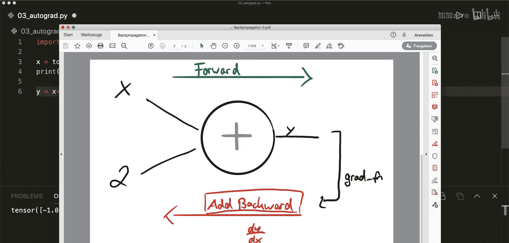
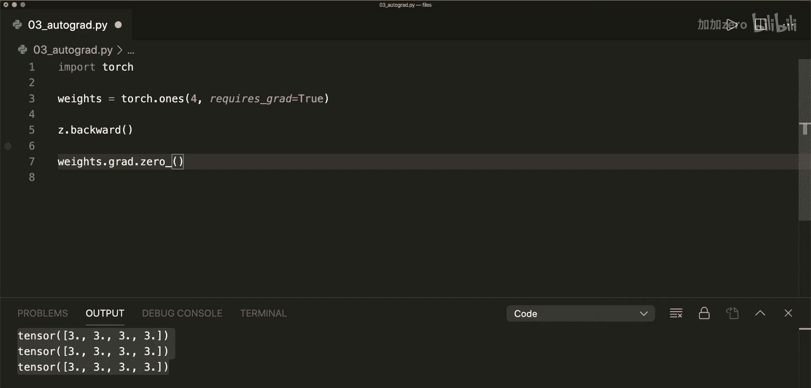

PyTorch入门教程：03：使用Autograd计算梯度 🔢

在本节课中，我们将学习PyTorch中的`autograd`包，以及如何使用它来计算梯度。梯度对于模型优化至关重要，而`autograd`包可以自动为我们完成所有计算。我们只需要了解如何使用它。

---

### 导入PyTorch

首先，我们需要导入PyTorch库。

```python
import torch
```



---

### 创建张量与梯度追踪

要计算某个函数关于张量`x`的梯度，我们必须将张量的`requires_grad`参数设置为`True`。默认情况下，该参数为`False`。

```python
x = torch.randn(3, requires_grad=True)
print(x)
```

执行此操作后，PyTorch会追踪该张量，并准备为其计算梯度。

---



### 计算图与正向传播

当我们对设置了`requires_grad=True`的张量进行操作时，PyTorch会自动构建一个**计算图**。这个图记录了所有操作，以便后续进行梯度计算。

例如，执行一个加法操作：

```python
y = x + 2
print(y)
```

此时，`y`不仅包含计算结果，还拥有一个`grad_fn`属性。这个属性指向一个梯度函数（例如`AddBackward`），它记录了产生`y`的操作（这里是加法），用于后续的**反向传播**。

计算图可以简单表示为：
> **输入 x** -> **操作 (+2)** -> **输出 y**

---

### 链式操作与梯度函数

我们可以继续进行更多操作，每次操作都会在计算图中添加节点，并更新`grad_fn`。

```python
z = y * y * 2
print(z)
# 此时 z.grad_fn 指向 MulBackward

z = z.mean()
print(z)
# 此时 z.grad_fn 指向 MeanBackward
```

---

### 反向传播与梯度计算

上一节我们介绍了计算图如何记录操作。本节中，我们来看看如何利用它来计算梯度。

要计算最终输出（例如`z`）关于初始输入（例如`x`）的梯度，我们只需在最终输出的标量上调用`.backward()`方法。

```python
z.backward() # 计算梯度
print(x.grad) # 访问存储在 x.grad 中的梯度
```

`.backward()`方法会沿着计算图反向传播，应用链式法则，计算出所有`requires_grad=True`的张量的梯度，并将结果累积到各自的`.grad`属性中。

---

### 非标量输出的梯度计算

需要注意的是，`.backward()`方法默认只适用于**标量输出**。如果输出是一个向量或矩阵，我们需要为`.backward()`提供一个**梯度参数**，这本质上是在计算**向量-雅可比积**。

以下是如何处理非标量输出的情况：

```python
# 假设 z 是一个向量，而不是标量均值
z = y * y * 2 # z 现在是大小为3的张量

# 创建一个与 z 同形的“权重”向量
v = torch.tensor([0.1, 1.0, 0.001], dtype=torch.float32)
z.backward(v) # 必须传入梯度参数 v
print(x.grad)
```

---

### 阻止梯度追踪

在某些情况下（例如模型评估或更新参数时），我们可能希望阻止PyTorch追踪某些操作的梯度历史。以下是三种常用方法：

1.  **使用 `.requires_grad_(False)`**：原地修改张量属性。
    ```python
    x.requires_grad_(False)
    ```
2.  **使用 `.detach()`**：创建一个内容相同但不追踪梯度的新张量。
    ```python
    y = x.detach()
    ```
3.  **使用 `torch.no_grad()` 上下文管理器**：在该代码块内的所有操作都不会被追踪。
    ```python
    with torch.no_grad():
        y = x + 2
    ```

---

### 梯度累积与清零

一个至关重要的细节是：在训练循环中，每次调用`.backward()`时，梯度都会**累积**（相加）到张量的`.grad`属性中，而不是被替换。

以下是一个演示梯度累积和为何需要清零的例子：

```python
weights = torch.ones(4, requires_grad=True)

for epoch in range(3):
    # 模拟模型输出和损失计算
    model_output = (weights * 3).sum()
    model_output.backward() # 计算梯度
    print(weights.grad) # 梯度会不断累积：3, 6, 9...
    # 在下一个优化步骤前，必须清零梯度！
    weights.grad.zero_() # 将梯度重置为0
```

在后续使用PyTorch内置优化器（如`torch.optim.SGD`）时，优化器的`.zero_grad()`方法会为我们完成这项工作。

---

### 总结

本节课中我们一起学习了PyTorch `autograd`包的核心机制：

1.  通过设置 `requires_grad=True` 来让PyTorch追踪张量的操作历史。
2.  操作会构建**计算图**，`grad_fn`属性记录了反向传播所需的函数。
3.  对**标量输出**调用 `.backward()` 可以自动计算所有梯度。
4.  对于**非标量输出**，需要为 `.backward(gradient)` 提供梯度参数。
5.  可以使用 `.detach()` 或 `torch.no_grad()` 来阻止不必要的梯度计算。
6.  在训练循环中，每次参数更新前，必须使用 `.zero_grad()` 来**清零累积的梯度**，否则梯度会不断叠加，导致错误的更新方向。



掌握`autograd`是使用PyTorch进行神经网络训练的基础。在接下来的教程中，我们将把这些知识应用到实际的模型训练流程中。