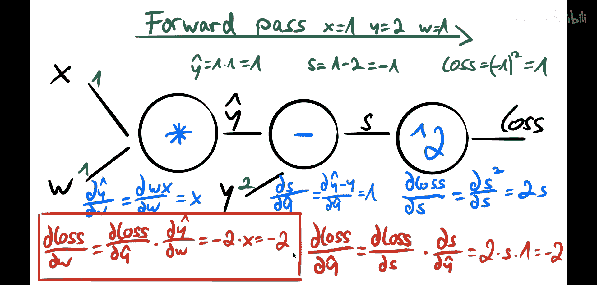
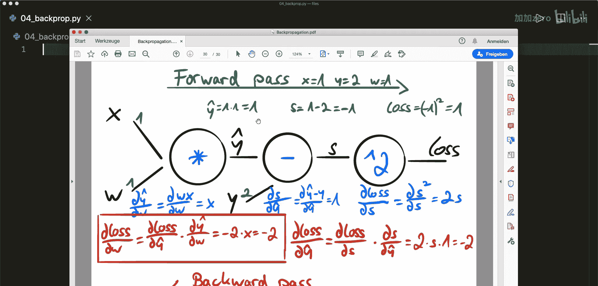
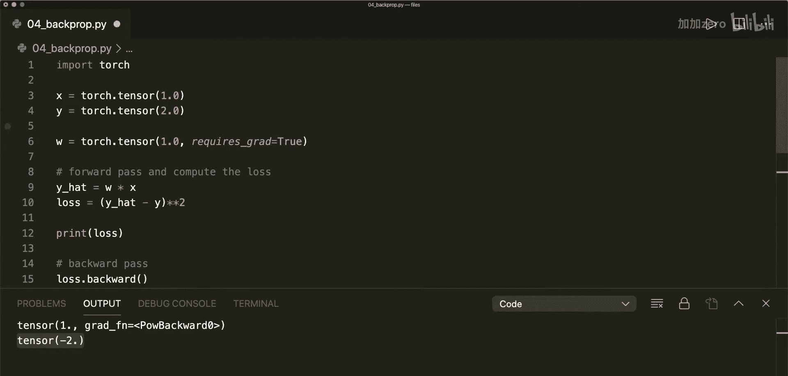

# 004：反向传播 - 理论与实例

在本节课中，我们将要学习神经网络中至关重要的**反向传播算法**。我们将从核心数学概念讲起，通过一个具体的数字例子来理解其工作原理，最后在PyTorch中验证并应用它。

## 📚 核心概念：链式法则与计算图

上一节我们介绍了反向传播的目标是计算梯度。本节中我们来看看实现这一目标的两个核心数学工具。

### 链式法则

假设我们有两个连续的函数操作。首先，输入 `X` 经过函数 `A` 得到输出 `Y`。然后，`Y` 作为输入经过函数 `B` 得到最终输出 `C`。

**公式**：
\[
C = B(A(X))
\]

如果我们想最小化 `C`，就需要计算 `C` 关于初始输入 `X` 的导数。链式法则告诉我们：

**公式**：
\[
\frac{dC}{dX} = \frac{dC}{dY} \cdot \frac{dY}{dX}
\]

我们首先计算 `C` 关于中间变量 `Y` 的导数，再乘以 `Y` 关于 `X` 的导数，两者相乘即得到最终梯度。

### 计算图

PyTorch 会为张量上的每一个操作自动构建一个**计算图**。图中的每个节点代表一个操作（函数），它接收一些输入并产生输出。

例如，一个乘法操作节点 `c = x * y`。在这个节点上，我们可以轻松计算**局部梯度**：
*   `c` 关于 `x` 的梯度是 `y`。
*   `c` 关于 `y` 的梯度是 `x`。

局部梯度之所以容易计算，是因为我们明确知道该节点的函数形式。在复杂的计算图中，我们最终会计算一个损失函数。通过从最终损失开始，利用链式法则和沿途各节点的局部梯度，我们就可以回溯计算出损失关于任何早期参数（如 `x`）的梯度。

## 🔄 反向传播的三步流程

整个反向传播过程可以归纳为三个步骤：

以下是具体的三个步骤：
1.  **前向传播**：应用所有函数，计算最终损失值。
2.  **计算局部梯度**：在计算图的每个节点处，计算其输出的局部梯度。
3.  **反向传播**：从最终损失开始，反向遍历计算图，利用链式法则将局部梯度相乘，计算出损失关于各参数（权重）的梯度。

## 📝 实例演练：线性回归

现在，我们通过一个线性回归的具体例子，用数字来演练上述三步流程。

我们使用简单的线性模型：`y_hat = w * x`。损失函数采用平方误差（为简化，暂不取平均）：`loss = (y_hat - y)^2`。我们的目标是计算损失 `loss` 关于权重 `w` 的梯度 `d(loss)/d(w)`。

假设训练数据为：`x = 1`, `y = 2`。初始化权重：`w = 1`。

### 第一步：前向传播

我们按顺序执行计算图中的操作：
1.  计算预测值：`y_hat = w * x = 1 * 1 = 1`
2.  计算误差：`s = y_hat - y = 1 - 2 = -1`
3.  计算损失：`loss = s^2 = (-1)^2 = 1`

### 第二步：计算局部梯度

我们在每个计算节点计算局部梯度：
1.  在 `loss = s^2` 节点：`d(loss)/d(s) = 2 * s = 2 * (-1) = -2`
2.  在 `s = y_hat - y` 节点：`d(s)/d(y_hat) = 1` （因为 `y` 是常数）
3.  在 `y_hat = w * x` 节点：`d(y_hat)/d(w) = x = 1`

> **注意**：我们不需要计算关于固定输入 `x` 和 `y` 的梯度，只需要计算关于可训练参数 `w` 的梯度。

### 第三步：反向传播（应用链式法则）

现在，我们从后向前传递梯度，应用链式法则：
1.  计算 `d(loss)/d(y_hat)`：利用 `loss` 到 `s` 再到 `y_hat` 的路径。
    \[
    \frac{d(loss)}{d(y\_hat)} = \frac{d(loss)}{d(s)} \cdot \frac{d(s)}{d(y\_hat)} = (-2) \cdot 1 = -2
    \]
2.  计算最终目标 `d(loss)/d(w)`：利用 `loss` 到 `y_hat` 再到 `w` 的路径。
    \[
    \frac{d(loss)}{d(w)} = \frac{d(loss)}{d(y\_hat)} \cdot \frac{d(y\_hat)}{d(w)} = (-2) \cdot 1 = -2
    \]

我们得到损失关于权重 `w` 的梯度为 `-2`。

## 💻 在 PyTorch 中验证

理论计算完成后，让我们在 PyTorch 中验证这一过程是否自动得出相同结果。

以下是实现代码：
```python
import torch





# 1. 定义数据和张量，对权重w设置 requires_grad=True 以追踪梯度
x = torch.tensor(1.0)
y = torch.tensor(2.0)
w = torch.tensor(1.0, requires_grad=True)

# 2. 前向传播：计算损失
y_hat = w * x          # 预测
loss = (y_hat - y)**2  # 损失

print(f"初始损失: {loss.item()}")  # 输出应为 1.0

# 3. 反向传播：PyTorch自动计算所有梯度
loss.backward()

# 4. 查看损失关于w的梯度
print(f"梯度 d(loss)/d(w): {w.grad.item()}")  # 输出应为 -2.0
```
运行这段代码，你会看到初始损失为 `1.0`，计算得到的梯度为 `-2.0`，这与我们手动计算的结果完全一致。调用 `loss.backward()` 后，PyTorch 便自动完成了我们刚才演示的所有局部梯度计算和链式法则应用。

接下来的步骤将是使用这个梯度（例如，结合优化器）来更新权重 `w`，然后重复前向和反向传播过程进行迭代训练。

## ✅ 总结



本节课中我们一起学习了反向传播的核心机制。我们首先理解了**链式法则**和**计算图**这两个基础数学概念。然后，我们通过**三步流程**——前向传播、计算局部梯度、反向传播——详细拆解了一个线性回归的例子，并手动计算了梯度。最后，我们在 PyTorch 中验证了该过程，看到仅需一行 `loss.backward()` 代码，PyTorch 就能自动完成所有复杂的梯度计算，极大地简化了神经网络训练。