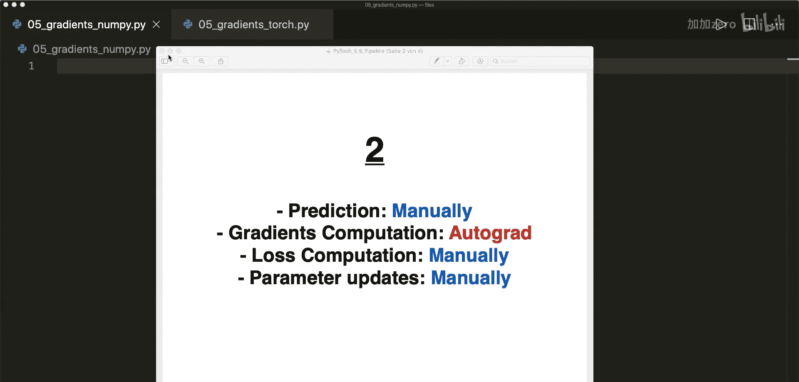
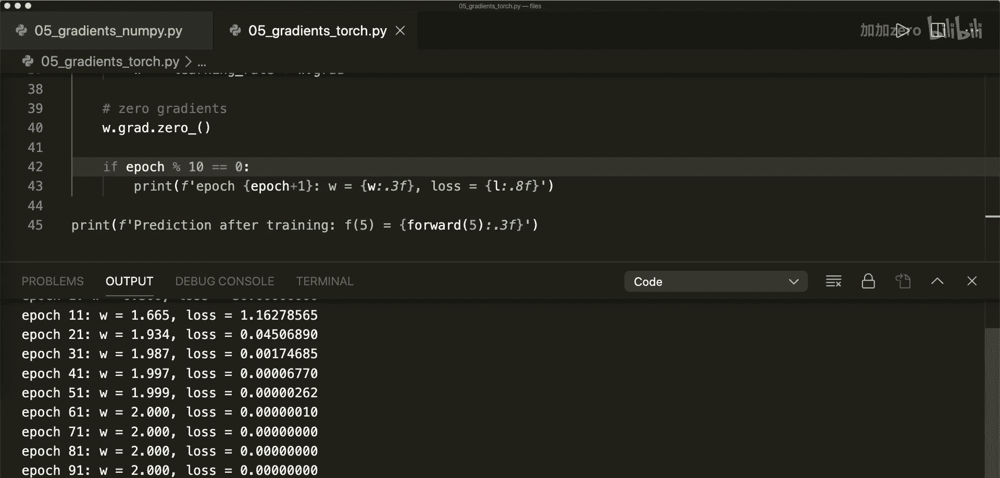

# 005：使用Autograd和反向传播进行梯度下降

## 概述
在本节课中，我们将学习如何使用PyTorch的自动梯度计算功能来优化模型。我们将从一个具体的线性回归例子开始，手动实现所有步骤，然后逐步用PyTorch的自动功能替换手动计算的部分。本节课将涵盖前两个步骤：手动实现和用Autograd替换梯度计算。

---

## 从零开始手动实现线性回归



上一节我们介绍了课程的整体目标，本节中我们来看看如何完全手动实现线性回归算法。

我们首先只使用NumPy来实现。假设我们的真实函数是 `f(x) = 2x`，目标是学习权重 `w = 2`。

以下是实现步骤：

1.  **准备数据**：创建训练样本 `x` 和对应的标签 `y`。
    ```python
    import numpy as np
    x = np.array([1, 2, 3, 4], dtype=np.float32)
    y = 2 * x  # 即 [2, 4, 6, 8]
    ```

2.  **初始化参数**：将权重 `w` 初始化为0。
    ```python
    w = 0.0
    ```

3.  **定义前向传播函数**：计算模型预测值。
    ```python
    def forward(x):
        return w * x
    ```

4.  **定义损失函数**：使用均方误差（MSE）。
    ```python
    def loss(y, y_pred):
        return ((y_pred - y) ** 2).mean()
    ```

5.  **手动计算梯度**：计算损失函数 `J` 关于权重 `w` 的梯度。对于MSE，其梯度公式为：
    ```
    dJ/dw = (2/n) * Σ x * (w*x - y)
    ```
    代码实现如下：
    ```python
    def gradient(x, y, y_pred):
        return (2 * x * (y_pred - y)).mean()
    ```

6.  **训练循环**：应用梯度下降算法更新权重。
    ```python
    learning_rate = 0.01
    n_iters = 20

    for epoch in range(n_iters):
        # 前向传播
        y_pred = forward(x)
        # 计算损失
        l = loss(y, y_pred)
        # 计算梯度
        dw = gradient(x, y, y_pred)
        # 更新权重：w = w - learning_rate * gradient
        w -= learning_rate * dw
    ```

运行以上代码，可以看到权重 `w` 逐渐接近2，损失逐渐减小，模型预测变得准确。

---

## 使用PyTorch Autograd自动计算梯度

上一节我们手动计算了梯度，本节中我们来看看如何使用PyTorch的Autograd机制自动完成这一过程，从而省去手动推导和实现梯度公式的麻烦。

我们将用PyTorch张量替换NumPy数组，并让PyTorch自动计算梯度。

以下是修改步骤：

1.  **导入PyTorch并准备数据**：将数据转换为PyTorch张量。
    ```python
    import torch
    x = torch.tensor([1, 2, 3, 4], dtype=torch.float32)
    y = 2 * x
    ```

2.  **初始化参数并启用梯度追踪**：将权重 `w` 定义为需要计算梯度的张量。
    ```python
    w = torch.tensor(0.0, dtype=torch.float32, requires_grad=True)
    ```
    设置 `requires_grad=True` 告诉PyTorch需要追踪针对 `w` 的所有操作以计算梯度。

3.  **前向传播和损失计算**：这部分代码与手动实现类似。
    ```python
    def forward(x):
        return w * x

    def loss(y, y_pred):
        return ((y_pred - y) ** 2).mean()
    ```

4.  **训练循环（关键变化）**：
    *   **计算梯度**：不再调用手动实现的 `gradient` 函数，而是在计算损失 `l` 后，调用 `l.backward()`。PyTorch会自动计算所有 `requires_grad=True` 的张量（此处是 `w`）的梯度，并将其存储在 `w.grad` 属性中。
    *   **更新权重**：权重更新操作 `w -= learning_rate * w.grad` 不应被梯度追踪，因此需要用 `torch.no_grad()` 包裹。
    *   **清零梯度**：PyTorch会累积梯度，所以在下一次反向传播前，必须手动将 `w.grad` 置零。
    ```python
    learning_rate = 0.01
    n_iters = 100

    for epoch in range(n_iters):
        # 前向传播
        y_pred = forward(x)
        # 计算损失
        l = loss(y, y_pred)
        # 反向传播，自动计算梯度
        l.backward()
        # 更新权重，不追踪此操作的梯度
        with torch.no_grad():
            w -= learning_rate * w.grad
        # 手动清零梯度，为下一次迭代准备
        w.grad.zero_()
    ```

通过使用 `autograd`，我们不再需要手动推导和编码梯度公式。PyTorch的自动微分系统会为我们处理这一切，大大简化了实现过程。

---

## 总结
本节课中我们一起学习了梯度下降在PyTorch中的实现演进。
*   首先，我们从零开始手动实现了线性回归的**前向传播**、**损失计算**、**梯度推导**和**参数更新**。
*   接着，我们引入了PyTorch的核心特性 **`Autograd`（自动梯度计算）**。通过将张量设置为 `requires_grad=True` 并使用 `.backward()` 方法，我们让PyTorch自动完成了繁琐的梯度计算，替代了手动公式。
*   我们同时学习了在自动梯度计算环境下更新参数时的两个重要注意事项：使用 `torch.no_grad()` 上下文管理器来避免不必要的梯度追踪，以及每次迭代后必须调用 `.zero_()` 来清除累积的梯度。



通过本节课，我们看到了PyTorch如何将我们从复杂的数学计算中解放出来，让我们能更专注于模型结构本身。在下一节课中，我们将继续简化流程，使用PyTorch内置的损失函数和优化器类来进一步替代手动代码。