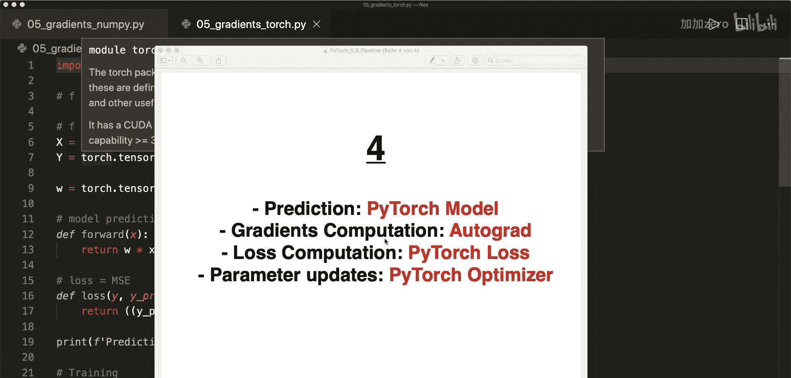
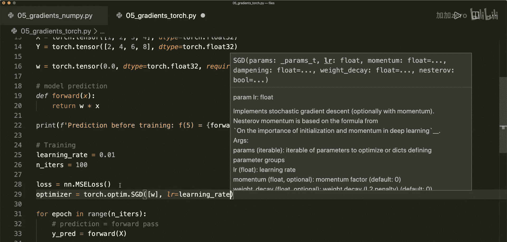
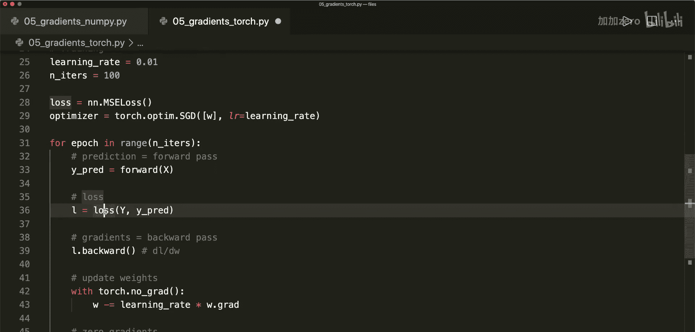
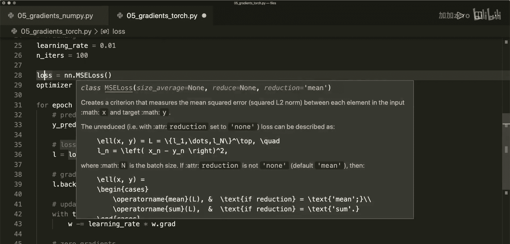
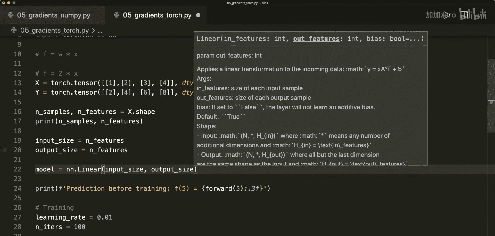
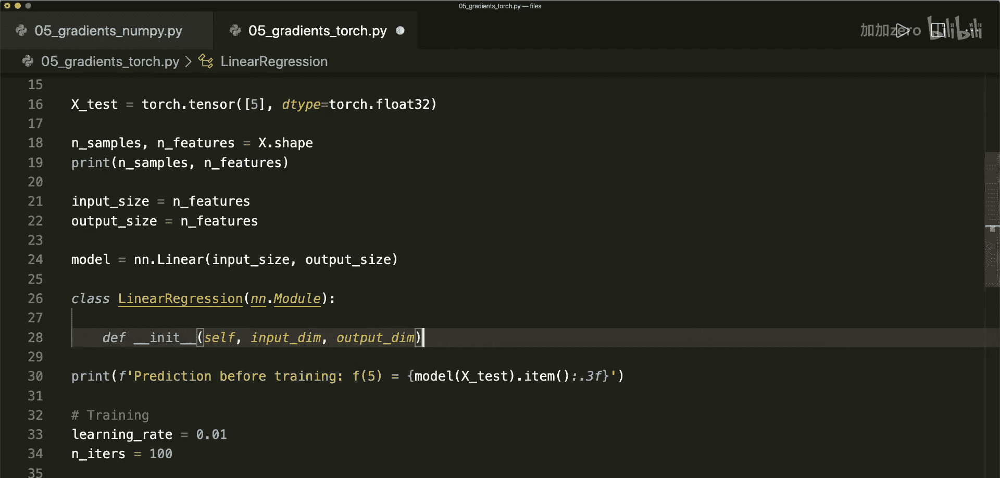
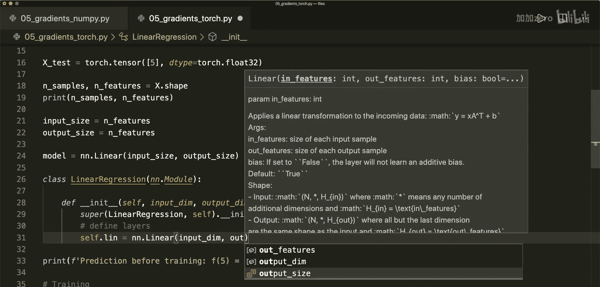
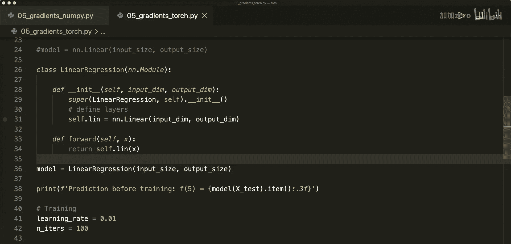

# 006：训练流程 - 模型、损失函数与优化器

在本节课中，我们将学习如何构建一个完整的PyTorch训练流程。我们将不再手动计算损失和更新参数，而是使用PyTorch内置的`nn`和`optim`模块来完成这些工作，并学习如何定义一个PyTorch模型。

## 概述：PyTorch通用训练流程



上一节我们实现了逻辑回归并学习了PyTorch如何通过反向传播自动计算梯度。本节我们将在此基础上，用PyTorch的类来替代手动计算的部分。

一个典型的PyTorch训练流程包含三个核心步骤：
1.  **设计模型**：定义模型的输入/输出尺寸以及前向传播过程。
2.  **构建损失函数和优化器**：选择合适的损失函数和优化算法。
3.  **执行训练循环**：迭代地进行前向传播、计算损失、反向传播和参数更新。

## 步骤三：使用PyTorch的损失函数与优化器

首先，我们导入必要的模块，并替换掉手动定义的损失函数和优化步骤。

```python
import torch
import torch.nn as nn
import torch.optim as optim
```

以下是具体的操作步骤：

1.  **定义损失函数**：使用PyTorch提供的`MSELoss`（均方误差损失），这与我们之前手动实现的功能相同。
    ```python
    loss_fn = nn.MSELoss()
    ```



2.  **定义优化器**：使用随机梯度下降优化器`SGD`。它需要两个参数：待优化的参数列表（这里是我们之前定义的权重`w`）和学习率`lr`。
    ```python
    optimizer = optim.SGD([w], lr=learning_rate)
    ```





3.  **修改训练循环**：在循环内部，计算损失和更新权重的步骤变得非常简单。
    *   计算损失：`loss = loss_fn(y_pred, y)`
    *   反向传播：`loss.backward()`
    *   更新参数：`optimizer.step()`
    *   清空梯度：`optimizer.zero_grad()`

完成这些修改后，运行代码，模型依然能够成功训练并做出预测。

## 步骤四：使用PyTorch模型

接下来，我们将手动实现的前向传播方法替换为PyTorch模型。对于简单的线性回归，我们可以直接使用`nn.Linear`层。

首先，我们需要调整输入数据`X`和标签`y`的形状，使其成为二维张量，其中行代表样本数，列代表特征数。

```python
# 调整数据形状
X = X.view(-1, 1)  # 形状变为 (样本数, 特征数)
y = y.view(-1, 1)
n_samples, n_features = X.shape
print(f"样本数: {n_samples}, 特征数: {n_features}")  # 例如：样本数: 4, 特征数: 1
```

然后，定义模型、优化器并调整训练循环：

1.  **定义模型**：使用`nn.Linear`，它需要指定输入特征数和输出特征数。
    ```python
    model = nn.Linear(n_features, n_features)
    ```



2.  **更新优化器**：优化器的参数现在来自模型本身。
    ```python
    optimizer = optim.SGD(model.parameters(), lr=learning_rate)
    ```

3.  **更新训练循环**：前向传播通过调用模型完成。
    *   预测：`y_pred = model(X)`
    *   其他步骤（计算损失、反向传播、更新）保持不变。

4.  **进行预测**：对新数据进行预测时，也需要将其转换为张量。
    ```python
    X_test = torch.tensor([5.0], dtype=torch.float32)
    y_test_pred = model(X_test).item()
    ```

运行修改后的代码，模型可以正常工作。最终的预测精度可能因参数随机初始化或优化器细节而有所不同，可以通过调整学习率和迭代次数来改进。

## 如何构建自定义模型

当`nn.Linear`这样的内置层无法满足需求时，我们需要构建自定义模型。方法是创建一个继承自`nn.Module`的类。

以下是构建一个自定义线性回归模型的示例：



```python
class LinearRegression(nn.Module):
    def __init__(self, input_dim, output_dim):
        super(LinearRegression, self).__init__()
        # 定义层
        self.linear = nn.Linear(input_dim, output_dim)

    def forward(self, x):
        # 定义前向传播
        return self.linear(x)

# 实例化模型
model = LinearRegression(input_size, output_size)
```



这个自定义类封装了一个线性层，其功能与直接使用`nn.Linear`相同。但它演示了构建更复杂模型的基本范式：在`__init__`中定义网络层，在`forward`方法中定义数据如何通过这些层。

## 总结

本节课我们一起学习了构建完整PyTorch训练流程的核心步骤：
1.  我们了解了标准的训练流程：设计模型、构建损失函数与优化器、执行训练循环。
2.  我们使用`nn.MSELoss`和`optim.SGD`替代了手动计算损失和更新权重的代码，使流程更简洁。
3.  我们使用`nn.Linear`模块替代了手动的前向传播计算，并学会了调整数据形状以适配PyTorch模型。
4.  我们学习了如何通过继承`nn.Module`类来构建自定义模型，为设计更复杂的网络结构打下基础。



现在，PyTorch可以为我们处理大部分底层计算，我们只需专注于模型结构、损失函数和优化器的选择。