# 007：线性回归实现 🧮

在本节课中，我们将学习如何使用PyTorch实现线性回归。我们将遵循典型的PyTorch工作流程，涵盖数据准备、模型设计、损失函数与优化器定义，以及训练循环的实现。

---

## 数据准备 📊

首先，我们需要生成并准备用于线性回归的数据。我们将使用`sklearn`生成一个简单的回归数据集，并将其转换为PyTorch张量。

以下是数据准备的步骤：

1.  导入必要的库。
2.  使用`sklearn.datasets.make_regression`生成包含100个样本和1个特征的数据集。
3.  将生成的NumPy数组转换为PyTorch张量，并确保数据类型为`float32`。
4.  调整标签`y`的形状，使其成为一个列向量。

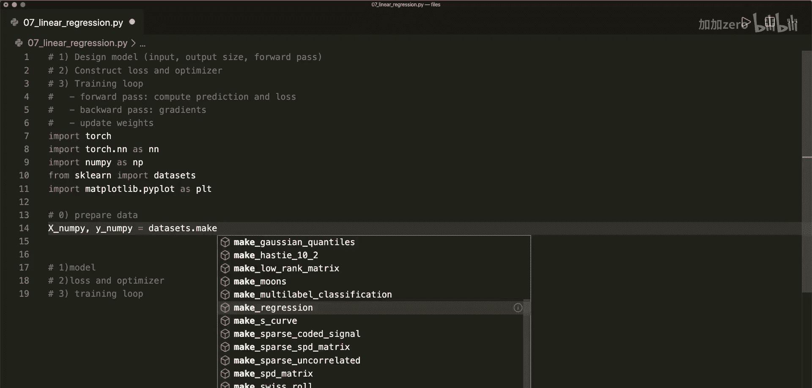

```python
import torch
import torch.nn as nn
import numpy as np
from sklearn import datasets
import matplotlib.pyplot as plt

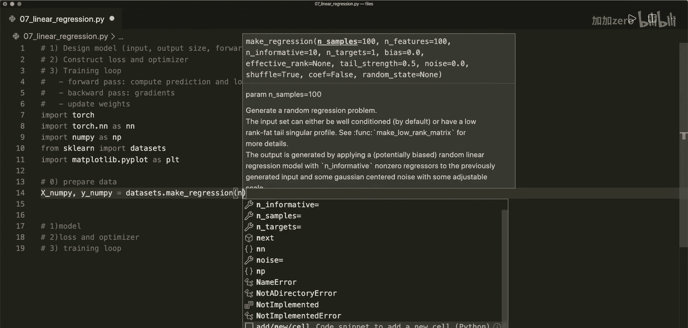

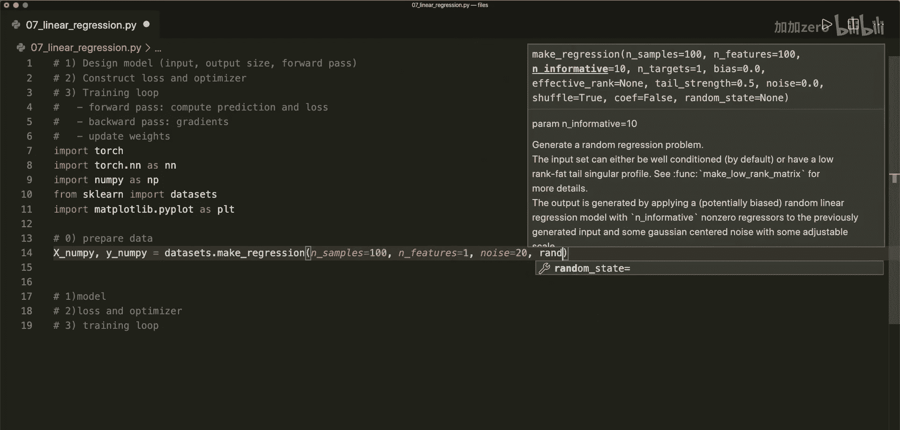

# 生成回归数据集
x_numpy, y_numpy = datasets.make_regression(n_samples=100, n_features=1, noise=20, random_state=1)

# 转换为PyTorch张量
x = torch.from_numpy(x_numpy.astype(np.float32))
y = torch.from_numpy(y_numpy.astype(np.float32))

# 将y重塑为列向量 (n_samples, 1)
y = y.view(y.shape[0], 1)

# 获取样本数和特征数
n_samples, n_features = x.shape
```

---

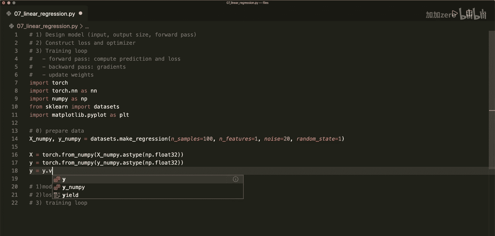

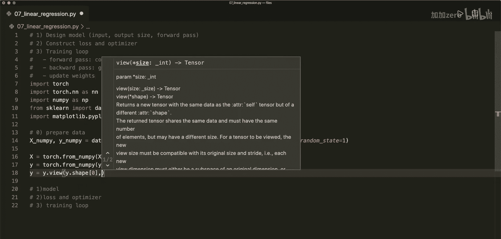

## 模型设计 🏗️

上一节我们准备好了数据，本节中我们来看看如何设计线性回归模型。在PyTorch中，线性回归模型可以通过一个线性层轻松构建。

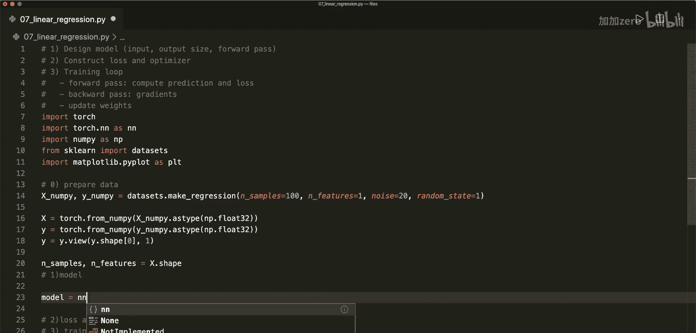

我们使用`nn.Linear`来创建模型，它需要指定输入特征的数量和输出值的数量。对于我们的简单回归问题，输入和输出大小都是1。

```python
# 定义模型
model = nn.Linear(in_features=n_features, out_features=1)
```

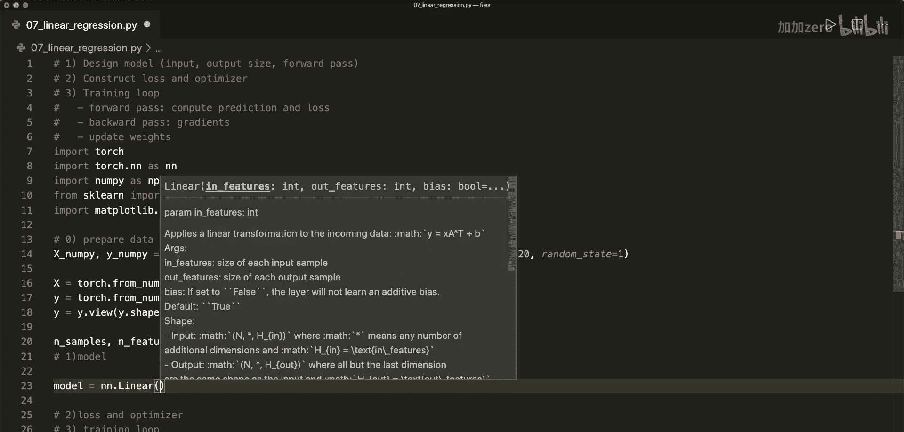

---

## 定义损失函数与优化器 ⚙️

模型设计完成后，我们需要定义衡量模型预测好坏的损失函数，以及用于更新模型参数的优化器。

对于线性回归，我们使用**均方误差（MSE）**作为损失函数。优化器我们选择**随机梯度下降（SGD）**，并为其设置一个学习率。

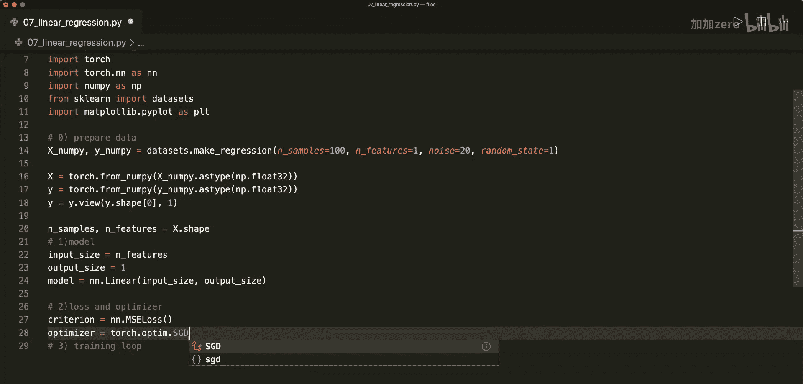

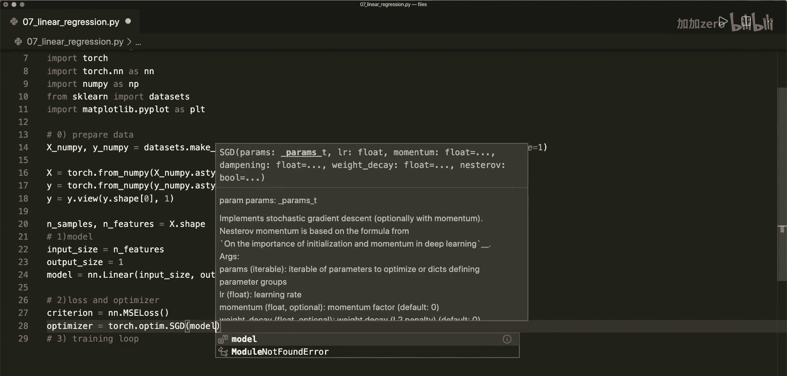

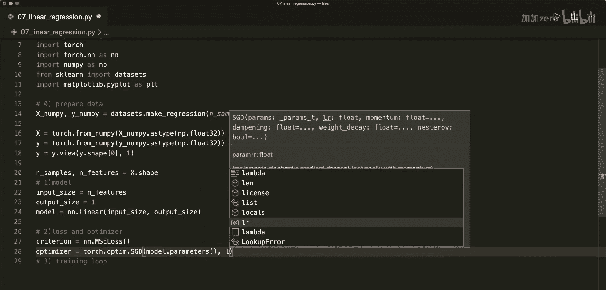

```python
# 定义损失函数和优化器
criterion = nn.MSELoss()  # 均方误差损失
learning_rate = 0.01
optimizer = torch.optim.SGD(model.parameters(), lr=learning_rate)  # 随机梯度下降优化器
```

---

## 训练循环 🔁

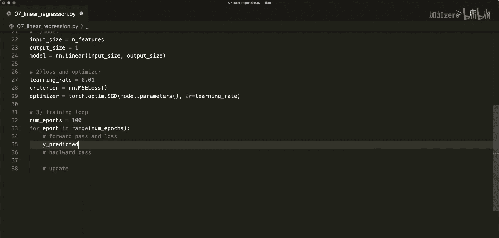

现在，我们将进入核心的训练环节。训练循环包括前向传播、计算损失、反向传播和参数更新这几个关键步骤。

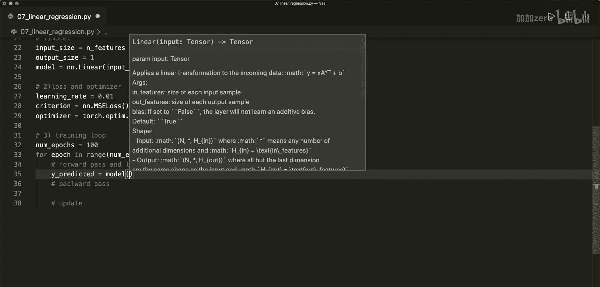

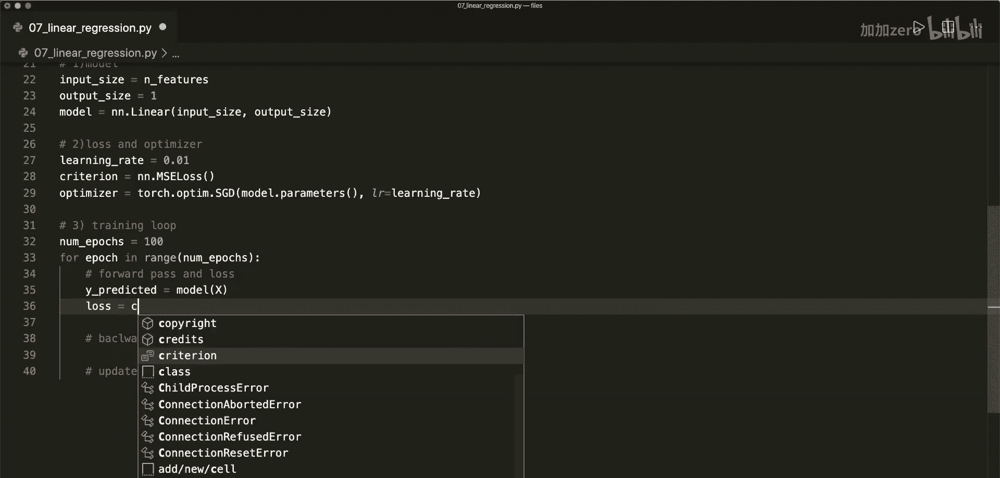

以下是训练循环的详细步骤：

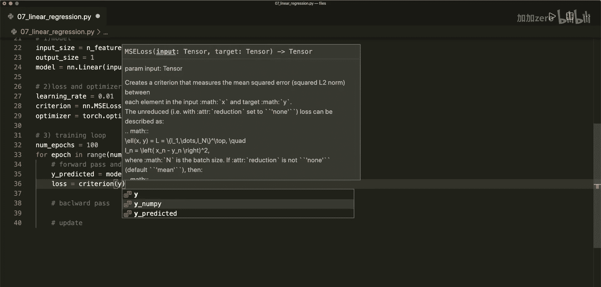

1.  **前向传播**：将输入数据`x`传递给模型，得到预测值`y_predicted`。
2.  **计算损失**：使用损失函数`criterion`比较预测值`y_predicted`和真实值`y`。
3.  **反向传播**：调用`loss.backward()`计算模型参数的梯度。
4.  **参数更新**：调用`optimizer.step()`根据梯度更新模型参数。
5.  **梯度清零**：在下一轮迭代前，必须调用`optimizer.zero_grad()`将梯度归零，防止梯度累积。

```python
# 设置训练轮数
num_epochs = 100

for epoch in range(num_epochs):
    # 前向传播和计算损失
    y_predicted = model(x)
    loss = criterion(y_predicted, y)

    # 反向传播
    loss.backward()

    # 参数更新
    optimizer.step()

    # 梯度清零
    optimizer.zero_grad()

    # 每隔10轮打印一次损失
    if (epoch+1) % 10 == 0:
        print(f‘epoch: {epoch+1}, loss = {loss.item():.4f}’)
```

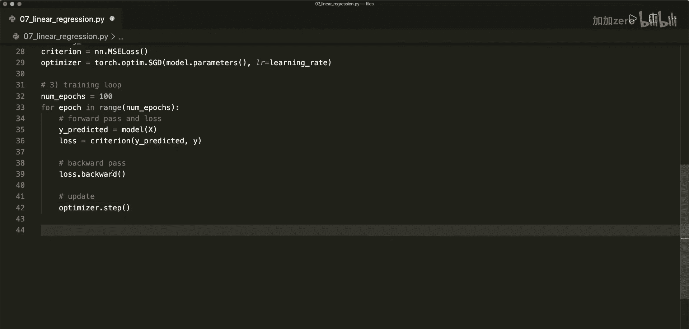

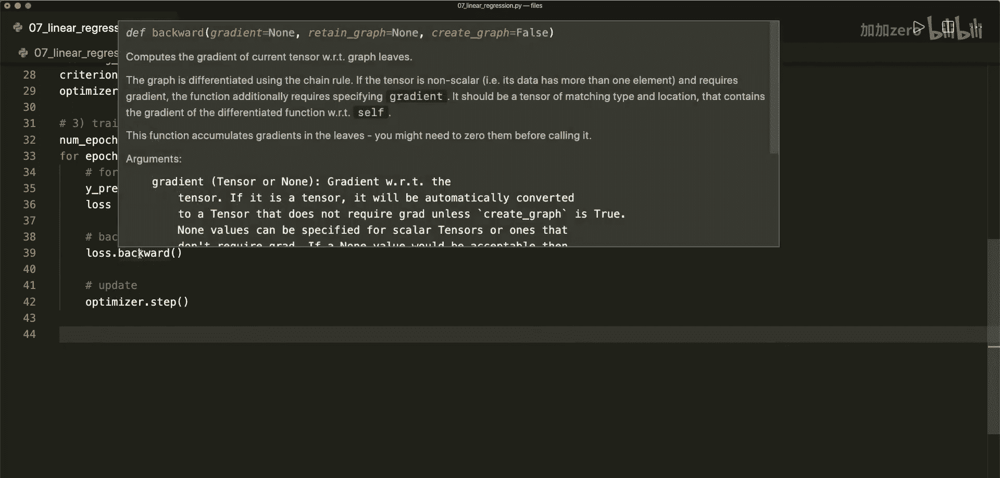

---

## 结果可视化 📈

训练完成后，我们可以将模型的最终预测结果与原始数据一起绘制出来，直观地查看拟合效果。

我们需要将模型的预测结果从计算图中分离（`detach`），并转换回NumPy数组以便绘图。

```python
# 获取最终预测值并绘图
predicted = model(x).detach().numpy()

plt.plot(x_numpy, y_numpy, ‘ro’, label=‘Original data’)  # 原始数据点
plt.plot(x_numpy, predicted, ‘b-’, label=‘Fitted line’)   # 拟合的直线
plt.legend()
plt.show()
```

运行代码后，你将看到一条蓝色的直线较好地拟合了红色的原始数据点，这表明我们的线性回归模型训练成功。

---

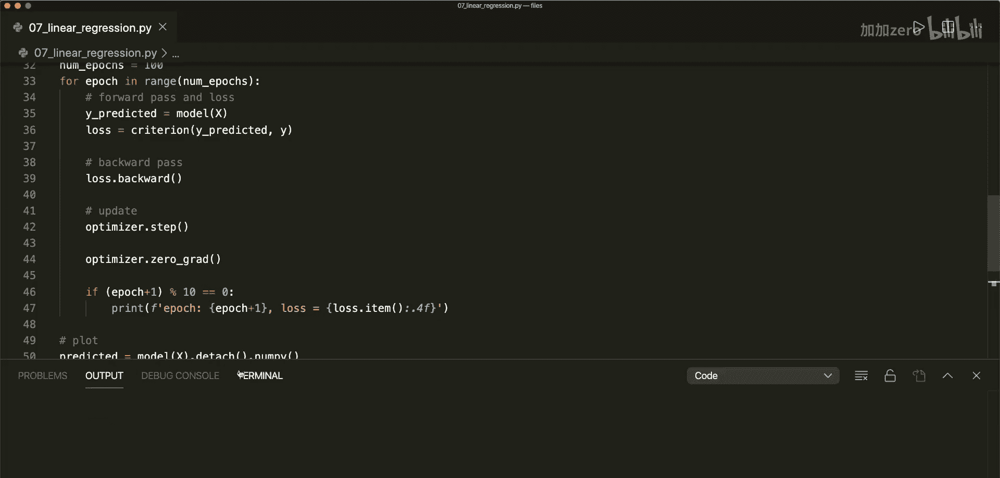

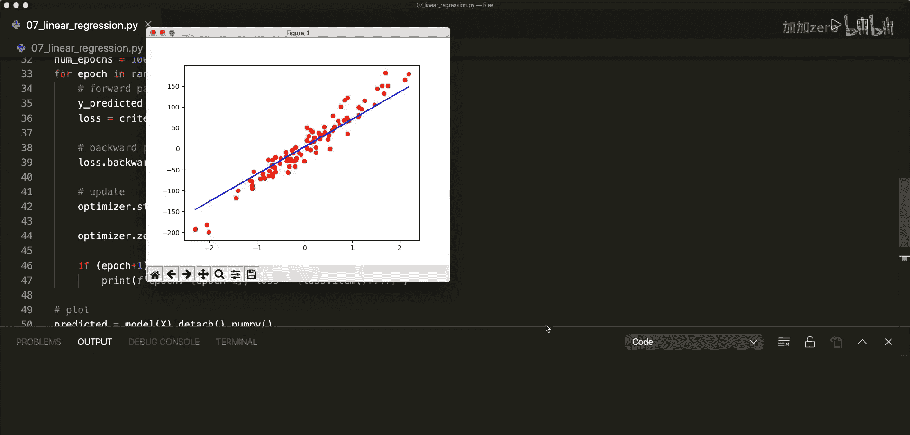

## 总结 🎯

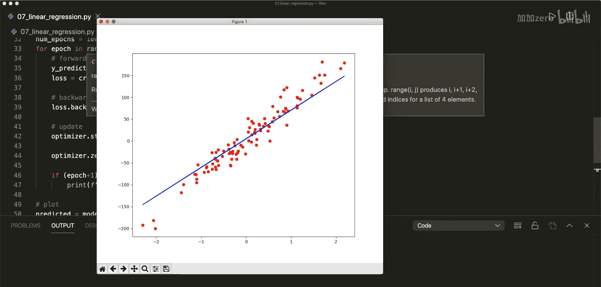

本节课中我们一起学习了使用PyTorch实现线性回归的完整流程。我们回顾了PyTorch的标准三步工作流：**设计模型**、**定义损失与优化器**、**执行训练循环**。通过这个简单的例子，你将掌握使用PyTorch构建和训练机器学习模型的基本方法，为学习更复杂的模型打下坚实基础。