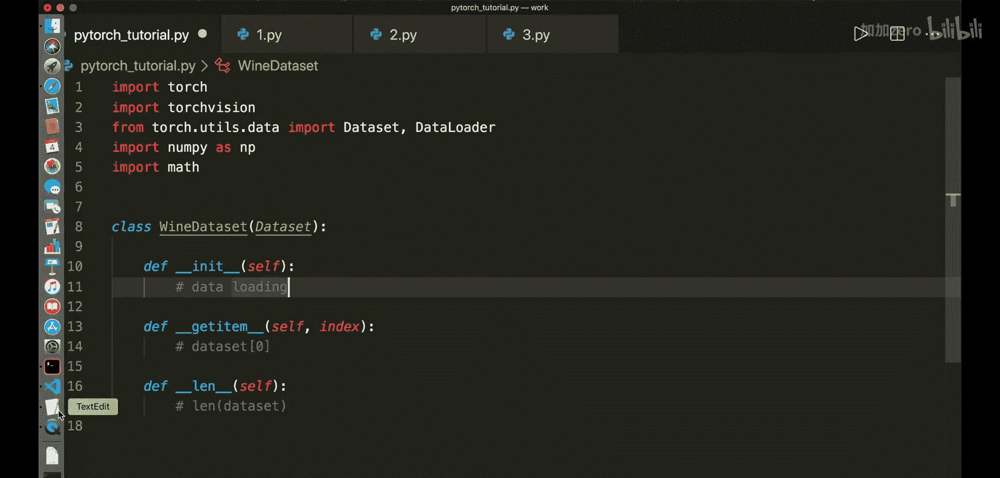
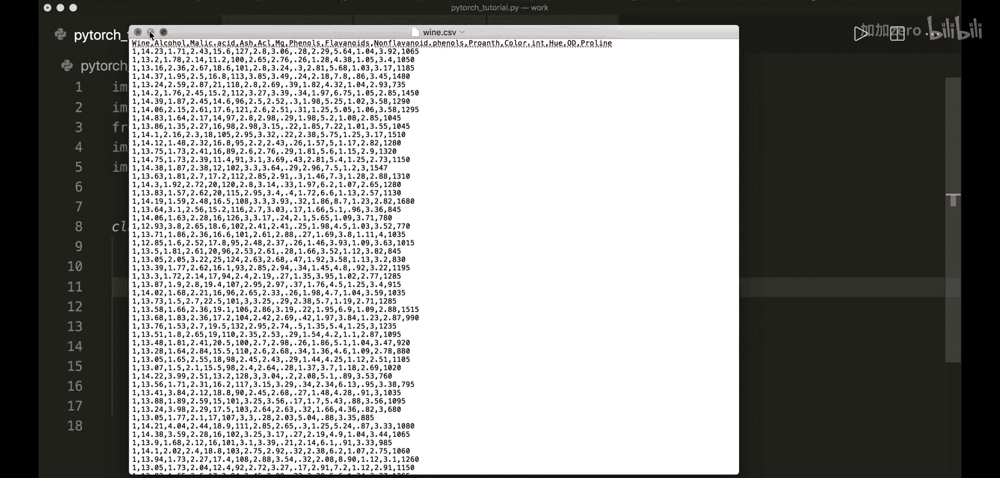
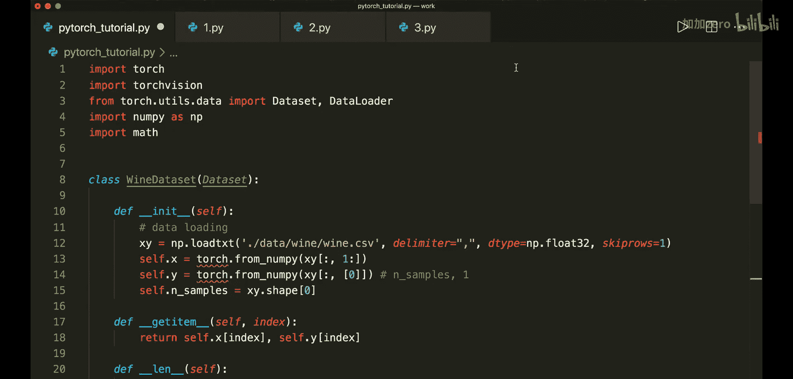

# 009：Dataset与DataLoader - 批训练

## 概述
在本节课中，我们将学习PyTorch中两个非常重要的类：`Dataset`和`DataLoader`。它们能帮助我们高效地组织数据，并实现批训练，这对于处理大型数据集至关重要。

## 批训练基础概念
上一节我们介绍了基础的训练循环。本节中我们来看看如何通过批处理来优化训练过程。

在之前的代码中，我们通常在单个循环中处理整个数据集，然后计算梯度并更新模型。如果数据集很大，这种方式会非常耗时。

更好的方法是将样本分成更小的批次。这样，我们的训练循环会先遍历所有轮次，然后在每个轮次中遍历所有批次，最后仅基于当前批次的数据进行优化。

如果使用PyTorch内置的`Dataset`和`DataLoader`类，PyTorch可以自动为我们处理批次计算和迭代，使用起来非常方便。

在深入代码之前，我们先快速了解一些关于批训练的关键术语。



以下是批训练中涉及的三个核心概念：
*   **一个轮次**：所有训练样本完成一次前向传播和反向传播。
*   **批大小**：一次前向传播和反向传播中使用的训练样本数量。
*   **迭代次数**：完成一个轮次所需的传递次数，每次传递使用`批大小`数量的样本。

例如，如果我们有100个样本，批大小设为20，那么一个轮次就有5次迭代，因为100除以20等于5。



## 实现自定义Dataset类
现在让我们开始编写代码。首先，导入必要的模块。

```python
import torch
import torchvision
from torch.utils.data import Dataset, DataLoader
import numpy as np
import math
```

接下来，我们实现一个自定义的`Dataset`类。我们将其命名为`WineDataset`，它必须继承自`Dataset`类。

我们需要实现三个方法：
1.  `__init__`：用于数据加载等初始化操作。
2.  `__getitem__`：通过索引获取单个数据样本。
3.  `__len__`：返回数据集的总样本数。

在本例中，我们将使用葡萄酒数据集。数据集的第一行是表头，第一列是葡萄酒的类别标签（共3类），其余列是特征。

```python
class WineDataset(Dataset):
    def __init__(self):
        # 加载数据
        xy = np.loadtxt('./data/wine/wine.csv', delimiter=',', dtype=np.float32, skiprows=1)
        # 分割特征和标签
        self.x = torch.from_numpy(xy[:, 1:])  # 所有行，从第1列开始到最后
        self.y = torch.from_numpy(xy[:, [0]]) # 所有行，仅第0列，保持形状为 [n_samples, 1]
        self.n_samples = xy.shape[0] # 样本数量

    def __getitem__(self, index):
        # 返回指定索引的（特征， 标签）元组
        return self.x[index], self.y[index]

    def __len__(self):
        # 返回数据集大小
        return self.n_samples
```

现在，创建数据集实例并查看第一个样本。

```python
dataset = WineDataset()
first_data = dataset[0]
features, labels = first_data
print(features, labels)
```

## 使用DataLoader进行批处理
创建好`Dataset`后，我们可以使用`DataLoader`来方便地进行批训练。

`DataLoader`接收我们的数据集，并允许我们设置批大小、是否打乱数据等参数。

```python
dataloader = DataLoader(dataset=dataset,
                        batch_size=4,
                        shuffle=True,
                        num_workers=2)
```

我们可以将`DataLoader`转换为迭代器，并手动获取一个批次的数据。

```python
dataiter = iter(dataloader)
data = dataiter.next()
features, labels = data
print(features, labels)
```

更常见的是在训练循环中直接遍历`DataLoader`。下面是一个模拟训练循环的例子。

```python
num_epochs = 2
total_samples = len(dataset)
n_iterations = math.ceil(total_samples / 4) # batch_size=4
print(f'总样本数：{total_samples}, 迭代次数：{n_iterations}')

for epoch in range(num_epochs):
    for i, (inputs, labels) in enumerate(dataloader):
        # 这里进行真实的前向传播、反向传播和权重更新
        # 本例中仅打印信息
        if (i+1) % 5 == 0:
            print(f'轮次 {epoch+1}/{num_epochs}, 步数 {i+1}/{n_iterations}, 输入形状 {inputs.shape}')
```

## PyTorch内置数据集
当然，PyTorch也提供了一些内置的数据集，方便我们快速开始。例如，在`torchvision.datasets`中，我们可以找到著名的MNIST、FashionMNIST、CIFAR等数据集。我们将在后续教程中使用MNIST数据集。



## 总结
本节课中我们一起学习了PyTorch的`Dataset`和`DataLoader`类。我们了解了批训练的基本概念，学会了如何创建自定义的数据集类，以及如何使用数据加载器来高效地进行批次迭代。这是构建高效PyTorch训练流程的基础。