# 011：Softmax与交叉熵损失函数

在本节课中，我们将要学习神经网络中两个至关重要的函数：Softmax函数和交叉熵损失函数。我们将探讨它们的数学原理，学习如何在NumPy和PyTorch中实现它们，并了解它们如何应用于典型的分类神经网络架构中。

## Softmax函数

上一节我们介绍了本课程的目标，本节中我们来看看Softmax函数。Softmax函数将一组原始分数（logits）转换为概率分布。其核心作用是将输出值压缩到0和1之间，并且所有输出值的总和为1。

以下是Softmax函数的公式：

$$
\text{Softmax}(x_i) = \frac{e^{x_i}}{\sum_{j} e^{x_j}}
$$

该公式对每个元素应用指数函数，然后通过除以所有指数值的总和来进行归一化。

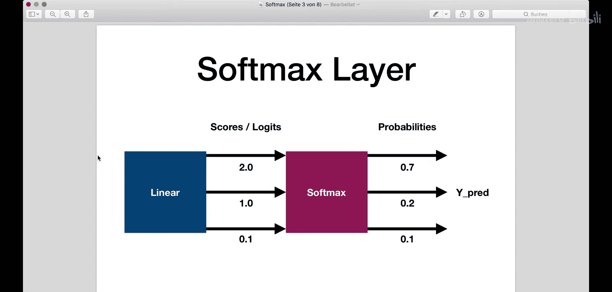

让我们通过一个例子来理解。假设一个线性层输出三个原始分数（logits）：`[2.0, 1.0, 0.1]`。

以下是计算Softmax的步骤：

1.  计算每个值的指数：`e^2.0, e^1.0, e^0.1`。
2.  计算所有指数值的总和。
3.  将每个指数值除以总和，得到对应的概率。

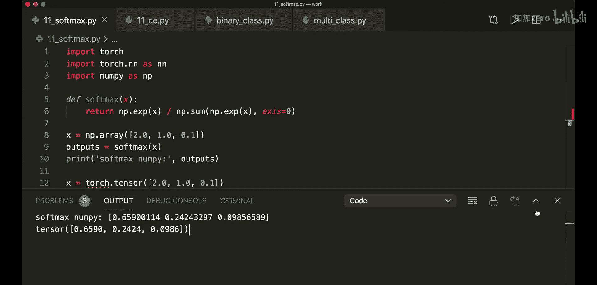

应用Softmax后，我们得到类似 `[0.7, 0.2, 0.1]` 的概率分布。最高原始分数（2.0）对应最高概率（0.7），且所有概率之和为1。

### 代码实现

以下是Softmax在NumPy和PyTorch中的实现方式。

**NumPy实现：**
```python
import numpy as np

def softmax(x):
    return np.exp(x) / np.sum(np.exp(x), axis=0)

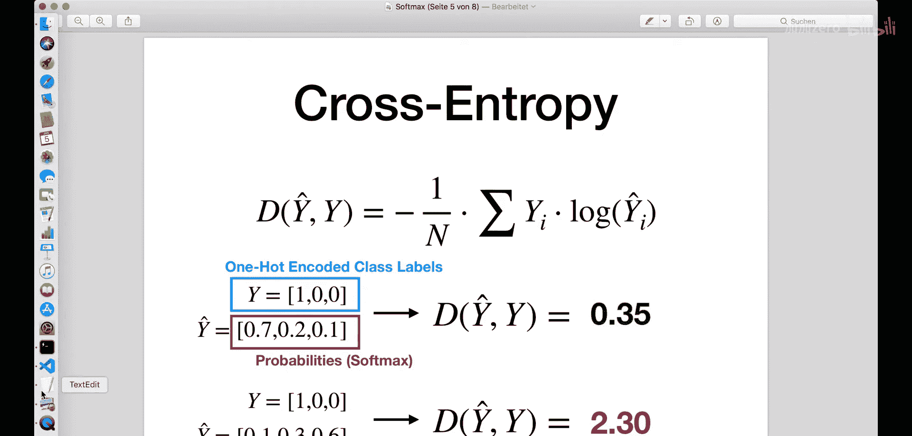

# 示例
logits = np.array([2.0, 1.0, 0.1])
probs = softmax(logits)
print(probs)  # 输出类似 [0.659, 0.242, 0.099]
```

**PyTorch实现：**
```python
import torch

x = torch.tensor([2.0, 1.0, 0.1])
outputs = torch.softmax(x, dim=0)
print(outputs)  # 输出类似 tensor([0.6590, 0.2424, 0.0986])
```

## 交叉熵损失函数

理解了如何将输出转换为概率后，我们需要一种方法来衡量预测概率与真实标签之间的差距，这就是交叉熵损失函数。它衡量分类模型的性能，输出值在0到1之间。损失值随着预测概率偏离真实标签而增加，因此预测越好，损失越低。

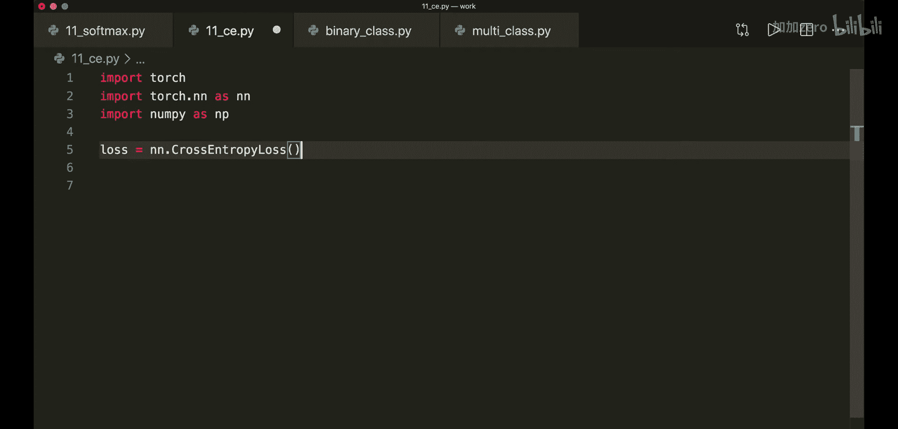

交叉熵损失函数的公式如下：

$$
\text{CrossEntropyLoss} = -\sum_{i} y_i \cdot \log(\hat{y}_i)
$$

其中，$y_i$ 是真实标签的独热编码（one-hot encoding），$\hat{y}_i$ 是预测的概率。

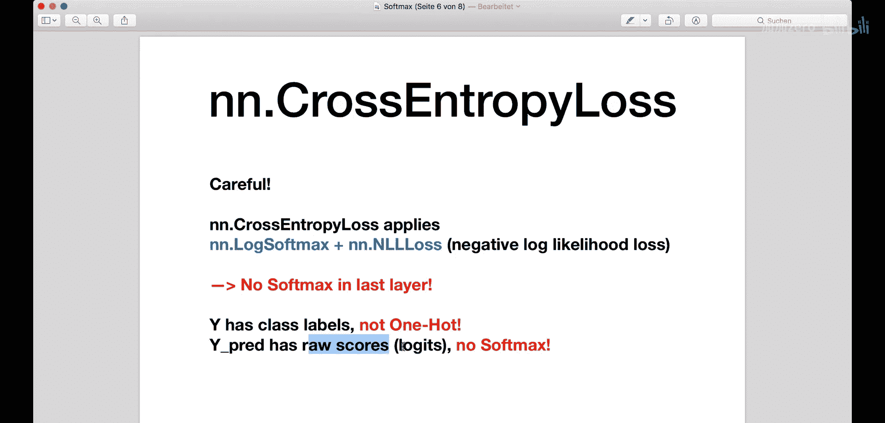

例如，对于三个类别（0, 1, 2），如果真实标签是类别0，则其独热编码为 `[1, 0, 0]`。预测概率可能是应用Softmax后的结果，如 `[0.7, 0.2, 0.1]`。

### 代码实现

以下是交叉熵在NumPy和PyTorch中的计算方式。

**NumPy实现（需要独热编码）：**
```python
def cross_entropy_loss(y_true_onehot, y_pred_probs):
    # y_true_onehot: 独热编码的真实标签
    # y_pred_probs: 预测的概率分布
    return -np.sum(y_true_onehot * np.log(y_pred_probs))

# 示例：好预测与坏预测
y_true_good = np.array([1, 0, 0])  # 真实类别为0
y_pred_good = np.array([0.7, 0.2, 0.1])
loss_good = cross_entropy_loss(y_true_good, y_pred_good)
print(f"好预测的损失: {loss_good}")  # 损失较低

y_pred_bad = np.array([0.1, 0.2, 0.7])
loss_bad = cross_entropy_loss(y_true_good, y_pred_bad)
print(f"坏预测的损失: {loss_bad}")  # 损失较高
```

**PyTorch实现（重要区别）：**
在PyTorch中使用 `nn.CrossEntropyLoss` 时，有两个关键点需要注意：
1.  该损失函数内部**已经结合了Softmax和负对数似然损失**，因此**不需要**在模型最后一层手动添加Softmax。
2.  真实标签 `y` **不需要**是独热编码，只需提供正确的类别索引（如 `0`, `1`, `2`）。预测值 `y_pred` 也应该是**原始分数（logits）**，而不是概率。

```python
import torch.nn as nn

# 定义损失函数
loss_fn = nn.CrossEntropyLoss()

# 准备数据
# 真实标签：类别索引，不是独热编码
y = torch.tensor([0])
# 预测值：原始分数（logits），未应用Softmax
y_pred_good = torch.tensor([[2.0, 1.0, 0.1]])  # 形状：(样本数, 类别数)
y_pred_bad = torch.tensor([[0.1, 2.0, 0.1]])

# 计算损失
l1 = loss_fn(y_pred_good, y)
l2 = loss_fn(y_pred_bad, y)
print(l1.item(), l2.item())  # l1损失低，l2损失高

# 获取预测类别
_, predictions1 = torch.max(y_pred_good, 1)
_, predictions2 = torch.max(y_pred_bad, 1)
print(predictions1, predictions2)  # 输出预测的类别索引
```

PyTorch的交叉熵损失也支持批量计算。只需确保输入张量的形状正确：`y_pred` 的形状为 `(批量大小, 类别数)`，`y` 的形状为 `(批量大小,)`，包含每个样本的正确类别索引。

## 在神经网络中的应用

了解了基础函数后，我们来看看它们如何整合到完整的神经网络中。根据问题是多分类还是二分类，网络结构有所不同。

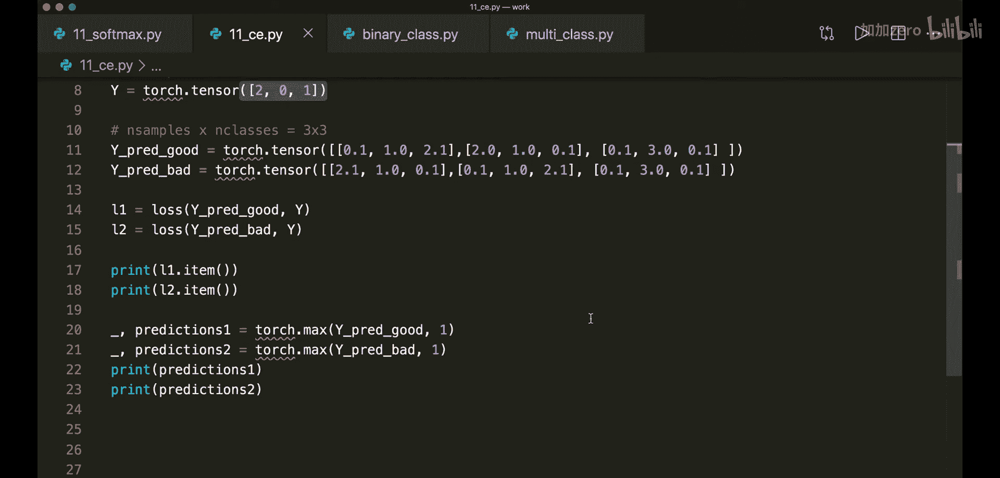

### 多分类网络架构

对于一个典型的多类别分类网络（例如，识别猫、狗、鸟）：
1.  输入层接收数据（如图像像素）。
2.  经过若干隐藏层和激活函数（如ReLU）。
3.  最后一个线性层输出数量等于类别数的原始分数（logits）。
4.  **注意**：在PyTorch中，如果使用 `nn.CrossEntropyLoss`，则**不需要**在网络的 `forward` 方法末尾添加Softmax层。损失函数会处理它。

以下是PyTorch中多分类网络的示例代码框架：

```python
import torch.nn as nn

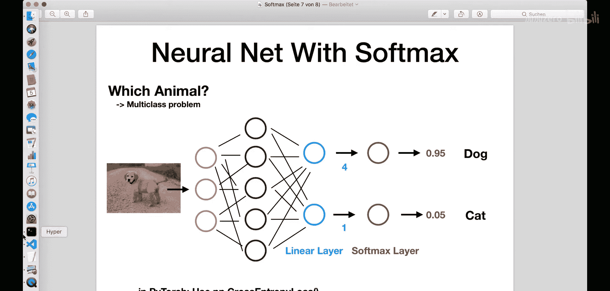

class NeuralNet(nn.Module):
    def __init__(self, input_size, hidden_size, num_classes):
        super(NeuralNet, self).__init__()
        self.linear1 = nn.Linear(input_size, hidden_size)
        self.relu = nn.ReLU()
        self.linear2 = nn.Linear(hidden_size, num_classes) # 输出层，输出原始分数

    def forward(self, x):
        out = self.linear1(x)
        out = self.relu(out)
        out = self.linear2(out) # 不在这里应用Softmax
        return out

# 模型、损失函数和优化器
model = NeuralNet(input_size=784, hidden_size=50, num_classes=3)
criterion = nn.CrossEntropyLoss() # 内部包含Softmax
optimizer = torch.optim.Adam(model.parameters())
```

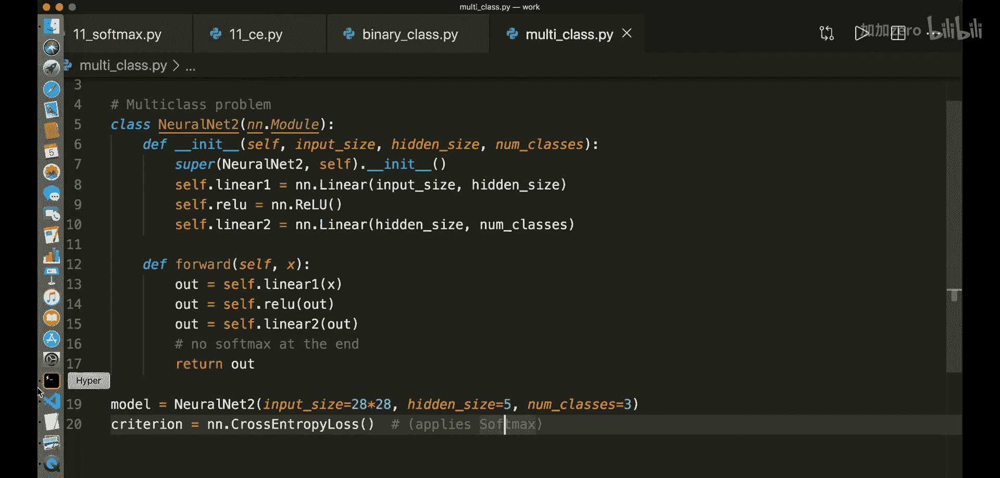

### 二分类网络架构

对于二分类问题（例如，判断是否是狗）：
1.  网络架构类似，但最后一个线性层**只输出一个值**。
2.  需要在 `forward` 方法中对该输出应用 **Sigmoid** 函数，将其压缩到0和1之间，表示概率。
3.  使用 **`nn.BCELoss`** （二元交叉熵损失）作为损失函数。

以下是PyTorch中二分类网络的示例代码框架：

```python
class BinaryClassifier(nn.Module):
    def __init__(self, input_size, hidden_size):
        super(BinaryClassifier, self).__init__()
        self.linear1 = nn.Linear(input_size, hidden_size)
        self.relu = nn.ReLU()
        self.linear2 = nn.Linear(hidden_size, 1) # 输出一个值

    def forward(self, x):
        out = self.linear1(x)
        out = self.relu(out)
        out = self.linear2(out)
        out = torch.sigmoid(out) # 必须在此处应用Sigmoid
        return out

# 模型、损失函数和优化器
model = BinaryClassifier(input_size=784, hidden_size=50)
criterion = nn.BCELoss() # 二元交叉熵损失
optimizer = torch.optim.Adam(model.parameters())
```

**关键区别总结：**
*   **多分类** (`nn.CrossEntropyLoss`)：网络输出原始分数，**不**加Softmax。
*   **二分类** (`nn.BCELoss`)：网络输出单个值，**必须**加Sigmoid。

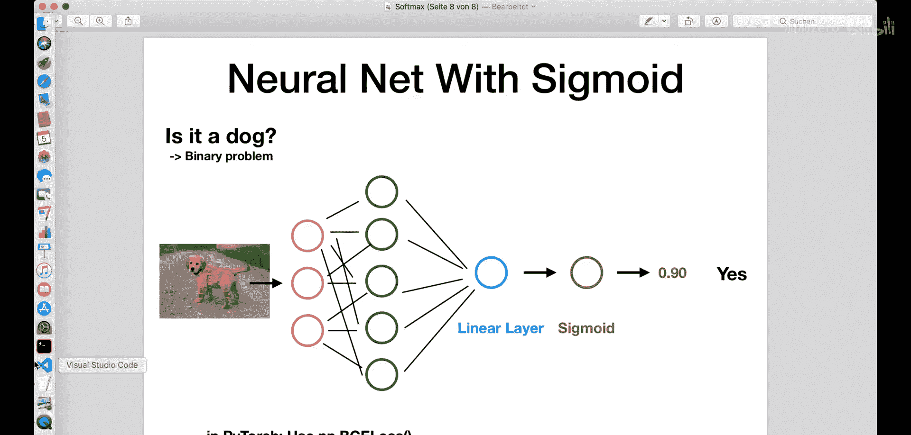

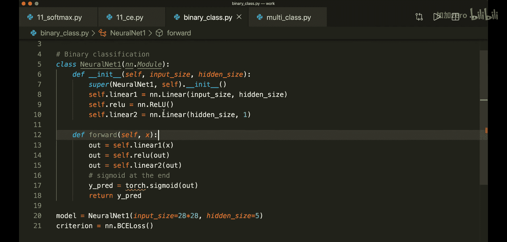

## 总结

本节课中我们一起学习了：
1.  **Softmax函数**：用于将神经网络的原始输出转换为概率分布，所有输出值在0到1之间且和为1。公式为 $\text{Softmax}(x_i) = \frac{e^{x_i}}{\sum_{j} e^{x_j}}$。
2.  **交叉熵损失函数**：用于衡量分类模型预测概率与真实标签之间的差异。预测越准确，损失值越低。
3.  **在PyTorch中的关键实践**：
    *   使用 `nn.CrossEntropyLoss` 时，网络应输出**原始分数（logits）**，且真实标签使用**类别索引**而非独热编码。
    *   使用 `nn.BCELoss` 处理二分类问题时，网络输出需经过 **Sigmoid** 函数激活。
4.  **典型网络架构**：我们对比了多分类和二分类神经网络在输出层和损失函数使用上的不同结构。

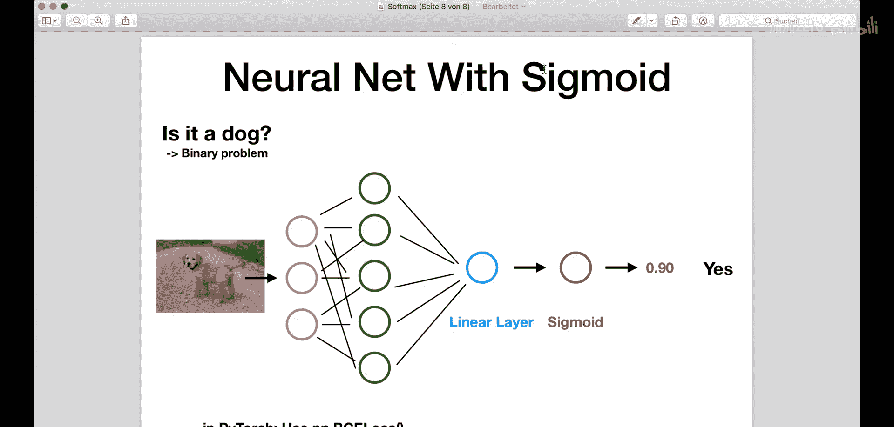

正确理解并应用Softmax和交叉熵损失，是构建有效分类神经网络的基础。