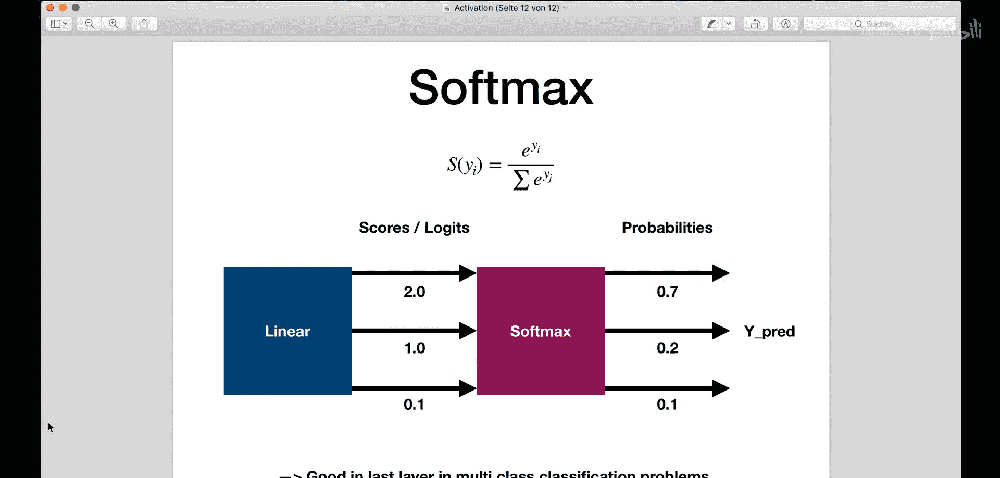
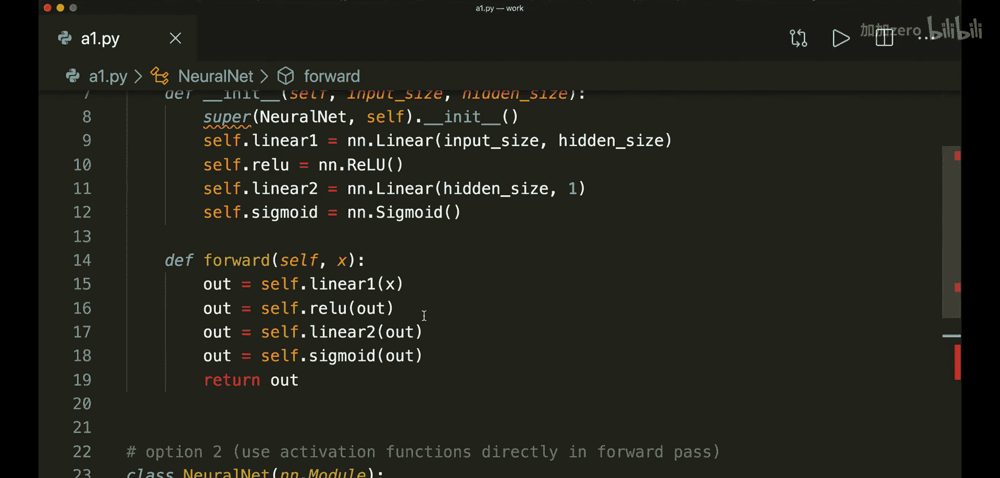

# 012：激活函数

## 概述
在本节课中，我们将要学习神经网络中的一个核心组件——激活函数。我们将了解激活函数是什么、为什么需要使用它们、有哪些常见的激活函数类型，以及如何在PyTorch模型中应用它们。

激活函数对神经网络的层输出施加非线性变换，并决定神经元是否应该被激活。如果没有激活函数，多层神经网络将退化为一个线性回归模型，无法处理复杂的任务。因此，激活函数对于提升网络的学习能力和处理复杂问题的能力至关重要。

## 什么是激活函数？
激活函数应用于神经网络的层输出。它的核心作用是引入非线性因素。一个典型的神经网络层会进行线性变换，即 `output = input * weights + bias`。如果我们在层与层之间不使用激活函数，那么整个网络从输入到输出就只是一系列线性变换的组合，本质上仍然是一个线性模型。这种线性模型无法胜任更复杂的任务。

因此，结论是：通过在层之间引入非线性变换，我们的网络可以学习得更好，并执行更复杂的任务。通常，我们在每个线性层之后都会应用一个激活函数。

## 常见的激活函数
以下是几种最流行的激活函数，我们将逐一介绍它们的特点和适用场景。

### 1. 二元阶跃函数
这是最简单的激活函数。如果输入大于某个阈值（通常为0），则输出1；否则输出0。其公式可以表示为：
```
f(x) = 1 if x > 0 else 0
```
这个函数在实践中很少使用，但它清晰地展示了“神经元是否应被激活”的基本概念。

### 2. Sigmoid函数
如果你看过逻辑回归的教程，应该已经熟悉这个函数。Sigmoid函数的公式是：
```
σ(x) = 1 / (1 + e^(-x))
```
它将输入压缩到0和1之间，输出一个概率值。Sigmoid函数通常用于**二元分类**问题的最后一层。

### 3. 双曲正切函数
双曲正切函数，即 `tanh`，可以看作是一个经过缩放和位移的Sigmoid函数。其输出范围在-1到+1之间。公式为：
```
tanh(x) = (e^x - e^(-x)) / (e^x + e^(-x))
```
`tanh` 函数是隐藏层的一个良好选择。

### 4. ReLU函数
ReLU是当前神经网络中最流行的激活函数。其规则非常简单：
```
ReLU(x) = max(0, x)
```
对于正值，它直接输出输入值；对于负值，则输出0。虽然它看起来很像线性函数，但实际上它是非线性的。经验法则是：如果你不知道在隐藏层使用哪个激活函数，那么使用ReLU通常是一个很好的选择。

### 5. Leaky ReLU函数
Leaky ReLU是ReLU的一个改进版本，旨在解决“神经元死亡”问题。其公式为：
```
LeakyReLU(x) = x if x > 0 else a * x
```
其中，`a` 是一个非常小的值（例如0.001）。在标准的ReLU中，负输入的梯度为0，导致对应的权重在反向传播中无法更新，这些神经元就“死亡”了。Leaky ReLU通过为负输入赋予一个很小的斜率，确保了梯度始终存在。如果在训练中发现权重不更新，可以尝试用Leaky ReLU替换标准的ReLU。

### 6. Softmax函数
Softmax函数通常用于**多类别分类**问题的最后一层。它将一组输入值（logits）转换为一个概率分布，使得所有输出值之和为1。其公式为：
```
Softmax(x_i) = e^(x_i) / Σ_j e^(x_j)
```

## 在PyTorch中使用激活函数
在PyTorch中，我们有两种主要方式来使用激活函数。



### 方法一：将激活函数定义为 `nn.Module`
在这种方法中，我们在网络类的 `__init__` 方法中，像定义线性层一样定义激活函数层。然后在 `forward` 方法中依次调用它们。

```python
import torch.nn as nn

class NeuralNet(nn.Module):
    def __init__(self, input_size, hidden_size, num_classes):
        super(NeuralNet, self).__init__()
        self.linear1 = nn.Linear(input_size, hidden_size)
        self.relu = nn.ReLU()          # 定义ReLU层
        self.linear2 = nn.Linear(hidden_size, num_classes)
        self.sigmoid = nn.Sigmoid()    # 定义Sigmoid层

    def forward(self, x):
        out = self.linear1(x)
        out = self.relu(out)           # 应用ReLU
        out = self.linear2(out)
        out = self.sigmoid(out)        # 应用Sigmoid
        return out
```

### 方法二：在 `forward` 方法中直接调用函数式API
在这种方法中，我们只在 `__init__` 中定义线性层，而在 `forward` 方法中直接使用 `torch.nn.functional` 或 `torch` 中的函数。

```python
import torch
import torch.nn as nn
import torch.nn.functional as F

class NeuralNet(nn.Module):
    def __init__(self, input_size, hidden_size, num_classes):
        super(NeuralNet, self).__init__()
        self.linear1 = nn.Linear(input_size, hidden_size)
        self.linear2 = nn.Linear(hidden_size, num_classes)

    def forward(self, x):
        out = self.linear1(x)
        out = F.relu(out)              # 直接调用函数式ReLU
        out = self.linear2(out)
        out = torch.sigmoid(out)       # 直接调用torch的sigmoid
        return out
```

两种方法实现的效果相同，选择哪一种取决于你的编码偏好。PyTorch在 `torch.nn` 模块（如 `nn.ReLU`, `nn.Sigmoid`, `nn.Softmax`, `nn.Tanh`, `nn.LeakyReLU`）和 `torch.nn.functional` 模块（通常导入为 `F`）中提供了所有常见的激活函数。有些函数（如 `F.leaky_relu`）可能只在函数式API中提供。



## 总结
本节课我们一起学习了激活函数。我们首先了解了激活函数的作用是为神经网络引入非线性，使其能够学习复杂的模式。接着，我们介绍了六种常见的激活函数：二元阶跃函数、Sigmoid、Tanh、ReLU、Leaky ReLU和Softmax，并了解了它们各自的特点和适用场景。最后，我们学习了在PyTorch中应用激活函数的两种主要方法：将其定义为 `nn.Module` 的子模块，或在 `forward` 方法中直接调用函数式API。掌握激活函数是构建有效神经网络模型的关键一步。