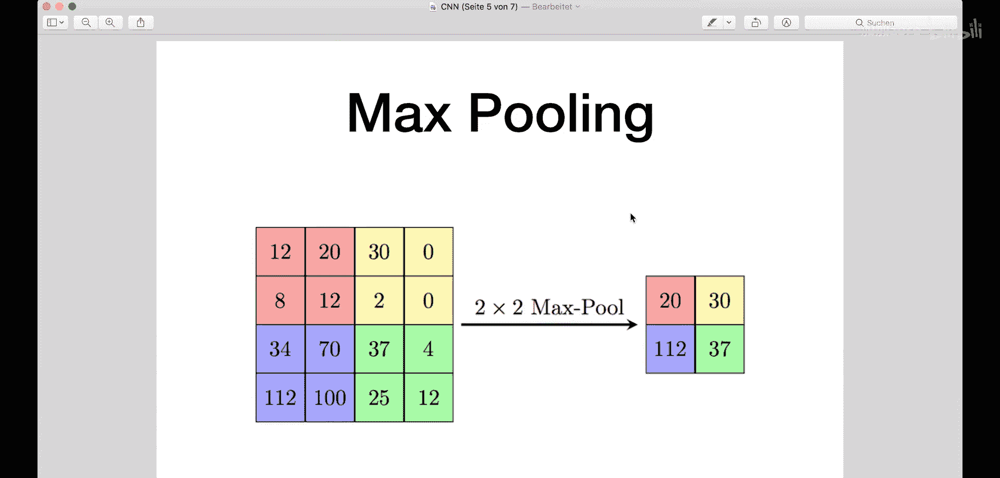
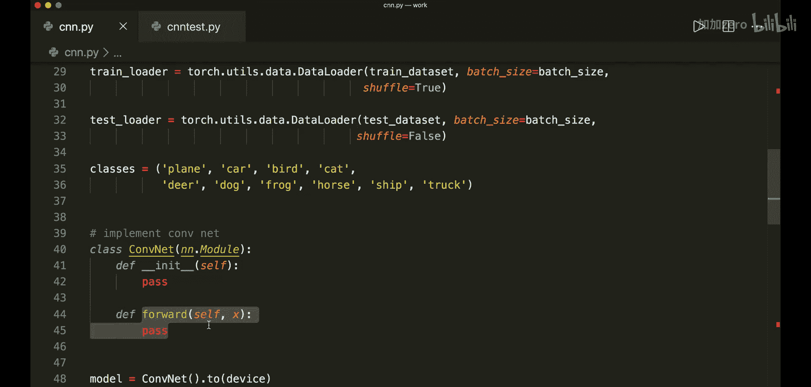
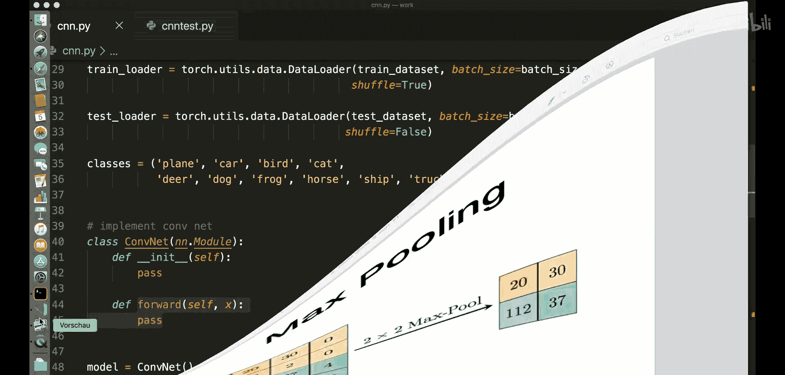
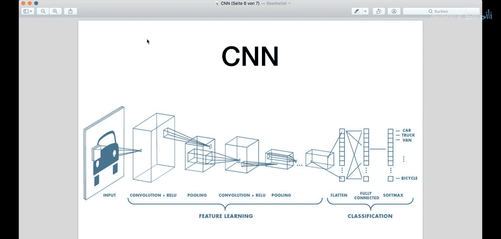
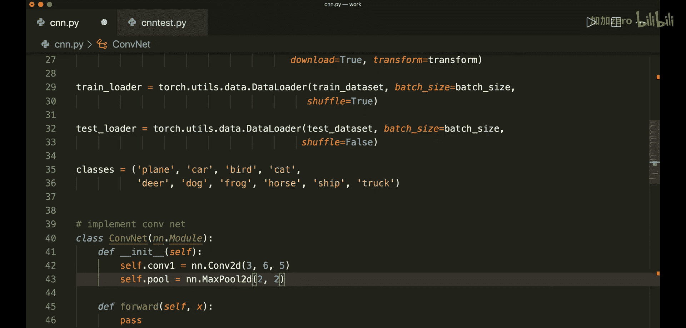
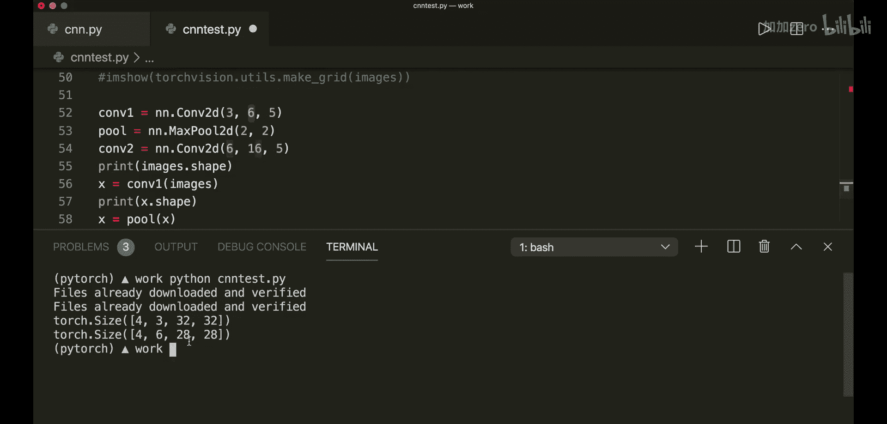
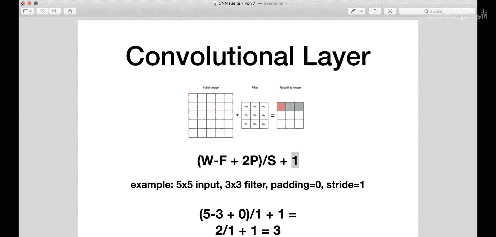
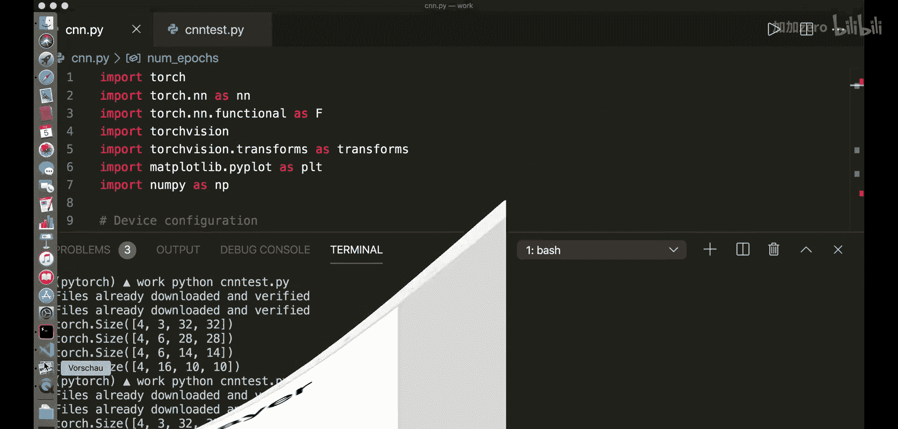
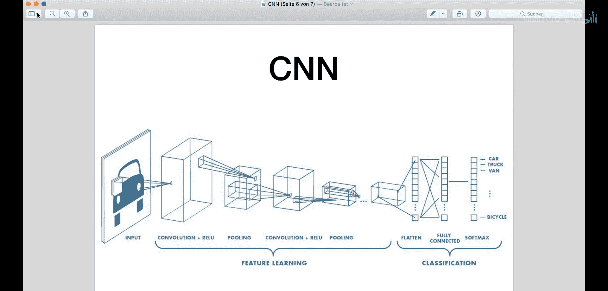
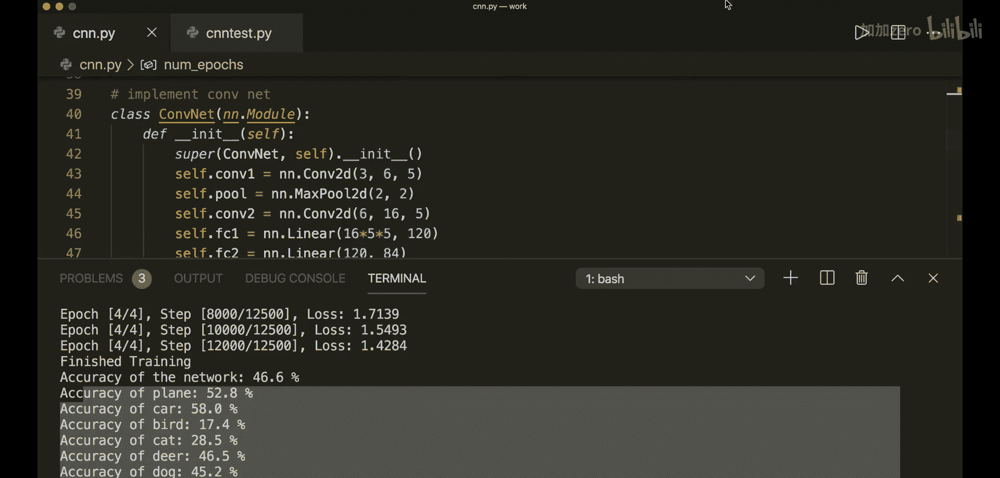

# 014：卷积神经网络（CNN）

在本节课中，我们将学习如何实现一个卷积神经网络（CNN），并使用CIFAR-10数据集进行图像分类。CIFAR-10是一个包含10个类别的流行图像数据集，例如飞机、汽车、鸟类和猫等。我们将创建一个能够对这些图像进行分类的卷积神经网络。

## 概述

卷积神经网络是专门为处理图像数据而设计的神经网络。它们通过使用卷积滤波器自动从图像中学习特征，然后通过全连接层进行分类。本节我们将重点介绍如何在PyTorch中实现一个CNN。

## 卷积神经网络简介

上一节我们介绍了本课程的目标。本节中，我们来看看卷积神经网络的基本概念。

卷积神经网络与普通神经网络相似，都由具有可学习权重和偏置的神经元组成。主要区别在于，卷积网络主要处理图像数据，并应用所谓的卷积滤波器。

一个典型的CNN架构如下：输入图像，经过多个卷积层（通常伴随激活函数）和池化层，这些层用于自动从图像中学习特征，最后是一个或多个用于实际分类任务的全连接层。

### 卷积滤波器的工作原理

以下是卷积滤波器的工作原理。

卷积滤波器通过将一个滤波器核应用于我们的图像来工作。我们将滤波器放置在图像的第一个位置（例如红色位置），通过乘法和求和计算输出值，并将该值写入输出图像。然后，我们将滤波器滑动到下一个位置（例如绿色位置），重复相同的操作，直到遍历整个图像。



经过这种变换，生成的图像尺寸可能会变小，因为滤波器无法完全贴合图像的角落（除非使用填充技术，本课不涉及）。正确计算输出尺寸是实践中的重要步骤。

### 池化层简介

接下来，我们简要介绍池化层。

池化层，更具体地说是最大池化，用于通过对图像子区域应用最大滤波器来进行下采样。例如，我们有一个2x2的滤波器，查看原始图像中的2x2子区域，并将该区域的最大值写入输出图像。

最大池化通过减小图像尺寸来降低计算成本，从而减少模型需要学习的参数数量，并通过提供输入的抽象形式来帮助避免过拟合。

以上是我们需要了解的核心概念。现在，理论部分已经足够，让我们开始编写代码。

## 代码实现



以下是实现CNN所需的步骤概述。我们将首先导入必要的库，设置超参数，加载数据集，然后定义我们的卷积神经网络模型。

### 1. 导入库与设置

首先，我们导入所需的PyTorch模块，并确保支持GPU运算。然后定义超参数。





```python
import torch
import torch.nn as nn
import torch.nn.functional as F
import torchvision
import torchvision.transforms as transforms
import matplotlib.pyplot as plt
import numpy as np

# 设备配置
device = torch.device('cuda' if torch.cuda.is_available() else 'cpu')




# 超参数
num_epochs = 4
batch_size = 4
learning_rate = 0.001
```

### 2. 加载与准备数据集

CIFAR-10数据集可直接从PyTorch获取。我们定义数据转换、数据集和数据加载器。

```python
# 图像转换
transform = transforms.Compose(
    [transforms.ToTensor(),
     transforms.Normalize((0.5, 0.5, 0.5), (0.5, 0.5, 0.5))])

# 加载训练和测试数据集
train_dataset = torchvision.datasets.CIFAR10(root='./data', train=True,
                                        download=True, transform=transform)
test_dataset = torchvision.datasets.CIFAR10(root='./data', train=False,
                                       download=True, transform=transform)

# 数据加载器
train_loader = torch.utils.data.DataLoader(train_dataset, batch_size=batch_size,
                                          shuffle=True)
test_loader = torch.utils.data.DataLoader(test_dataset, batch_size=batch_size,
                                         shuffle=False)

# 类别名称
classes = ('plane', 'car', 'bird', 'cat',
           'deer', 'dog', 'frog', 'horse', 'ship', 'truck')
```

### 3. 定义卷积神经网络模型

现在，我们定义`ConvNet`类。它继承自`nn.Module`，并需要实现`__init__`和`forward`方法。

我们的架构包含两个卷积层（每个后面跟着ReLU激活和最大池化层），以及三个全连接层。



```python
class ConvNet(nn.Module):
    def __init__(self):
        super(ConvNet, self).__init__()
        # 第一个卷积层：输入通道3，输出通道6，卷积核5x5
        self.conv1 = nn.Conv2d(3, 6, 5)
        # 池化层：核大小2x2，步长2
        self.pool = nn.MaxPool2d(2, 2)
        # 第二个卷积层：输入通道6，输出通道16，卷积核5x5
        self.conv2 = nn.Conv2d(6, 16, 5)
        # 全连接层
        self.fc1 = nn.Linear(16 * 5 * 5, 120)
        self.fc2 = nn.Linear(120, 84)
        self.fc3 = nn.Linear(84, 10)

    def forward(self, x):
        # 应用第一个卷积 -> ReLU -> 池化
        x = self.pool(F.relu(self.conv1(x)))
        # 应用第二个卷积 -> ReLU -> 池化
        x = self.pool(F.relu(self.conv2(x)))
        # 展平特征图
        x = x.view(-1, 16 * 5 * 5)
        # 应用全连接层与ReLU激活
        x = F.relu(self.fc1(x))
        x = F.relu(self.fc2(x))
        # 最终输出层（无激活函数）
        x = self.fc3(x)
        return x



# 实例化模型
model = ConvNet().to(device)
```

**关于尺寸计算的说明**：第一个全连接层`self.fc1`的输入尺寸必须是`16 * 5 * 5`。这是因为经过两次卷积和池化后，特征图的尺寸变为`[batch_size, 16, 5, 5]`。我们将其展平为`[batch_size, 16*5*5]`后，才能输入到全连接层。输出尺寸`120`和`84`可以调整，但最终输出必须是10（对应10个类别）。

### 4. 定义损失函数与优化器



对于这个多分类问题，我们使用交叉熵损失和随机梯度下降优化器。



```python
criterion = nn.CrossEntropyLoss()
optimizer = torch.optim.SGD(model.parameters(), lr=learning_rate)
```

### 5. 训练循环

以下是标准的训练循环，包括前向传播、损失计算、反向传播和参数更新。

```python
n_total_steps = len(train_loader)
for epoch in range(num_epochs):
    for i, (images, labels) in enumerate(train_loader):
        # 将数据移动到设备（GPU/CPU）
        images = images.to(device)
        labels = labels.to(device)

        # 前向传播
        outputs = model(images)
        loss = criterion(outputs, labels)

        # 反向传播与优化
        optimizer.zero_grad()
        loss.backward()
        optimizer.step()

        # 打印训练信息
        if (i+1) % 2000 == 0:
            print (f'Epoch [{epoch+1}/{num_epochs}], Step [{i+1}/{n_total_steps}], Loss: {loss.item():.4f}')

print('训练完成')
```

### 6. 模型评估

训练完成后，我们在测试集上评估模型的性能。我们计算整体准确率和每个类别的准确率。

```python
with torch.no_grad():
    n_correct = 0
    n_samples = 0
    n_class_correct = [0 for i in range(10)]
    n_class_samples = [0 for i in range(10)]
    for images, labels in test_loader:
        images = images.to(device)
        labels = labels.to(device)
        outputs = model(images)
        # 最大值即预测类别
        _, predicted = torch.max(outputs, 1)
        n_samples += labels.size(0)
        n_correct += (predicted == labels).sum().item()

        # 计算每个类别的准确率
        for i in range(batch_size):
            label = labels[i]
            pred = predicted[i]
            if (label == pred):
                n_class_correct[label] += 1
            n_class_samples[label] += 1

    acc = 100.0 * n_correct / n_samples
    print(f'网络整体准确率: {acc} %')

    for i in range(10):
        acc = 100.0 * n_class_correct[i] / n_class_samples[i]
        print(f'{classes[i]}类别的准确率: {acc} %')
```

## 总结

本节课中，我们一起学习了卷积神经网络（CNN）的基本原理及其在PyTorch中的实现。我们完成了以下步骤：

1.  **理解CNN架构**：了解了卷积层、池化层和全连接层的作用。
2.  **实现CNN模型**：定义了一个包含两个卷积层和三个全连接层的`ConvNet`类。
3.  **处理数据**：加载并准备了CIFAR-10数据集用于训练和测试。
4.  **训练与评估**：设置了损失函数和优化器，执行了训练循环，并最终评估了模型的分类性能。



通过本教程，你现在应该掌握了使用PyTorch构建和训练一个简单卷积神经网络进行图像分类的基本方法。你可以尝试调整超参数（如学习率、训练轮数）或网络结构（如通道数、层数）来进一步提升模型在CIFAR-10数据集上的准确率。