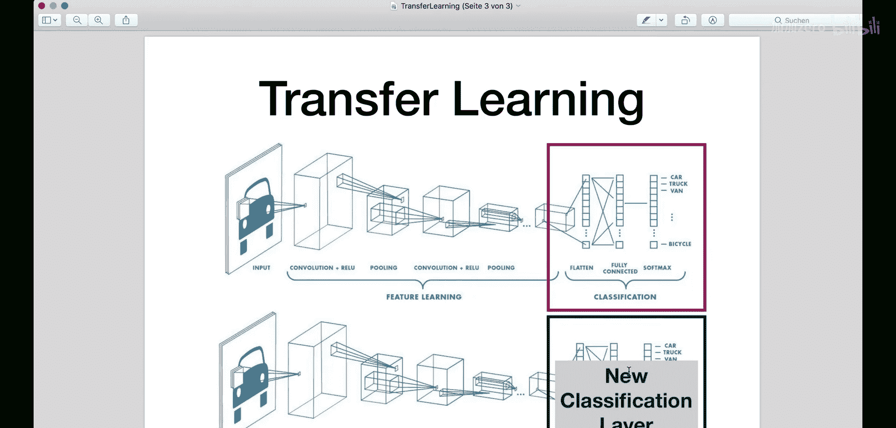
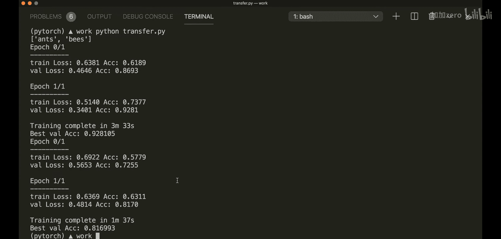

# 015：迁移学习

## 概述
在本节课中，我们将要学习迁移学习的概念及其在PyTorch中的应用。迁移学习是一种强大的深度学习技术，它允许我们利用在一个任务上训练好的模型，作为解决另一个相关任务的起点，从而节省大量训练时间和计算资源。

## 什么是迁移学习？
迁移学习是一种机器学习方法，其核心思想是将为第一个任务开发的模型，作为第二个任务模型的起点进行复用。

例如，我们可以先训练一个模型来分类鸟类和猫，然后仅修改其最后一层，再利用这个新模型来分类蜜蜂和狗。这是一种在深度学习中非常流行的方法，因为它能快速生成新模型。从头开始训练一个全新的模型可能非常耗时，需要数天甚至数周。而使用预训练模型时，我们通常只需替换最后一层，无需重新训练整个模型。

然而，迁移学习通常能取得相当不错的性能表现，这也是它如今如此流行的原因。

## 迁移学习的工作原理
让我们来看一下这张图。这是一个典型的CNN架构。假设它已经在大量数据上训练完毕，我们得到了优化后的权重。现在，我们只想取出最后一个全连接层，对其进行修改，并在我们的新数据上训练这一层。这样，我们就得到了一个在最后一层经过训练和调整的新模型。

这就是迁移学习的基本概念。




## PyTorch中的迁移学习实践
现在，让我们来看一个在PyTorch中的具体例子。在这个例子中，我们将使用预训练的ResNet-18模型。这个网络在ImageNet数据库的超过一百万张图像上进行了训练，共有18层深度，可以将图像分类为1000个对象类别。而在我们的例子中，我们只有两个类别：蚂蚁和蜜蜂。



在本节中，我还将向你展示另外两个新内容：
1.  如何使用`datasets.ImageFolder`加载数据。
2.  如何使用调度器来动态调整学习率。
3.  当然，还有如何使用迁移学习。

### 数据准备：ImageFolder
我已经导入了所需的库。现在我们来设置数据。上次我们使用了TorchVision内置的数据集，这次我们使用`datasets.ImageFolder`，因为我们的数据保存在文件夹中。

文件夹结构必须如下所示：
*   我们有一个根文件夹。
*   在根文件夹下，有`train`（训练）和`val`（验证）子文件夹。
*   在每个子文件夹（`train`和`val`）中，都有对应每个类别的文件夹（例如`ants`和`bees`）。
*   在每个类别文件夹中，存放着对应的图像。

你可以这样调用`datasets.ImageFolder`并指定路径，同时应用一些数据变换。然后，通过`image_datasets.classes`可以获取类别名称。

我定义了一个训练模型函数，其中包含了训练和评估的循环。这里不深入细节，你应该已经从之前的教程中了解了典型的训练和评估循环是什么样的。你可以在GitHub上查看完整代码，链接在描述中。

### 应用迁移学习
首先，我们需要导入预训练模型。我们可以通过以下方式设置模型：

```python
model = models.resnet18(pretrained=True)
```

`pretrained=True`表示加载在ImageNet数据上优化好的权重。

接下来，我们要替换最后一个全连接层。首先，获取最后一层的输入特征数：

```python
num_ftrs = model.fc.in_features
```

然后，创建一个新的层并将其分配给最后一层：

```python
model.fc = nn.Linear(num_ftrs, 2) # 2 是我们的新类别数
```

之后，将模型发送到设备（GPU或CPU）：

```python
model = model.to(device)
```

### 定义损失函数、优化器与学习率调度器
像往常一样，我们定义损失函数和优化器：

```python
criterion = nn.CrossEntropyLoss()
optimizer = optim.SGD(model.parameters(), lr=0.001)
```

现在，引入一个新内容：学习率调度器。它将用于更新学习率。我们可以创建一个`StepLR`调度器：

```python
scheduler = lr_scheduler.StepLR(optimizer, step_size=7, gamma=0.1)
```

这意味着每经过7个周期，我们的学习率将乘以`gamma`值（0.1），即变为原来的10%。

在训练循环中，在每个周期结束时，我们不仅调用`optimizer.step()`，还需要调用`scheduler.step()`。

### 两种迁移学习策略
**1. 微调整个模型**
这是我们上面设置的方式。我们训练整个模型，但基于新数据和新的最后一层进行微调。这是一种常用策略。

**2. 仅训练最后一层（冻结其他层）**
作为第二种选择，我们可以冻结模型开始的所有层，只训练最后一层。为此，在获取模型后，我们需要遍历所有参数并将其`requires_grad`属性设置为`False`：

```python
for param in model.parameters():
    param.requires_grad = False
```

然后，我们像之前一样设置新的最后一层（默认情况下，新层的`requires_grad=True`）。接着，再次设置损失函数、优化器和调度器，并调用训练函数。这种方式训练速度更快。

### 结果对比
在我的电脑上运行示例（由于没有GPU支持，我将周期数减少到2进行演示）：
*   **微调整个模型**：耗时约3.5分钟，最佳准确率达到92%。
*   **仅训练最后一层**：耗时约1.5分钟，准确率已超过80%。

可以想象，如果我们设置更多的训练周期，准确率会更高。这正体现了迁移学习的强大之处：我们拥有一个预训练模型，只需对其进行少量微调，就能在一个全新的任务上取得相当好的结果。


## 总结
本节课中，我们一起学习了迁移学习的概念及其在PyTorch中的实现。我们了解了如何使用`ImageFolder`加载自定义数据集，如何应用学习率调度器，并实践了两种迁移学习策略：微调整个模型和仅训练最后一层。迁移学习通过利用预训练模型的知识，能够显著减少训练时间和资源消耗，是深度学习实践中一项极其重要的技术。