# 016：使用TensorBoard可视化分析模型 📊

在本节课中，我们将学习如何使用TensorBoard来可视化和分析我们的模型及训练过程。TensorBoard是一个强大的可视化工具包，最初由TensorFlow团队开发，但它同样可以完美地与PyTorch配合使用。

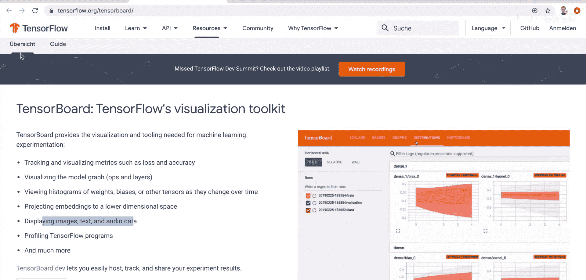

## 概述
我们将通过一个手写数字识别（MNIST数据集）的示例项目，演示如何将TensorBoard集成到PyTorch代码中。你将学会如何：
1.  安装和启动TensorBoard。
2.  将训练数据（如图像）添加到TensorBoard。
3.  可视化模型的计算图。
4.  跟踪和绘制训练过程中的指标（如损失和准确率）。
5.  为每个类别绘制精确率-召回率曲线。

## 准备工作：安装与启动TensorBoard

首先，我们需要安装TensorBoard。这可以通过pip轻松完成，无需安装整个TensorFlow库。

```bash
pip install tensorboard
```

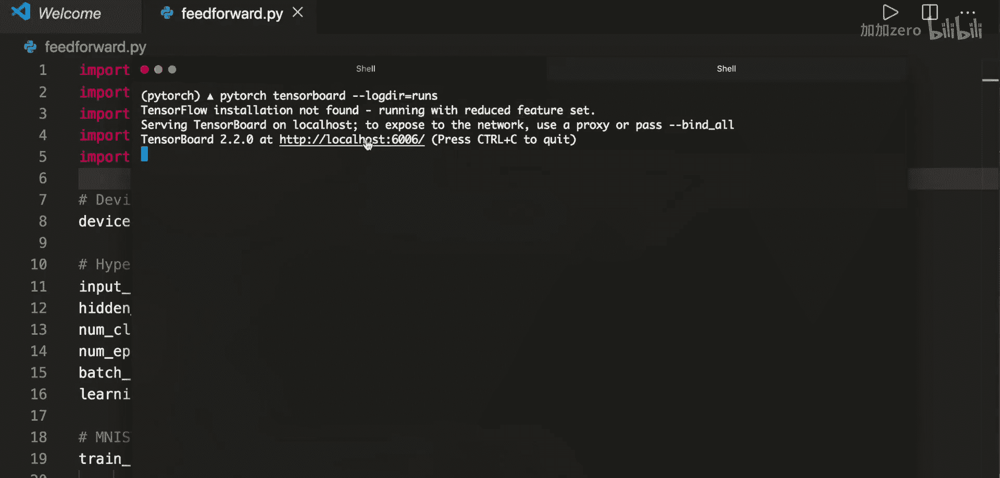

安装完成后，可以通过以下命令启动TensorBoard服务器。`--logdir`参数指定了存储日志文件的目录。

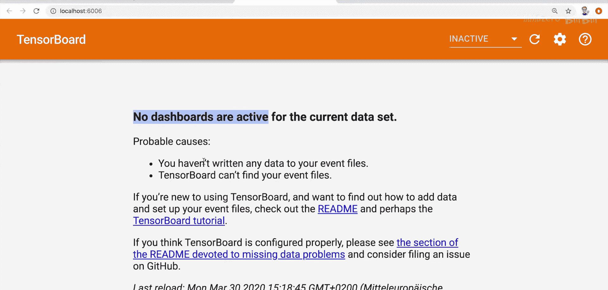

```bash
tensorboard --logdir=runs
```

执行命令后，TensorBoard将在 `localhost:6006` 启动。在浏览器中打开此地址，即可看到TensorBoard的Web界面。初始时，由于尚未写入任何数据，界面会显示“No dashboards are active”。

## 第一步：将图像数据写入TensorBoard

我们将从一个已有的MNIST分类项目代码开始。首先，需要从`torch.utils.tensorboard`导入`SummaryWriter`，它是我们与TensorBoard交互的主要工具。

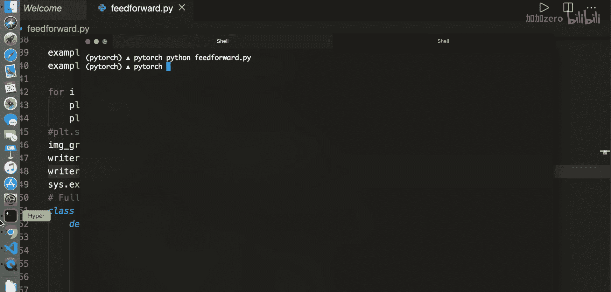

```python
from torch.utils.tensorboard import SummaryWriter
```

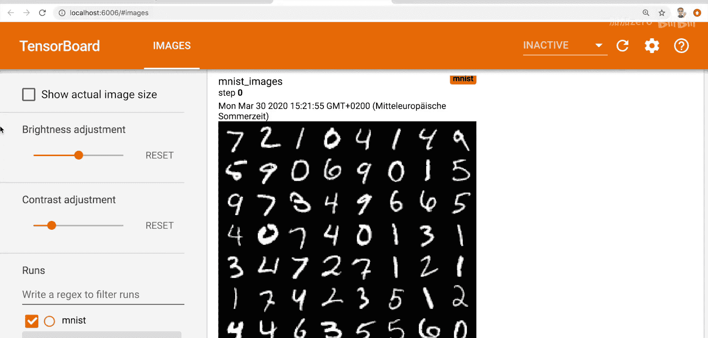

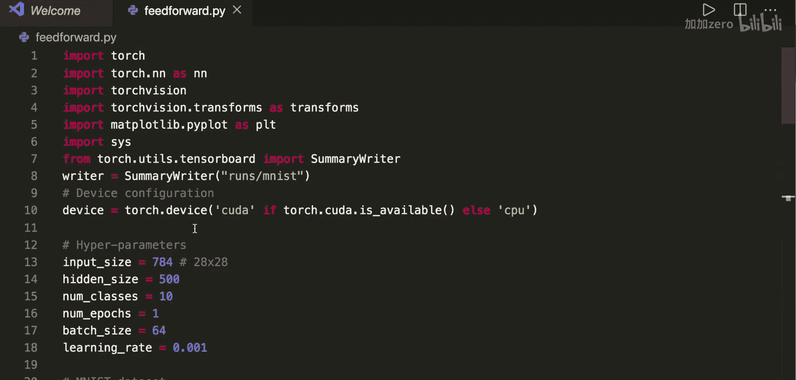

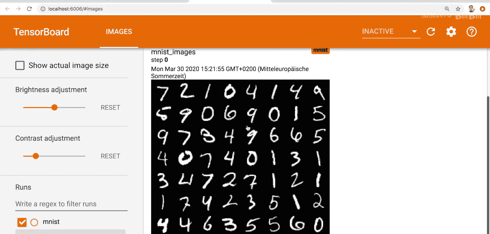

接着，创建一个`SummaryWriter`实例，并指定日志的保存目录。

```python
writer = SummaryWriter(‘runs/mnist_experiment’)
```

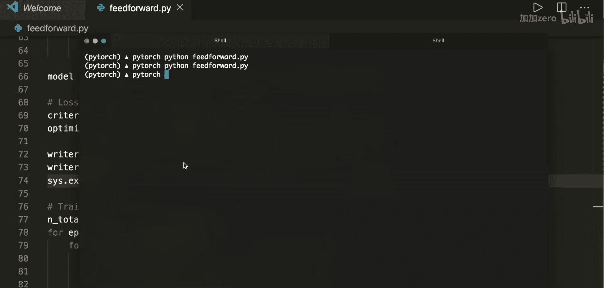

在加载并展示数据批次的部分，我们可以将图像网格添加到TensorBoard，而不是仅仅使用`matplotlib`显示。

```python
# 创建图像网格
img_grid = torchvision.utils.make_grid(example_data)
# 将图像网格写入TensorBoard
writer.add_image(‘mnist_images’, img_grid)
# 关闭writer以确保数据被刷新
writer.close()
```

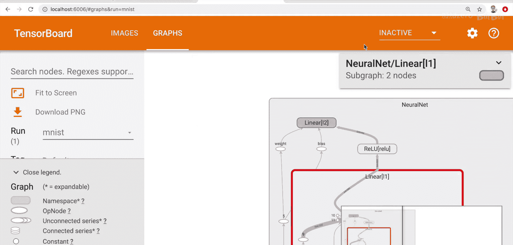

运行脚本后，刷新TensorBoard页面，你将在“IMAGES”标签页下看到上传的图像网格。

## 第二步：可视化模型计算图

TensorBoard可以直观地展示模型的结构。在定义模型之后，我们可以轻松地添加计算图。

```python
model = NeuralNet()
# ... 定义损失函数和优化器 ...
# 将模型图添加到TensorBoard，需要提供一个示例输入
writer.add_graph(model, example_data.reshape(-1, 28*28))
writer.close()
```

运行脚本后，在TensorBoard的“GRAPHS”标签页中，你可以看到模型的完整计算图。双击节点可以展开查看更详细的层结构、权重和偏置信息。

## 第三步：跟踪训练指标（损失与准确率）

在训练循环中，我们通常打印损失值。使用TensorBoard，我们可以将这些指标绘制成动态图表，便于分析。

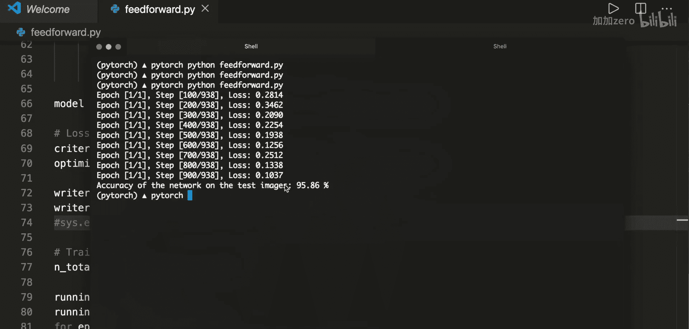

首先，在训练循环外初始化两个累加器。

```python
running_loss = 0.0
running_correct = 0.0
```

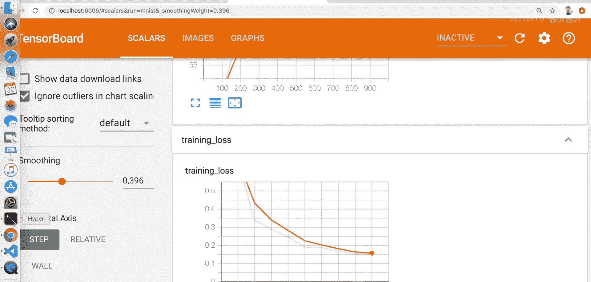

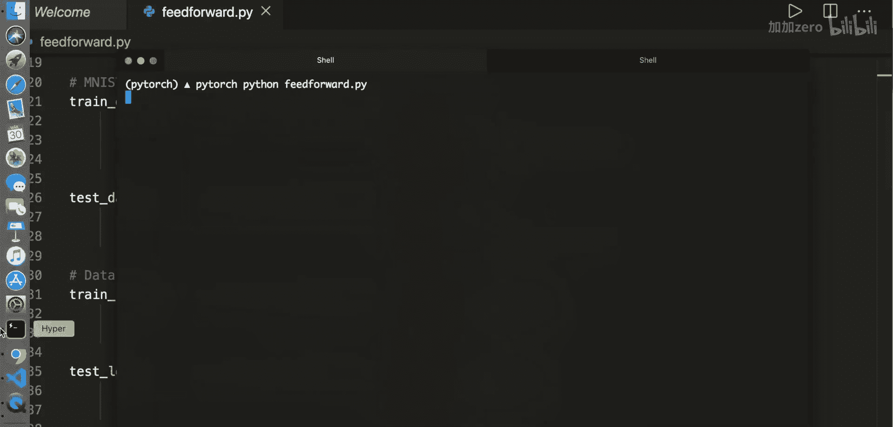

在每次训练迭代中，更新这些累加器。

```python
# 前向传播、计算损失、反向传播...
running_loss += loss.item()
_, predictions = torch.max(outputs, 1)
running_correct += (predictions == labels).sum().item()
```

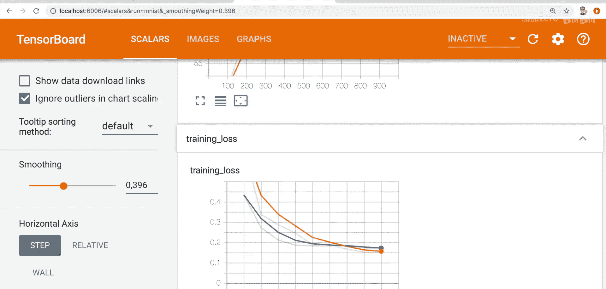

然后，每隔一定步数（例如100步），计算平均值并写入TensorBoard。

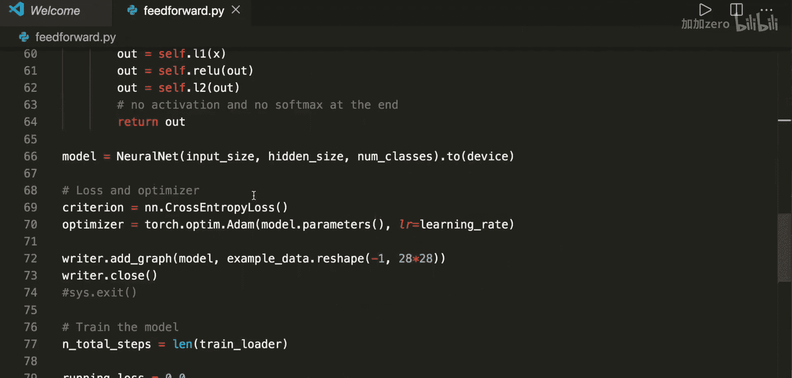

```python
if i % 100 == 99:
    # 计算平均损失和准确率
    avg_loss = running_loss / 100
    avg_accuracy = running_correct / 100
    # 获取当前全局步数
    global_step = epoch * len(train_loader) + i
    # 写入标量数据
    writer.add_scalar(‘training loss’, avg_loss, global_step)
    writer.add_scalar(‘accuracy’, avg_accuracy, global_step)
    # 重置累加器
    running_loss = 0.0
    running_correct = 0.0
```

完成训练后，在TensorBoard的“SCALARS”标签页中，你可以看到损失和准确率随训练步数变化的曲线。这有助于你观察模型是否在有效学习，以及何时可能达到收敛或需要调整超参数（如学习率）。

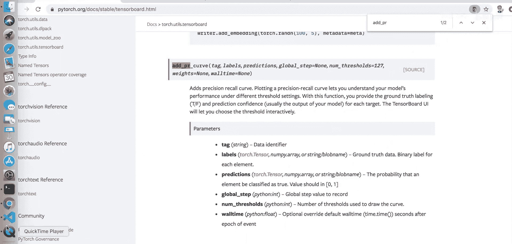

## 第四步：绘制精确率-召回率曲线

精确率-召回率曲线是评估分类模型（尤其是二分类）在不同阈值下性能的有力工具。对于多分类问题，我们可以为每个类别单独绘制。

在模型评估阶段，我们需要收集所有样本的预测概率和真实标签。

```python
# 初始化列表
all_labels = []
all_preds = []

with torch.no_grad():
    for data in test_loader:
        images, labels = data
        outputs = model(images)
        # 获取预测类别（用于准确率计算）
        _, predicted = torch.max(outputs.data, 1)
        # 计算Softmax概率（用于PR曲线）
        probs = F.softmax(outputs, dim=1)

        all_labels.append(labels)
        all_preds.append(probs)

# 合并所有批次的数据
all_labels = torch.cat(all_labels)
all_preds = torch.cat(all_preds)
```

然后，为每个类别（0到9）计算并添加PR曲线。

```python
num_classes = 10
for class_idx in range(num_classes):
    # 获取当前类别的二分类标签和预测概率
    class_labels = (all_labels == class_idx)
    class_probs = all_preds[:, class_idx]
    # 将PR曲线添加到TensorBoard
    writer.add_pr_curve(f‘class_{class_idx}’,
                        class_labels,
                        class_probs,
                        global_step=0)
writer.close()
```

运行脚本后，在TensorBoard的“PR CURVES”标签页中，你可以查看每个类别的PR曲线。通过调整曲线上的阈值点，可以分析模型在不同权衡下的表现。

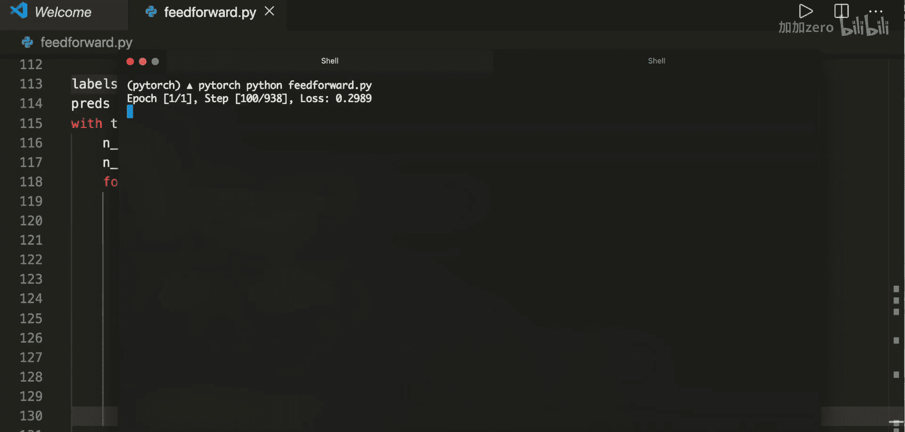

## 总结

本节课我们一起学习了如何利用TensorBoard提升PyTorch项目的开发和分析效率。我们掌握了：
1.  **安装与基础设置**：如何安装TensorBoard并启动其服务。
2.  **数据可视化**：将训练数据（如图像）写入TensorBoard进行查看。
3.  **模型结构分析**：可视化模型计算图，理解数据流和层结构。
4.  **训练过程监控**：实时跟踪并绘制损失和准确率等关键指标。
5.  **模型性能评估**：为多分类模型的每个类别绘制精确率-召回率曲线，进行深入分析。

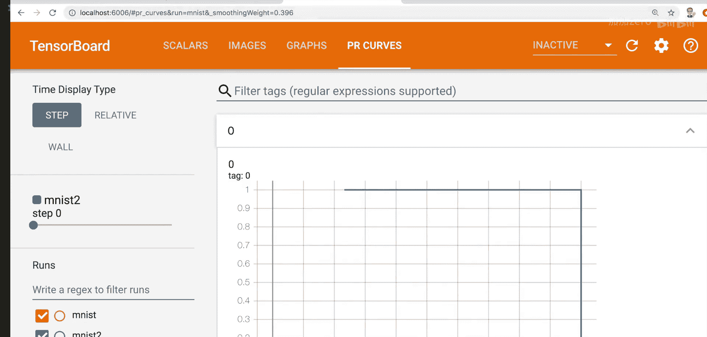

通过集成TensorBoard，你可以更直观地调试模型、优化超参数并理解模型行为，从而更高效地进行机器学习项目开发。