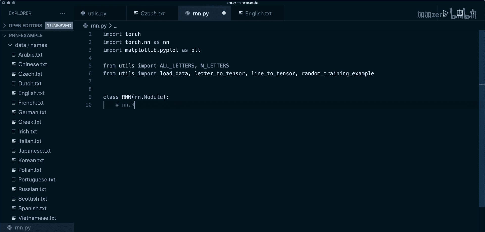
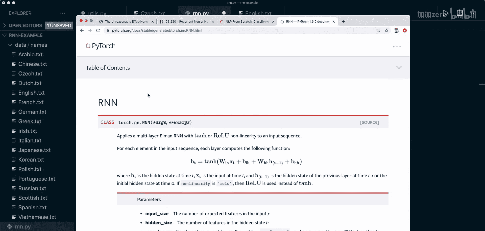
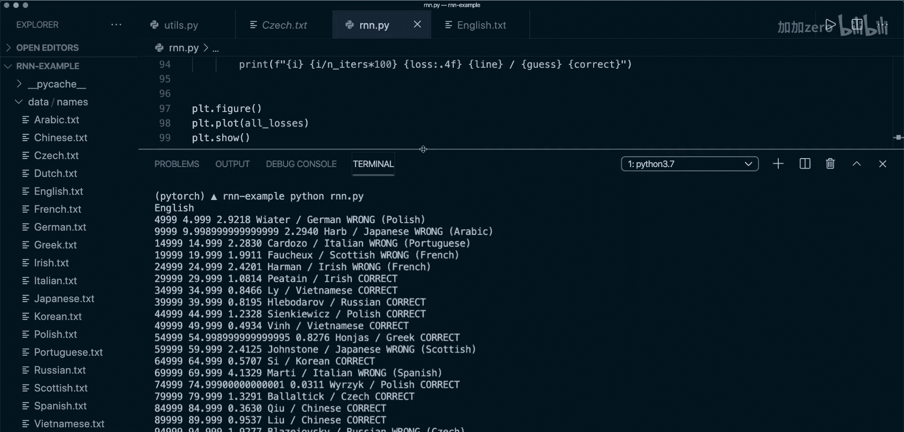
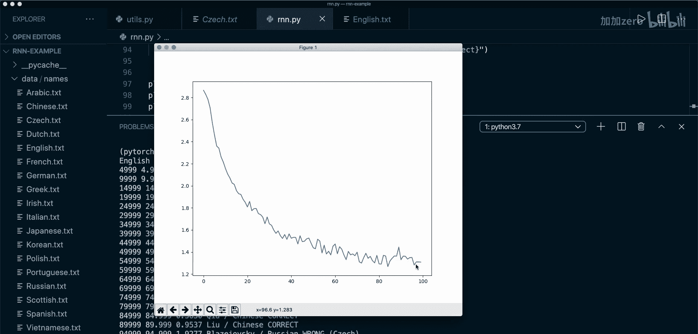
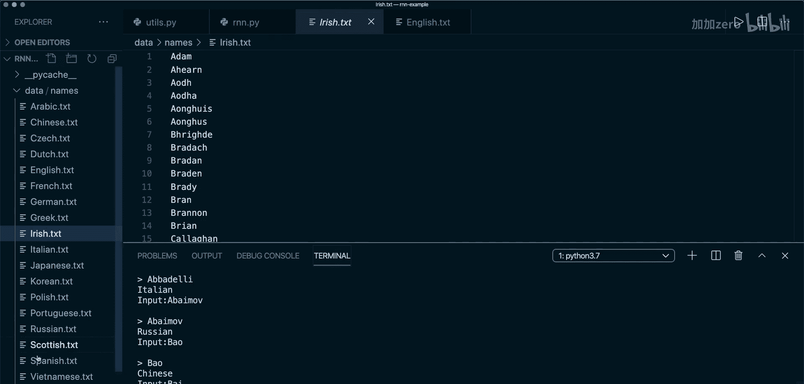

# 019：使用循环神经网络进行姓名分类

在本节课中，我们将学习循环神经网络（RNN）的基本理论，并从头开始实现一个RNN模型，用于根据姓名判断其所属的国家。我们将使用PyTorch框架，并通过一个实际的姓名分类项目来理解RNN的内部工作原理。


## 循环神经网络（RNN）简介


上一节我们介绍了本课程的目标。本节中，我们来看看什么是循环神经网络。

循环神经网络是一类允许先前输出作为输入，并具有隐藏状态的神经网络。其最简单的架构如下图所示：我们有一个输入，经过内部运算后得到隐藏状态，然后将这个隐藏状态作为下一步的输入。这样，我们可以利用先前的知识来更新当前状态，并在最后得到一个输出。

我们可以将这个计算图展开，以便更好地理解。本质上，我们是在处理一个序列。例如，对于一个完整的句子，我们可以将每个单词作为一个输入。我们处理第一个输入和初始隐藏状态，得到输出和新的隐藏状态。然后，我们将这个新的隐藏状态与下一个输入一起，再次进行运算，如此反复。

**核心公式/概念**：
一个RNN单元在时间步 `t` 的基本操作可以表示为：
`h_t = f(W_{ih} * x_t + W_{hh} * h_{t-1} + b_h)`
其中，`h_t` 是当前隐藏状态，`x_t` 是当前输入，`h_{t-1}` 是上一个隐藏状态，`W` 是权重矩阵，`b` 是偏置，`f` 是激活函数。

## RNN的重要性与应用

了解了RNN的基本结构后，我们来看看为什么它如此重要。

RNN之所以令人兴奋，是因为它允许我们对向量序列进行操作。传统的神经网络通常是一对一的关系，例如图像分类，输入（图像）和输出（类别）的长度都是固定的。而RNN可以处理序列数据，并且有多种输入输出模式。

以下是RNN主要的几种应用类型：

*   **一对一**：标准神经网络模式，如固定尺寸的图像分类。
*   **一对多**：单个输入，序列输出。例如图像描述（Image Captioning），根据一张图片生成一段文字描述。
*   **多对一**：序列输入，单个输出。例如情感分析（Sentiment Analysis）或我们即将进行的姓名分类。
*   **多对多（同步）**：序列输入，序列输出，且输入输出步长同步。例如视频帧分类，对每一帧进行实时分类。
*   **多对多（异步）**：序列输入，序列输出，但输入输出步长可能不同。例如机器翻译，将一种语言的句子翻译成另一种语言的句子。

RNN主要应用于自然语言处理和语音识别领域，当然也可用于其他涉及序列数据的任务。

## RNN的优缺点

在深入代码之前，我们先简要了解RNN的优缺点。





**优点**：
*   可以处理任意长度的输入。
*   模型大小不随输入大小而增加。
*   计算会考虑历史信息。
*   权重在时间步之间共享。

**缺点**：
*   计算可能比传统神经网络慢。
*   难以访问很久以前的信息（存在梯度消失/爆炸问题）。
*   当前状态无法考虑未来的输入信息。

## 项目准备：数据与工具函数

理论部分介绍完毕，现在让我们开始动手编码。首先，我们需要为姓名分类任务准备数据和一些辅助函数。

本项目使用的数据是来自18个不同国家（如阿拉伯、中文、捷克、荷兰、英语等）的姓氏列表。我们的目标是构建一个模型，输入一个姓名（字符串序列），输出其所属的国家。

我们需要一些辅助函数来处理数据：
1.  `unicodeToAscii`: 将字符串中的特殊字符转换为最接近的ASCII字符。
2.  `loadData`: 加载所有数据文件，返回一个字典，键是国家名，值是该国姓名的列表。
3.  `letterToIndex`, `letterToTensor`, `lineToTensor`: 将字母和姓名转换为模型可处理的张量格式。这里我们使用**独热编码**。

**核心概念**：独热编码
独热编码向量是一个除当前索引处为1外其余全为0的向量。例如，对于字符集 `[A， B， C， D， E]`：
*   `A` 的编码是 `[1， 0， 0， 0， 0]`
*   `B` 的编码是 `[0， 1， 0， 0， 0]`
代码示例：`letterToTensor(‘J‘)` 会返回一个形状为 `(1， n_letters)` 的张量，其中 `n_letters` 是总字符数（本例为57），在’J’对应的索引位置值为1。

对于整个姓名，`lineToTensor` 会返回一个形状为 `(name_length， 1， n_letters)` 的张量，其中 `name_length` 是姓名的字符数。

## 实现RNN模型

数据准备就绪，现在我们来从头实现RNN模型。虽然PyTorch提供了现成的`nn.RNN`模块，但为了深入理解，我们将手动实现。

我们的RNN模型架构如下：对于每个输入字符，我们将其与当前的隐藏状态组合，然后通过两个线性层（一个用于生成新的隐藏状态，一个用于生成输出），最后对输出应用Softmax函数进行分类。

以下是模型实现的关键步骤：

```python
import torch
import torch.nn as nn

class RNN(nn.Module):
    def __init__(self， input_size， hidden_size， output_size):
        super(RNN， self).__init__()
        self.hidden_size = hidden_size
        # 组合输入和隐藏状态的线性层
        self.i2h = nn.Linear(input_size + hidden_size， hidden_size)
        # 生成输出的线性层
        self.i2o = nn.Linear(input_size + hidden_size， output_size)
        # Softmax层用于分类
        self.softmax = nn.LogSoftmax(dim=1)

    def forward(self， input， hidden):
        # 1. 组合输入和当前隐藏状态
        combined = torch.cat((input， hidden)， 1)
        # 2. 生成新的隐藏状态
        hidden = self.i2h(combined)
        # 3. 生成输出
        output = self.i2o(combined)
        # 4. 应用Softmax
        output = self.softmax(output)
        return output， hidden

    def initHidden(self):
        # 初始化隐藏状态为零张量
        return torch.zeros(1， self.hidden_size)
```

## 训练准备：损失函数与优化器

模型定义完成后，我们需要设置训练流程。这包括定义损失函数和优化器。

对于多分类任务，我们使用负对数似然损失（`NLLLoss`）。优化器选择随机梯度下降（`SGD`）。学习率是一个需要仔细调整的超参数。

```python
criterion = nn.NLLLoss()
learning_rate = 0.005
optimizer = torch.optim.SGD(rnn.parameters()， lr=learning_rate)
```

接下来，我们定义一个函数来处理单次训练步骤。该函数接收一个姓名张量和其对应的国家类别张量。

```python
def train(line_tensor， category_tensor):
    hidden = rnn.initHidden()
    # 遍历姓名中的每个字符
    for i in range(line_tensor.size(0)):
        output， hidden = rnn(line_tensor[i]， hidden)
    # 使用最后一个字符的输出计算损失
    loss = criterion(output， category_tensor)
    # 反向传播与优化
    optimizer.zero_grad()
    loss.backward()
    optimizer.step()
    return output， loss.item()
```

## 训练循环与评估

现在，我们将所有部分组合起来，运行训练循环。我们会进行大量迭代，每次随机抽取一个训练样本，调用`train`函数，并定期打印训练进度和损失。

在训练过程中，我们会记录损失值并绘制损失曲线，以观察模型的学习情况。同时，我们也会在验证集上查看模型的预测准确率。



训练完成后，我们可以实现一个简单的预测函数，让用户输入姓名，模型给出预测的国家。



```python
def predict(input_line):
    with torch.no_grad(): # 预测时不计算梯度
        hidden = rnn.initHidden()
        line_tensor = lineToTensor(input_line)
        for i in range(line_tensor.size(0)):
            output， hidden = rnn(line_tensor[i]， hidden)
        # 获取概率最高的类别
        _， topi = output.topk(1)
        category_i = topi.item()
        return all_categories[category_i]
```

## 总结



本节课中，我们一起学习了循环神经网络（RNN）的核心概念。我们从RNN的基本原理和架构入手，了解了其处理序列数据的优势和各种应用场景。随后，我们通过一个具体的姓名分类项目，实践了如何使用PyTorch从头构建一个RNN模型。这个过程包括数据预处理（独热编码）、模型定义、训练循环设置以及最终的预测功能。通过这个实战项目，你应该对RNN如何工作以及如何在PyTorch中实现它有了扎实的理解。在接下来的教程中，我们将探索PyTorch内置的更高级的RNN模块。