# 020：使用内置模块实现RNN、LSTM与GRU

在本节课中，我们将学习如何使用PyTorch内置的`nn.RNN`、`nn.LSTM`和`nn.GRU`模块来实现循环神经网络。我们将以MNIST手写数字分类任务为例，演示如何将图像数据视为序列进行处理，并构建一个“多对一”架构的RNN模型。

上一节我们介绍了从零开始实现RNN，理解了其内部架构。本节中，我们来看看如何利用PyTorch提供的内置模块，更便捷地构建RNN及其变体模型。

## 概述与准备工作

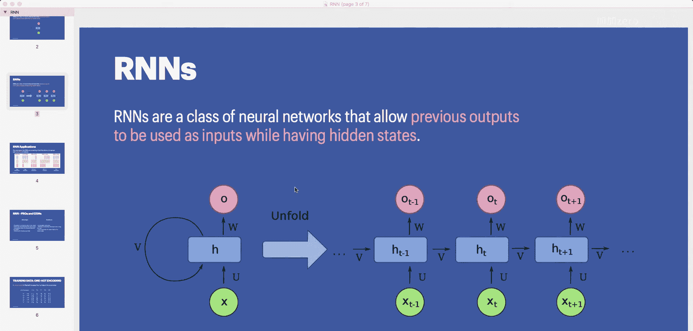

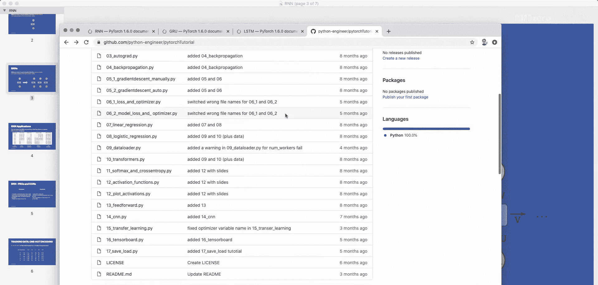

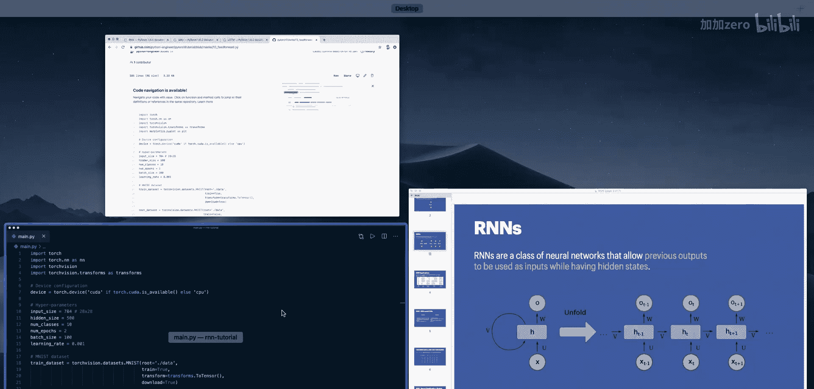

我们将基于本系列教程的第13讲（一个简单的神经网络）代码进行修改。该代码实现了对MNIST数据集的分类。虽然图像分类并非RNN的典型应用场景，但此示例能很好地演示如何将输入数据视为序列，并设置正确的张量形状，同时证明RNN在此任务上也能取得高准确率。

RNN的特殊之处在于它处理向量序列。在本例中，我们采用“多对一”架构：输入是一个序列（图像的行），输出是序列末尾的一个类别标签。

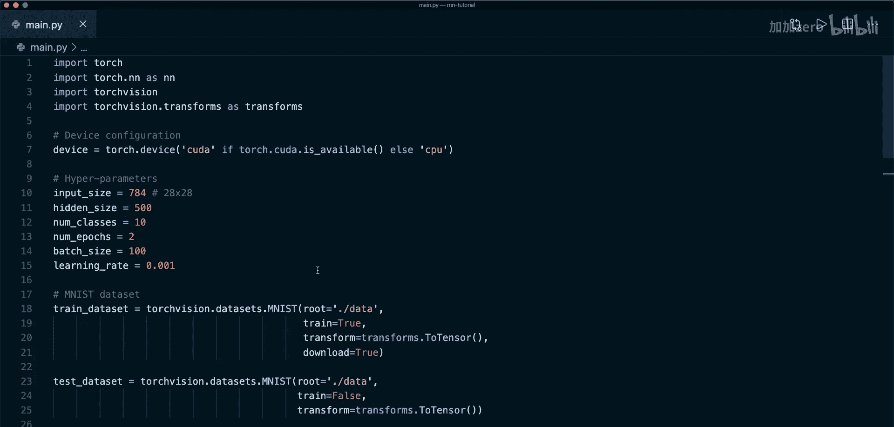

首先，我们需要调整超参数。MNIST图像尺寸为28x28像素。之前我们将图像展平为一维向量（784维）。现在，我们需要将图像视为序列：将一行（28个像素）视为一个时间步，该行的每个像素值视为该时间步的特征。

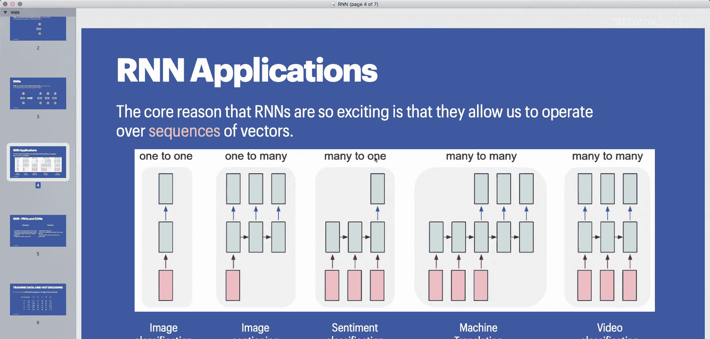

以下是需要定义的超参数：
*   **输入大小**：每个时间步的特征数量，即图像宽度 `input_size = 28`
*   **序列长度**：时间步的数量，即图像高度 `sequence_length = 28`
*   **隐藏层大小**：RNN隐藏状态的特征数量 `hidden_size = 128`
*   **层数**：堆叠的RNN层数量 `num_layers = 2`
*   **类别数**：输出类别数量 `num_classes = 10`

## 构建RNN模型类

现在，我们开始构建RNN模型类。我们将类名改为`RNN`，并在初始化方法中接收上述超参数。

在`__init__`方法中，我们首先存储层数和隐藏层大小。然后，使用`nn.RNN`创建PyTorch内置的RNN层。关键参数包括`input_size`、`hidden_size`和`num_layers`。我们还需设置`batch_first=True`，这意味着输入张量的形状应为`(batch_size, sequence_length, input_size)`。

由于我们采用“多对一”架构进行最终分类，需要在RNN层后添加一个全连接层（线性层）。该层的输入维度是`hidden_size`，输出维度是`num_classes`。

```python
import torch
import torch.nn as nn

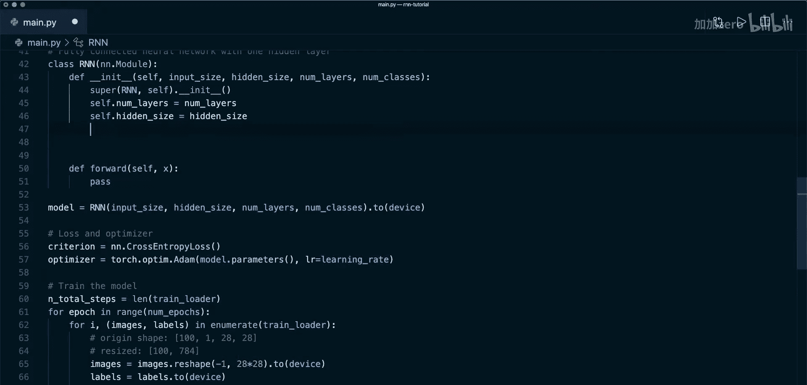

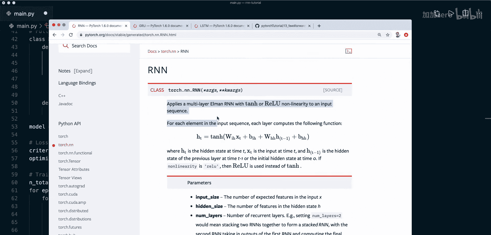

class RNN(nn.Module):
    def __init__(self, input_size, hidden_size, num_layers, num_classes):
        super(RNN, self).__init__()
        self.num_layers = num_layers
        self.hidden_size = hidden_size
        self.rnn = nn.RNN(input_size, hidden_size, num_layers, batch_first=True)
        self.fc = nn.Linear(hidden_size, num_classes)
```

## 实现前向传播

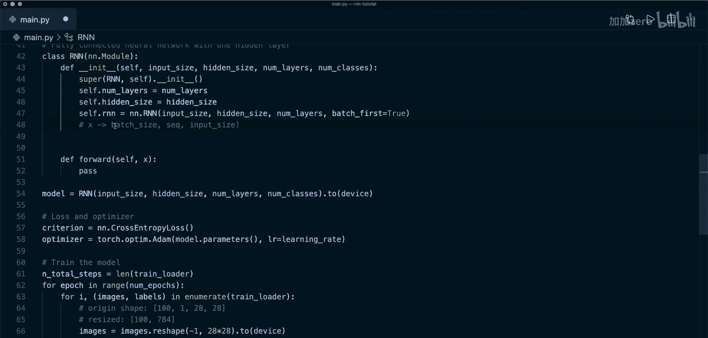

接下来，实现`forward`方法。PyTorch的`nn.RNN`模块需要两个输入：输入序列`x`和初始隐藏状态`h0`。

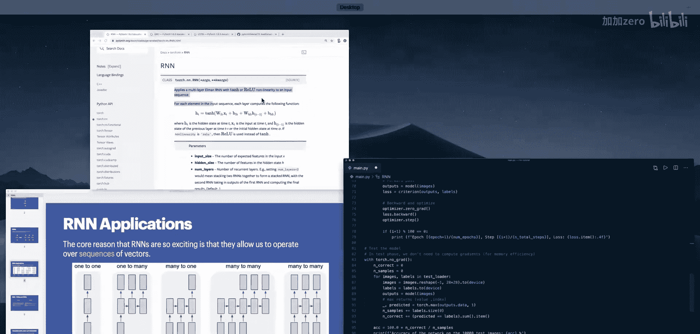

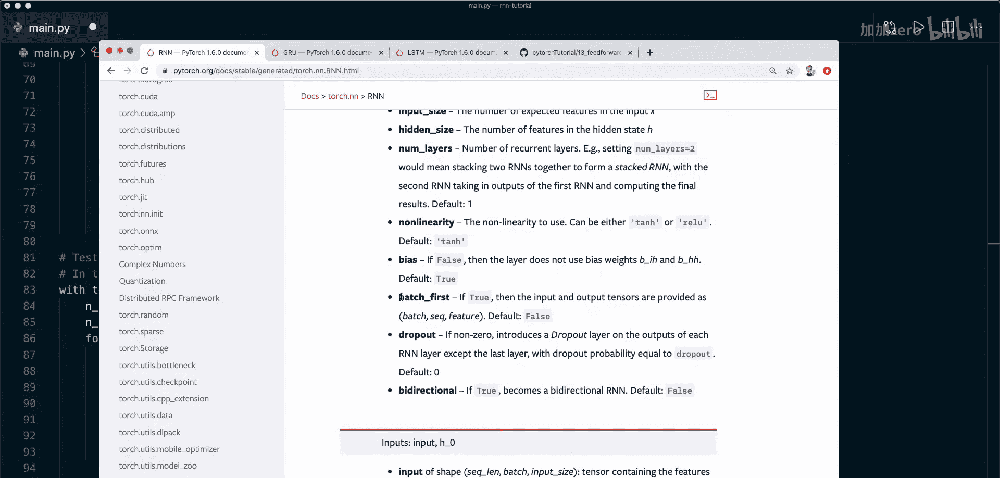

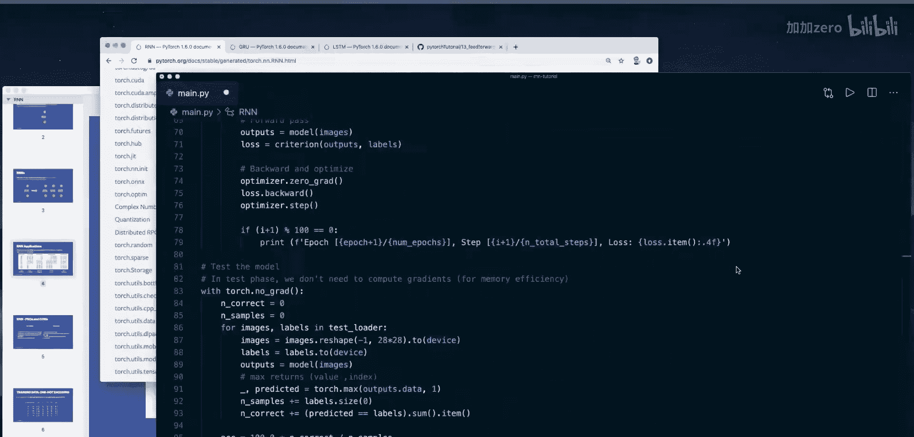

我们需要创建初始隐藏状态张量`h0`，其形状为`(num_layers, batch_size, hidden_size)`，并初始化为零。

调用`self.rnn(x, h0)`会返回两个输出：第一个是所有时间步的输出特征`out`，第二个是最终隐藏状态（本例中不需要）。输出`out`的形状为`(batch_size, sequence_length, hidden_size)`。

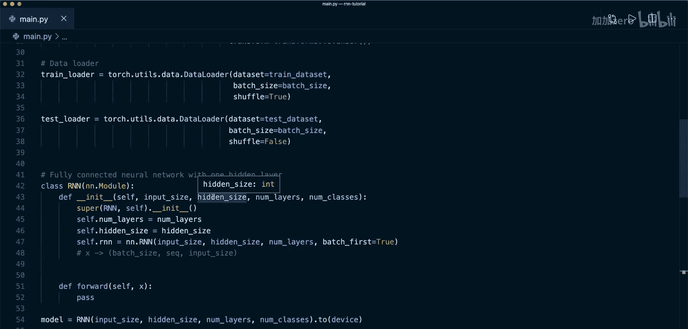

在“多对一”架构中，我们只关心最后一个时间步的输出。因此，我们通过切片操作`out[:, -1, :]`提取最后一个时间步的所有隐藏特征，得到形状为`(batch_size, hidden_size)`的张量。

最后，将这个张量传入全连接层`self.fc`，得到最终的分类得分。

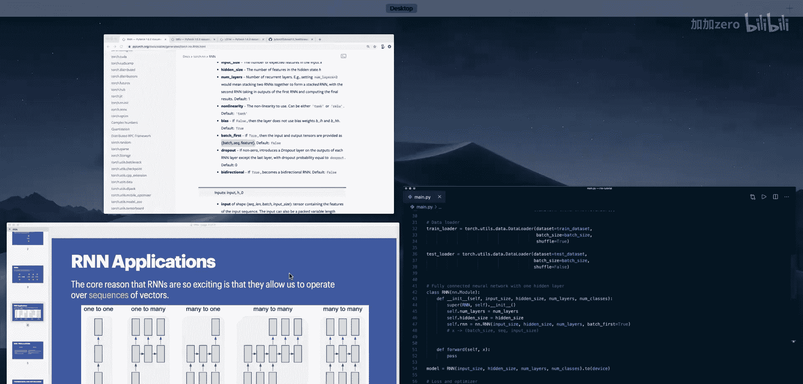

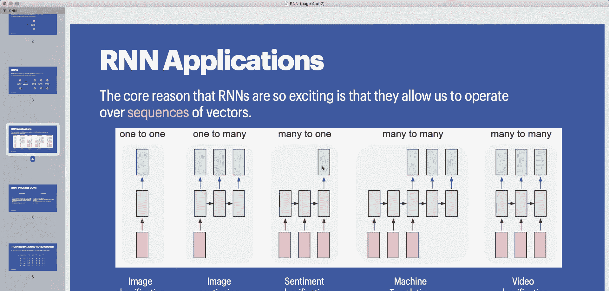

```python
    def forward(self, x):
        # 设置初始隐藏状态
        h0 = torch.zeros(self.num_layers, x.size(0), self.hidden_size).to(device)
        
        # 前向传播RNN
        out, _ = self.rnn(x, h0)
        
        # 解码最后一个时间步的隐藏状态
        out = out[:, -1, :]
        
        # 通过全连接层
        out = self.fc(out)
        return out
```

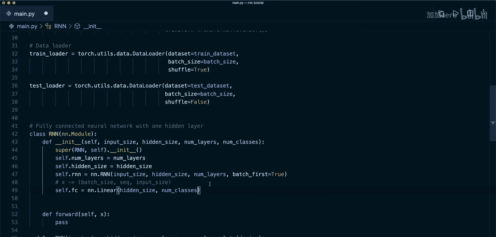


## 调整数据输入形状

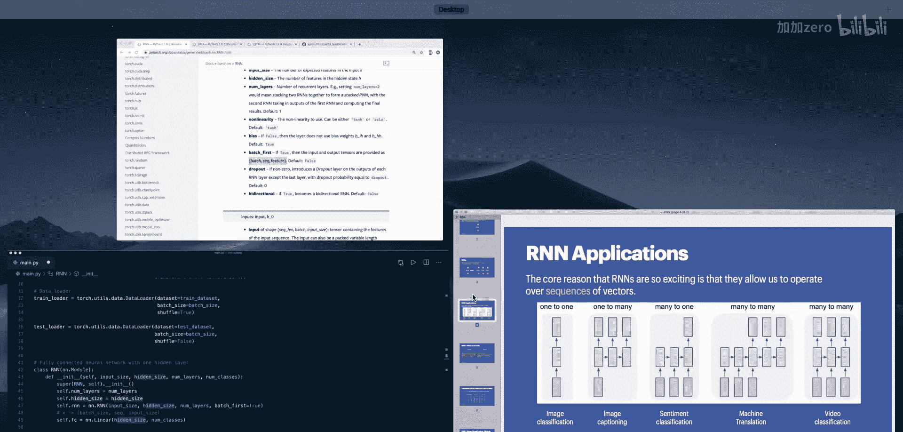

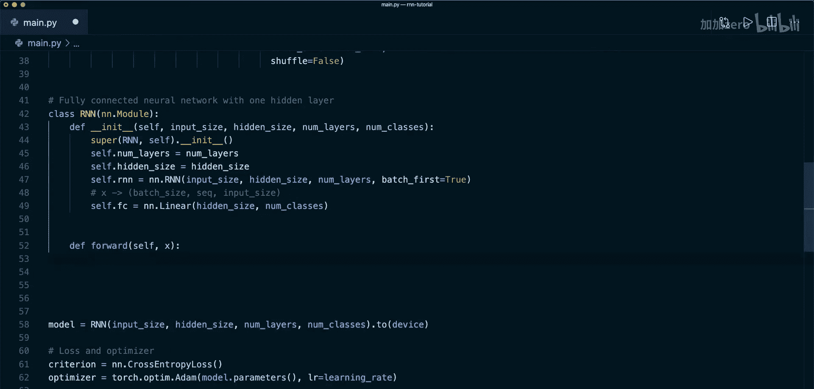

在训练和评估循环中，我们需要将输入图像重塑为RNN期望的形状。原始图像形状为`(batch_size, 1, 28, 28)`。我们需要将其重塑为`(batch_size, sequence_length, input_size)`，即`(batch_size, 28, 28)`。

```python
# 在训练循环中，对每个batch的images进行重塑
images = images.reshape(-1, sequence_length, input_size).to(device)
```

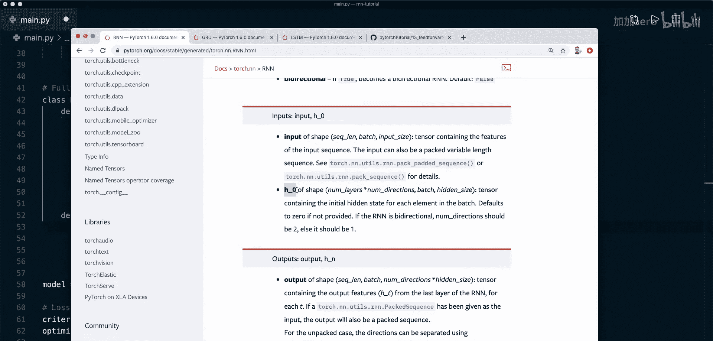

## 运行与测试模型

完成以上步骤后，即可运行训练脚本。使用内置`nn.RNN`模块，我们能够在MNIST分类任务上达到约93%的准确率，这证明了RNN在此类任务上的有效性。

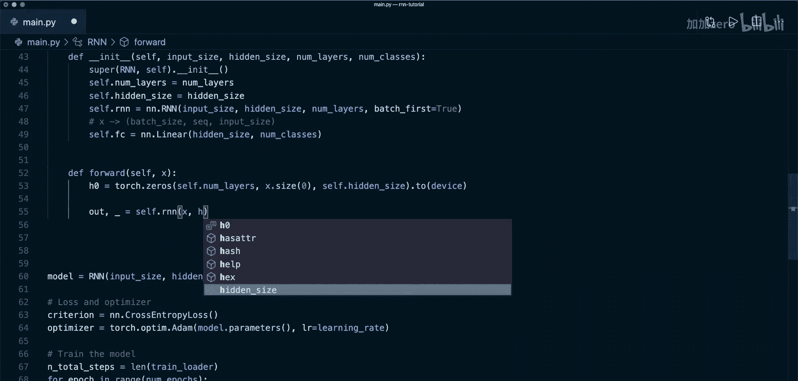

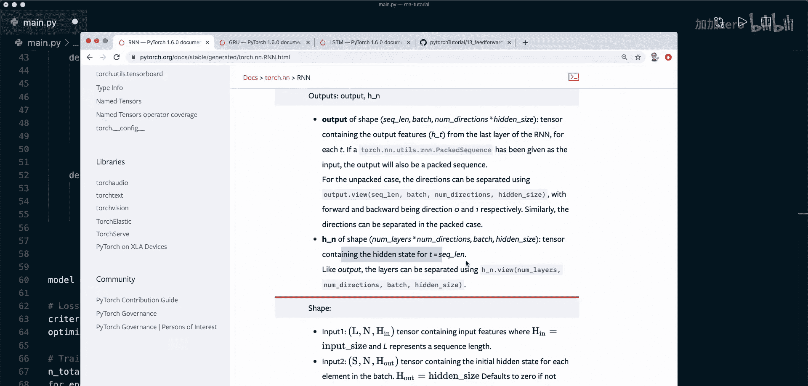

## 尝试GRU模块

门控循环单元是RNN的一种流行变体，旨在缓解梯度消失问题。在PyTorch中，我们可以非常方便地将`nn.RNN`替换为`nn.GRU`，因为它们的接口几乎完全相同。

只需将模型定义中的`nn.RNN`改为`nn.GRU`即可，无需修改其他代码。

```python
self.gru = nn.GRU(input_size, hidden_size, num_layers, batch_first=True)
# 在forward方法中相应地将 self.rnn 改为 self.gru
```

使用GRU通常能获得相似或更好的性能，在本例中准确率可能更高。

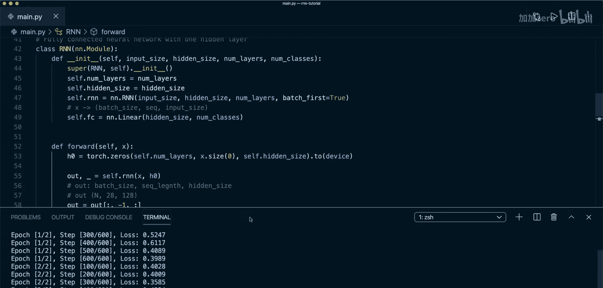

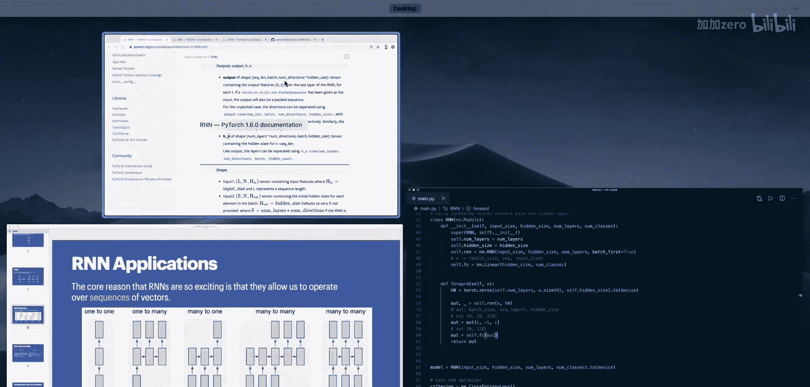

## 尝试LSTM模块

长短期记忆网络是另一种广泛使用的RNN变体，它引入了细胞状态和三个门控机制。LSTM的初始状态需要两个张量：隐藏状态`h0`和细胞状态`c0`。

在模型初始化时，创建LSTM层：
```python
self.lstm = nn.LSTM(input_size, hidden_size, num_layers, batch_first=True)
```

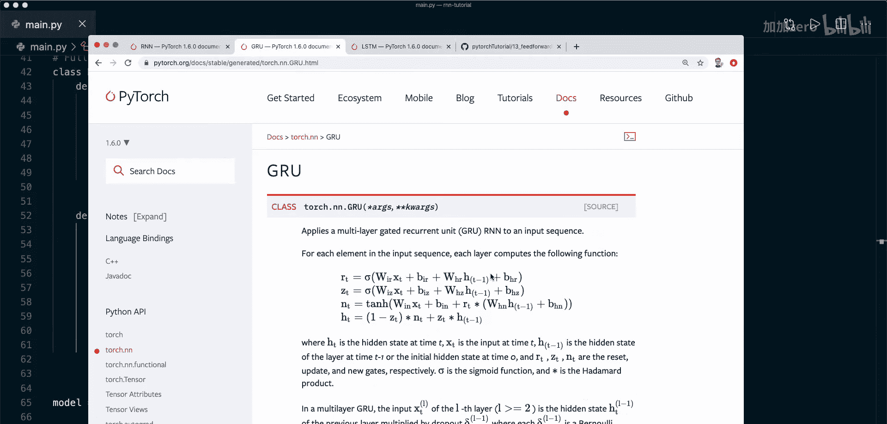

在前向传播中，需要创建初始细胞状态`c0`（形状与`h0`相同），并将`(h0, c0)`作为元组传递给LSTM：
```python
def forward(self, x):
    h0 = torch.zeros(self.num_layers, x.size(0), self.hidden_size).to(device)
    c0 = torch.zeros(self.num_layers, x.size(0), self.hidden_size).to(device)
    
    out, _ = self.lstm(x, (h0, c0)) # LSTM接收一个元组 (h0, c0)
    
    out = out[:, -1, :]
    out = self.fc(out)
    return out
```

运行LSTM模型，同样能取得很高的分类准确率（例如97%）。

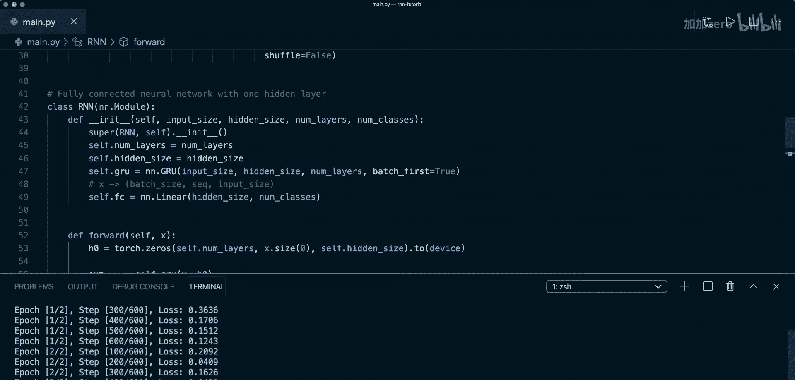

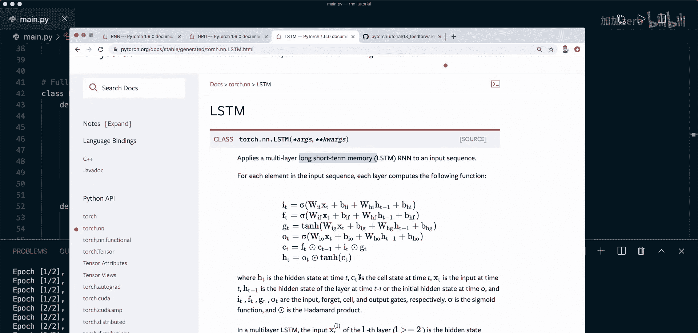

## 总结

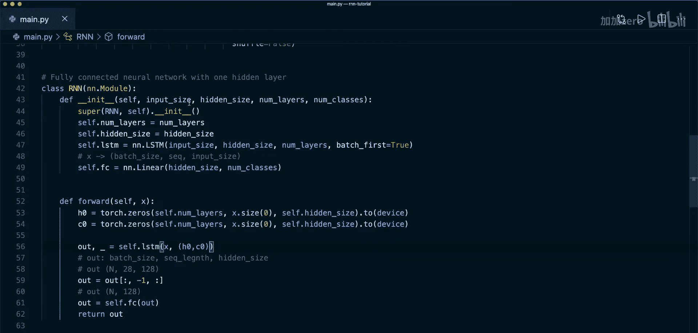

本节课中我们一起学习了如何使用PyTorch内置模块实现循环神经网络。我们首先回顾了RNN处理序列数据的核心思想，然后以MNIST分类为例，详细演示了如何设置超参数、构建`nn.RNN`模型、调整输入数据形状以及实现前向传播。我们还了解到，通过简单的模块替换，就能轻松使用更高级的RNN变体，如GRU和LSTM。这些内置模块极大地简化了RNN模型的实现过程，让我们能够更专注于模型架构和实验。