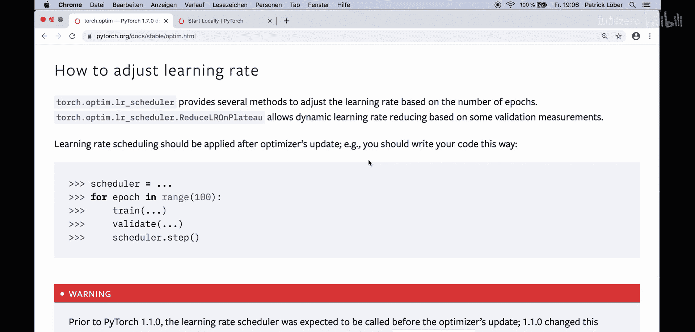
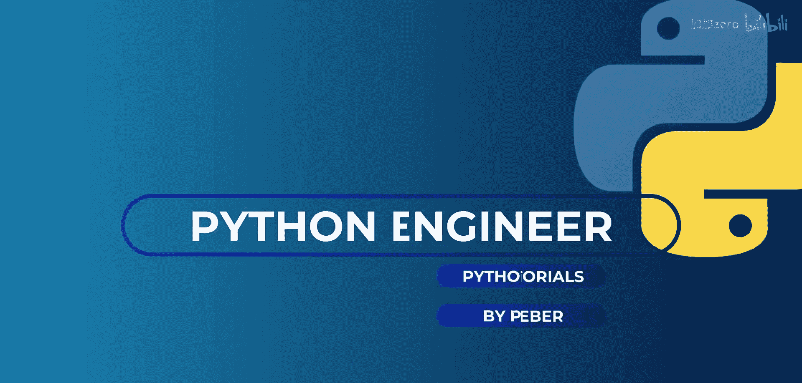
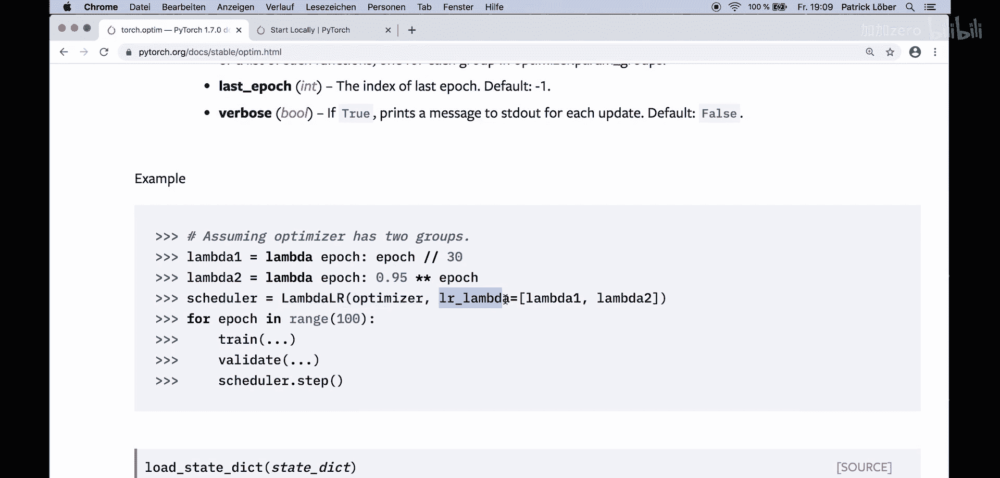
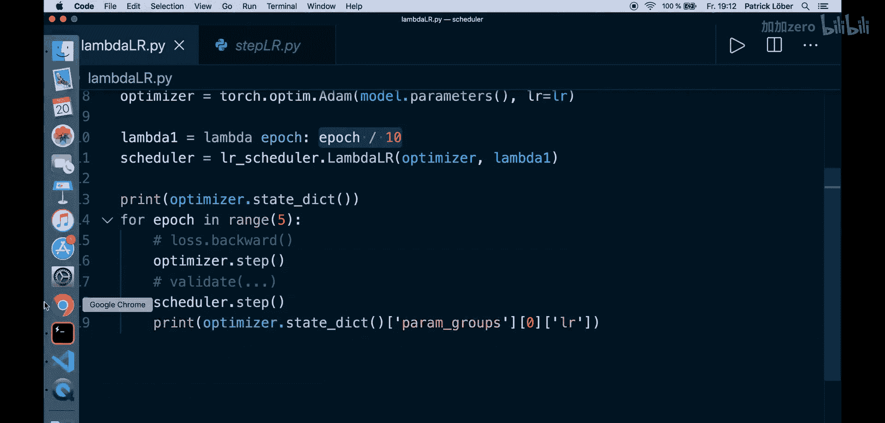
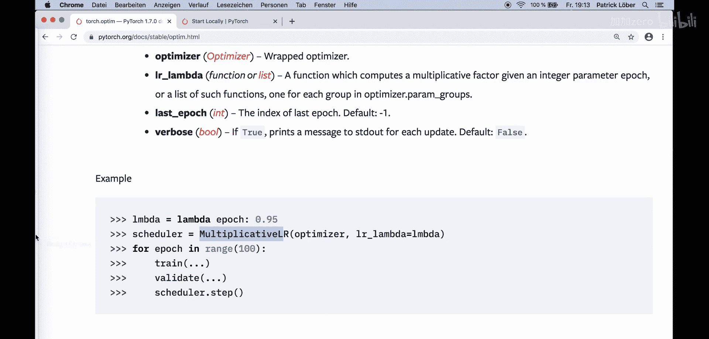
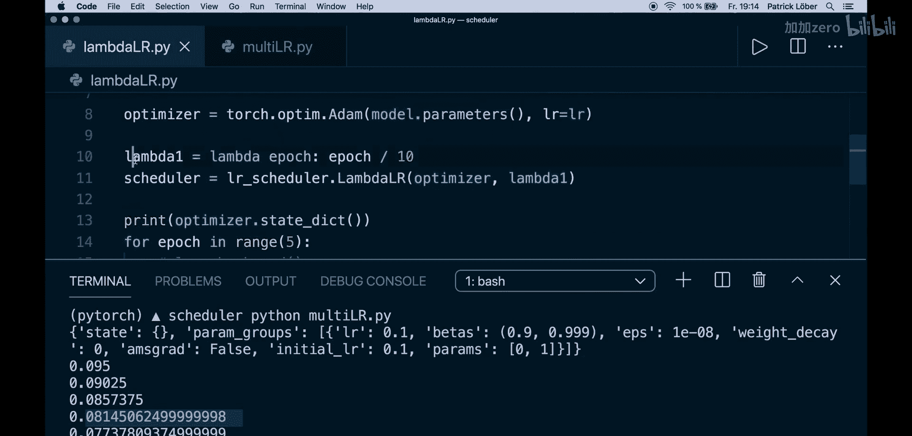
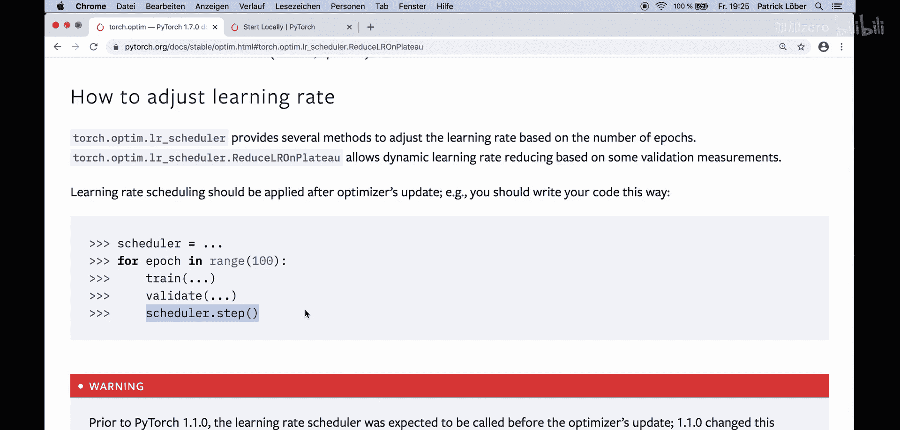

# 022：学习率调度器 - 调整学习率以获得更好结果 🎯

在本节课中，我们将学习一个简单但强大的PyTorch技术——学习率调度器。它可以在训练过程中动态调整学习率，从而帮助模型更好地优化，通常能带来更好的训练结果。





## 概述 📋

学习率是训练神经网络时需要调整的最重要的超参数之一。通常建议在训练过程中适当调整学习率。PyTorch在其`optim`模块中提供了多种方法来实现这一点，并且实现起来并不复杂。

上一节我们介绍了优化器的基本使用，本节中我们来看看如何通过调度器动态调整学习率。

## 学习率调度器的工作原理 ⚙️

PyTorch的`torch.optim.lr_scheduler`模块提供了多种基于训练轮数（epoch）或验证指标来调整学习率的方法。一个关键点是：**学习率调度应在优化器更新权重之后应用**。

典型的代码结构如下：
```python
# 创建调度器
scheduler = SomeScheduler(optimizer, ...)

for epoch in range(num_epochs):
    # 训练步骤
    loss.backward()
    optimizer.step()

    # 验证步骤（可选）
    # ...

    # 更新学习率
    scheduler.step()
```

接下来，我们将逐一介绍几种常用的调度器。

## 常用学习率调度器类型 📊

以下是PyTorch提供的几种主要学习率调度器。



### 1. LambdaLR

`LambdaLR`将每个参数组的学习率设置为初始学习率乘以一个给定的函数。这个函数可以依赖于当前epoch。

示例代码：
```python
import torch.optim.lr_scheduler as lr_scheduler

lr = 0.1
model = ... # 你的模型
optimizer = torch.optim.SGD(model.parameters(), lr=lr)

# 定义一个lambda函数，学习率随epoch线性增加（本例中）
lambda_func = lambda epoch: epoch / 10.0
scheduler = lr_scheduler.LambdaLR(optimizer, lambda_func)

for epoch in range(5):
    # 训练步骤...
    optimizer.step()
    scheduler.step()
    # 打印当前学习率
    current_lr = optimizer.param_groups[0]['lr']
    print(f"Epoch {epoch+1}, Learning Rate: {current_lr}")
```
在这个例子中，学习率从第1轮的`0.1 * (1/10) = 0.01`开始，逐渐增加。

### 2. MultiplicativeLR



`MultiplicativeLR`将每个参数组的学习率乘以指定函数返回的因子。与`LambdaLR`不同，这里是累积相乘。

示例代码：
```python
# 使用相同的优化器设置
lambda_func = lambda epoch: 0.95 # 每轮乘以0.95
scheduler = lr_scheduler.MultiplicativeLR(optimizer, lambda_func)

for epoch in range(5):
    # ...训练步骤
    scheduler.step()
    current_lr = optimizer.param_groups[0]['lr']
    print(f"Epoch {epoch+1}, Learning Rate: {current_lr}")
```
输出将显示学习率每轮乘以0.95：0.1 -> 0.095 -> 0.09025 -> ...



### 3. StepLR

`StepLR`是最容易理解的调度器之一。它每经过固定的`step_size`个epoch，就将学习率乘以一个因子`gamma`（通常小于1）。

示例代码：
```python
# 每30个epoch，学习率乘以0.1
scheduler = lr_scheduler.StepLR(optimizer, step_size=30, gamma=0.1)
```
这意味着前30个epoch使用初始学习率（如0.05），第31-60个epoch使用`0.05 * 0.1 = 0.005`，以此类推。这种方法简单且非常有效。



### 4. MultiStepLR

`MultiStepLR`与`StepLR`类似，但不是按固定间隔调整，而是在达到指定的“里程碑”（milestones）epoch时调整学习率。

示例代码：
```python
# 在第30和第80个epoch时降低学习率
scheduler = lr_scheduler.MultiStepLR(optimizer, milestones=[30, 80], gamma=0.1)
```
这提供了比固定步长更灵活的调整策略。

### 5. ExponentialLR

`ExponentialLR`在每个epoch后将学习率乘以`gamma`。

示例代码：
```python
# 每个epoch后，学习率乘以0.95
scheduler = lr_scheduler.ExponentialLR(optimizer, gamma=0.95)
```
这本质上等同于设置`step_size=1`的`StepLR`。

### 6. ReduceLROnPlateau

这是最常用的调度器之一，它**不依赖于epoch数量，而是依赖于某个监控指标（如验证损失）**。当该指标停止改善时，它才降低学习率。

以下是其关键参数：
*   **mode**：`‘min’`或`‘max’`。在`‘min’`模式下，当监控指标停止下降时降低学习率；在`‘max’`模式下，当指标停止上升时降低学习率（如准确率）。
*   **factor**：学习率降低的因子（例如0.1）。
*   **patience**：等待“无改善”的epoch数。例如，`patience=2`表示会忽略前2个没有改善的epoch，如果第3个epoch损失仍然没有改善，则降低学习率。

示例代码：
```python
scheduler = lr_scheduler.ReduceLROnPlateau(optimizer, mode='min', factor=0.1, patience=2)

for epoch in range(num_epochs):
    # 训练步骤...
    train_loss = ...
    # 验证步骤...
    val_loss = ...

    # 注意：这里传入要监控的指标（如验证损失）
    scheduler.step(val_loss)
```
这种方法能有效帮助模型在优化停滞时跳出局部最优，继续改进。

## 其他调度器 🔍

PyTorch还提供了其他高级调度器，例如：
*   **CosineAnnealingLR**：按照余弦函数周期性地调整学习率。
*   **CyclicLR** 和 **OneCycleLR**：实现周期性学习率策略，有时能带来更快的收敛。

你可以查阅官方文档来了解和使用它们。

## 总结 🎓

本节课中我们一起学习了PyTorch学习率调度器。我们了解到：
1.  动态调整学习率是优化训练过程的有效技巧。
2.  PyTorch在`torch.optim.lr_scheduler`模块中提供了丰富的调度器。
3.  基于epoch的调度器（如`StepLR`, `MultiStepLR`）简单易用。
4.  基于指标的调度器（如`ReduceLROnPlateau`）能更智能地响应模型的实际训练状态。
5.  实现只需在优化器更新后调用`scheduler.step()`（对于`ReduceLROnPlateau`需要传入监控指标）。




建议你在自己的项目中尝试不同的调度器，找到最适合你模型和任务的那一个。只需几行代码，就可能为你的训练效果带来显著提升。