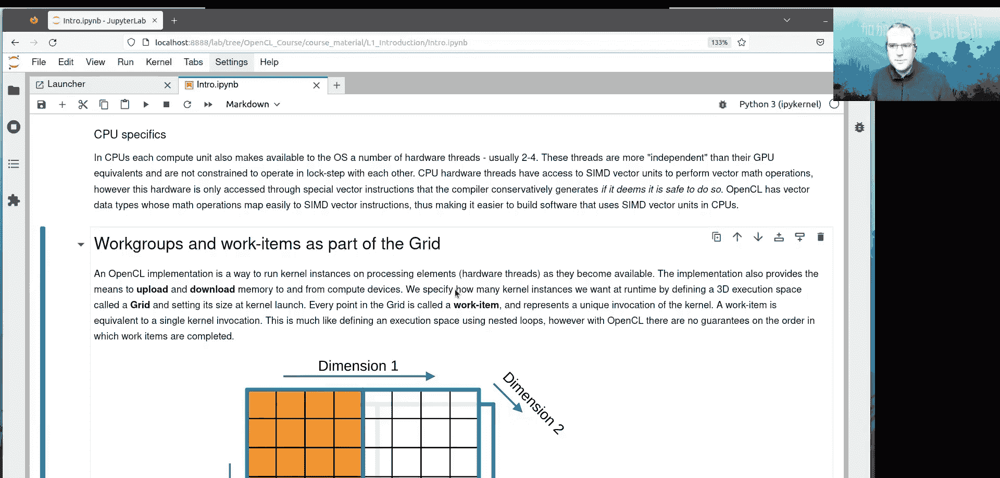

# 001：OpenCL简介


在本节课中，我们将要学习OpenCL的基础知识，包括其概念、架构以及如何开始使用。

## 概述

OpenCL是一个用于在异构计算架构（如CPU、GPU和FPGA）上运行计算工作负载的开放标准。本节课将介绍OpenCL的基本概念、其优势与挑战，并指导您设置学习环境。

## 课程材料与环境设置

在开始之前，您需要获取课程材料并设置好计算环境。

以下是获取和设置课程材料的步骤：

1.  **获取课程材料**：课程材料位于一个GitHub链接中。您可以点击该链接下载材料到本地计算机，解压后使用网页浏览器查看HTML页面。
2.  **登录超算系统**：使用SSH命令登录到超算系统。命令格式为：`ssh username@satanonics.hasy.org.au`。
3.  **申请交互式GPU节点**：登录后，使用特定的`SalLc`命令申请一个交互式作业，以获得GPU节点的访问权限。
4.  **加载OpenCL环境**：在节点中，运行以下命令来加载本课程所需的OpenCL环境模块：
    ```bash
    module use /path/to/modules
    module load programming_environment_opencl
    ```
5.  **下载材料到超算**：在超算系统的交互式作业中，进入您的临时目录，使用`wget`命令下载课程材料并解压。

完成上述步骤后，您就可以在本地和超算系统上访问课程材料，并开始进行练习。

## 什么是OpenCL？

上一节我们设置了学习环境，本节中我们来看看OpenCL究竟是什么。

OpenCL是“开放计算语言”的缩写。它是一个由Khronos Group开发和维护的开放标准，用于在多种计算设备上编写程序。其核心目标是提供一种统一的编程模型，让代码能够在不同厂商的CPU、GPU乃至FPGA上运行。

OpenCL本身是一个规范文档，定义了应用程序编程接口。具体的实现则由硬件厂商（如Intel、AMD、NVIDIA）负责，他们根据规范使其硬件支持OpenCL。

## GPU与科学计算

为了理解OpenCL的价值，我们需要了解GPU为何适用于科学计算。

图形处理器最初设计用于执行渲染3D场景所需的复杂计算。这个过程很容易并行化，可以为屏幕上显示的每个像素分配一个计算任务。后来，这些专用硬件变得可编程和通用化，使得GPU能够执行科学计算等任务。

商业上对更高帧率的追求，促使GPU设计具备了高带宽内存和大量并行计算核心。如今，GPU的浮点运算性能和内存带宽通常比CPU高出一个数量级。

在超算领域，硬件选择日益多样化。OpenCL使用户能够利用这种多样性，在不同平台间迁移代码时，无需承担高昂的移植成本。

## OpenCL的特点与适用性

了解了GPU的优势后，我们来看看OpenCL的具体特点以及它是否适合您的项目。

OpenCL是一个成熟的标准，由超过150家公司的联盟共同推动。这意味着它有完善的文档支持，并且数学运算在不同设备间具有高度一致性，因为它遵循IEEE 754算术标准。

以下是评估OpenCL是否适合您项目的一些考量点：

*   **优势**：
    *   **跨平台兼容性**：代码有潜力在不同厂商的设备上运行，减少平台锁定风险。
    *   **一致的数学结果**：遵循IEEE 754标准，确保计算结果的可靠性。
    *   **支持大型向量类型**：支持长达16个元素的向量类型，便于利用CPU的SIMD单元。
    *   **共享内存支持**：能很好地利用CPU与GPU共享内存的新型架构（如AMD MI300）。

*   **挑战**：
    *   **性能可能稍逊**：在某些设备上，其性能可能略低于厂商专属框架（如CUDA）。
    *   **样板代码较多**：需要编写较多设备发现、上下文管理、内核编译等样板代码。
    *   **调试工具支持有限**：厂商提供的调试和性能分析工具可能不如其专属框架丰富。
    *   **内核知识产权保护**：内核通常以源代码形式提供，保护知识产权更具挑战性。
    *   **库生态相对稀疏**：可用的高级函数库（如机器学习库）不如CUDA或HIP丰富。

因此，如果您的项目追求极致的性能且不担心厂商锁定，专属框架可能是更好选择。如果您看重开放标准、结果一致性、跨平台能力，并愿意接受一定的性能折衷和开发复杂性，那么OpenCL是一个坚实的选择。

## OpenCL核心概念：内核与硬件模型

在决定使用OpenCL后，我们需要理解其核心执行模型。

OpenCL实现的核心是运行被称为“内核”的轻量级代码段。内核是在计算设备上并行执行的函数。

以下是一个简单的OpenCL内核示例，它计算数组中每个元素的绝对值：
```opencl
__kernel void absolute_value(__global const float* source,
                             __global float* dest,
                             const int length) {
    int gid = get_global_id(0); // 获取当前工作项的全局ID
    if (gid < length) {
        dest[gid] = fabs(source[gid]);
    }
}
```
为了处理整个数组，这个内核会被实例化成许多个“工作项”，每个工作项处理数组中的一个元素。

这些工作项的执行依赖于底层硬件：
*   **软件线程**：执行一系列计算指令的独立序列。一个内核实例在一个软件线程中运行。
*   **硬件线程**：处理器上执行软件线程指令的物理流水线。在OpenCL术语中，也称为“处理元件”。
*   **计算单元**：管理内存和执行线程的核心。在CPU上，通常每个核心是一个计算单元；在GPU上，一个计算单元包含许多硬件线程。

## CPU与GPU执行模型的区别

理解了基本概念后，本节我们深入比较CPU和GPU执行模型的差异，这是优化OpenCL代码的关键。

CPU和GPU在设计哲学上不同：
*   **CPU**：采用多线程模型。每个硬件线程（通常每个核心有2-4个）相对独立，可以执行不同的指令流。CPU还拥有SIMD向量单元，可以单条指令操作多个数据，但这通常需要编译器自动向量化，且较为保守。
*   **GPU**：采用单指令多线程模型。一个计算单元（指挥者）同时管理一“组”硬件线程（例如64个），这组线程以锁步方式执行相同的指令，但操作不同的数据。这组线程在AMD GPU上称为“波前”，在NVIDIA GPU上称为“线程束”。GPU通过极大量的这类线程组来实现高并行度。

简单比喻：CPU像多个独立的乐手，各自看着乐谱演奏；GPU像一个指挥同时指挥一整组小提琴手，所有小提琴手同步演奏相同的音符，但各自负责不同的音部。

这种差异意味着，在GPU上编写内核时，需要考虑线程组的协同工作，并尽量避免分支 divergence（即组内线程执行不同路径），以保持高效。

## 硬件实例：AMD MI250X GPU

最后，我们以一个具体的硬件为例，将上述概念具象化。

以Pawsey超算系统使用的AMD MI250X GPU处理器为例：
*   每个物理处理器包含**两个GPU芯片**。
*   每个GPU芯片包含**8个着色引擎**，每个着色引擎有**14个计算单元**，总计**110个计算单元/芯片**。
*   每个计算单元管理一个**64线程的波前**。
*   因此，每个GPU芯片拥有约 $110 \times 64 = 7040$ 个并行硬件线程。
*   每个GPU芯片配备独立的**高带宽内存**，带宽可达1.6TB/s。
*   Pawsey的GPU节点装有4个这样的处理器，因此共有 **8个GPU** 可供使用。

理解您目标硬件的具体架构，对于后续进行性能调优至关重要。

## 总结

本节课中我们一起学习了OpenCL的入门知识。我们首先介绍了OpenCL作为跨平台异构计算框架的基本定位和优势。然后，我们完成了课程材料获取和超算环境的设置。接着，我们探讨了GPU适用于科学计算的原因，并分析了OpenCL的优缺点以帮助您评估其适用性。之后，我们深入讲解了OpenCL的核心概念，包括内核、工作项、硬件线程和计算单元。最后，我们比较了CPU与GPU不同的执行模型，并以AMD MI250X为例了解了实际GPU的硬件层次结构。这些基础概念是后续深入学习OpenCL编程的基石。



