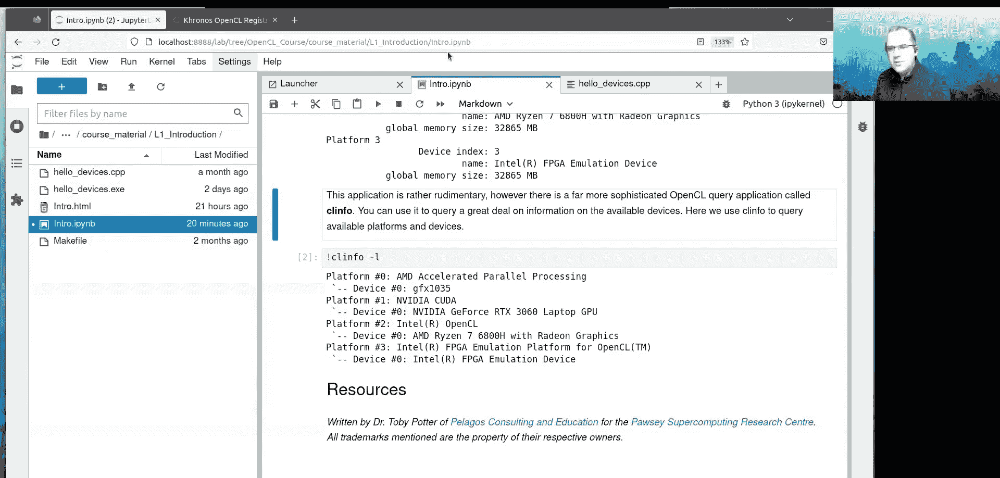

# 002：OpenCL - 第一天，第二部分 - OpenCL简介与练习


在本节课中，我们将要学习OpenCL的核心概念，包括其执行模型、组件架构以及如何编译和运行一个简单的OpenCL程序。我们将从工作项和工作组开始，逐步了解OpenCL应用程序的构成要素。

## 执行模型：工作项与工作组

上一节我们介绍了OpenCL的基本概念，本节中我们来看看OpenCL如何组织并行计算。OpenCL实现了一种在硬件线程或处理单元上运行内核实例的方法。

你的计算任务可能会映射到所有可用的硬件线程上。例如，映射到GPU的所有可用硬件线程。这些线程执行工作，完成后，OpenCL实现会向它们分发更多工作。

OpenCL实现提供了在处理单元上运行内核的方法。同时，它也提供了在计算设备上传和下载内存的方法。计算设备拥有高带宽内存，OpenCL实现提供了将内存从主机上传到此高带宽内存的途径。

你通过定义一个三维的执行空间（称为**网格**）来指定运行时所需的内核实例数量，并在内核启动时设置网格的大小。你可以将网格想象成一个迭代空间或执行空间。例如，如果你有一个二维或三维数组（或立方体），并希望在立方体的每个点上运行一个内核，这就是网格的作用。你可以在启动内核时指定该网格的大小。

实现会确保在网格的每个点上都运行一个内核。这与计算中的嵌套循环有相似之处。然而，嵌套循环保证一个维度会在另一个维度之前被访问，而OpenCL没有这种保证。在OpenCL中，你只需定义三维空间（网格），OpenCL会确保在网格的每个点启动内核，但你无法控制网格中哪个点先运行。

这是一个关键区别。网格有三个维度：维度0、维度1和维度2。

一个网格被划分为称为**工作组**的单元。一个**工作项**是网格中的一个独立点，它是一个内核的实例。当你启动内核时，它会确保在网格的每个点运行一个内核实例。

工作项被分组到工作组中。这提供了一种相当自然地映射到硬件线程组概念的方式。在AMD和NVIDIA GPU中，线程组的大小为32或64。一个工作组可以包含多个线程组。

工作组内的工作项可以通过**本地内存**共享资源。同时，工作组中的每个工作项也可以访问自己的内存。因此，工作组为团队中的工作项提供了相互共享资源的方式。

一个工作组中可以包含的实现所允许的任意数量的硬件线程组。例如，实现可能允许一个工作组中最多有1024个工作项。这些工作项随后会被分配到可用的线程组中。

在OpenCL中，维度0是硬件线程作为邻居的维度。一个线程组中的硬件线程首先在维度0上是邻居，然后是维度1，接着是维度2。这对于GPU实现很重要，对于CPU实现则不那么重要。

网格被划分为工作组。在这个例子中，工作组沿维度0有5个工作项，沿维度1有4个工作项，沿维度2看起来只有1个工作项。这实际上不是一个最优的网格，因为每个工作组只有20个工作项。理想情况下，你希望工作组中的工作项数量是硬件线程大小的倍数（例如32或64的倍数）。

在上面的例子中，网格的全局大小是 `10 x 8 x 2`。每个工作组的大小是 `5 x 4 x 1`。那么，每个维度上的工作组数量是：沿此维度有2个工作组，沿此维度有2个工作组，沿此维度有2个工作组。

每个工作项都可以访问它可以独占使用的设备内存，这称为**私有内存**。可以访问团队（即工作组内的工作项）可以使用的内存，这称为**本地内存**。还可以访问其他团队可以使用的内存，这称为**全局内存**或**常量内存**。

每个内核调用（即每个工作项）都可以查询其在网格中的位置，然后使用该位置作为偏移量来访问计算设备上分配的内存。

关于维度命名，为了避免混淆，我们更倾向于使用数学维度索引：维度0、维度1、维度2。这样你就不必担心哪个是宽度，哪个是高度。维度0是硬件线程作为邻居的维度，这一点非常重要（至少对于GPU而言）。

每个工作项可以访问它独占使用的内存（私有内存）、工作组内工作项可以使用的内存（本地内存）以及其他工作组可以使用的内存（全局或常量内存）。

图中的橙色方块表示已完成的工作项，白色方块表示未完成的工作项。这旨在说明，在某些OpenCL实现中（特别是CPU上），工作组内的工作项可能在其他工作项之前完成，工作组也可能在其他工作组之前完成。不能对工作组或工作项完成的顺序做出任何假设。

因此，设计内核时，最好采用输入和输出的模式：获取输入，对其进行处理，然后将结果发送到输出。这样你就不必担心某个工作项是否已完成对全局内存中特定元素的操作。不要假设一个特定的工作项会在另一个工作项之前完成。不要使用一个工作项的结果作为另一个工作项的输入。你需要有一个输入数组，进行处理，然后输出到另一个数组。在另一个内核调用中，你可以使用该输出的结果。这就是OpenCL的工作方式，我们不能对这些工作项完成的顺序做出任何假设。

每个工作项（或内核实例）都可以查询其在网格中的位置，然后使用该位置来访问计算设备缓冲区中的内存。例如，在MI250X上，分配的内存将位于高带宽内存区域。在Setonix上，每个GPU计算芯片有64GB的高带宽内存可用。

上述概念构成了OpenCL的核心思想。本课程后续的所有内容都只是关于如何准备计算设备、管理内存、调用内核以及如何最佳地结合使用这些概念以从计算设备获得最佳性能的支持信息。

## 加速应用程序的构成要素

在每一个加速应用程序中，都有一个**主机计算机**的概念，其上有一个或多个**计算设备**。主机通常拥有最大的可用内存空间（例如，GPU计算节点上的主机有230GB内存）。计算设备通常拥有最强的计算能力和内存带宽。这就是为什么我们说应用程序是由计算设备加速的。

在运行时，主机执行应用程序。在执行期间，OpenCL内核会为可用的计算设备进行编译。主机程序管理计算设备上的内存分配，指定应分配多少内存。然后，它在计算设备上执行（或启动）已编译的内核。

在计算设备是CPU的情况下，主机CPU和计算设备是同一个东西。

加速应用程序遵循相同的逻辑步骤序列：
1.  发现计算设备资源。
2.  为发现的计算设备编译内核。
3.  在计算设备上分配内存。
4.  将内存从主机复制到计算设备。
5.  运行内核。
6.  主机等待计算设备上的内核完成。
7.  将内存从计算设备复制回主机。
8.  根据需要重复步骤3到7。
9.  完成后，清理资源，释放计算设备，释放计算设备上分配的内存，然后退出。

接下来，我们将讨论使这些步骤成为可能的OpenCL组件。

## OpenCL应用程序的架构

以下是OpenCL应用程序的架构图。在主机上，有一个OpenCL实现。在软件层面，OpenCL实现以**平台**的形式存在。在一个平台内部，可以有该平台支持的任意数量的计算设备。

例如，一个Intel OpenCL实现可能支持CPU和GPU。因此，一个平台支持多个计算设备。

在平台之上，有一个**上下文**。上下文就像一个资源管理器，它管理在计算设备上运行的内核，也管理计算设备上的资源分配。

有称为**缓冲区**的东西。OpenCL缓冲区是一个有点模糊的概念，因为它可以存在于主机或计算设备上。实现可以自由指定缓冲区位于何处。唯一保证的是，当内核在计算设备上运行时，该缓冲区内存将在计算设备上可用。因此，实现可以自由地将该内存流入和流出计算设备。

我们有**内核**。在运行时引入一些源代码，然后将其编译成一个**程序**。接着，从构建的程序中编译出**内核**。为上下文内的每个计算设备构建一个内核。你可以为计算设备构建内核。一个程序中可以有任意数量的内核。

因此，你引入内核源代码，将其编译成程序，然后为该程序进一步为每个可用的（或你想要构建内核的）计算设备构建内核。

**命令队列**连接到上下文内的一个计算设备。命令队列是提交工作的目的地。你可以提交工作，例如使用命令队列将内存从主机复制到计算设备。命令队列是工作的目的地。当你启动一个内核时，你将其启动到一个命令队列。如果你有一个已为上下文内的计算设备编译好的内核，你可以将该内核启动到命令队列。

对于一个计算设备，你可以拥有的命令队列数量是有限的（由OpenCL实现定义，通常数量较低，大约10个左右）。因此，我会将命令队列的数量保持在较低水平。

你可以在上下文中为一个计算设备拥有多个命令队列。当你创建缓冲区时，你使用命令队列在计算设备上创建缓冲区。命令队列是提交工作的地方，有点像工作池或你交给计算设备的工作列表。你可以将工作添加到计算设备需要运行的工作列表底部，它会查看该命令队列然后运行其中的任务（无论是复制操作还是内核）。

命令队列有一个**事件**气泡，可以跟踪命令队列中工作的进度。你可以将事件附加到命令队列中的一项工作上，该事件将跟踪该工作在命令队列内的进度。

你可以将工作提交到命令队列，这是计算设备必须执行的工作列表。对于提交到命令队列中的工作顺序，有“顺序”或“乱序”的选项。这意味着计算设备可以自由选择先运行哪些工作块。因此，你在这方面有一些自由。如果你不关心工作运行的顺序，那么你可以使用乱序命令队列。

事件附加在你提交到命令队列的工作块上。然后，主机可以同步这些事件。主机可以等待一个事件或一项工作完成，然后再做其他事情。

这就是OpenCL应用程序的架构：你有一个主机，主机内有计算设备，有一个平台。一个平台可以支持任意数量的计算设备。上下文是计算设备的资源管理器。在上下文内，你编译一个程序，然后为该程序针对特定的计算设备构建内核，之后该内核就可用。然后，你可以通过将内核提交到命令队列来启动它。你可以使用命令队列构建缓冲区，并使用命令队列在主机和缓冲区之间复制内存。缓冲区可以存在于主机或计算设备上，这取决于OpenCL实现。有时你可以指定缓冲区的位置。OpenCL实现需要做的就是，当你启动内核时，它必须确保该缓冲区在计算设备上。

以下是每个术语含义的总结：
*   **平台**：提供对计算设备的访问。
*   **设备**：表示访问计算设备并查询其能力的方式。
*   **上下文**：提供创建缓冲区并跟踪计算设备上发生情况的方式。
*   **缓冲区**：提供在设备上分配内存的方式。
*   **程序**：提供聚合内核然后为上下文中的每个计算设备构建这些内核的方式。
*   **命令队列**：提供发送工作（如内存复制命令和内核启动）的地方。
*   **内核**：提供在计算设备上执行工作的方式。
*   **事件**：提供跟踪提交到命令队列的工作的方式。

这些概念目前可能有些抽象，但当我们逐行讲解示例时，它们将变得非常具体。接下来我们将进行矩阵乘法示例，并逐行介绍所有这些内容。

## OpenCL规范发展路线图

OpenCL规范于2008年批准。因此，该标准的第一个公开版本是在2008年12月。OpenCL最初由Apple开发，他们拥有OpenCL徽标和名称的商标。但Apple在很大程度上已经放弃了OpenCL，OpenCL在Apple上已被弃用。在未来的操作系统中，他们将完全移除对OpenCL的支持。因此，Apple现在偏爱其Metal实现来在其处理器上运行工作负载。所以，Apple如今不太关心OpenCL，它只是一个为了支持某些使用OpenCL的软件而存在的弃用软件库。

幸运的是，还有其他实现在Apple设备上工作，例如Portable OpenCL。

以下是各版本引入的主要特性：
*   **版本1.0**：2008年发布。
*   **版本1.1**：引入了线程安全性，使得从不同线程调用大多数OpenCL函数不会引入竞态条件。OpenCL API调用在很大程度上是线程安全的，但为内核设置参数可能是个例外。如果缓冲区中的内存分配用于表示2D和3D数组，则版本1.1引入了复制这些缓冲区的矩形区域的例程。
*   **版本1.2**：可能是OpenCL最重要的版本，在过去至少10年里一直是事实上的OpenCL标准。它带来了诸如将计算设备的处理元素划分为共享公共L3缓存的子设备等能力，并引入了内核的离线编译等功能。版本1.2引入了符合IEEE 754标准的数学运算，这意味着在不同计算架构上可以获得一致的结果。
*   **版本2.x**：版本2开始变得越来越难以实现。版本2引入了对共享虚拟内存的支持，这意味着不再需要限定内存分配属于哪个空间，内存可以在主机和设备之间透明地传输。这对一些供应商来说难以实现，一些供应商的实现多年停留在版本1.2。Kronos集团在OpenCL版本2.1和2.2中开始变得雄心勃勃。它们引入了SPIR-V（标准可移植中间表示语言）。在编译期间，编译器可以获取C或C++内核代码并将其生成为SPIR-V。然后在运行时，应用程序加载此程序，并将其传递给供应商的驱动程序，以便进一步编译为其特定的二进制代码或在计算设备上运行的机器代码。这是一个重大的进步，但并非所有供应商都支持。SPIR-V本应是一个完美的粘合层，从开源编译器到SPIR-V，然后硬件供应商实现将SPIR-V编译为机器代码的编译器。并非所有供应商都支持这一点，例如Nvidia没有实现版本2.1。版本2.2引入了更多功能，允许使用C++子集生成内核，并更新了SPIR-V。共享虚拟内存、C++内核和SPIR-V支持的结合意味着很少有供应商成功生产出可行的OpenCL 2.2实现。因此，OpenCL停滞了大约五年。
*   **版本3.0**：为了解决停滞问题，版本3将版本1.2定为规范核心，而版本2.x的所有其他改进都变为可选。这给了供应商实现其客户想要的任何功能的自由，并给了标准喘息的空间。版本3还引入了用于内核的新C++语言，该语言使用了C++17标准的子集。SPIR-V仍然存在，但它是可选的。

因此，OpenCL 3.0是最新标准，它拥有1.2的所有特性，其他一切取决于实现是否想要实现。

以下是各供应商的支持情况：
*   **AMD**：正在开发3.0支持，最远支持到2.1，但仅支持2.2的部分功能。
*   **Apple**：仅支持到1.2。如果你要在Apple硬件上使用OpenCL，除非使用Portable OpenCL之类的工具，否则你只能使用1.2。
*   **Arm**：支持OpenCL 3.0，也没有达到2.2。
*   **Intel**：非常支持OpenCL，其oneAPI实现运行在OpenCL之上。
*   **Nvidia**：实现了2.0的部分功能，但现在也支持OpenCL 3.0，并且是最早实现OpenCL 3.0支持的厂商之一。
*   **Portable OpenCL**：一个社区项目，提供CPU实现，也可以连接到一些专有供应商（如CUDA），并提供另一种进行OpenCL的方式。他们也支持OpenCL 3.0。

符合规范的OpenCL实现是通过了Kronos测试套件的实现。你可以点击链接查看最新的符合规范的实现列表。

## 文档与编译

OpenCL的最佳帮助来源是Kronos OpenCL注册表。其中包含标准的文档，即OpenCL API规范（PDF），其中包含本课程将使用的所有OpenCL API调用的文档。

在开始使用OpenCL之前，最好准备好该文档。

OpenCL应用程序中有两个编译步骤：
1.  在执行前编译应用程序本身。
2.  在执行期间从应用程序内部编译内核。

在程序执行期间，内核被编译成程序，然后这些程序使用供应商的内核编译器为每个计算设备进行编译。

幸运的是，在进行步骤1时，我们不需要链接到每个可用的实现。你只需要链接到一个名为ICD加载器的库文件。ICD加载器可以由任何供应商提供。ICD加载器在Windows上名为`OpenCL.dll`，在Linux上名为`libOpenCL.so`。

伴随ICD加载器的还有头文件：C语言是`CL/opencl.h`，C++是`CL/opencl.hpp`。这些头文件位于名为`CL`的目录中。该目录必须在编译时位于应用程序的包含路径中。

最佳实践是直接从Kronos GitHub站点使用ICD加载器和OpenCL头文件，因为你总是拥有最新的OpenCL API。或者，你也可以使用供应商提供的ICD加载器，但它可能不是最新的OpenCL版本。

你需要链接到`libOpenCL.so`这个文件，并在你的C++或C应用程序头中包含`CL/opencl.h`。ICD加载器（可安装客户端驱动程序加载器）的作用是拦截OpenCL API调用，然后将它们路由到该特定计算设备的供应商调用。因此，你只需要链接到ICD加载器即可获得OpenCL应用程序的支持。

在Setonix上，你可以在`/opt/rocm/opencl/lib`目录中找到AMD实现附带的ICD加载器。或者，通过加载我们提供的OpenCL模块，你可以使用来自Kronos的最新ICD加载器。

编译OpenCL应用程序通常采用以下形式：
```bash
g++ -g -O2 -I/path/to/CL/ hellodevices.cpp -o hellodevices.exe -lOpenCL
```
你需要将`CL`目录的路径包含在`-I`标志中，将ICD加载器的路径包含在库标志中。如果你的库路径已经包含ICD加载器的位置，则无需指定`-L`标志。如果你将`CL`目录设置在环境变量`CPATH`中，那么编译时会自动获取OpenCL头文件。

## 第一个OpenCL程序：`hellodevices`

现在，让我们使用这些信息来编译我们的第一个OpenCL应用程序。文件`hellodevices.cpp`是一个完整的OpenCL应用程序，用于获取设备内存的大小以及该内存中可能的最大缓冲区大小。

我们将按照欢迎信中的说明，在计算设备上获取一个交互式节点并编译运行此程序。

以下是编译和运行步骤的简要说明：
1.  获取交互式计算节点。
2.  加载OpenCL模块。
3.  切换到课程材料目录。
4.  使用`g++`或`cc`编译器编译程序。
5.  运行生成的可执行文件。

该应用程序会获取交互式分配中所有可用的计算设备，并显示它们的信息。例如，它可能显示两个平台：设备0是CPU（有多个核心和大量全局内存），设备1是AMD GPU（有64GB内存）。

课程材料中通常包含一个`Makefile`，你可以使用`make clean`和`make`命令来编译该目录中的所有软件。

还有一个名为`clinfo`的应用程序，它可以提取OpenCL实现所有可用计算设备的信息。使用`clinfo -l`列出平台和设备，使用`clinfo`（无选项）获取详细信息，如本地内存限制、工作组最大大小等。

`hellodevices.cpp`应用程序的代码结构如下：
*   包含必要的头文件。
*   定义错误检查代码（检查每个OpenCL调用的返回值是良好实践）。
*   获取系统上可用的平台数量。
*   获取每个平台中的设备数量。
*   查询每个设备的信息（如设备类型、全局内存大小等）。
*   释放发现的设备和平台。

这是一个简单的“Hello World”风格的OpenCL代码，其中包含大量用于提取计算设备信息的样板代码。

## 总结

本节课中我们一起学习了OpenCL的核心执行模型，包括工作项、工作组和网格的概念。我们探讨了OpenCL应用程序的架构，涵盖了平台、设备、上下文、缓冲区、程序、命令队列、内核和事件等关键组件。我们还回顾了OpenCL规范的发展历程以及各主要供应商的支持情况。最后，我们了解了如何设置编译环境，并实际编译和运行了第一个OpenCL程序`hellodevices`，它能够查询并显示系统中可用的OpenCL计算设备信息。这些基础知识为我们后续深入学习OpenCL编程，特别是进行矩阵乘法等实际案例的剖析打下了坚实的基础。



