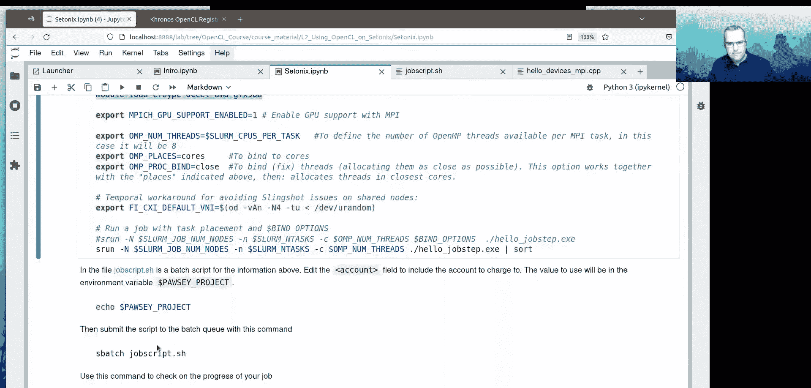

# 003：在Setonix超算上使用OpenCL


在本节课中，我们将学习如何在Pawsey超算中心的Setonix系统上使用OpenCL进行GPU编程。我们将介绍Setonix的硬件架构、可用的软件环境、如何编译和运行OpenCL程序，以及如何通过作业调度系统高效地使用GPU节点。

## 概述

Setonix是一台世界级的超级计算机，使用AMD EPYC CPU和AMD Instinct MI250X GPU，提供超过27 PetaFLOPS的浮点计算性能。截至2022年11月，它在全球最强大的研究型超级计算机TOP500榜单中排名第15位，在Green500榜单中排名第4位，能效达到57 GigaFLOPS/瓦特。

Pawsey文档门户是查找如何在Setonix上使用GPU的首要信息来源。如果官方文档与本材料有任何差异，应以官方文档为准。

## Setonix硬件环境

Setonix主要有两种计算节点：CPU节点和GPU节点。

### CPU节点

CPU节点基于AMD EPYC 7763处理器，采用双插槽配置。每个插槽包含8个核心复合体（CCD），每个CCD有8个核心，每个核心支持2个硬件线程。因此，每个CPU节点总共有128个核心和256个线程。

*   **缓存**：每个核心有32 KB L1缓存和512 KB L2缓存。每个CCD共享32 MB L3缓存。
*   **性能**：峰值浮点处理性能为1.79 TeraFLOPS。

### GPU节点

GPU节点配备一个AMD 7A53 “Trento” CPU处理器（EPYC的优化版本）和四个MI250X GPU插槽。

*   **CPU**：1个插槽，64个核心，128个线程。
*   **GPU**：每个MI250X GPU插槽包含2个计算芯片（GPU Die），因此每个节点总共对OpenCL可见8个GPU设备。每个GPU Die拥有110个计算单元，总计7040个“流处理器”（类比为小提琴手），可提供近15 TeraFLOPS的峰值性能。
*   **内存**：每个GPU Die可访问64 GB的全局内存。主机内存为256 GB。

## 队列与资源分配

在Setonix上，有以下主要队列可供使用：

*   `work`：使用CPU节点，最大运行时间24小时，最多256个处理单元（线程）。
*   `gpu`：使用GPU节点的生产队列。每个作业可访问一个GPU节点上的所有8个GPU，但CPU资源限制为128个处理单元（即64个核心）。
*   `gpu-dev`：用于GPU代码调试和测试的队列。
*   `long`, `debug`, `highmem`：分别提供更长运行时间、更好调试访问或更大内存的队列。

**重要提示**：使用GPU队列时，需要在项目ID后附加`-gpu`（例如 `course001-gpu`），因为GPU节点有独立的资源分配。

### 交互式作业

要获取一个交互式GPU作业，可以使用以下`sbatch`命令：

```bash
salloc --account=course001-gpu --partition=gpu --nodes=1 --ntasks=1 --cpus-per-task=8 --gres=gpu:1 --time=01:00:00
```

其中，`--gres=gpu:1` 表示每个MPI任务请求1个GPU。

## 软件环境与编译

OpenCL与CUDA和HIP不同，其内核编译是在OpenCL实现库内部完成的，因此我们可以自由选择编译器，只需链接到OpenCL ICD加载器即可。

Setonix上主要有三个编程环境，都提供C、C++和Fortran编译器，并集成了MPI库：

1.  **GNU环境**：使用GCC编译器，开源软件兼容性最好，是登录后的默认环境。
2.  **AOCC环境**：使用AMD编译器，旨在为AMD CPU提供最佳性能。
3.  **Cray环境**：使用基于LLVM的Cray编译器。

加载编程环境后，可以使用 `cc` (C), `CC` (C++), `ftn` (Fortran) 等编译器包装器。

### 启用GPU感知的MPI

要使用Cray提供的GPU感知MPI库，需要加载特定模块并设置环境变量：

```bash
module load craype-accel-amd-gfx90a
export MPICH_GPU_SUPPORT_ENABLED=1
```

### OpenCL实现

Setonix上，AMD的ROCm库提供了OpenCL实现以及调试器和性能分析器等工具。可以通过以下命令加载：

```bash
module load rocm/5.0.1
```

然而，ROCm自带的OpenCL头文件和ICD加载器版本较旧（仅支持OpenCL 2.0）。为了使用OpenCL 3的特性，建议从Khronos GitHub仓库获取最新的头文件和ICD加载器。本课程提供了一个自定义的OpenCL环境，它使用了便携式OpenCL库（pocl），可以在CPU节点上运行OpenCL程序，便于开发和测试。

加载课程自定义环境：

```bash
module use /software/projects/opencl/modulefiles
module load opencl
```

### 编译OpenCL程序

使用编译器包装器编译支持OpenCL和MPI的程序。以下是推荐的编译标志：

```bash
CC -g -O2 hello_devices_mpi.cpp -o hello_devices_mpi -lOpenCL
```

*   `-g`：包含调试符号。
*   `-O2` 或 `-O3`：用于生产代码的优化级别。
*   `-lOpenCL`：链接OpenCL库。

## 代码示例解析：`hello_devices_mpi`

上一节我们介绍了Setonix的软硬件环境，本节中我们通过一个具体的MPI+OpenCL程序来了解其工作流程。以下是对 `hello_devices_mpi.cpp` 关键部分的解析：

1.  **初始化与设备选择**：程序首先初始化MPI，获取任务数和当前排名。然后，它根据设定的设备类型（如 `CL_DEVICE_TYPE_GPU`）查询并创建OpenCL上下文和命令队列。设备选择基于MPI排名进行简单分配。
2.  **创建缓冲区**：使用 `clCreateBuffer` 在OpenCL上下文中创建设备端缓冲区。上下文负责管理其下的所有资源（如缓冲区）。
3.  **构建内核与设置参数**：内核源代码以内嵌字符串形式提供。使用 `clBuildProgram` 为设备构建程序，然后使用 `clCreateKernel` 创建指定名称的内核对象。通过 `clSetKernelArg` 设置内核参数（如指向设备缓冲区的指针）。
4.  **执行内核**：定义内核执行的范围（网格和工作组大小）。使用 `clEnqueueNDRangeKernel` 将内核提交到命令队列执行。全局大小是网格中的工作项总数，本地大小是每个工作组中的工作项数。
5.  **数据回传与清理**：内核执行后，使用 `clEnqueueReadBuffer`（阻塞方式）将设备缓冲区数据复制回主机内存。此操作会等待队列中所有前置任务（包括内核）完成。最后，释放OpenCL对象（缓冲区、队列、上下文等）和主机内存。

这个程序每个MPI进程都会独立运行，访问其分配到的GPU，完成填充向量、验证结果的过程。

## 在Setonix上运行程序

我们可以在编译时选择链接到ROCm的OpenCL实现或课程环境中的Khronos ICD加载器。

使用ROCm OpenCL编译和运行：
```bash
CC -I/opt/rocm-5.0.1/opencl/include -L/opt/rocm-5.0.1/opencl/lib -lOpenCL hello_devices_mpi.cpp -o hello_devices_mpi_rocm
srun ./hello_devices_mpi_rocm
```

使用课程OpenCL环境编译和运行：
```bash
module load opencl
CC hello_devices_mpi.cpp -o hello_devices_mpi_khronos -lOpenCL
srun ./hello_devices_mpi_khronos
```

通过修改代码中的 `targetDevice` 变量（`CL_DEVICE_TYPE_GPU`, `CL_DEVICE_TYPE_CPU`, `CL_DEVICE_TYPE_ALL`），可以控制程序搜索的设备类型。

### 请求多个GPU和任务

在申请交互式作业时，可以请求多个GPU和MPI任务来测试多设备并行：

```bash
# 请求1个节点，2个任务，每个任务1个GPU
salloc --account=course001-gpu --partition=gpu --nodes=1 --ntasks=2 --cpus-per-task=8 --gres=gpu:2 --time=01:00:00
```

在交互式分配中运行多任务程序需要使用 `srun`：
```bash
srun -n 2 ./hello_devices_mpi_khronos
```

## GPU节点优化使用策略

为了在GPU节点上获得最佳性能，需要理解CPU核心复合体与GPU设备之间的亲和性关系。每个CCD在延迟上优化连接到8个可用计算设备中的一个。

以下是优化资源绑定的建议策略：

*   **每节点8个MPI任务**：实现一个MPI任务对应一个CCD/GPU对。
*   **每任务1个GPU**：`--gres=gpu:1`
*   **每任务8个CPU核心**：`--cpus-per-task=8`，并将 `--threads-per-core` 设为1，将一个CCD的所有硬件线程分配给单个MPI进程。
*   **绑定GPU到最近的任务**：使用 `--gpu-bind=closest`
*   **独占节点**：使用 `--exclusive` 选项独占节点所有资源（慎用，可能导致排队时间长且消耗大量资源配额）。

一个示例的作业脚本（`job_script.sh`）可能如下所示，它旨在为节点上的每个计算设备分配一个MPI任务，并为每个MPI任务分配8个OpenMP线程，同时进行核心绑定：

```bash
#!/bin/bash
#SBATCH --account=course001-gpu
#SBATCH --partition=gpu
#SBATCH --nodes=1
#SBATCH --ntasks=8
#SBATCH --cpus-per-task=8
#SBATCH --threads-per-core=1
#SBATCH --gpus-per-task=1
#SBATCH --gpu-bind=closest
#SBATCH --time=00:10:00

module load craype-accel-amd-gfx90a
export MPICH_GPU_SUPPORT_ENABLED=1
module load opencl

export OMP_NUM_THREADS=8
export OMP_PLACES=cores
export OMP_PROC_BIND=close

srun ./hello_jobstep
```

此脚本运行的工具 `hello_jobstep` 会输出MPI任务ID、OpenMP线程ID、硬件线程ID以及关联的GPU ID，帮助验证绑定是否正确。

## 总结



本节课中，我们一起学习了在Setonix超算系统上使用OpenCL进行GPU编程的全流程。我们从Setonix的CPU和GPU硬件架构开始，了解了不同的作业队列和资源申请方式。接着，我们探讨了可用的软件环境、如何编译链接OpenCL程序，并详细分析了一个结合MPI与OpenCL的示例代码。最后，我们介绍了如何通过合理的作业脚本参数设置，优化GPU节点上资源绑定与任务分配，以获得最佳的计算性能。掌握这些知识，是高效利用Setonix强大GPU计算能力的基础。