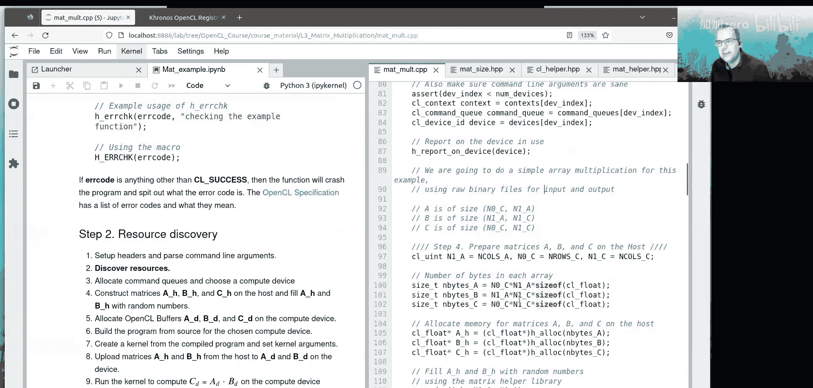

# 004：矩阵乘法完整示例

在本节课中，我们将通过一个完整的矩阵乘法示例，详细讲解OpenCL应用程序的构建过程。我们将从概念理解开始，逐步深入到每一行代码，并学习如何使用辅助函数来简化OpenCL繁琐的样板代码。

## 矩阵乘法概念

上一节我们介绍了OpenCL的基本架构，本节中我们来看看如何将其应用于一个具体的计算问题：矩阵乘法。

矩阵乘法是科学、技术、工程和数学领域中常用的计算操作。许多问题都可以简化为矩阵乘法。计算矩阵 **A** 和 **B** 的乘积 **C** 时，需要计算矩阵 **A** 的每一行与矩阵 **B** 的每一列的点积。

点积的计算过程如下：我们有两个向量，将它们并排放置。然后遍历向量的每一个元素，从索引0开始。将向量1在某个索引处的元素与向量2在同一索引处的元素相乘，然后将结果累加到一个总和上。当遍历到向量末尾时，得到的总和就是点积。

在矩阵乘法中，计算第 `I0` 行与第 `I1` 列的点积时，我们沿着矩阵 **A** 的第 `I0` 行移动，逐元素地将矩阵 **A** 的元素与矩阵 **B** 第 `I1` 列的元素相乘，并累积求和。最终得到的值被放入结果矩阵 **C** 的位置 `(I0, I1)`。

我们采用的策略是将一个内核实例与矩阵 **C** 中的每一个像素 `(I0, I1)` 关联起来。这意味着我们的网格大小需要与矩阵 **C** 一样大，并且必须足够覆盖整个矩阵 **C**。同时，它必须满足一个约束条件：在维度0和维度1上，必须有整数个工作组。因此，网格可能比矩阵 **C** 的域大，这没有问题，但不能更小，否则无法充分覆盖问题。每个内核将计算自己的点积，它拥有坐标 `I0` 和 `I1`，然后使用这些坐标沿着矩阵 **A** 的第 `I0` 行和矩阵 **B** 的第 `I1` 列进行索引。

## 程序概览与运行

源代码位于 `L3_matrix_multiplication/matmul.cpp`。我们可以先运行程序查看结果，再逐行理解其工作原理。

该文件夹中有一个Makefile，用于编译示例程序 `matmul.cpp`。程序会创建矩阵 **A** 和 **B**，并用0到1之间的随机数填充它们。然后使用OpenCL计算矩阵 **C**。计算完成后，矩阵会以二进制格式写入文件。

在终端中，我们可以切换到 `L3_matrix_multiplication` 目录，然后编译并运行矩阵乘法程序。

程序运行后，会选择计算设备，执行矩阵乘法操作，并检查结果。这里显示的最大误差（即两个矩阵差值的绝对值的最大值，也称为无穷范数）大约在 `10^-5` 量级。这是一个很好的结果，接近浮点表示之间的误差。

我们现在应该能看到输出的文件：`arrayA.dat`、`arrayB.dat` 和 `arrayC.dat`。我们可以使用Python读入这些矩阵，进行矩阵乘法，然后与OpenCL的结果进行比较。

从Python计算的结果和OpenCL计算的结果对比来看，两者非常相似。残差的绝对值平均幅度最大值约为 `6 * 10^-5`。从C++课程中我们知道，在数值约为70时，机器精度或相邻浮点表示之间的差值大约为 `10^-5`。因此，`10^-5` 量级的绝对残差是可以接受的，它与浮点误差处于同一数量级。我们对这个结果感到满意，代码正在按预期工作。

## 程序结构详解

正如引言中所介绍的，每个加速应用程序都遵循相同的逻辑步骤序列：发现计算资源、编译内核、分配内存、复制内存、运行内核、主机等待内核完成、将内存复制回来，并根据需要重复多次（本例中只执行一次）。然后清理资源并退出。

对于使用OpenCL的矩阵乘法问题，我们选择了以下策略：
1.  设置头文件并解析命令行参数。
2.  发现资源。
3.  分配命令队列并选择计算设备。
4.  在主机上构造矩阵 **A**、**B** 和 **C**，并用随机数填充 **A** 和 **B**。
5.  在计算设备上分配OpenCL缓冲区 `A_d`、`B_d` 和 `C_d`。
6.  为选定的计算设备从源代码构建程序。
7.  从已构建的程序中创建内核，并设置内核参数。
8.  将矩阵 **A** 和 **B** 从主机上传到设备的 `A_d` 和 `B_d`。
9.  运行内核，在计算设备上计算 `C = A * B`。
10. 将 `C_d` 的内容从设备复制回主机的 `C_h`。
11. 将 `C_h` 与已知解进行测试，并将矩阵内容写回磁盘。
12. 清理数组并释放资源。

现在，我们将逐步讲解这个序列中的每一步，并尽可能详细地解释其工作原理。

## 头文件与辅助函数

OpenCL应用程序有相当多繁琐的样板代码。几乎每个OpenCL应用程序都使用某种形式的自定义头文件来屏蔽程序员的额外复杂性，并减少潜在的错误源。本课程涵盖的应用程序也不例外，我构建了许多辅助函数来减少这种繁琐的样板代码。

我们将解释每个辅助函数的作用以及它如何融入程序的其余部分。同时打开源代码 `matmul.cpp` 和辅助头文件 `cl_helper.hpp` 会很有帮助。

在 `matmul.cpp` 中，我们首先包含一些必要的头文件，用于断言、数学运算和标准输出。然后引入定义矩阵大小的头文件 `matmul.h`。该文件定义了矩阵 **C** 的行数 `N0_C`、列数 `N1_C`，以及矩阵 **A** 的列数（同时也是矩阵 **B** 的行数）`N1_A`。因此，矩阵 **A** 的大小为 `N0_C x N1_A`，矩阵 **B** 的大小为 `N1_A x N1_C`，矩阵 **C** 的大小为 `N0_C x N1_C`。

接下来，我们包含辅助头文件 `cl_helper.hpp`，它引入了一系列用户定义的函数来减少样板代码。我们还包含了一个名为 `mat_helper` 的函数库，其中包含可以在CPU上打印矩阵、进行矩阵乘法以及计算无穷范数等例程。然后包含OpenCL辅助头文件。

查看 `cl_helper.hpp`，这个头文件最初设计为可以在Apple系统和Windows系统上工作。如果使用Windows，则包含一些Windows特定的头文件。这里定义了一个宏 `CL_TARGET_OPENCL_VERSION`，用于指定目标OpenCL版本（例如300代表OpenCL 3.0）。在包含 `opencl.h` 时定义这个宏有助于OpenCL头文件确定可以提供哪些功能。对于Apple操作系统，OpenCL头文件位于不同的位置。

## 命令行参数解析

接下来，我们需要解析命令行参数。代码中声明了一个 `cl_device_type` 类型的变量 `target_device`，用于指定目标设备类型。函数 `h_parse_args` 从命令行读取我们想要的设备类型和设备索引。

以下是可能的设备类型：
*   `CL_DEVICE_TYPE_ALL`: 所有设备
*   `CL_DEVICE_TYPE_CPU`: CPU
*   `CL_DEVICE_TYPE_GPU`: GPU
*   `CL_DEVICE_TYPE_ACCELERATOR`: 加速器（如FPGA）
*   `CL_DEVICE_TYPE_CUSTOM`: 自定义加速器

在本程序中，我们只支持通过 `ALL`、`CPU` 或 `GPU` 进行过滤。一旦获得过滤后的设备列表，我们就可以从中选择一个设备索引。

在 `main` 函数中，我们创建变量 `target_device`，然后使用 `h_parse_args` 来填充该变量。`target_device` 的值最终将由 `clGetDeviceIDs` 函数使用，以创建平台上兼容的OpenCL设备列表。`device_index` 用于从该列表中选择设备。

程序支持的可选参数有：
*   `-cpu`: 将设备限制为CPU。
*   `-gpu`: 将设备限制为可用的GPU。
*   `-id `: 指定设备索引的数字。

默认情况下，我们选择所有设备，并使用设备索引0。

## 错误检查

在OpenCL中进行健全性检查极其重要。每个OpenCL函数调用都有某种方式来指示其是否正常工作，通常以OpenCL有符号整数数据类型 `cl_int` 的形式返回信息。OpenCL规范定义了许多错误代码，`CL_SUCCESS` 是函数调用成功的通用代码。

在 `cl_helper.hpp` 中，`err_codes` 查找表提供了从错误代码整数到名称的映射。最佳实践是始终检查每个OpenCL调用的返回代码，并妥善处理。否则，OpenCL程序可能会静默失败并产生未定义行为。

辅助函数 `h_errchk` 接受一个错误代码和一条消息，并打印出错误信息。如果遇到任何非 `CL_SUCCESS` 的错误代码，该函数将使程序崩溃并输出错误消息。除了向 `h_errchk` 提供自定义错误消息外，还可以使用宏 `H_ERRCHK`，它使用文件名和行号作为消息。

## 资源发现

接下来我们需要发现资源。我们需要查询存在的平台，在每个平台中找出有多少设备，从这些可用设备中选择我们想要的，然后为每个找到的设备创建上下文。

主机代码定义了一些指针，这些指针将指向平台数组、OpenCL设备ID数组和上下文数组。我们的策略是搜索所有平台，获取所有设备，然后将所有设备放入一个扁平的长数组中。同时，我们创建一个长度相同的上下文数组。我们遍历所有平台，获取所有设备，然后将所有内容放入一个大的扁平数组中。这是一种灵活且可移植的策略。

在单个上下文中包含多个设备是可能的，但那样代码可能特定于该架构。如果为每个发现的设备关联一个单独的上下文，则会获得更好的可移植性。这样做可能会失去在上下文内的设备之间进行特定内存复制的能力，但这不是一个重大问题，而可移植性的提升是显著的。

从参数解析中，变量 `target_device` 包含我们希望使用的设备类型。辅助函数 `h_acquire_devices` 完成了遍历平台、找出符合 `target_device` 描述的设备，然后用兼容设备及其上下文填充扁平数组的过程。

让我们深入查看 `h_acquire_devices`。每个OpenCL平台都有一组零个或多个符合目标设备描述的设备。该函数首先查询平台数量，然后为平台ID分配内存并填充数组。接着，它遍历每个平台，使用 `clGetDeviceIDs` 获取匹配所需设备类型的设备数量，并填充设备数组。同时，它为找到的每个设备创建一个上下文。最后，函数填充传入的指针，使其指向分配的数组。

在程序结束时，我们调用 `h_release_devices` 函数来释放 `h_acquire_devices` 中分配的所有资源。

## 分配命令队列与选择设备

发现资源后，我们需要分配命令队列并选择计算设备。我们需要创建一个与上下文中的设备相关联的命令队列。

代码中包含一个断言，确保选择的设备索引小于发现的设备数量。然后我们从已创建的上下文和命令队列数组中选择一个上下文和一个命令队列。

一旦获取了设备，我们现在需要创建命令队列。OpenCL实现会设置可以创建的命令队列数量的限制。创建命令队列时，我们可以指定一些选项，例如启用乱序执行或性能分析。性能分析选项允许使用事件来获取某些工作开始执行和结束执行的时间。

在函数 `h_create_command_queues` 中，我们传入设备数组、上下文数组、设备数量和所需的命令队列数量。该函数以循环方式使用找到的设备创建一个命令队列数组。创建命令队列时，可以使用 `clCreateCommandQueueWithProperties` 函数（OpenCL 2.0+ API）或旧函数。我们通过检查设备支持的版本来决定使用哪个函数。我们使用一个位字段来设置队列属性，例如启用性能分析或乱序执行。

然后，我们使用设备索引来获取一个上下文、一个命令队列和一个设备。函数 `h_report_on_device` 用于获取并打印计算设备的名称、版本、全局内存大小、支持的最大维度数以及工作组中的最大工作项数等信息。所有这些样板代码都被简化为一行代码，非常方便。

---

本节课中我们一起学习了如何构建一个完整的OpenCL矩阵乘法应用程序。我们从矩阵乘法的核心概念出发，详细讲解了程序的结构、命令行参数解析、错误检查、资源发现、命令队列分配等关键步骤，并了解了如何使用辅助函数来简化OpenCL编程中常见的样板代码。通过这个示例，你应该对OpenCL应用程序的开发流程有了更清晰的认识。