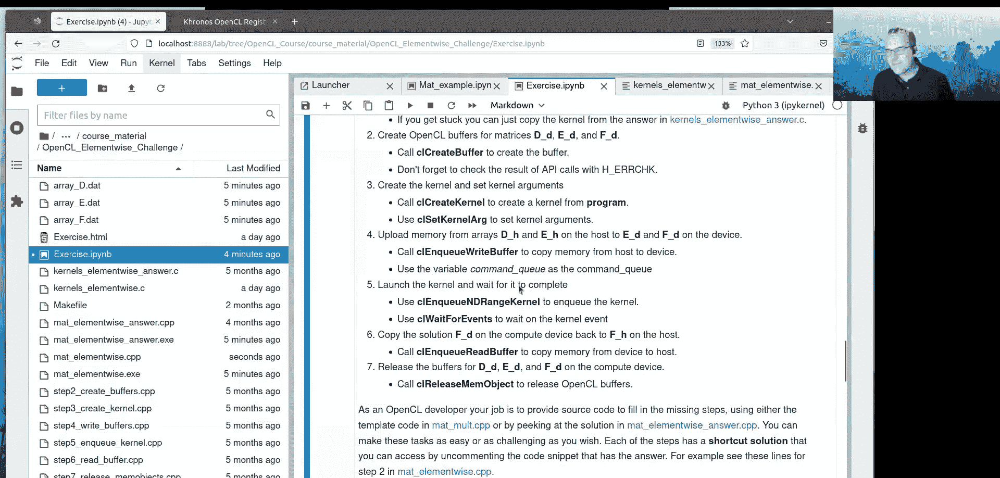

# 005：矩阵乘法详解与练习


在本节课中，我们将深入学习OpenCL编程，完成一个完整的矩阵乘法示例。我们将从创建命令队列开始，逐步讲解如何准备数据、编译内核、执行计算并获取结果。课程最后会提供一个元素级矩阵乘法的练习，帮助你巩固所学知识。

## 步骤四：在主机上准备矩阵A、B和C

上一节我们介绍了如何创建命令队列，本节中我们来看看如何在主机上准备数据。

变量 `N_COLS_A`、`N_ROWS_C` 和 `N_COLS_C` 已在 `matsize.hpp` 文件中定义。数组大小为256，这意味着矩阵A有256列，矩阵C有256行和256列。这些信息足以定义我们的计算问题。

我们使用 `cl_uint` 类型定义变量 `n1_a`、`n0_c`、`n1_c`。在调用内核时，确保数据类型匹配至关重要。

以下代码用于计算每个数组所需的字节数：
```c
size_t bytes_a = n0_c * n1_a * sizeof(cl_float);
```
我们使用 `cl_float` 类型存储32位浮点数，这与OpenCL内核中使用的 `float` 类型精确对应。

我们使用 `h_alloc` 函数在主机上为矩阵A、B和C分配对齐的内存。在OpenCL中，当主机内存用作缓冲区的后备存储时，使用对齐内存至关重要。`h_alloc` 函数使用OpenCL中最大的数据类型 `cl_long16` 作为对齐基准，确保分配的内存起始地址是其字节数的倍数。

接着，我们使用 `mat_random` 函数，通过梅森旋转算法生成器，用随机数填充矩阵A和B。这里使用固定种子以确保结果可重现。

## 步骤五：在计算设备上创建OpenCL缓冲区

现在，我们进入步骤五，在计算设备上为数据创建缓冲区。

我们使用 `clCreateBuffer` 函数为矩阵A、B和C分配OpenCL缓冲区。创建缓冲区时需要上下文、字节数以及读写标志 `CL_MEM_READ_WRITE`。该标志表示缓冲区可读可写。

函数返回一个错误代码，用于检查缓冲区分配是否成功。在OpenCL编程中，检查每一步操作的错误代码是必不可少的良好实践。

`clCreateBuffer` 函数负责在上下文（最终是计算设备）上分配内存。OpenCL实现会负责在主机和设备之间移动这些缓冲区内存。

## 步骤六：为选定设备从源代码构建程序

数据准备就绪后，下一步是为计算设备编译内核程序。

我们有一个额外的文件 `kernels_matmul.cl`，其中包含了执行矩阵乘法的内核代码。内核函数使用 `__kernel` 限定符，返回类型始终为 `void`，并接受多个参数。

在内核中，每个从全局内存传入的参数都需要使用 `__global` 限定符。这对应于我们之前使用 `clCreateBuffer` 创建的缓冲区。

在主机程序中设置内核参数时，必须确保数据类型与内核中的定义完全一致。例如，主机端的 `cl_uint` 对应内核中的 `unsigned int`。

我们使用 `h_binary` 函数将内核源文件读入字符串，然后使用 `h_build_program` 函数为特定的上下文和设备编译该程序。`h_build_program` 内部调用了 `clCreateProgramWithSource` 和 `clBuildProgram`。如果编译失败，该函数会提取并打印构建日志，便于调试。

## 步骤七：从构建的程序中获取内核并设置参数

程序构建成功后，我们需要从中提取出内核对象并为其设置参数。

使用 `clCreateKernel` 函数从已编译的程序中提取名为 `matmul` 的内核。然后，我们使用 `clSetKernelArg` 函数为内核设置参数。

对于缓冲区参数，我们传递缓冲区的地址。对于标量参数（如 `n1_a`, `n0_c`, `n1_c`），我们传递其值。确保参数索引与内核函数定义中的顺序一致。

**注意**：`clSetKernelArg` 函数不是线程安全的。在多线程程序中，应在单个线程中设置内核参数，或者每个线程从共享的程序中创建自己的内核实例。

## 内核源代码解析

让我们简要看一下内核 `matmul` 的工作原理：
```opencl
__kernel void matmul(__global const float* A,
                     __global const float* B,
                     __global float* C,
                     unsigned int n1_a,
                     unsigned int n0_c,
                     unsigned int n1_c) {
    size_t i1 = get_global_id(0); // 对应矩阵的列维度
    size_t i0 = get_global_id(1); // 对应矩阵的行维度
    if (i0 < n0_c && i1 < n1_c) {
        float temp = 0.0f;
        for (unsigned int k = 0; k < n1_a; ++k) {
            temp += A[i0 * n1_a + k] * B[k * n1_c + i1];
        }
        C[i0 * n1_c + i1] = temp;
    }
}
```
*   `get_global_id(0)` 和 `get_global_id(1)` 获取工作项在全局网格中的坐标。这里进行了维度映射，使网格的0维度对应矩阵的列(`i1`)，1维度对应矩阵的行(`i0`)，以适配C语言的行优先存储顺序。
*   循环 `k` 计算矩阵A的第 `i0` 行与矩阵B的第 `i1` 列的点积，结果存入矩阵C的 `(i0, i1)` 位置。
*   `if` 语句是保护条件，防止网格尺寸大于矩阵C时发生越界访问。

## 步骤八：将矩阵A和B从主机上传至设备

内核准备就绪后，需要将输入数据传送到设备。

我们使用 `clEnqueueWriteBuffer` 命令将主机内存中的矩阵 `A_h` 和 `B_h` 上传到设备缓冲区 `A_d` 和 `B_d`。该命令从缓冲区的视角出发，“写入缓冲区”即从主机复制数据到缓冲区。

这些复制操作被提交到之前创建的命令队列中。

## 步骤九：运行内核进行计算

数据上传完成后，便可以调度内核在设备上执行。

我们使用 `clEnqueueNDRangeKernel` 函数将内核提交到命令队列。需要指定：
*   `work_dim`: 网格的维度数（此处为2）。
*   `global_work_size`: 全局工作项数量（即网格大小）。由于内核中的维度映射，这里使用 `(n1_c, n0_c)`。
*   `local_work_size`: 工作组的大小（每个维度上的工作项数量）。函数 `h_fit_global_size` 会调整全局大小，使其能被局部大小整除。

我们创建一个事件 `kernel_event` 来跟踪内核执行的完成情况。使用 `clWaitForEvents` 函数可以等待一个或多个事件完成，这里我们等待内核事件。

## 步骤十与十一：回传结果与验证

计算完成后，需要将结果从设备取回并验证。

使用 `clEnqueueReadBuffer` 命令将设备缓冲区 `C_d` 中的结果复制回主机内存 `C_h`。

随后，我们分配内存用于存储CPU计算的参考结果，并计算OpenCL结果与CPU结果之间的最大误差，以验证正确性。

最后，我们写入数组并释放所有资源：
1.  释放主机内存分配。
2.  调用 `h_release_command_queues` 释放命令队列（内部先调用 `clFinish` 等待队列中所有命令完成，再调用 `clReleaseCommandQueue`）。
3.  调用 `h_release_devices` 释放设备、上下文和平台资源。

## 练习：元素级矩阵乘法

为了巩固你对OpenCL编程流程的理解，我们提供了一个练习：实现Hadamard乘积（即元素级矩阵乘法）。

练习文件位于 `opencl_elementwise_challenge` 目录中。你需要编辑两个文件：
*   `mat_elementwise.cpp`: 主机端代码。
*   `kernels_elementwise.cl`: 内核代码。

当前代码缺少多个关键步骤，但每个步骤都在代码中用 `////` 注释清晰地标记出来。练习步骤包括：
1.  完成内核代码。
2.  创建OpenCL缓冲区。
3.  创建内核对象。
4.  上传数据到设备。
5.  启动内核。
6.  将结果复制回主机。
7.  释放缓冲区。

这是一个“自主选择冒险”式的练习，你可以选择完成任意数量的步骤。如果遇到困难，可以参考 `mat_elementwise_answer.cpp` 中的答案。你的目标是修改代码，使得最终输出的残差矩阵误差为零，表明计算结果正确。

## 总结



本节课中我们一起学习了完整的OpenCL矩阵乘法应用流程。我们从设备发现、命令队列创建开始，逐步完成了主机数据准备、设备缓冲区分配、内核程序构建与参数设置、数据传输、内核执行以及结果回传和验证。通过这个详尽的示例，你应该对OpenCL编程的基本结构和步骤有了清晰的认识。接下来的课程将涵盖内核调试、性能剖析以及OpenCL中不同的内存空间，帮助你更深入地掌握高性能计算编程。