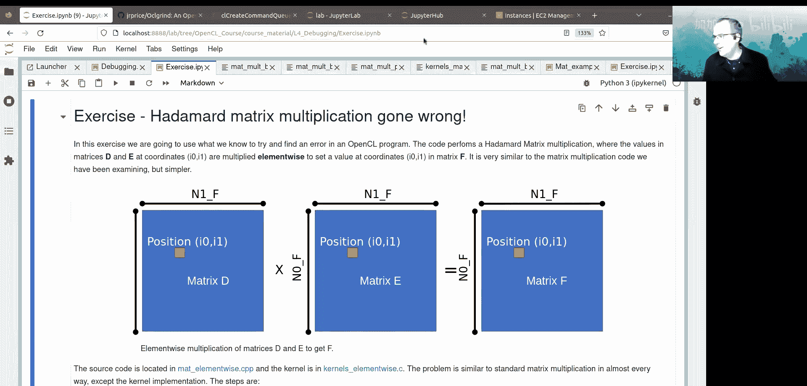

# 006：调试 🐛


在本节课中，我们将学习如何调试OpenCL应用程序。我们将通过一个矩阵乘法的例子，引入一个错误，并使用多种技术和工具来定位和修复这个错误。主要内容包括：检查错误代码、内存访问检查、输入输出可视化、使用`printf`、以及使用开源工具OCLgrind进行交互式调试。

---

## 调试OpenCL内核的挑战

调试OpenCL内核通常并不容易，主要原因是缺乏特定厂商的专门支持。然而，有一些工具和技术可以提供帮助。

以下是几种常用的调试方法：
*   **检查每个OpenCL函数调用的错误代码**：这是编程的最佳实践，可以捕获许多API错误。
*   **检查内核中的内存访问**：确保内存访问在有效范围内。
*   **对输入和输出进行可视化检查**：直接观察数据，判断算法是否正确。
*   **在内核中使用`printf`**：大多数主要的OpenCL实现都支持在内核中使用C语言的`printf`语句，输出会显示在命令行中。
*   **使用OCLgrind工具套件**：这是一个开源工具，提供了类似Valgrind的方式来调试OpenCL内核，可以检测数据竞争、内存访问违规和错误的API运行时调用。

上一节我们介绍了调试OpenCL应用的基本思路，本节中我们来看看一个具体的调试案例。

---

## 案例：一个有Bug的矩阵乘法

我们将使用一个矩阵乘法操作作为例子。我们故意在核函数中移除了防止内核在C矩阵域外设置值的保护性检查（guard check）。

矩阵A、B和C的大小设置为72x72，并使用行主序（row-major ordering）。在核函数中，我们指定OpenCL网格的维度0映射到矩阵的维度1（因为维度1是行主序中的连续维度），网格的维度1映射到矩阵的维度0。

我们选择的工作组大小（局部大小）为16x4x1。由于网格在每个维度上必须由整数个工作组组成，因此覆盖矩阵所需的最小全局大小为80x72x1（对应5x18x1个工作组）。

经过映射转换后，网格的全局大小80x72x1对应到矩阵上是72x80，而矩阵实际大小是72x72。这意味着在矩阵C的边界外，有8个单元格会被错误地写入。

让我们回顾一下矩阵乘法的原理：我们取矩阵A的第`i0`行与矩阵B的第`i1`列进行点积，结果放入矩阵C的`(i0, i1)`位置。如果移除了保护检查，当`i1`超出矩阵C的边界时，内核会从矩阵B的末尾之外读取数据（内存访问违规），并可能向矩阵C末尾之外的内存写入数据。

当我们运行这个有错误的代码时，最大残差（infinity norm）通常会远大于预期（例如出现`10^38`这样的巨大数值）。但请注意，这个基于GPU的OpenCL实现运行完成了，并没有崩溃。这是因为GPU实现通常没有严格的内存访问违规检查，这会导致未定义行为，每次运行可能得到看似随机的结果。

相比之下，由于操作系统的安全机制，CPU实现通常对内存访问违规更敏感，尝试访问不属于程序的内存可能会导致程序崩溃（如段错误）。

---

## 调试技术实践

### 1. 可视化检查输入输出

作为第一步，我们可以将计算的输出（以及输入）加载到内存中，并与一个已知的正确结果（例如使用NumPy计算的结果）进行比较。

通过计算绝对残差，我们可以发现一条由8个错误单元格组成的线。错误区域宽度为8，这证实了我们超出了C矩阵边界，并开始写入下一行。值得注意的是，有些错误区域内的单元格值是正确的，这是因为我们无法依赖工作项（work-item）完成的顺序。最后写入该内存位置的工作项决定了最终值。

在GPU实现上，这个错误区域可能呈现为更“块状”的模式，这是因为硬件线程团队（wavefront/warp）是作为一个整体执行写入操作的。

**结论**：可视化检查是判断算法是否正常运行的最有效测试方法之一。

### 2. 检查内存访问有效性

如果我们通过可视化检查发现了问题，下一步可以尝试确保内存访问是有效的。

一种调试策略是用一个已知的答案预先填充输出数组。例如，在核函数中，我们可以用索引`i1`（转换为浮点数）来填充矩阵C。这样做的目的不是获得正确结果，而是找出错误的根源。

运行修改后的程序后，观察输出矩阵C，会发现某些行中出现了高于预期最大值（71）的索引值（如78）。这清楚地表明程序访问了矩阵C边界之外的内存。

### 3. 在内核中使用`printf`

大多数主要的OpenCL实现支持在内核中使用`printf`语句，输出会显示在标准输出中。

我们可以修改有错误的核函数，添加一个`printf`语句，当`i1`行为异常（例如超出`n1_c - 1`）时，打印出`i1`的值。运行程序后，控制台会输出超出范围的`i1`值，这直接指示了错误所在。

### 4. 使用OCLgrind工具

OCLgrind是一个模拟OpenCL设备的开源工具，它可以自我检查数据竞争、内存访问违规和错误的API运行时调用。它提供了一个OpenCL 1.2接口以及类似GDB的交互式内核调试功能，但速度比原生OpenCL应用程序慢几个数量级。

在系统上安装或加载OCLgrind模块后，可以使用以下命令进行交互式调试：
```bash
oclgrind -i ./matmul_bug.exe
```
调试会话开始后，可以使用`info`查看停止位置，用`list`查看内核代码，用`next`单步执行，用`print`检查变量（如`n1_c`、`i0`、`i1`）甚至内存分配中的值（如`B[0]`）。还可以使用`wi`命令切换到特定的全局ID对应的工作项。

当OCLgrind遇到内存访问违规（如无效读取或写入）时，它会停止并报告详细错误信息，包括违规地址和工作组信息。

对于只想调试特定内核而不想运行整个应用程序的情况，可以使用OCLgrind的姊妹工具`oclgrind-kernel`。它需要一个`.sim`文件来指定运行时参数和内核参数，然后仅对该内核进行交互式调试。

---

## 厂商特定工具尝试

### AMD ROCgdb

ROCgdb是AMD的调试器，可用于调试HIP和OpenCL内核。然而，在当前环境下，使用ROCgdb调试OpenCL代码的体验可能不完整。虽然可以设置断点并命中内核，但在单步执行内核代码时可能会遇到困难。

### Intel oneAPI GDB

Intel oneAPI工具包中的增强版GDB调试器能够单步调试OpenCL内核，它适用于Intel的OpenCL运行时。要启用内核调试，需要选择CPU设备并使用Intel OpenCL实现。

在编译程序时，需要添加生成调试信息（`-g`）和指定内核源代码位置（`-s`）的编译选项。在内核中，可以使用`__ocl_dbg_gid0`等变量在特定全局ID处设置条件断点。

在调试会话中，可以单步执行代码并打印变量值。但需要注意的是，在此示例中，Intel调试器并未主动检测到内存访问违规。

---

## 总结与练习

本节课我们一起学习了多种调试OpenCL应用程序的技术：
1.  **可视化检查输入输出**：快速发现明显错误。
2.  **检查内存访问**：通过填充已知值验证访问范围。
3.  **内核内`printf`**：直接输出运行时状态。
4.  **使用OCLgrind**：强大的开源工具，用于检测违规和交互式调试。
5.  **尝试厂商工具**：如ROCgdb和Intel GDB，其支持程度因平台和实现而异。

### 练习：找出元素级矩阵乘法中的错误

现在，请你运用所学的调试技术，在一个“Hadamard乘积”（元素级相乘）的OpenCL程序中寻找错误。程序位于`mat_elementwise`目录中，内核在`kernels_elementwise`目录。

正确程序的输出应与CPU计算结果完全一致（残差为0）。但有错误的程序会在最后一行的部分元素产生非零残差。

你的任务是使用本课介绍的任何技术（查看代码差异、可视化输出、使用`printf`、或使用OCLgrind等）来定位并理解这个错误。你可以对比`mat_elementwise_answer`和`kernels_elementwise_answer`中的正确代码来获得启发。



请尝试在接下来的时间里独立或协作完成这个调试练习。