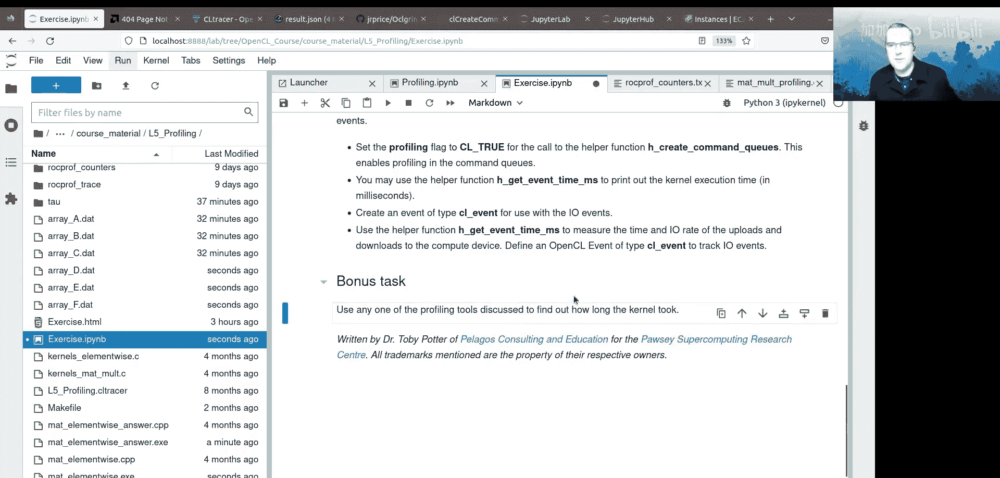

# 007：调试练习与性能分析


在本节课中，我们将学习如何调试OpenCL程序中的错误，并使用多种工具对OpenCL内核和内存操作进行性能分析。我们将从调试练习开始，然后深入探讨OpenCL内置的事件分析接口，以及如何使用开源工具Tau和商业/供应商工具（如CL Tracer和ROCm Profiler）来收集详细的性能数据。

## 调试练习回顾

上一节我们介绍了OpenCL编程的基础。本节中，我们来看看一个包含错误的矩阵乘法程序，并学习如何定位和修复这些错误。

在之前的调试练习中，程序存在两个关键错误。

以下是错误的具体位置和原因：

1.  **内核参数顺序错误**：在主机代码中设置内核参数时，`n0_f`和`n1_f`的顺序被颠倒了。
    *   **错误代码示例**：`kernel.setArg(0, n1_f); kernel.setArg(1, n0_f);`
    *   **正确代码示例**：`kernel.setArg(0, n0_f); kernel.setArg(1, n1_f);`
    *   **导致问题**：这导致内核中的索引`i0`可以超出矩阵的有效范围（0到3），而`i1`则无法访问完整范围，从而引发内存访问错误。

2.  **内核保护条件错误**：在内核代码中，循环的边界保护条件使用了错误的变量。
    *   **错误代码示例**：`if(i0 < n1_f && i1 < n0_f)`
    *   **正确代码示例**：`if(i0 < n0_f && i1 < n1_f)`
    *   **导致问题**：即使参数顺序正确，这个错误的保护条件也会允许线程访问矩阵边界之外的内存，导致内存访问违规。

修复第一个错误后，使用`oclgrind`等工具可以检测到第二个错误引起的内存访问违规。修复第二个错误后，程序运行正常并得到正确结果。

这个练习强调了在传递内核参数时确保顺序和数据类型正确的重要性，以及在内核中编写正确边界检查的必要性。

## 使用OpenCL事件进行性能分析

了解应用程序的性能是开发过程的关键部分。OpenCL标准本身提供了一个性能分析接口，主要基于**事件**和**命令队列**。

在OpenCL中，事件用于跟踪提交到命令队列中的工作状态，并建立工作流之间的依赖关系。它们也可用于计时内核执行和内存拷贝等操作。

要启用性能分析，必须在创建命令队列时显式设置一个标志。

以下是创建支持性能分析的命令队列的代码示例：
```cpp
cl_command_queue_properties props = CL_QUEUE_PROFILING_ENABLE;
command_queue = clCreateCommandQueue(context, device, props, &err);
```
启用分析功能后，可以使用`clGetEventProfilingInfo`函数提取与事件关联的时间信息（以纳秒为单位）。

我们通常使用一个辅助函数来获取事件的耗时（毫秒）和计算数据传输速率。

以下是获取事件时间的辅助函数逻辑：
```cpp
// 伪代码逻辑
1. 等待事件完成：clWaitForEvents。
2. 查询事件开始时间：clGetEventProfilingInfo(..., CL_PROFILING_COMMAND_START, ...)。
3. 查询事件结束时间：clGetEventProfilingInfo(..., CL_PROFILING_COMMAND_END, ...)。
4. 计算耗时（毫秒）：(end - start) / 1.0e6。
5. 如果提供了传输字节数，计算传输速率：bytes / (time_in_seconds)。
```
在实际应用中，我们可以这样为缓冲区拷贝和内核执行计时：

*   **内存拷贝计时**：在调用`clEnqueueWriteBuffer`或`clEnqueueReadBuffer`时传递一个`cl_event`对象，并在操作完成后使用上述辅助函数查询时间。
*   **内核执行计时**：在调用`clEnqueueNDRangeKernel`时传递一个`cl_event`对象，并在内核完成后查询时间。

这种方法可以直接在代码中测量关键操作的性能，是优化程序的第一步。

## 使用Tau进行性能分析与追踪

除了OpenCL原生接口，我们还可以使用开源工具。**Tau**是一个用于高性能计算应用的常用性能分析和追踪工具包，它支持OpenCL应用。

Tau可以收集两种类型的数据：
*   **性能分析**：统计程序各部分累积耗时。
*   **追踪**：收集线程在每个应用组件中执行的时间线信息。

使用Tau的基本步骤很简单。

以下是使用Tau分析OpenCL应用的基本命令：
```bash
# 设置输出目录
export PROFILEDIR=`pwd`/tau
# 使用tau_exec运行应用程序，收集OpenCL API调用信息
tau_exec -opencl -serial ./my_opencl_app
```
运行后，Tau会生成性能分析数据。可以使用`pprof`工具查看文本格式的分析报告，其中会列出所有OpenCL调用的次数和耗时，帮助识别最耗时的操作。

此外，Tau也能生成追踪文件。

以下是使用Tau生成并转换追踪文件的命令：
```bash
# 启用追踪
export TAU_TRACE=1
export TRACEDIR=`pwd`/tau
# 再次运行应用以收集追踪数据
tau_exec -opencl -serial ./my_opencl_app
# 合并追踪事件
tau_treemerge.pl
# 转换为Perfetto可读的JSON格式
tau_trace2json *.trc *.edf -o trace.json
```
生成的`trace.json`文件可以复制到本地，用浏览器打开`ui.perfetto.dev`加载，即可可视化查看整个应用程序的时间线，包括每个OpenCL API调用和内核执行的精确开始、结束时间。这对于理解并发性和性能瓶颈至关重要。

## 供应商工具：ROCm Profiler

对于AMD平台，**ROCm Profiler**是一个强大的工具。虽然它主要追踪底层的HSA层而非OpenCL层，对OpenCL应用的分析不那么直接，但它仍能提供有用的信息，特别是**硬件性能计数器**。

ROCm Profiler可以收集关于GPU内部工作的详细指标。

以下是ROCm Profiler可以收集的部分性能计数器示例：
*   `GPUBusy`：GPU忙碌时间的百分比。
*   `Wavefronts`：执行的总波前数。
*   `L2CacheHit`：L2缓存命中率。
*   `FetchSize`：获取的数据量。

要收集这些计数器，需要先创建一个配置文件列出感兴趣的指标，然后运行profiler。

以下是使用ROCm Profiler收集性能计数器的命令示例：
```bash
# 列出可用的派生计数器
rocprof --list-derived
# 创建计数器列表文件（例如：counters.txt）
# 内容示例：pmc: Wavefronts, GPUBusy
# 使用列表文件运行应用
rocprof -i counters.txt --timestamp on -o ./results.csv ./my_opencl_app
```
结果将保存在CSV文件中，包含每个内核的详细性能数据。在MPI环境中，需要确保每个进程将输出写入唯一文件，通常可以通过结合`SLURM_JOB_ID`和`SLURM_PROCID`环境变量来实现。

## 商业工具：CL Tracer

历史上，像NVIDIA Visual Profiler这样的工具对OpenCL有一定支持，但现已 largely abandoned。不过，仍有商业工具可用，例如**CL Tracer**。

CL Tracer是一个跨平台、跨供应商的OpenCL性能分析器，提供图形化界面来显示API调用时间线、内核执行和IO操作。它可以直观地展示阻塞调用、内核配置和执行时间等信息。虽然它是商业软件，但开发者似乎提供了免费许可，可用于评估和学习。

## 性能分析实践练习

现在，我们将通过一个练习来巩固所学知识。任务是对一个哈达玛积（逐元素矩阵乘法）OpenCL程序进行性能分析。

练习的代码位于`mat_elementwise.cpp`（主机代码）和`kernel_elementwise.cl`（内核代码）中。当前代码功能正确，但**没有**包含任何性能分析的代码。

你的任务是：
1.  使用OpenCL事件分析接口，修改主机代码，测量并输出以下操作的耗时：
    *   上传矩阵D和E到设备的时间。
    *   内核执行的时间。
    *   下载结果矩阵F回主机的时间。
2.  （可选）使用本课介绍的任何一种性能分析工具来验证你的结果，或获取更详细的性能数据。

完成后，你可以与提供的答案代码`mat_elementwise_answer`进行对比，看看实现是否一致。

## 总结

本节课中我们一起学习了OpenCL程序的调试和性能分析。

*   **调试**：我们通过实例学习了常见的内核参数设置错误和边界检查错误，并强调使用工具验证的重要性。
*   **OpenCL事件分析**：我们介绍了如何使用OpenCL内置的事件机制，通过启用命令队列的性能分析标志，来精确测量内存传输和内核执行的耗时。
*   **Tau工具**：我们探讨了如何使用开源的Tau工具进行更全面的性能分析和追踪，并将结果可视化。
*   **供应商工具**：我们了解了AMD ROCm Profiler的基本用法，特别是如何利用它收集GPU硬件性能计数器来获得底层性能洞察。
*   **商业工具**：我们简要介绍了CL Tracer这样的图形化分析工具。



有效地使用这些调试和性能分析技术，对于开发和优化高性能、正确的OpenCL应用程序至关重要。