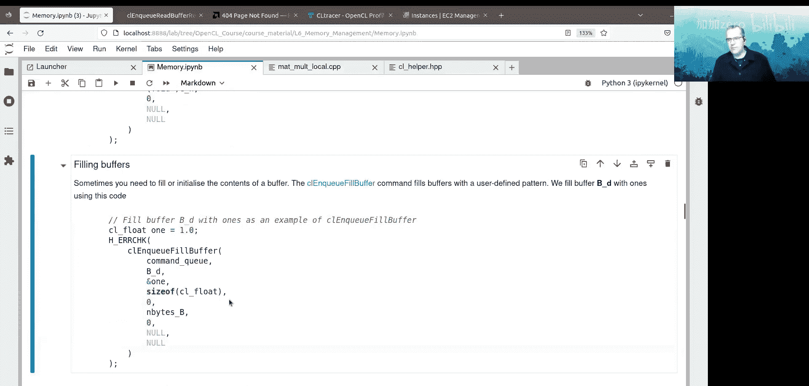

# 008：内存管理


## 概述
在本节课中，我们将要学习OpenCL中的内存管理。我们将探讨不同的内存空间、如何创建和操作缓冲区，以及如何高效地在主机和设备之间传输数据。

---

## 内存空间概述
在之前的课程中，我们学习了如何在主机上分配内存，然后将其复制到设备上作为内核使用的全局内存。OpenCL程序可以访问五种不同的内存空间，它们分别位于主机或设备上。

以下是这些内存空间：
*   **主机内存**：位于主机上，通常是最大但最慢的内存空间。
*   **全局内存**：位于计算设备上，是设备上最大但最慢的内存空间。
*   **局部内存**：在CUDA术语中称为共享内存。可供工作组内的每个工作项访问，通常缓存在计算设备的缓存中。
*   **私有内存**：存储在寄存器中，是设备上最小但最快的内存空间，每个内核工作项都有自己独立的私有内存区域。
*   **常量内存**：可供所有运行的工作项访问，据我所知是只读的。

---

## 内存访问图
上一节我们介绍了不同的内存空间，本节中我们来看看谁能访问它们。下图展示了不同内存空间及其访问者：


*   主机（黑色方框内）可以访问主机内存。
*   主机线程可以分配内存并复制到全局内存和常量内存。
*   内核（或工作项）可以访问其私有内存。
*   工作组内的所有工作项可以访问该组的局部内存。
*   内核可以访问全局内存和常量内存。

需要注意的是，主机无法访问私有内存或局部内存，只有计算设备上的内核才能访问这些空间。

---

## 从主机创建和访问内存
从引言中我们知道，缓冲区在主机上分配，然后在需要时移入和移出计算设备。缓冲区属于一个上下文。

以下是创建缓冲区和传输内存的一些方法。在矩阵乘法示例中，我们一直使用 `CL_MEM_READ_WRITE` 标志创建缓冲区。

```c
cl_mem buffer = clCreateBuffer(context, CL_MEM_READ_WRITE, size_in_bytes, NULL, &err);
```

除了读写标志，还有其他标志可以指定缓冲区的使用方式，例如 `CL_MEM_WRITE_ONLY`、`CL_MEM_READ_ONLY`、`CL_MEM_HOST_WRITE_ONLY`、`CL_MEM_HOST_READ_ONLY` 和 `CL_MEM_HOST_NO_ACCESS`。理论上，指定 `CL_MEM_HOST_NO_ACCESS` 可能是一个优化，因为它允许缓冲区留在设备上。但请注意，`CL_MEM_WRITE_ONLY` 与 `CL_MEM_READ_WRITE` 不兼容，尝试写入标记为 `CL_MEM_READ_ONLY` 的缓冲区会导致未定义行为。

---

## 缓冲区分配标志
除了权限标志，还有一些额外的标志决定缓冲区内的内存分配方式。

以下是这些标志及其作用：
*   `CL_MEM_USE_HOST_PTR`：使用主机内存分配作为缓冲区的后备存储。使用此选项时有一个非常重要的注意事项，我们很快会讨论。
*   `CL_MEM_ALLOC_HOST_PTR`：分配固定内存。固定内存是指不能被交换到磁盘的内存，它允许计算设备和缓冲区之间进行快速传输，例如直接内存访问。
*   `CL_MEM_COPY_HOST_PTR`：创建缓冲区时，从主机内存复制数据来初始化缓冲区。
*   `CL_MEM_USE_PERSISTENT_MEM_AMD`：这是AMD特定的标志，它创建一个与设备同步的零拷贝缓冲区，允许主机和设备之间进行非常快速的传输。

关于 `CL_MEM_USE_HOST_PTR` 的注意事项：它允许缓冲区使用主机内存作为后备存储。必须确保有足够的主机内存分配给缓冲区使用，并且在缓冲区使用期间主机内存不会被释放。此外，除非特别注意内存对齐，否则使用此标志可能存在危险。如果以 `float8` 向量访问内存，则内存必须对齐到32字节边界。默认情况下，不使用 `CL_MEM_USE_HOST_PTR` 的OpenCL缓冲区会正确对齐。辅助库中的 `h_alloc` 例程可以创建对齐的内存。

`CL_MEM_COPY_HOST_PTR` 和 `CL_MEM_ALLOC_HOST_PTR` 可以一起使用，只需在 `clCreateBuffer` 调用中传入要复制的指针。只有 `CL_MEM_USE_HOST_PTR` 和 `CL_MEM_ALLOC_HOST_PTR` 是互斥的。

在AMD平台上，三个 `CL_*_HOST_PTR` 标志分配的缓冲区驻留在主机上。但如果在缓冲区创建时指定 `CL_MEM_USE_PERSISTENT_MEM_AMD`，则会创建一个驻留在设备上的零拷贝缓冲区，其内容可以高效地映射回主机。

---

## 显式内存复制
有时我们需要在主机和OpenCL缓冲区之间显式复制内存。可以选择复制连续或矩形区域的内存，并使用阻塞或非阻塞传输。

以下是可用的复制函数：
*   `clEnqueueWriteBuffer`：从主机内存写入OpenCL缓冲区。
*   `clEnqueueReadBuffer`：从OpenCL缓冲区读取到主机内存。
*   `clEnqueueCopyBuffer`：在同一OpenCL上下文中的两个OpenCL缓冲区之间复制连续内存。

这些命令总是从缓冲区的角度出发：`WriteBuffer` 表示写入缓冲区，`ReadBuffer` 表示从缓冲区读取。所有三个选项都可以指定OpenCL缓冲区中的起始偏移量，`clEnqueueCopyBuffer` 还可以指定目标缓冲区的偏移量。

有时连续复制不够，例如需要复制网格的边界区域时。这时 `clEnqueueWriteBufferRect` 和 `clEnqueueReadBufferRect` 例程就派上用场了。它们在缓冲区和主机内存之间写入和读取一个3D矩形区域。

在文档中，“行”指的是沿着连续维度的方向。行间距是内存分配中一行的字节数。切片间距是行间距乘以内存分配中的行数。区域是要复制的矩形区域的大小（以字节为单位的行数、行数、切片数）。缓冲区原点和主机原点是基于零的索引，表示行、行索引和切片索引。

在 `matmul_local.cpp` 中，我们使用矩形复制将内存从 `B_h` 复制到 `B_d`。我们指定了所有必要的信息：原点为0，行间距为 `n1c * sizeof(float)`，切片间距为 `n1a * n1c * sizeof(float)`，区域大小为 `buffer_row_pitch`（字节）、`n1a`（行）和1（切片）。

---

## 缓冲区映射
使用上面提到的连续和矩形复制时，存在两个内存空间：一个用于缓冲区，一个用于主机。可以将OpenCL缓冲区映射到主机，从而避免显式的内存传输步骤。当使用CPU或集成GPU时，这种方法尤其有益，因为缓冲区的内存已经在主机上，不需要从设备进行实际传输。

缓冲区映射对于可以驻留在主机上的缓冲区（例如在设备上）很有用。通过缓冲区映射，OpenCL实现有机会优化传输，从而优化OpenCL缓冲区（可能在设备上）和主机之间的同步。

`clEnqueueMapBuffer` 命令将OpenCL缓冲区映射到主机内存。它使用以下映射标志：`CL_MAP_READ`、`CL_MAP_WRITE` 或 `CL_MAP_WRITE_INVALIDATE_REGION`。当缓冲区映射到主机时，从OpenCL内核访问该缓冲区被认为是未定义的。因此，请不要在映射时尝试使用OpenCL缓冲区。

`clEnqueueUnmapMemObject` 函数从主机取消映射内存，然后使其再次可供内核使用。

在 `matmul_local.cpp` 的末尾，我们使用 `clEnqueueMapBuffer` 调用将缓冲区 `C_d` 映射回主机。这将一些工作放入命令队列，以复制内存或将内存移出设备，并使其再次可供主机使用。完成后，我们使用 `h_write_binary` 将映射的缓冲区写入磁盘。当我们完成使用 `C_h` 后，我们使用 `clEnqueueUnmapMemObject` 取消映射 `C_h`，然后使用 `clReleaseMemObject` 释放缓冲区。

---

## 填充缓冲区
有时需要填充或初始化缓冲区的内容。`clEnqueueFillBuffer` 命令可以用用户定义的模式填充缓冲区。

在 `matmul_local.cpp` 中，我们使用以下代码用1填充缓冲区 `B_d`：

```c
clEnqueueFillBuffer(queue, B_d, &one, sizeof(cl_float), 0, n_bytes_B, 0, NULL, NULL);
```

这将向命令队列提交一个任务，用值1填充整个缓冲区 `B_d`。

---

## 总结
在本节课中，我们一起学习了OpenCL中的内存管理。我们探讨了不同的内存空间（主机、全局、局部、私有、常量）及其访问方式。我们学习了如何使用各种标志（如 `CL_MEM_USE_HOST_PTR`、`CL_MEM_ALLOC_HOST_PTR`）创建缓冲区，以及如何通过 `clEnqueueWriteBuffer`、`clEnqueueReadBuffer` 和 `clEnqueueCopyBuffer` 在主机和设备之间复制内存。我们还了解了矩形复制和缓冲区映射的高级技术，这些技术可以优化数据传输和同步。最后，我们看到了如何使用 `clEnqueueFillBuffer` 初始化缓冲区内容。掌握这些概念对于编写高效的OpenCL程序至关重要。



