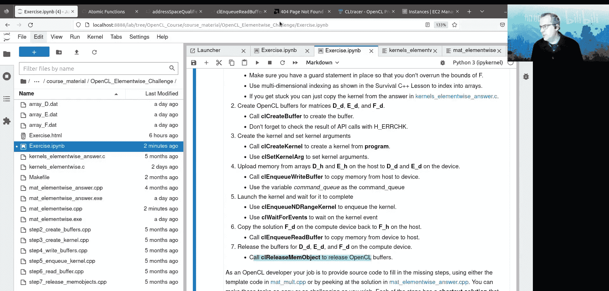

# 009：内存管理与练习

在本节课中，我们将学习OpenCL内核如何访问和管理不同的内存空间，包括全局内存、常量内存、本地（共享）内存和私有内存。我们还将探讨向量数据类型的使用和原子操作，并通过一个练习来巩固对矩形内存复制的理解。

## 内核可访问的内存空间

上一节我们介绍了如何在主机和设备之间传输内存。本节中，我们来看看内核本身可以访问哪些内存空间。

内核可以访问以下几种内存空间：
*   **全局内存**
*   **共享内存**（或称**本地内存**）
*   **私有内存**
*   **常量内存**

点击[此链接](https://www.khronos.org/registry/OpenCL/specs/3.0-unified/html/OpenCL_C.html#memory-model)可以获取关于这些内存空间的更多信息。

## 内存空间限定符

在内核源代码中定义的变量，有时必须用限定符指明其所属的内存空间。虽然规则繁多，但我们将逐一了解。

在全局地址空间中分配的内存，在声明或传入时必须带有 `global` 限定符。这意味着，如果你要在代码中使用指向全局内存的指针，该指针前必须有 `global` 限定符。你可以使用 `__global` 或 `global`，两者皆可。我使用 `__global` 是因为Jupyter将其识别为有效的C语法。

传递给内核的缓冲区分配指针始终需要 `global` 限定符。我们在内核定义 `format_malt_local` 中可以看到这一点，`__global` 限定符位于内存分配参数之前。

一个有趣的现象是，传入内核的内存分配，我们可以使用任意数量的指针类型来解释该内存。例如，我们可以轻松地将指针 `a` 的类型改为 `float8*`，内核会很高兴地将该内存解释为 `float8` 指针。这样做是可以的，但你需要确保数组 `a` 的大小是8个浮点数的倍数，并且要小心索引访问，因为如果你将其用作 `float8`，那么元素数量将比之前少8倍。

你可以传入内存，并将其用作任何你想要的数据类型，如 `double` 或 `float8`。你只需要确保有足够的内存，并清楚如何索引它。

## 全局地址空间变量

如果定义了特定的宏，全局地址空间中的变量也可以在内核函数外部声明。让我们看看内核 `matmult`。在顶部，如果有 `#ifdef OPENCL_PROGRAM_SCOPE_GLOBAL_VARIABLES` 定义，那么我就可以拥有这些位于内核外部的全局内存变量。

如果定义了宏，我们就可以使用 `AG` 和 `BG` 等变量。它们对编译此代码的程序中运行的每个内核都可用。假设你在这里有多个内核（本例中确实有），如果编译时定义了该宏，每个内核都可以访问这些变量。

## 常量地址空间

常量地址空间通常位于计算设备的快速缓存中，使用 `__constant` 或 `constant` 限定符。这使其成为存储必须对所有内核可访问的小内存分配（例如滤波器系数）的理想位置，这些值在程序执行期间不会改变。

我知道在CUDA中，你可以在运行时更改常量内存。我不确定OpenCL是否支持这样做。一旦你在源代码中将常量定义为常量内存空间的一部分，它就无法更改。

当然，我们可以在内核中使用该常量内存。这里有一个虚拟的使用示例，但足以说明你可以从内核中引用该变量。

## 本地（共享）地址空间

本地地址空间中的内存对工作组内的每个工作项都是局部的或可用的。这意味着工作组内的每个工作项都可以访问该内存，但另一个工作组中的工作项则不能。

本地内存通过在变量类型声明前添加 `__local` 或 `local` 限定符来指定。这可以发生在内核函数内部，也可以作为传入的内核函数参数。

本地内存通常由计算设备上的快速缓存提供，可能由于在延迟和带宽上更接近处理单元而带来速度提升。但话虽如此，OpenCL实现中的设备也擅长将全局内存缓存到快速缓存中。因此，使用本地内存可能带来性能提升，也可能不会。在Satonics上，我见过使用本地内存带来的显著提升。但在其他架构上，我不太确定。

有两种分配本地内存的方式：静态和动态。

静态分配本地内存发生在内核函数体内。例如，`__local float scratch[10];` 分配了10个浮点数，它们属于本地内存空间。我实际上没有使用这个数组，但这就是你静态定义本地内存空间分配的方式。工作组中的每个工作项都会遇到这条语句，然后该暂存内存对工作组中的每个工作项都可用，可读可写。

静态分配的本地内存必须发生在函数的最外层作用域。这意味着你不能将分配放在只有某些内核会执行的语句块中。每个内核都必须看到并执行该分配。有些实现不允许你将分配隐藏在代码块中，并且不能在内核调用的函数内分配本地内存。

幸好还有另一种分配本地内存的方式。工作组所需的本地内存也可以在内核入队时动态保留。本地内存分配作为带有 `local` 地址限定符的参数传入内核。

在本例中，`format_malt_local` 传入了一个动态分配的共享内存量，并通过指针 `sharedB` 使其可访问。当你使用 `clSetKernelArg` 设置内核参数时，就是在那时指定应为该变量或分配提供多少内存。

让我们再次查看 `matmult_local`，并滚动到设置内核参数的地方。内核参数索引3，当我们传入参数大小时，我们实际上指定了需要多少字节，然后传入一个空指针。这让OpenCL运行时知道：请为每个工作组分配指定大小的本地内存。

## 本地内存优化示例：矩阵乘法

我们已经看到了 `matmult_local` 的片段。现在让我们完整地看看它。

在 `matmult_local` 中，我们尝试了一种不同的策略。我们将在性能优化部分讨论不同的策略。这里我们尝试将矩阵B的列缓存到一个临时存储区域。

这个想法是（我不说这一定正确），当我们尝试从矩阵B访问数据时，比从矩阵A获取要慢，因为我们需要跨 `N1c` 的步长从一个元素到下一个元素。假设一个工作组正在处理矩阵C的一个区块，它需要访问矩阵A的这些行和矩阵B的这些列。那么，让我们将这些B的列缓存到本地内存中，然后我们可以从那里（`sharedB`）获取，而不是直接从矩阵B获取。

因为本地内存对工作组内的每个工作项都可用，所以这可能具有性能优势。否则，这一列中的每个工作项都必须获取这一列，那个工作项也必须获取这一列。这就是为什么我们认为使用本地内存是个好主意，可以节省这些多次发生的获取操作。

这就是我们本地内存实现背后的想法：尝试将B的列缓存到名为 `sharedB` 的本地内存分配中。我们将列分成块，如果工作组大小为 `L0` x `L1`，我们将有 `L1` 行和 `L0` 个块来复制。这意味着工作组中的一个工作项将负责复制矩阵B的自己的一小部分。

让我们看看具体实现。我们指定本地内存的大小：我们希望存储 `L1`（由于翻转，`local_size[0]` 实际上变成了 `L1`）乘以 `N1a` 乘以 `sizeof(cl_float)` 的内存。我们在 `sharedB` 中分配那么多内存，然后在内核中传入该本地内存。

在内核中，我们获取索引：`i0 = get_global_id(1)`，`i1 = get_global_id(0)`（这是翻转）。在加载本地内存索引时，我们也必须进行翻转。`s0` 和 `s1` 是工作组内的坐标，`L0` 和 `L1` 是本地大小。

`get_start` 函数确定每个工作项负责复制到共享区域的这些小块的起始和结束位置。我们获取起始和结束位置，然后开始填充 `sharedB`。每个工作项沿着矩阵B的小块行走并填充 `sharedB` 空间。

在可以使用 `sharedB` 中的内存之前，我们需要确保所有工作项都已完成向 `sharedB` 的复制。因为每个工作项都可以访问 `sharedB` 中的共享内存，但不能保证每个工作项同时完成。这就是为什么我们需要一个屏障（barrier），它确保所有工作项完成它们正在做的事情，并都到达终点线。这就像比赛中的终点线，是一个检查点，确保在通过此检查点之前，没有人可以继续前进。

一旦我们通过了这个屏障，我们就可以沿着A的第 `i0` 行遍历。但是，我们不是从B抓取数据，而是从 `sharedB` 抓取。在第八课中，我们将看到这是否带来了任何性能差异。我将结果留到那时。

最后，我们不需要担心它们是否同步。我们只是将 `temp` 的结果存储到矩阵C的位置 `(i0, i1)`。

这就是共享或本地内存尝试优化矩阵乘法问题的方法。

请确保在执行屏障时，使用 `CLK_LOCAL_MEM_FENCE` 选项。我认为同步还有其他一些选项，但这是在工作组内同步所有工作项唯一需要使用的选项。

## 屏障的重要性

现在，如果你没有那个屏障会怎样？缺少屏障通常是错误的来源。让我们尝试一下。我们去掉那个同步共享副本的屏障，然后再次运行程序。

我们遇到了一个大问题，我们在程序中引入了一个错误，因为我们没有同步。我们所做的是从B复制到本地内存，但没有放置屏障。因为没有屏障，一些工作项说：“好吧，我要继续前进。” 它们确实这样做了。而要在 `sharedB` 中使用的内存还没有准备好，它没有从B的元素初始化。因此，仍然有一些工作项在复制，而其他工作项已经继续并完成了计算。这就是为什么我们**必须**放置那个屏障。

## 私有内存

私有内存是运行内核内创建的变量的默认存储空间。此内存仅对分配它的工作项可用。

不需要使用 `private` 或 `__private` 限定符，因为在内核中创建的变量默认是私有的。我的意思是，看看我们如何在内核中定义一个变量，它默认就在私有内存空间中。我们可以加上 `private` 限定符，但不需要，因为大家都明白在内核中，默认使用的是私有内存空间。

## 通用地址空间

通用地址空间是OpenCL 2.0或更高版本的一个特性，它使从内核调用的函数能够接受来自任何地址空间的指针参数，而无需限定它们来自哪个地址空间。

如果你在这里定义了一个函数，并且从内核调用该函数，顺便说一下，你可以这样做。在不使用OpenCL 2.0时，你必须限定每个输入参数来自哪个地址空间（我认为是针对 `local` 和 `global`）。但在OpenCL 2.0中，你可以使用更多原子函数。

你只能通过传入编译器选项 `-cl-std=CL2.0` 来获得OpenCL 2.0支持。当你构建内核时，使用 `clBuildProgram`，这里有一个 `compiler_options` 参数。你可以传入 `-cl-std=CL2.0` 而不是 `NULL`。这将把编译器选项传递给 `clBuildProgram`。这就是我们如何使用通用地址空间。

通用地址空间意味着从内核调用的函数可以接受来自私有、本地和全局地址空间的指针参数，而无需限定它们来自的地址空间。并且，应该定义这个宏 `__opencl_c_generic_address_space`，你可以检查它。

## 向量类型

现在我们来谈谈向量，这真的很酷。这是OpenCL的闪光点。

除了标准类型，OpenCL标准还定义了许多向量类型，其中 `n` 等于2、3、4、8和16个元素。向量可以释放OpenCL应用程序的性能，因为内存是通过称为缓存行的基本事务单元加载到缓存中的。

当你从RAM获取内存时，它是作为一个缓存行的一部分被带入的，即作为其他内存的有效载荷的一部分。当你从RAM随机获取一个字节时，它会带入整个缓存行，而不仅仅是那个特定的值。这些缓存线就像是，你需要访问原木的某一部分，但缓存线是整个原木。当你传输内存时，就像运输原木，这些缓存线（原木）被加载到你的临时存储（缓存）中，然后从中提取值。

缓存线是计算机系统中内存的基本事务单元。因此，获得良好性能的关键实际上是使用缓存行中的邻居。这样你就不会浪费内存访问，不会浪费从RAM获取整个缓存行所做的努力。这就是为什么建议沿着数组的连续维度迭代，因为这样你就有机会重用缓存行。

向量之所以好，另一个原因是它们是能够封装大部分缓存行的数据类型。此外，CPU有计算单元，可以处理高达16个浮点数宽的向量（例如AVX-512）。CPU的这些计算单元可以在一条指令中处理浮点数向量。因此，OpenCL有这些长达16个元素的数据类型。

所以你有字符向量类型 `charN`（N=2,3,4,8,16），`ucharN`，`intN`，`longN`，`floatN` 和 `doubleN`。有一个 `double16` 数据类型，意味着16个64位浮点数。我认为这真的很棒，因为我相信CUDA的向量元素不超过4个。如果我错了，请纠正我。

## 复数

OpenCL中没有实现复数。不幸的是，你必须使用 `float2` 或 `double2` 来存储复数，然后必须手动对各个分量执行复数数学运算。对于OpenCL来说，这有点麻烦，因为它不支持复数，你必须使用 `float2` 或 `double2` 向量数据类型自己实现复数运算。

所有这些类型都在这里。例如，`cl_floatN` 或 `cl_float16`，这是从主机端看到的数据类型的样子，但从内核看，它只是 `float16`。如果你从主机使用浮点类型，它将是 `cl_somethingN`，但如果你从内核使用它，它将是 `somethingN` 而不是 `cl_somethingN`。

## 主机端向量操作

以下是如何从主机端使用向量类型。你可以使用 `cl_float4 f;` 声明一个 `float4` 向量类型，然后像这样初始化向量中的每个元素：`f = (cl_float4)(1.0f, 2.0f, 3.0f, 4.0f);`。我们隐式转换为 `cl_float4` 向量类型，但我们也可以这样做：`cl_float4 f = (cl_float4)0;`，这会将每个元素初始化为零。

当我们想从主机访问时（这不是从内核），我们可以使用 `.s` 表示法。例如，`.s3` 将访问索引3处的浮点数，即 `float4` 向量的最后一个元素。我们也可以将值存储到该向量中。这是从主机端操作，如果你需要从主机操作向量。

## 内核中的向量访问

让我们尝试从内核内部访问向量。作为 `global` 或 `local` 传入的内存分配可以被解释为向量数据类型。

在 `matmult_local_vector` 内核中，我们将 `a` 中的内存解释为 `float8` 类型，也将 `sharedB` 中的内存解释为 `float8` 类型。这没问题，你只需要确保沿连续维度的 `a` 的大小足够存储8个浮点数的倍数。

你需要确保内存是字节对齐的，以便分配的起始地址是向量长度的倍数。当你使用 `clCreateBuffer` 分配内存作为OpenCL缓冲区，并且不使用主机内存作为后备存储时，`clCreateBuffer` 将根据可用的最大数据类型（本例中为 `double16`）对齐内存。如果你使用主机内存作为后备存储，请使用 `aligned_alloc` 或仅使用辅助函数中的 `h_alloc`。这样做应该没问题。

需要注意的是 `float3` 和 `double3` 类型。它们实际上使用4个元素作为内存存储，只是关闭了其中一个。这意味着 `float3` 或 `double3` 的存储空间实际上与 `float4` 或 `double4` 相同。它们这样做是为了对齐。因为当你使用主机内存作为后备存储时，你的对齐必须位于字节边界上。如果你有这个特立独行的3元素内存，那么你必须将内存对齐到3个浮点数或3个双精度数的倍数，这不太好。这就是为什么3元素向量实际上使用了足够4个元素的内存。

另一件事是，如果OpenCL函数执行内存分配（例如 `clSVMAlloc`，我们将在下一课讨论），它通常会根据最大的OpenCL数据类型（如 `long16`）分配内存。

## 内核中的向量操作

从内核内部访问向量类型也是使用这种点表示法完成的。但你可以使用几种不同的方式：你可以使用 `.x`、`.y`、`.z` 和 `.w` 表示前四个元素，或者使用 `.s0`、`.s1` 一直到 `.s9`，然后使用 `.sA`、`.sB`、`.sC`、`.sD`、`.sE` 和 `.sF` 来访问到第16个元素。

OpenCL向量一个巧妙之处在于你可以进行“混合”（swizzle）。这是一个花哨的词，意思是你可以交换或置换索引。

这里有一个混合的例子。假设 `vectorF` 是一个 `float4`，`vectorV` 是一个 `float4`。我们可以使用 `.x` 或 `.s0` 访问第一个元素，但这里有一个混合的例子：`v.xyzw = f.wzyx;`。这是一种快速完成所有需要发生的交换操作的方法。混合功能非常棒，我真的很欣赏OpenCL中的这个特性。

你也可以使用 `vload` 和 `vstore` 从内存分配中加载和存储向量。例如，`float4 f = vload4(offset, r);`。那么，相对于 `r` 指针的偏移量将是 `offset` 乘以 `float4` 的大小。所以偏移量不是相对于 `r` 中的元素，而是相对于 `r` 的元素，就好像你将 `r` 解释为 `float4` 向量一样。`vstore` 也是如此。

为了避免未定义行为，分配的地址 `r` 需要与你使用的数据类型进行字节对齐。只要你使用分配和对齐的地址作为 `vloadN` 和 `vstoreN` 函数的地址，你就会没事。你只需要确保内存分配是字节对齐的，然后如果你获取数组 `r` 中的任何指针，这些指针也需要对齐。

## 向量化本地内存示例

在程序 `matmult_local_vector` 和内核 `matmult_local_vector` 中，我们将扩展内存解决方案，将 `A` 和 `sharedB` 作为 `float8` 类型的向量分配来处理。

这意味着加载和存储将一次处理8个浮点数，这可能有利于内存复制，也有利于利用计算设备中的向量硬件。CPU可能能够利用这一点，因为它们有可以同时处理多达8个浮点数的计算单元。

我们有了内存解决方案，矩阵复制如前，但我们将把 `A` 中的内存解释为 `float8` 类型，把 `sharedB` 中的内存解释为 `float8` 类型。

这是内核 `matmult_local_vector`。在这里，我们将本地内存解释为 `float8` 类型，将来自 `A` 的内存解释为 `float8` 类型。我们已经更改了大小，使得沿 `A` 的列维度有8个浮点数的倍数，所以我们不必担心这一点。我们已经确保情况如此。

然后我们进行矩阵乘法，和之前一样使用共享内存。但这里是复制的步骤。因为 `sharedB` 将是 `float8` 类型，我们必须非常小心。我们这里有 `sharedB` 的内存，我们将其解释为 `float8` 类型的向量。这意味着我们需要仔细提取这个元素，这个元素，慢慢地填充那些向量。这就是这段代码的作用：我们填充各个分量。

我们有一个临时变量，类型为 `float8`，然后我们填充这些分量。我们循环获取起始和结束值，然后尝试填充 `sharedB`。这就是这个循环背后的整个想法：我们填充 `sharedB`。我们提取B中的起始指针，但当我们填充这个向量时，我们必须非常小心地循环8个值来填充这里的一个向量。这就是为什么向量化代码可能变得相当复杂。

我们必须非常小心地填充那些向量元素，然后在最后，我们只是将 `temp` 的值插入到 `sharedB` 的这个索引处。然后我们有一个屏障。当我们进行点积时，我们可以一次处理8个元素。这太棒了，在CPU硬件中，这将使用一条指令来完成：一条指令将两个 `float8` 相乘。这真的很酷，我们一次做8个元素的点积。最后，我们累加向量，并将结果插入到 `state` 的值中。

让我们运行这个程序，我们得到一个合理的无穷范数。它运行正常，使用本地内存，但也向量化了本地内存。看看这在性能方面如何比较会很有趣，但我们将留到第八课。

## 原子操作

原子操作是从内核完成的操作。内核中的原子操作确保一次只有一个工作项可以访问该更新。这就是原子操作。

在OpenCL 1.x中，你对原子操作的支持非常基础。这里提供了OpenCL 1.x原子函数的文档。在这个例子中，我们做了一个非常简单的测试 `atomics_test1`，我认为这段代码在内核 `atomics` 中。这只是OpenCL 1.x原子的用法。

我们传入一个指向 `unsigned int` 类型的全局内存的指针，然后我们使用一个名为 `atomic_add` 的函数来原子地递增它。因此，一次只有一个工作项能够更新它。这就是原子操作。原子可能有用，但使用原子对性能不利。因此，可能有用，但对性能不是很好。

OpenCL 1.x中只有非常基础的原子功能。在OpenCL 2.0中，我们可以使用更多的原子函数。

OpenCL 1.x有一个宽松的内存模型，这意味着工作组内项目之间的一致性仅在工作组屏障处得到保证，主机和设备内存之间的一致性仅在同步点（如 `clFinish`、`clWaitForEvents` 或内存复制之后）得到保证。我们在矩阵乘法示例中看到，使用 `clFinish` 来等待命令队列，以确保命令队列已完成所有工作。

OpenCL 1.x中有基本的原子函数，如 `atomic_add`。然而，随着OpenCL 2.0的引入，需要在主机和设备之间进行更复杂的同步。OpenCL 2.0有两种类型的同步结构：栅栏（fences）和原子操作。老实说，规范中的阅读材料非常密集。如果你愿意深入研究，可以查看规范，但我觉得相当复杂。

尽管如此，我们将在OpenCL 2.0中使用一个简单的原子操作。在代码 `atomics2` 中，我们创建一个变量：使用 `clCreateBuffer` 创建一个缓冲区，其中包含一个类型为 `stdatomic_uint` 的单个元素。我们在全局内存中拥有该变量。然后我们放入我们的内核，该内核实现了OpenCL 2.0函数 `atomic_fetch_add`。该函数获取并向这个 `atomic_uint` 变量添加一个值。这与OpenCL 1.x代码的功能相同。

让我们启动并运行它。我可能需要专门编译它。运行 `atomics`，它打印出执行的工作项总数。让我们看看 `atomics.cpp`。我们获取平台和设备，然后创建一个 `cl_uint` 类型的缓冲区，创建内核，然后运行内核。内核的期望本地大小为16x16，所以该大小中有256个工作项。然后我们将使用 `NrowC` 乘以 `NcolC`。总共有256个工作项，每个维度2个，所以256x256是65536。这意味着应该有65,536个内核调用。

在内核 `atomics` 中，我们有这个 `atomic_add` 操作，所以如果这些原子操作正确地从全局内存发生，这里的值最终应该是65536。我们运行内核，然后提取回那个整数并打印出来。我们看到总共执行了65,536个工作项。

这是OpenCL 1.x进行原子操作的方式。我们将做OpenCL 2.0的方式，产生相同的答案。这是非常基础的原子操作，适用于OpenCL 1.x和OpenCL 2.0。在OpenCL 1.x中，你只有非常基础的功能来处理整数。但在OpenCL 2.0中，你有可以处理其他东西（如浮点数）的原子操作。你可以这样做。

## 练习：使用矩形复制进行哈达玛德矩阵乘法

好了，这结束了关于OpenCL内存管理的课程。我们现在谈谈与本模块配套的练习。练习是：使用矩形复制进行哈达玛德（逐元素）矩阵乘法。

我们又有了哈达玛德（逐元素）矩阵乘法。目前，代码产生了正确答案，有点像我们之前的验证任务。这次，在逐元素乘法中，我们有一个大小为8x4的矩阵。答案是正确的，但它使用连续的内存复制将 `Fd` 复制回 `Fh`。

你可以做的是，也可以使用矩形复制。为了让你获得一些使用矩形复制的经验，你可以尝试应用矩形复制将内存从 `Fd` 复制回 `Fh`。你将替换这段代码，用 `clEnqueueReadBufferRect` 替换 `clEnqueueReadBuffer`，但然后我们需要为这个函数组装适当的输入值以使其工作。

这个练习的目的是让你获得使用矩形复制的经验。你可以查阅 `clEnqueueReadBufferRect` 的文档，然后尝试这个练习。当然，如果你卡住了，答案在 `mat_elementwise_answer.cpp` 中，你可以在任何地方卡住时查看它。

## 综合挑战练习

我现在把今天的剩余时间留给大家做任何练习。如果你有机会待到昨天结束，我们也有一个练习，有点像“选择你自己的冒险”。这个练习只是为了帮助你熟悉OpenCL的许多API函数调用。

你可能昨天见过这个，但我再概述一遍。本课程的一个重大挑战练习叫做“OpenCL逐元素挑战”。在那个挑战中，你需要决定你想要实现什么。这是哈达玛德逐元素矩阵乘法，但这次缺少很多东西。

例如，你必须完成内核。你可以完成内核，或者你可以从答案 `kernels_elementwise_answer` 中复制内核。在文件夹 `opencl_elementwise_challenge` 中有一些文件。练习叫做 `mat_elementwise.cpp`，答案是 `mat_elementwise_answer.cpp`。内核代码在 `kernels_elementwise` 中，答案代码在 `kernels_elementwise_answer` 中。

第一步是完成内核，以实现哈达玛德逐元素矩阵乘法。第二步是编写代码，使用 `clCreateBuffer` 创建OpenCL缓冲区。如果你在任何步骤卡住，当然可以包含答案。假设你想跳过第二步，你可以取消注释这里的这行代码，然后那将包括创建缓冲区的代码。但如果你想自己动手，如果你想自己查找 `clCreateBuffer`，你完全可以自己把代码放进去创建缓冲区。

第三步是创建内核并设置内核参数。第四步是将内存从 `Dh` 和 `Eh` 上传到设备上的 `Dd` 和 `Ed`。使用 `clEnqueueWriteBuffer` 将内存从主机复制到设备。然后，在第五步，你可以使用 `clEnqueueNDRangeKernel` 来入队内核。第六步，使用 `clEnqueueReadBuffer` 读回内存。第七步，你可以调用 `clReleaseObject` 来释放内存对象。

这是一个你可以在接下来一周自己做的练习。欢迎你尝试一步、两步，甚至所有步骤，这只是让你获得OpenCL API经验的问题。这就是这个练习的意义。

下周，我们将讨论OpenCL的共享虚拟内存（SVM），然后这将引导到一个性能课程，我们将尝试各种不同的技巧和技术来从OpenCL内核中榨取性能，这会很有趣。

但与此同时，在这一周，Hub2将开放并可用，你也可以使用你在Satonics上的分配。只是要确保，每当你完成Satonics上的工作时，退出你的交互式会话，这样你就不会堵塞我们对其他学生的预留资源。

## 总结

本节课中，我们一起学习了OpenCL内核如何访问和管理多种内存空间，包括全局、常量、本地和私有内存。我们探讨了向量数据类型的使用和原子操作，并通过练习加深了对内存操作的理解。下一课我们将进入共享虚拟内存和性能优化的主题。