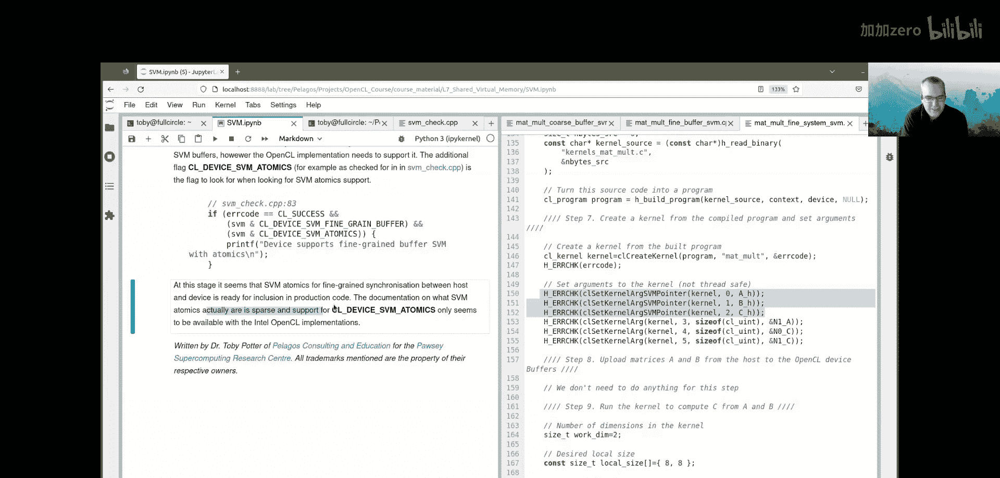
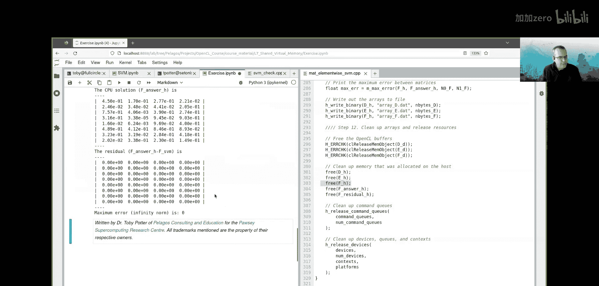

# 010：共享虚拟内存 (SVM) 🧠


在本节课中，我们将要学习OpenCL中的共享虚拟内存。这是一种可以模糊甚至消除主机内存与设备全局内存之间界限的技术，有助于减少或避免在主机和设备之间显式复制数据的需要。


## 概述

在之前的课程中，我们了解到主机内存和设备内存通常是分离的，数据需要通过缓冲区进行显式传输。共享虚拟内存旨在打破这种隔离，允许主机和设备线程访问同一块内存区域，从而简化编程并可能提升性能。

上一节我们介绍了OpenCL的基本内存模型，本节中我们来看看如何通过共享虚拟内存来优化内存访问。

## 什么是共享虚拟内存？

共享虚拟内存是OpenCL 2.0及以上版本引入的一种特性。它允许主机内存和设备全局内存共享同一个虚拟地址空间。这意味着，在支持SVM的系统上，主机指针和设备指针可以指向相同的物理内存。

主要优势包括：
*   避免显式的数据拷贝。
*   简化某些算法的编程模型。
*   在集成GPU或APU（如AMD MI300）等架构上可能带来显著的性能收益。

OpenCL定义了三种主要的SVM类型，支持级别依次提高。

## SVM的类型与支持检查

在深入使用SVM之前，我们需要了解设备支持哪种类型的SVM。可以使用 `clGetDeviceInfo` 函数并传入 `CL_DEVICE_SVM_CAPABILITIES` 参数来查询。

以下是检查设备SVM能力的核心代码逻辑：

```cpp
cl_device_svm_capabilities svm_caps;
cl_int err = clGetDeviceInfo(device, CL_DEVICE_SVM_CAPABILITIES,
                             sizeof(svm_caps), &svm_caps, NULL);

// 检查是否支持粗粒度缓冲区SVM
if (svm_caps & CL_DEVICE_SVM_COARSE_GRAIN_BUFFER) {
    // 设备支持粗粒度缓冲区SVM
}
// 检查是否支持细粒度缓冲区SVM
if (svm_caps & CL_DEVICE_SVM_FINE_GRAIN_BUFFER) {
    // 设备支持细粒度缓冲区SVM
}
// 检查是否支持细粒度系统SVM
if (svm_caps & CL_DEVICE_SVM_FINE_GRAIN_SYSTEM) {
    // 设备支持细粒度系统SVM
}
```

如果查询返回 `CL_INVALID_VALUE`，则表示设备不支持任何SVM。

了解如何检查SVM支持后，我们接下来详细探讨第一种类型：粗粒度缓冲区SVM。

## 粗粒度缓冲区SVM

粗粒度缓冲区SVM是OpenCL 2.0标准要求必须支持的最基本SVM类型。它的使用方式与传统OpenCL缓冲区类似，但仍需要一些显式的同步操作。

主要特点：
*   使用 `clSVMAlloc` 分配内存，使用 `clSVMFree` 释放内存。
*   分配的内存可以作为OpenCL缓冲区的后备存储。
*   主机在访问该内存前，**必须**使用 `clEnqueueSVMMap` 和 `clEnqueueSVMUnmap` 进行显式的映射和解映射操作，以确保内存一致性。

在矩阵乘法的例子中，我们可以这样使用粗粒度SVM：

1.  **分配SVM内存**：`clSVMAlloc` 分配内存作为矩阵A的后备存储。
2.  **创建OpenCL缓冲区**：使用 `CL_MEM_USE_HOST_PTR` 标志，将上一步的SVM内存包装成一个OpenCL缓冲区。
3.  **设置内核参数**：对于直接使用的SVM指针（如矩阵C），必须使用 `clSetKernelArgSVMPointer` 而非普通的 `clSetKernelArg`。
4.  **同步访问**：内核执行后，主机在读取SVM内存（矩阵C）前，必须先调用 `clEnqueueSVMMap`，读取后再调用 `clEnqueueSVMUnmap`。

核心代码示例：
```cpp
// 1. 分配SVM内存
void* svm_ptr_A = clSVMAlloc(context, CL_MEM_READ_WRITE, size_A, 0);
// 2. 创建包装SVM内存的缓冲区
cl_mem buffer_A = clCreateBuffer(context, CL_MEM_READ_WRITE | CL_MEM_USE_HOST_PTR,
                                 size_A, svm_ptr_A, &err);
// 3. 为直接使用的SVM指针设置内核参数
clSetKernelArgSVMPointer(kernel, 2, svm_ptr_C); // 假设参数2是矩阵C
// ... 运行内核 ...
// 4. 映射SVM内存以供主机访问
clEnqueueSVMMap(queue, CL_TRUE, CL_MAP_READ, svm_ptr_C, size_C, 0, NULL, NULL);
// ... 主机读取 svm_ptr_C ...
// 5. 解映射
clEnqueueSVMUnmap(queue, svm_ptr_C, 0, NULL, NULL);
```

粗粒度SVM虽然仍需映射操作，但已简化了内存分配和内核参数传递。接下来，我们看看功能更强的细粒度缓冲区SVM。

## 细粒度缓冲区SVM

细粒度缓冲区SVM在粗粒度的基础上更进一步，**移除了显式映射和解映射内存的要求**，使得SVM的使用更加直观。

主要特点：
*   同样使用 `clSVMAlloc` 分配内存，但在分配时需要添加 `CL_MEM_SVM_FINE_GRAIN_BUFFER` 标志。
*   主机和设备可以同时访问不同的内存字节。
*   同步通过等待内核完成（例如 `clFinish`）来保证。内核执行完毕后，主机即可安全访问SVM内存。

以下是使用细粒度缓冲区SVM的关键步骤：

1.  **检查并分配内存**：确认设备支持后，使用特定标志分配SVM内存。
2.  **设置内核参数**：同样使用 `clSetKernelArgSVMPointer`。
3.  **运行与同步**：运行内核后，只需等待命令队列完成，主机便可直接访问SVM内存，无需映射。

核心代码示例：
```cpp
// 分配细粒度缓冲区SVM内存
void* svm_ptr_C = clSVMAlloc(context,
                             CL_MEM_READ_WRITE | CL_MEM_SVM_FINE_GRAIN_BUFFER,
                             size_C, 0);
// 设置内核参数
clSetKernelArgSVMPointer(kernel, 2, svm_ptr_C);
// ... 运行内核 ...
clFinish(queue); // 等待内核完成，确保内存一致性
// 主机现在可以直接安全地读取或写入 svm_ptr_C
float* host_ptr = (float*)svm_ptr_C;
```

细粒度缓冲区SVM大大简化了编程。最后，我们介绍目前支持最广泛但功能最强大的类型：细粒度系统SVM。

## 细粒度系统SVM

细粒度系统SVM是SVM的“终极形态”，它允许使用标准的系统内存分配函数（如 `malloc` 或 `aligned_alloc`）来分配内存，并直接用于OpenCL内核。

主要特点：
*   **无需** `clSVMAlloc`：直接使用 `malloc`, `aligned_alloc` 等分配主机内存。
*   **无需**创建OpenCL缓冲区包装。
*   **无需**映射/解映射操作。
*   目前支持有限（主要见于Intel的OpenCL实现）。

使用方式极为简洁：
```cpp
// 使用标准库函数分配对齐内存
float* host_ptr_C = (float*)aligned_alloc(alignment, size_C);
// 直接将该主机指针设置为SVM内核参数
clSetKernelArgSVMPointer(kernel, 2, host_ptr_C);
// ... 运行内核并同步 ...
clFinish(queue);
// 主机可直接使用 host_ptr_C
```

需要注意的是，即使使用系统分配的内存，设置内核参数时仍须使用 `clSetKernelArgSVMPointer` 来告知OpenCL这是一个SVM指针。

## 原子操作与同步进阶

当主机和设备需要**并发读写SVM内存中的相同字节**时，就需要更精细的同步机制，即SVM原子操作。设备需要通过 `CL_DEVICE_SVM_ATOMICS` 能力位来报告支持情况。

然而：
*   目前对此的支持非常有限（主要是Intel实现）。
*   OpenCL规范中相关的同步原语和内存模型非常复杂。
*   在实际编程中，**建议避免这种并发读写同一字节的场景**。更安全的做法是：安排主机和设备访问不同的数据区域，或者通过 `clFinish` 等同步点确保串行访问。

因此，对于初学者和大多数应用，应优先考虑使用细粒度缓冲区SVM，并通过等待内核完成来进行同步，这是最安全、最清晰的做法。

## 练习：实现细粒度缓冲区SVM

为了巩固理解，我们提供一个练习。任务是将一个现有的逐元素矩阵乘法代码，修改为使用细粒度缓冲区SVM来存储结果矩阵F。

以下是需要完成的主要步骤列表：



*   **步骤1**：删除原有为 `F_D` 创建OpenCL缓冲区和为 `F_H` 分配主机内存的代码。
*   **步骤2**：使用 `clSVMAlloc` 并添加 `CL_MEM_SVM_FINE_GRAIN_BUFFER` 标志，分配一个名为 `F_SVM` 的SVM内存区域。
*   **步骤3**：在代码中，将所有对 `F_H` 的引用替换为对 `F_SVM` 的引用。
*   **步骤4**：使用 `clSetKernelArgSVMPointer` 将 `F_SVM` 设置为内核参数。
*   **步骤5**：内核执行并同步后，直接使用 `F_SVM` 中的数据。
*   **步骤6**：在程序最后，使用 `clSVMFree` 释放 `F_SVM` 内存。


完成修改后，程序应能正确运行并计算出相同的结果，同时内部使用了更高效的细粒度缓冲区SVM机制。

## 总结

本节课中我们一起学习了OpenCL共享虚拟内存的核心概念。我们从最基本的粗粒度缓冲区SVM开始，了解了其分配和必须的映射操作。接着，我们探讨了更便利的细粒度缓冲区SVM，它免除了映射要求，仅需内核同步。最后，我们介绍了理想的细粒度系统SVM，它允许直接使用系统内存，尽管目前支持尚不广泛。



关键要点在于，SVM通过统一主机与设备的内存视图，可以简化编程并可能提升性能。对于当前大多数支持OpenCL 2.0的平台，**细粒度缓冲区SVM是实现这一目标的推荐起点**。请记住，始终通过 `clGetDeviceInfo` 查询设备的具体支持能力，并选择最适合你应用场景的SVM类型。