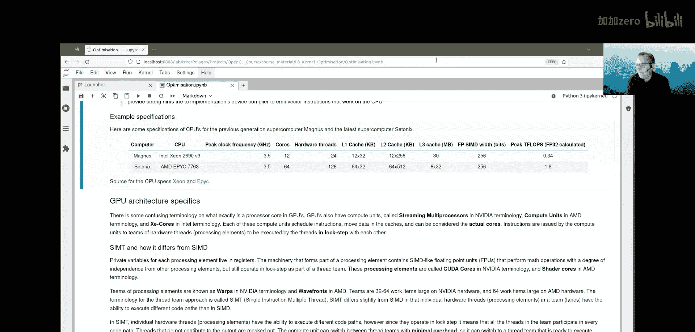
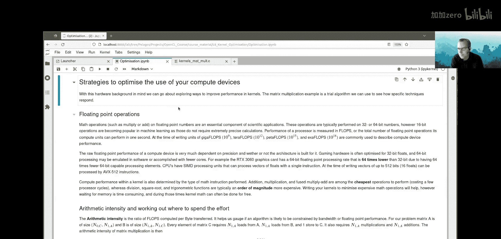

# 011：优化OpenCL内核（第一部分）

在本节课中，我们将学习如何优化OpenCL内核的性能。这是一个复杂的多维度优化问题，不仅涉及计算单元的高效利用，还涉及内存进出计算单元的及时性和速度。

## 处理器架构基础

上一节我们介绍了优化OpenCL内核的复杂性。本节中，我们来看看理解优化所需的基础知识：处理器架构。

一个处理器被划分为多个计算单元。每个计算单元提供一定数量的硬件线程来运行软件。在OpenCL中，一个内核运行在一个硬件线程上。该硬件线程中的硬件执行OpenCL内核的指令。

计算单元有一个时钟周期，每个周期可以执行有限数量的指令。这些指令由硬件线程运行。在计算过程中，诸如数学命令之类的指令由硬件线程内的机制执行。这个机制处理从缓存层次结构传入和传出核心的内存。如果内存没有按时到达或没有及时处理，硬件线程就会停滞，性能可能受到影响。

## 缓存层次结构

处理器（CPU或GPU）中最快的内存存储是寄存器。它们以几乎与核心相同的时钟速度运行，并且位于处理器芯片上，靠近执行指令的硬件。然而，这种内存并不便宜，计算所需的内存通过以下大小和位置的缓存层次结构在处理器之间来回传输。

以下是缓存层次结构，从快到慢排列：
*   **寄存器**：最快的存储器，位于计算设备上，非常靠近执行指令的硬件。内存可以在一个时钟周期内从寄存器读取或写入。
*   **L1缓存**：位于计算单元上，计算单元中的每个硬件线程都可以访问。
*   **L2缓存**：仍然在芯片上，是快速的内存。
*   **L3缓存**：快速内存，位于设备附近或计算芯片上（例如，AMD EPYC CPU的每个芯片组有一个L3缓存）。
*   **全局或设备内存**：最慢的内存。对于GPU（如MI 250），这是高带宽内存；对于主机，这是普通的DDR内存。

当从RAM或全局设备内存获取内存时，它被带入L1缓存。如果需要再次使用该内存，可以直接从缓存读取，而无需访问全局或设备内存。不经常使用的内存（例如在L1缓存中）会被逐出到L2和L3缓存。如果L3缓存需要释放空间且内存不再使用，则该内存将被逐出到主内存（主机上的主内存或计算设备上的全局内存）。

缓存层次结构的存在是为了在无法将所有内存都放在快速寄存器中的情况下，仍能获得快速内存访问的好处，同时控制成本。

## 缓存行

缓存行是内存事务的基本单位。从缓存传入处理器的内存不是以单个字节为单位到达，而是以称为缓存行的事务单元到达。缓存行通常约为64或128字节。

可以将缓存行想象成一根木头。当需要访问该木头中的某样东西时，整根木头被运送到缓存中。这意味着如果处理器需要从内存获取或存储单个值，缓存层次结构必须传输整个缓存行。64字节相当于16个浮点数。

在高性能计算中获得良好性能的关键是确保在访问内存时访问相邻的元素。重用缓存行中的内存访问至关重要。如果访问了缓存行中的第一个元素，随后访问缓存行中的第二个元素不会造成速度损失，因为缓存行已经被载入。

因此，性能严重依赖于重用缓存行中元素的能力。尽可能多地重用这些缓存行中的内存是获得良好性能的基本思想。尝试通过随后获取和存储内存访问紧邻区域的内存，来尽可能多地使用缓存行中的相邻元素。

然而，如果内存访问是随机的，性能就会很差，因为缓存层次结构必须不断从主内存中检索这些“木头”（缓存行），而你只获取了单个元素。

在OpenCL的上下文中，如果一个工作项或工作组中的工作项访问相邻的内存位置，那么内存传输可以在工作项之间共享，这被称为**合并内存访问**。这是一个在优化OpenCL（以及HIP或CUDA）内核时应努力实现的好目标。

## 延迟与吞吐量

延迟是处理元素或硬件线程等待内存从缓存到达所需的周期数。

以下是一些指示性的（非精确的）数字，说明了CPU和GPU需要等待内存的时间：
*   **寄存器**：CPU硬件线程可以在大约1个时钟周期内从寄存器获得内存，非常快。而GPU可能需要20个时钟周期。
*   **L1缓存**：CPU可能等待大约4个时钟周期，GPU可能是30到100个时钟周期。
*   **L2缓存**：CPU可能等待大约10个时钟周期，GPU可能是170到300个时钟周期。
*   **设备内存**（主机内存或设备内存）：CPU可能等待100个时钟周期或更多，GPU可能高达800个时钟周期。

这些数字随着新架构的出现而不断变化，但可以说，GPU等待内存的时钟周期比CPU多。GPU的构建方式决定了它们拥有高带宽，一旦内存开始到达，可以传输大量数据，但等待时间更长。

因此，我们可以得出结论，CPU比GPU更灵活，因为它们等待内存的时间更短。

GPU供应商通过拥有深度执行流水线来解决这个延迟问题。在GPU中，硬件线程以团队形式参与，可以同时有许多硬件线程团队处于活动状态。这对于性能是有利的，因为如果任何硬件线程团队在等待内存时停滞，GPU计算单元可以切换到另一个线程团队。因此，对于GPU来说，拥有尽可能多的团队准备接管是理想的。

活动团队数量与计算单元支持的最大可能活动团队数量之比称为**占用率**。对于GPU，期望内核实现高占用率。

吞吐量是衡量内存一旦开始到达，从缓存传输到处理元素的速度的指标。

以下是大致的吞吐量期望（这些数字也会随时间变化）：
*   **L1缓存和寄存器**：CPU和GPU都可以达到每秒TB级别。
*   **L2缓存**：CPU和GPU的传输速率相似。
*   **L3缓存**：GPU通常没有L3缓存；CPU的L3缓存可能略低于每秒TB。
*   **设备内存**：对于CPU，根据通道数量，可能达到每秒100GB左右。对于GPU，设备内存的传输速率可以从每秒数百GB到超过每秒TB。例如，MI 250 GPU上的高带宽内存，每个GPU设备的吞吐量为1.6 TB/秒。

从这一点我们可以了解到，GPU从设备内存的吞吐量比CPU从主机内存的吞吐量快得多。如果你能快速获取大量内存，这有助于提高性能。GPU通过拥有许多独立的内存芯片来实现这种高速内存访问，访问从这些内存芯片库并行发生。

## CPU架构细节

现在让我们看看一些CPU架构的具体细节。

CPU通常拥有少于100个计算单元（核心）。每个计算单元具有复杂的指令处理能力和诸如预取内存和分支预测等优良特性。我们可以将CPU计算单元视为聪明的工人。

缓存延迟时间表明CPU比GPU更灵活。GPU的硬件线程可以被比作高中生，他们知道一些东西，但不如博士生知道得多。然而，GPU有更多的硬件线程，因此大量高中生可以比一小群博士生更快地完成相同的工作。

CPU中的计算单元各自提供一定数量的硬件线程，这些线程可以彼此独立地执行指令。在OpenCL技术中，每个硬件线程被称为一个处理元素。

CPU具有寄存器以及片上L1、L2和L3缓存。在OpenCL中，我们可能能够使用`clCreateSubDevices`将CPU分区为子设备。

CPU核心内部有寄存器以及L1和L2缓存。在CPU核心内，可以有硬件线程。硬件线程内部有所谓的SIMD单元。这些SIMD单元可以用一条指令操作一个浮点元素向量。这是SIMD（单指令多数据）。这些浮点单元是作为硬件线程一部分执行软件线程的硬件的一部分。在CPU处理元素或硬件线程内部，也可以有执行整数操作的机制。

CPU拥有许多核心，例如AMD EPYC CPU有64个核心，每个核心提供两个硬件线程。这些硬件线程可以独立于其他硬件线程执行软件。它们可能可以访问共享的L3缓存。

CPU中的SIMD单元一次可以处理大约8到16个浮点数。在CPU上获得良好性能严重依赖于是否能有效使用CPU的SIMD单元。在OpenCL内核中使用向量是向实现设备的编译器提供强烈提示以使用在这些SIMD单元上工作的向量指令的一种方式。

例如，Setonix上的CPU核心可以使用SIMD单元一次处理多达8个浮点数。以下是一些关于Setonix CPU速度和缓存大小的数据：基准时钟频率为3.5 GHz，使用64个核心，L1缓存大小为32 KB，L2缓存大小为512 KB，L3缓存在八个核心的芯片组之间共享，每个L3缓存大小为32 MB。SIMD宽度（即一条指令可以处理的位数）为256位宽，即8个浮点数。使用SIMD单元可以达到1.8 Teraflops的峰值处理速度。

在Setonix上有64个可用的核心，这可以很好地映射到OpenCL网格中的工作。每个核心可以映射到OpenCL网格的一部分。因此，Setonix上的CPU作为OpenCL代码的计算设备可以运行得相当好。

## GPU架构细节

接下来，我们讨论GPU架构的具体细节。

GPU中关于处理器核心的确切术语有些混淆。GPU也有计算单元，但在NVIDIA术语中称为流多处理器，在AMD术语中称为计算单元，在Intel术语中称为Xe核心。

这些计算单元调度指令，在缓存中移动数据，可以被视为实际的核心。计算单元向硬件线程团队发出指令。在GPU中，计算单元向硬件线程或处理元素团队发出指令，该团队的成员同步执行这些指令。

在GPU中，指令由计算单元向硬件线程团队发出，这些指令由线程同步执行。这意味着计算单元是管弦乐队的指挥，每个硬件线程就像是乐队中的乐器。所有硬件线程运行指挥发出的指令，但每个硬件线程在执行该指令时有一定的自由度。

处理元素团队在NVIDIA术语中称为warps，在AMD术语中称为wavefronts。在NVIDIA硬件上，团队宽度为32到64个工作项，在AMD硬件上为64个工作项。这种线程团队方法称为SIMT（单指令多线程）。

SIMT与SIMD略有不同，因为团队中的单个硬件线程（在NVIDIA和AMD术语中称为lanes）有能力执行不同的代码路径。然而，由于团队同步操作，这意味着团队中的所有线程都必须参与每个代码路径。如果某些硬件线程执行不同的代码路径，那么整个团队都必须跟随。这可能会对性能产生非常坏的影响。

跟随但不打算做任何事情的线程团队的结果会被屏蔽掉。

在SIMT中，计算单元可以在线程团队之间以最小的开销切换。因此，一个计算单元可以同时拥有多个线程团队处于活动状态。如果一个线程团队在等待内存时卡住，它可以以最小的开销切换到另一个线程团队。

在SIMD中，单个向量指令必须应用于向量的所有元素，并且不可能有路径分歧。SIMT允许有限程度的分歧，但会带来相关的性能损失。

不同的GPU架构（NVIDIA、AMD、Intel）有其特定的计算单元和线程团队组织方式。例如，在NVIDIA架构中，一个流多处理器（计算单元）向一个包含32个CUDA核心的团队发出指令。在AMD架构中，一个计算单元向一个包含64个着色器核心的团队发出指令。在Intel GPU中，有向量引擎，每个引擎负责一组SIMD单元，使用向量对于在Intel GPU上获得良好的OpenCL性能非常重要。

由于指令在硬件线程团队上同步执行，因此对于GPU，工作组中工作项的有效数量自然是团队大小的倍数。你可以使用`clinfo`或查询内核首选工作组大小倍数属性来获取首选的工作组大小。

一个工作组内可以有多个线程团队。实际上，拥有一个大的工作组是有好处的，因为可以在该工作组中拥有多个线程团队，而拥有多个线程团队有利于提高占用率。

## 占用率

GPU供应商通过拥有深度执行流水线来克服内存延迟的缺点。这意味着多个线程团队（warps或wavefronts）可以同时处于活动状态（即在计算单元上执行指令的过程）。

一个工作组可以包含多个线程团队，计算单元可以以最小的开销在工作组中的线程团队之间切换焦点。这是为了在获取内存时隐藏延迟。自然地，你会希望尽可能多的线程团队处于活动状态。

占用率是用来描述活动线程团队数量与可能活动线程团队数量之比的术语。高占用率（即尽可能多的活动线程团队）通常对性能有好处，但有许多限制会影响占用率。

以下是可能限制占用率的一些因素：
*   每个计算单元的工作组数量限制。
*   每个计算单元的线程团队数量限制。
*   每个工作组的工作项数量限制。
*   每个计算单元的工作项数量限制。
*   每个计算单元的寄存器数量限制。
*   每个工作组的寄存器数量限制。
*   每个计算单元的共享内存限制。
*   每个工作组的共享内存限制。

如果使用太多寄存器或私有变量，或者分配太多共享内存（本地内存），可能会耗尽计算单元上所有可用的资源，从而限制占用率。如果工作组中的工作项数量太少，则会受到每个计算单元工作组数量的限制；如果太多，则会遇到每个工作组工作项数量的限制，内核可能无法运行。

你可以使用`clGetDeviceInfo`函数查询这些限制。当使用`clinfo`报告设备信息时，我们查询了其中一些限制。

如果工作项使用太多寄存器或工作组使用太多共享内存，可能会通过限制计算设备上可能的活动工作组数量来降低性能。使用太多内存时，还可能溢出到全局内存，代价是更大的延迟，这并不理想。

但有时，占用率仅仅因为未调度足够的并行工作来保持足够数量的工作项忙碌而受到限制。这可能是不可避免的，例如，如果你的算法一次只能处理矩阵的一整行，而矩阵的行数不多，那么仅仅因为没有调度足够的工作就会限制占用率。

以下是一些最大化占用率的技巧：
*   调度工作组，使其工作项数量是线程团队大小的倍数。
*   保持私有变量数量较少，即尽可能降低寄存器使用量。
*   保持共享内存使用量较低。
*   尽可能保持跨工作组的工作负载一致。
*   如果可能，调度足够的工作，使GPU中的每个计算单元都能达到完全占用。

## 指令分支

在GPU内核中，线程团队中的工作项彼此同步执行指令。因此需要小心避免构建单个工作项执行不同代码路径的内核，因为整个团队必须访问每个代码路径。

例如，如果内核代码中有一部分工作是为所有偶数ID的工作项调度的，另一部分工作是为奇数ID的工作项调度的，那么由于SIMT的工作方式，整个团队必须经历第一个代码路径，然后整个团队必须经历第二个代码路径。只是偶数工作项不会参与第二个路径的结果，奇数工作项不会参与第一个路径的结果。

因此，GPU中的指令分支不是一个好主意。然而，在内核中看到保护语句（如if语句）是可以的，因为另一个分支几乎没有工作（或为空）。但如果if语句的任何一侧有大量工作，那么将对性能产生不利影响，因为线程团队中的每个项目都必须参与每个代码分支。

因此，路径分歧或线程分歧对GPU上的性能不利。在CPU架构上，这不是问题，因为每个硬件线程都独立于其他硬件线程，它们不同步工作。

## 总结

本节课中，我们一起学习了优化OpenCL内核性能的基础知识。我们探讨了处理器架构、缓存层次结构、缓存行、延迟与吞吐量的概念，以及CPU和GPU架构的具体细节。我们还讨论了占用率的重要性以及如何最大化它，并指出了在GPU内核中避免指令分支的必要性。理解这些概念是进行有效内核优化的第一步。在接下来的课程中，我们将应用这些知识，尝试使用矩阵乘法示例来优化我们的OpenCL内核。