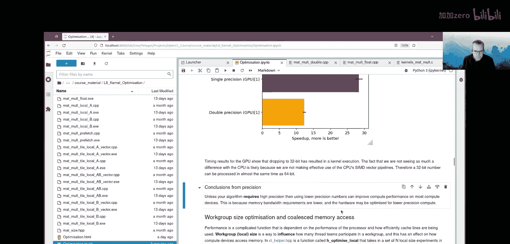
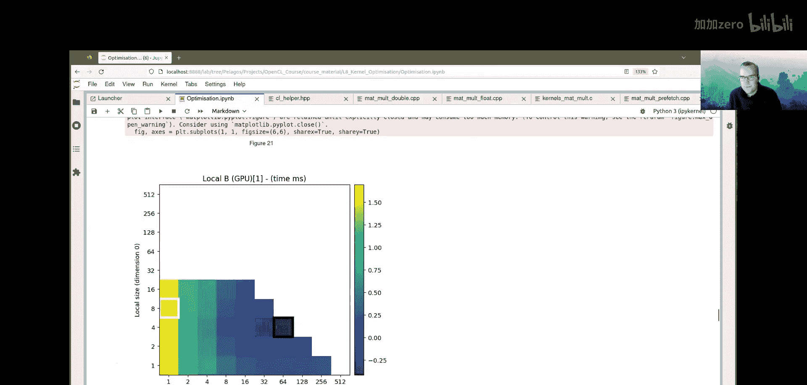
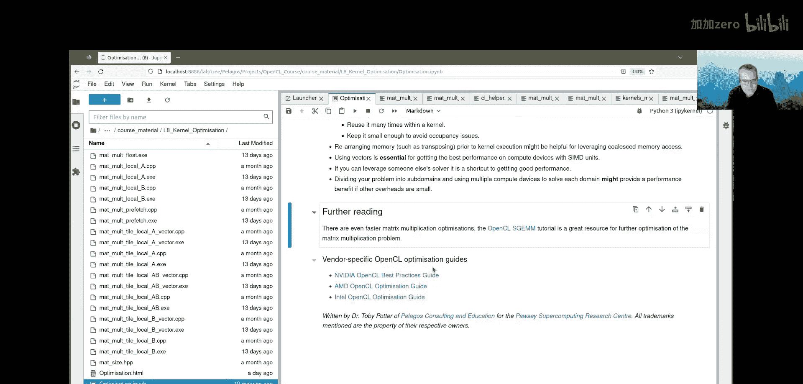

# 012：优化OpenCL内核（第二部分）📈

## 概述
在本节课中，我们将学习如何优化OpenCL内核，以充分利用计算设备的性能。我们将探讨浮点运算、算术强度、工作组大小优化、内存访问模式以及使用向量和本地内存等策略。通过矩阵乘法作为案例，我们将分析不同优化技术对CPU和GPU性能的影响。

---

## 浮点运算与性能指标 🧮

上一节我们介绍了缓存层次结构的使用，本节中我们来看看浮点运算。

数学运算，如浮点数的乘法或加法，是科学应用的核心组成部分。这些运算通常在32位或64位数上进行。然而，16位浮点运算在机器学习中越来越流行，因为它们不需要极高的计算精度，并且硬件执行速度更快。

处理器的性能通常以**FLOPS**（每秒浮点运算次数）来衡量。以下是常见的性能单位：
*   **GigaFLOPS (GFLOPS)**: 每秒 10^9 次浮点运算。
*   **TeraFLOPS (TFLOPS)**: 每秒 10^12 次浮点运算。
*   **PetaFLOPS (PFLOPS)**: 每秒 10^15 次浮点运算。
*   **ExaFLOPS (EFLOPS)**: 每秒 10^18 次浮点运算。

计算设备的原始浮点性能很大程度上取决于精度以及架构是否为此优化。例如，游戏硬件（如RTX 3060）针对32位浮点数进行了优化。64位处理虽然可能，但通常通过软件模拟实现，甚至可能使用更少的核心。

内核中的计算性能也取决于所执行的数学指令类型。对于浮点数，加法、乘法和融合乘加（FMA）是成本最低的运算。相比之下，除法、平方根和三角函数（如正弦）等运算通常要昂贵一个数量级。因此，编写内核以最小化昂贵的数学运算将有所帮助。然而，等待内存是最耗时的操作，在等待内存期间，内核数学运算通常可以“免费”执行。

---

## 算术强度与性能瓶颈分析 ⚖️

现在我们来谈谈算术强度，并找出优化工作的重点。

**算术强度**是**每秒计算的浮点运算次数（FLOPS）**与**每秒传输的字节数（Bytes）**的比值。这个指标帮助我们判断一个算法是受**内存带宽**限制还是受**浮点运算性能**限制。

以矩阵乘法为例，矩阵A的大小为 `N0_C x N1_A`，矩阵B的大小为 `N1_A x N1_C`。计算矩阵C的每个元素 `C[i0][i1]` 时，需要：
*   从矩阵A加载 `N1_A` 次。
*   从矩阵B加载 `N1_A` 次。
*   向矩阵C存储1次。
*   执行 `N1_A` 次乘法和 `N1_A` 次加法。

因此，矩阵乘法的算术强度 `a` 可以近似为：
`a ≈ (2 * N1_A) / ((2 * N1_A + 1) * B)`
其中 `B` 是每个元素的字节数。当 `N1_A` 很大时，算术强度近似为 `1 / B`。对于单精度浮点数（4字节），`a ≈ 0.25`。

如果一个处理器的峰值浮点性能为 `FP` (FLOPS/秒)，而特定缓存的峰值带宽为 `BP` (字节/秒)，那么受内存带宽限制的浮点性能上限 `FB` 为：
`FB = a * BP` (FLOPS/秒)

实际可达到的浮点性能将是 `FP`（峰值浮点性能）和 `FB`（带宽限制性能）中较低的那个。令 `FP = FB`，我们可以解出算术强度的交叉点：
`a_crossover = FP / BP`

因此，性能的“屋顶线”模型是：
*   如果 `a < FP / BP`，性能受带宽限制，为 `a * BP`。
*   否则，性能受计算限制，为 `FP`。

**示例**：AMD MI250X GPU的峰值32位浮点性能 `FP = 47.9 TFLOPS`，峰值内存带宽 `BP = 3.2 TB/s`。其交叉点算术强度约为 `15`。我们的矩阵乘法算法算术强度约为 `0.25`，远小于15，因此可以肯定该算法受内存带宽限制。

对于数组操作，很大概率会受内存带宽限制。因此，优化内存传输是我们的首要任务。如果我们能通过某种方式重用内存，就可以在传输相同数据量的情况下执行更多计算，从而改变算术强度，这是获得良好性能的关键策略。

---

## 精度优化：从双精度到单精度 🔽

在科学计算中，64位数的精度和范围可能很重要。然而，计算硬件通常针对32位运算进行优化。如果算法允许，切换到更低精度可能会获得加速。

我们运行了一个基准测试，比较了64位（双精度）和32位（单精度）浮点数矩阵乘法的性能。测试在CPU和GPU上进行。

**结果分析**：
*   **CPU**：切换到单精度带来了约1.2到1.3倍的加速。
*   **GPU (MI250)**：切换到单精度带来了约28倍的加速（相对于双精度CPU结果）。

**结论**：
*   使用更低精度的数字可以提高大多数计算设备上的计算性能。
*   原因在于内存带宽需求降低（从64位到32位，数据传输量减半）。
*   此外，硬件可能针对低精度计算进行了优化。

需要注意的是，CPU上的加速不那么明显，可能是因为我们没有有效利用CPU的SIMD向量流水线。使用向量数据类型可以更好地利用这些单元。

---

## 工作组大小优化与合并内存访问 🧩

性能是一个复杂的、多维度的函数，取决于计算设备的性能以及缓存线使用和重用的效率。工作组大小（或本地大小）是影响参与工作组的线程团队数量的方式，进而影响计算设备访问内存的方式。

我们使用一个辅助函数 `h_optimise_local` 来遍历一系列可能的工作组大小配置，为每个配置运行内核多次，并收集平均运行时间和标准差，以找到最佳性能的工作组大小。

**分析单精度朴素矩阵乘法算法的性能图谱**：
*   **GPU**：性能图谱显示出一个明确的最小值点。最佳工作组大小为 `32 x 8`（总计256个工作项），这恰好是波前大小的倍数。最差性能（1x1）与最佳性能相差41.6倍，表明正确设置工作组大小对获得良好性能至关重要。
*   **CPU**：性能图谱更加分散和随机，没有明显的全局最小值。最佳工作组大小为 `32 x 4` 或 `4 x 32`，这些是CPU核心数的倍数。这种随机性反映了CPU工作项执行的独立性。

**内存访问模式分析**：
GPU上最佳工作组大小是沿维度0（对应矩阵的维度1）拉长的。这可以通过缓存线使用来解释：
1.  **访问矩阵A的行**：相邻的工作项（在同一行上）可以重用加载到缓存中的同一行数据块。
2.  **访问矩阵B的列**：这看起来不直观，但更高效的缓存使用实际上发生在访问矩阵B的列时。在工作组内，相邻的工作项负责计算矩阵C中相邻的列。这意味着它们需要访问矩阵B中相邻的列。当这些工作项同时遍历各自的列时，它们可以高效地重用从矩阵B加载的同一缓存线中的数据，实现了**合并内存访问**。

因此，GPU偏好拉长的工作组形状，因为它促进了矩阵B的合并内存访问，而矩阵B的访问模式原本看起来是低效的（大跨度访问）。

---

## 预取与常量内存 🚀

我们可以在OpenCL内核中使用 `prefetch` 指令预取即将使用的全局内存。在我们的矩阵乘法内核中，我们在开始沿矩阵A的行进行点积计算之前，预取了该行数据。

**基准测试结果**：
*   **CPU**：预取带来了一定的性能提升。
*   **GPU**：预取带来的性能提升不明显。这可能是因为对矩阵B的内存访问已经通过合并访问得到了很好的优化，因此优化矩阵A的访问收益有限。

**常量内存**存储在计算设备的快速缓存中，速度快但容量小（通常几十到几百KB）。它是存储滤波器系数等在算法运行期间不变的数据的好地方。

---

## 内存重排：转置操作 🔄

有时，在内核执行前重新排列内存可以带来性能收益。我们测试了在计算前转置矩阵A或矩阵B的效果。

**转置矩阵B**：
*   **CPU**：转置B带来了巨大的性能提升（约2.3倍加速）。CPU更喜欢连续的内存访问模式，转置B后，对B的访问变得连续（访问行），这非常适合CPU独立线程的工作方式。
*   **GPU**：转置B导致了性能下降。这是因为GPU原本依赖对矩阵B列的合并访问来获得高性能，转置后这种优化模式被破坏。

**转置矩阵A**：
*   **CPU**：转置A（导致访问A的列和B的列）对性能有负面影响。
*   **GPU**：转置A后，性能图谱显示对工作组大小没有特别偏好，只要工作组足够大即可。但总体性能仍低于朴素的单精度算法。

**结论**：CPU和GPU对最优内存访问模式有截然不同的偏好。GPU偏好朴素算法（利用对B的合并访问），而CPU偏好转置B后的算法。编写代码时可能需要为不同设备考虑不同的优化路径。

---

## 本地内存的使用 🏠

在GPU上，本地内存使用延迟远低于全局内存的本地缓存。AMD架构的本地内存带宽尤其出色。

我们实现了两种使用本地内存的算法：
1.  **Local A**：将工作组所需的矩阵A的整行缓存到本地内存。
2.  **Local B**：将工作组所需的矩阵B的整列缓存到本地内存。

**基准测试结果**：
*   **GPU**：使用本地内存可以带来显著的性能提升。缓存矩阵A的行（Local A）比缓存矩阵B的列（Local B）性能更好，因为对矩阵B的访问已经通过合并访问很高效，进一步优化矩阵A的访问收益更大。最佳性能实现了约51倍（相对于双精度CPU）的加速。
*   **CPU**：便携式OpenCL实现拒绝了分配大量本地内存的请求，因此无法运行。
*   **致命缺陷**：这些算法试图将整行或整列数据塞入本地内存，这只适用于小矩阵。对于大矩阵，本地内存容量不足，因此这些算法不具备通用性。

---

## 分块内存访问 🧱

为了解决本地内存容量限制，我们采用分块策略。我们不一次性加载整行或整列，而是将点积计算分成小块进行。每次计算一个小块时，只将矩阵A的一小块行和矩阵B的一小块列加载到本地内存中，计算完该块后，再加载下一块。

我们实现了三种分块内核：
1.  `matmul_tile_local_a`：缓存矩阵A的块。
2.  `matmul_tile_local_b`：缓存矩阵B的块。
3.  `matmul_tile_local_ab`：同时缓存矩阵A和B的块。

**基准测试结果**：
*   这种方法性能优于朴素算法，但不如之前缓存整行/整列的本地内存算法。性能差距部分源于分块算法中所需的同步屏障（`barrier`）带来的开销。
*   然而，分块算法是通用的，适用于任意大小的矩阵。
*   **CPU**：最佳性能来自 `tile_local_b`（缓存B的块）。
*   **GPU**：最佳性能来自 `tile_local_a`（缓存A的块）。

这再次印证了CPU和GPU不同的内存访问偏好。

---

## 使用向量数据类型 ⚡

对于支持向量指令的计算设备（如Intel和AMD的SIMD单元），使用向量数据类型可以提升性能。即使像NVIDIA这样不直接使用SIMD的架构，向量加载也可以分组优化，从而受益于缓存性能提升。

我们将分块内核修改为使用 `float8` 类型的向量（包含8个单精度浮点数）。在加载数据到共享内存和进行计算时，都使用向量操作（如 `vload8`）。

**基准测试结果**：
*   **CPU**：使用向量带来了惊人的性能飞跃！`tile_local_b_vector` 实现了约12-13倍的加速（相对于双精度CPU）。这是因为向量类型激活了CPU的SIMD单元。
*   **GPU**：使用向量也进一步提升了性能，`tile_local_a_vector` 实现了约71倍的加速。

至此，我们得到了针对不同架构的高性能通用算法：
*   **CPU最佳**：`tile_local_b_vector`
*   **GPU最佳**：`tile_local_a_vector`

---

## 使用现有优化库：CLBlast 📚

如果问题可以转化为线性代数运算，可以使用现有的优化库，如 **CLBlast**。它提供了高度优化的例程，例如 `SGEMM`（单精度通用矩阵乘法）。

使用优化库是获得高性能的捷径，无需经历漫长的优化过程。库函数通常由专家精心优化，能充分发挥硬件潜力。

**基准测试结果**：
*   **CPU**：未经调优的CLBlast默认设置性能不如我们手写的 `tile_local_b_vector`。
*   **GPU**：经过调优的CLBlast性能与我们手写的 `tile_local_a_vector` 处于同一水平。

**结论**：如果可能，应优先使用成熟的优化库，但可能需要对特定设备进行调优。

---

## 多设备计算 🖥️🖥️

对于可并行化的问题，可以将工作分配到多个可用的计算设备上。对于矩阵乘法，我们可以将输出矩阵C划分为多个子域，每个设备负责一个子域的计算。

我们实现了一个使用OpenMP动态调度在多个设备上运行CLBlast的算法 (`matmul_clblast_md`)。

**基准测试结果**：
*   在测试的矩阵规模下，使用8个GPU并未获得比单GPU更好的性能，甚至结果波动较大。
*   推测原因是矩阵规模不够大，多设备并行带来的收益被OpenMP调度等开销所抵消。对于真正巨大的矩阵，多设备算法可能会显现优势。

---

## 性能总结与关键要点 📊

我们对所有测试算法进行了总结，按加速比升序排列。结果清楚地显示了不同算法的有效性，并且最优算法因硬件架构（CPU/GPU品牌型号）和OpenCL实现而异。

**关键学习要点**：
1.  **缓存线**是处理器内存事务的基本单位。充分利用缓存线内容是获得高性能的关键。
2.  **GPU**拥有比CPU更高的内存带宽，但延迟也更大。它们通过锁步执行的线程团队和深度流水线来隐藏延迟。
3.  **工作组大小**：应设置为硬件线程团队大小的倍数，并尽可能大（在限制范围内），以最大化占用率。
4.  **占用率**是计算单元上活动线程数与可能的活动线程数之比。为了最大化占用率，应减少内核中使用的变量数量，保持本地内存分配较小。
5.  **算术强度**（FLOPS/字节）决定了算法受限于带宽还是计算能力。低算术强度意味着受内存带宽限制。
6.  **精度**：降低精度（如使用32位或16位浮点数）可以加速计算，特别是在游戏硬件上。
7.  **性能是工作组大小的非线性函数**，需要调优找到最佳值。
8.  **预取**和**常量内存**在某些情况下有帮助。
9.  **本地内存**：如果能够并行填充、多次重用且保持较小规模，可以显著提升性能。
10. **内存重排**（如转置）可能有助于实现合并内存访问。
11. **向量化**对于具有SIMD单元的设备至关重要，是获得最佳性能的必要手段。
12. **使用现有优化库**是获得高性能的捷径。
13. **多设备计算**在问题规模足够大、能掩盖开销时可能带来收益。

**进一步阅读**：
*   OpenCL SGEMM 教程
*   NVIDIA OpenCL 最佳实践指南
*   AMD OpenCL 优化指南
*   Intel OpenCL 优化指南

---

## 总结
本节课中，我们一起深入探讨了优化OpenCL内核的多种策略。我们从浮点运算和算术强度的基本概念出发，逐步分析了精度优化、工作组大小调优、内存访问模式（合并访问、预取、转置）、本地内存使用、分块算法、向量化以及利用现有库和多设备计算等技术。通过矩阵乘法的具体案例，我们看到了不同优化技术对CPU和GPU性能产生的不同影响，并总结了获得高性能OpenCL代码的关键原则和实用建议。记住，优化是一个迭代和实验的过程，需要针对特定的硬件和应用进行细致的调优。