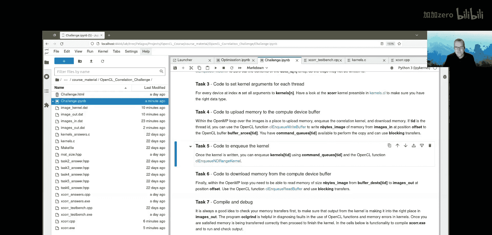

# 013：第3天，第4部分 - 优化OpenCL内核练习


在本节课中，我们将学习并完成一个关于图像边缘检测的OpenCL内核优化练习。我们将通过实现一个图像互相关（cross-correlation）算法来应用一个边缘检测滤波器，并学习如何将计算任务分配到多个OpenCL计算设备上。

## 概述

图像互相关是卷积神经网络和计算机视觉中的基础操作。在本练习中，我们将为一个图像栈（即一系列图像）实现一个3x3的边缘检测滤波器。由于纯Python解决方案速度较慢，我们的目标是利用OpenCL来加速这一过程。我们将从分析算法的计算强度开始，然后逐步完成一个包含内核编写、内存管理、任务调度和结果验证的完整OpenCL程序。

## 任务零：计算算术强度

在开始编码之前，我们需要分析算法的计算特性。对于每个输出像素，该算法需要执行以下操作：
*   **访存**：从滤波器读取9个值，从图像读取9个值，共计18次读取。写入1个结果值，共计1次存储。
*   **计算**：执行9次乘法和9次加法，共计18次浮点运算（FLOPs）。

假设每个像素值使用4字节（单精度浮点数）存储，我们可以计算算法的算术强度（Arithmetic Intensity），即每字节数据能执行多少次浮点运算。

**公式**：
`算术强度 = 总浮点运算次数 / 总数据移动字节数`
`= 18 FLOPs / ((18次读取 + 1次存储) * 4 字节/次)`
`= 18 FLOPs / 76 字节 ≈ 0.24 FLOPs/Byte`

这个值相对较低，表明该算法很可能受限于内存带宽，而非计算能力。这意味着优化内存访问模式将是提升性能的关键。

## 任务准备：理解问题与数据

上一节我们分析了算法的理论性能瓶颈。本节中，我们来看看具体的输入数据和期望的输出。

我们使用一张在珀朗加普斯国家公园拍摄的图像来生成测试用的图像栈。通过在这张大图像上滑动一个窗口，我们生成了包含100张灰度图像的栈。这些图像数据被保存为一个二进制文件 `images_in.dat`，作为我们程序的输入。

我们的目标是应用一个特定的3x3边缘检测滤波器。滤波器的矩阵表示如下：

**代码/公式**：
```
Kernel = [[-1, -1, -1],
          [-1,  8, -1],
          [-1, -1, -1]]
```

应用滤波器的过程是互相关操作：将滤波器像窗口一样滑过图像的每个有效位置，在每一步进行逐元素乘法和求和，结果写入输出图像的对应位置。由于滤波器尺寸，输出图像的每个维度会比输入图像小2个像素（即存在边界填充）。一个已有的Python解决方案（使用SciPy或NumPy）为我们提供了用于验证的基准输出（`proof_images`）。

## 程序框架与任务分解

我们的同事已经提供了一个使用OpenMP线程池来遍历图像栈的程序框架（`xcorr.cpp`）。每个OpenMP线程负责处理一张图像。我们的工作是将每张图像的处理任务“外包”给一个OpenCL计算设备（例如GPU）。

以下是需要完成的主要任务，我们将逐一进行：

**任务一：完成互相关内核**
这是最具挑战性的部分。我们需要在 `kernels.cl` 文件中完成名为 `xcorr` 的内核函数。该内核需要根据全局ID、图像尺寸和填充信息，计算每个输出像素的值，并确保内存访问不越界。一个测试程序 `xcorr_test_bench` 可以帮助我们验证内核的正确性。

**任务二：为每个线程/设备创建OpenCL缓冲区**
我们需要为每个OpenCL计算设备创建输入和输出缓冲区（`sourceD` 和 `currentD` 数组）。这涉及到调用 `clCreateBuffer` 函数。

**任务三：为每个线程设置内核参数**
对于每个设备，我们需要为其内核实例设置正确的参数，包括指向输入/输出缓冲区的指针、图像尺寸和填充值等。

**任务四：上传数据到设备**
在每次计算开始前，我们需要将当前待处理的图像数据从主机内存复制到对应设备的输入缓冲区。

**任务五：执行内核**
将内核执行命令提交到每个设备的命令队列，以启动计算。

**任务六：从设备下载数据**
计算完成后，我们需要将结果从设备的输出缓冲区复制回主机内存。

**任务七：编译与调试**
编译整个项目并运行，使用提供的Python脚本来验证输出图像是否与基准 `proof_images` 一致。

每个任务在 `xcorr.cpp` 文件中都有明确的标记和提示。如果遇到困难，可以通过取消注释特定的 `#include` 行来引入该任务的参考答案。完整的解决方案可以参考 `xcorr_ans.cpp` 文件。

## 总结

本节课我们一起学习并剖析了一个完整的OpenCL优化练习。我们从计算强度分析入手，理解了图像互相关算法的内存访问特性。接着，我们明确了练习的目标：在一个已有的多线程框架中，集成OpenCL代码来加速边缘检测滤波器的应用。

我们详细分解了需要完成的七个任务，从最核心的内核编写，到内存缓冲区的创建与管理，再到数据的传输与内核的执行。这个练习采用了“自主选择”的模式，你可以根据自身兴趣和能力，选择完成全部或部分任务，并尝试应用课程中学到的各种优化和调试技巧。



成功完成练习的标志是，你的OpenCL程序输出的图像栈与Python基准解决方案输出的 `proof_images` 完全一致。祝你编码顺利！