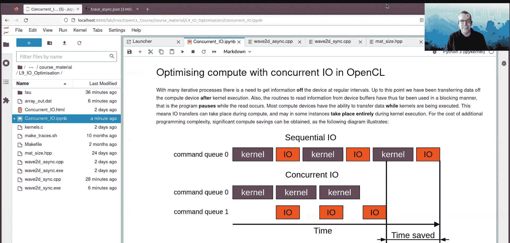

# 014：利用OpenCL优化计算与并发I/O


在本章中，我们将学习如何利用OpenCL的异步特性，通过并发I/O操作来优化计算密集型任务的性能。核心思想是让数据传输（I/O）与内核计算同时进行，从而减少程序的总体运行时间。

---

## 概述：并发I/O的概念

在之前的课程中，我们了解到OpenCL的内核启动默认是异步的。这意味着主机程序在调用内核后可以立即继续执行，而计算任务则在后台的命令队列中运行。

对于内存拷贝和映射操作，我们同样可以选择使其同步或异步。通过设置合适的标志，可以让这些I/O调用立即返回，而实际的数据传输工作在命令队列中后台执行。

本节我们将探讨利用多个命令队列的策略，以实现计算与I/O的并发执行。这是一种优化技术，特别适用于需要定期从计算设备（如GPU）读取数据的迭代过程（例如模拟仿真）。

---

## 同步I/O的局限性

在许多迭代计算过程中，我们需要定期从模拟中或计算设备上读取信息。到目前为止，我们都是在确认内核执行完毕后，才将数据从设备传输回主机。

此外，我们之前使用的从设备缓冲区读取数据的例程都是**阻塞式**的。这意味着主机程序在读取操作完成前会暂停执行。

然而，大多数计算设备都具备在执行内核的同时传输数据的能力。这意味着I/O传输可以与计算同时进行，有时甚至可以完全在内核执行期间完成。

虽然这增加了编程的复杂性，但可以带来显著的计算时间节省。

以下是顺序I/O的示意图：
```
时间轴
[内核] -> [I/O] -> [内核] -> [I/O] -> ...
```
如果能够利用并发I/O，让I/O在另一个命令队列中与内核同时运行，那么时间线可能变为：
```
命令队列A（计算）: [内核1] ----------> [内核2] ----------> ...
命令队列B（I/O）:          [I/O1] ----------> [I/O2] -> ...
```
通过这种方式，内核2可以在I/O1完成之前就开始执行，从而节省了总时间。

---

## 实现并发I/O的关键

实现并发I/O的关键在于使用多个命令队列。通常的策略是：
*   一个命令队列专门用于内核计算。
*   一个或多个命令队列专门用于数据传输（I/O）。

这样，I/O操作就可以在很大程度上独立于计算操作进行。

为了确保操作的正确性，我们需要在不同命令队列之间建立依赖关系。这可以通过以下两种方式实现：
1.  **OpenCL事件**：用于标记和等待特定操作的完成。
2.  **`clFinish`命令**：等待某个命令队列中的所有工作完成。

在接下来的例子中，我们将同时使用事件和`clFinish`，并配合**非阻塞**的I/O调用来实现并发。

---

## 示例：二维波动方程

我们将以二维标量波动方程为例，演示同步和异步I/O的实现。这个方程描述了一个二维波（如声波）在空间中的传播。

**核心公式**：
波场 `U` 在时间上的演化近似为：
`U2 = 2*U1 - U0 + (V^2 * Δt^2) * ∇^2 U1 + 源项`
其中：
*   `U2` 是下一时间步的波场。
*   `U1` 是当前时间步的波场。
*   `U0` 是上一时间步的波场。
*   `V` 是波速。
*   `∇^2` 是拉普拉斯算子（空间二阶导数）。
*   源项代表在特定位置（如盒子中心）注入的能量（模拟“烟花”）。

我们的模拟将在每个时间步使用内核计算新的`U2`，并定期将波场数据读回主机用于可视化。

---

### 同步I/O实现分析

在同步版本 (`wave2D_sync`) 中，我们使用**单个命令队列**来处理所有操作。

以下是主要的代码流程：
1.  创建OpenCL上下文、设备和单个命令队列。
2.  创建三个缓冲区用于存储`U0`, `U1`, `U2`。
3.  进入主循环（`for`循环遍历时间步）：
    *   设置内核参数（更新`U0`, `U1`, `U2`的引用）。
    *   将内核入队执行。
    *   使用**阻塞式** `clEnqueueReadBuffer` 将当前波场（例如`U1`）读回主机数组。
        ```cpp
        // 这是一个阻塞调用，主机线程会等待
        clEnqueueReadBuffer(command_queue, buffer_U1, CL_TRUE, ...);
        ```
    *   循环继续。

**关键点**：由于读操作是阻塞的，并且与内核共用同一个队列，因此每个时间步必须严格按顺序执行：`内核完成 -> 数据读回 -> 下一个内核`。这造成了大量的空闲等待时间。

使用性能分析工具（如TAU）查看跟踪文件 (`trace_sync`) 可以清晰地看到这种“计算-等待I/O-计算”的模式，其中主机端的API调用开销也可能成为瓶颈。

---

### 异步（并发）I/O实现分析

在异步版本 (`wave2D_async`) 中，我们使用**多个命令队列**来实现计算与I/O的重叠。

**一个重要限制**：在OpenCL中，如果一个内核正在使用某个缓冲区，同时另一个命令队列尝试读取该缓冲区，这是**未定义行为**，可能导致程序崩溃或结果错误。因此，我们必须确保进行I/O的缓冲区没有被任何正在执行的内核使用。

**我们的解决方案**：扩展波场缓冲区数组。内核需要访问`U0`, `U1`, `U2`来计算`U_{new}`。我们可以创建更多缓冲区（例如5个），形成一个“历史波场”池。当某个波场（如`U_{n-2}`）已经不再被当前或未来的内核计算所需要时，它就可以安全地被I/O队列读取。

以下是实现步骤：
1.  **创建资源**：
    *   创建 `N_scratch = 5` 个缓冲区用于波场。
    *   创建 `N_scratch + 1 = 6` 个命令队列。其中1个作为**计算队列**，另外5个作为**I/O队列**（每个I/O队列关联一个波场缓冲区）。
    *   创建 `N_scratch = 5` 个事件用于同步。

2.  **主循环逻辑**：
    我们用索引 `n` 循环时间步。通过取模运算 `n % N_scratch` 来循环使用缓冲区和对应的I/O队列。
    *   **步骤 A：确保依赖满足**。在计算新波场前，等待与`U2`目标缓冲区相关联的I/O队列完成（使用`clFinish`）。这确保之前的I/O不会干扰即将开始的计算。
        ```cpp
        clFinish(io_queues[(n+2) % N_scratch]);
        ```
    *   **步骤 B：执行计算**。在计算队列中入队内核，计算`U2`（存储在缓冲区`buffers_U[(n+2)%N_scratch]`）。此操作产生一个**事件** `events[(n+2)%N_scratch]`，记录内核完成点。
        ```cpp
        clEnqueueNDRangeKernel(compute_queue, kernel, ..., 0, NULL, &(events[(n+2)%N_scratch]));
        ```
    *   **步骤 C：发起异步I/O**。对于**已完成计算**的旧波场（例如`U1`，对应缓冲区`buffers_U[(n+1)%N_scratch]`），我们在其对应的I/O队列中发起一个**非阻塞**读操作。该操作**等待**步骤B中产生的事件`events[(n+1)%N_scratch]`（确保该波场的计算确实已完成），然后开始将数据拷贝回主机。
        ```cpp
        // 非阻塞读，立即返回
        cl_event read_event;
        clEnqueueReadBuffer(io_queues[(n+1)%N_scratch],
                            buffers_U[(n+1)%N_scratch],
                            CL_FALSE, // 非阻塞！
                            ...,
                            1, // 等待1个事件
                            &(events[(n+1)%N_scratch]), // 等待内核完成事件
                            &read_event);
        ```
    *   循环继续。通过精心设计的索引取模，我们确保了：
        *   计算永远不会覆盖正在被读取的缓冲区。
        *   I/O操作总是读取已经计算完毕且不再参与未来计算的“安全”缓冲区。
        *   依赖关系通过事件和`clFinish`得到正确维护。

**性能对比**：在该示例中，异步版本（~32毫秒）相比同步版本（~49毫秒）获得了明显的加速。通过TAU分析工具查看跟踪文件 (`trace_async`)，可以直观地看到多个I/O线程的活动与计算线程的活动在时间线上重叠，验证了并发执行。

---

## 总结

在本章中，我们一起学习了如何利用OpenCL的并发I/O来优化计算程序。

*   **核心思想**：通过使用多个命令队列，让数据传输与内核计算同时进行，以隐藏I/O延迟，提升整体性能。
*   **关键机制**：我们使用了**非阻塞I/O调用**、**OpenCL事件**和**`clFinish`命令**来协调不同命令队列之间的操作顺序和依赖关系。
*   **重要约束**：必须特别注意，避免让一个命令队列对缓冲区进行读写时，另一个命令队列的内核正在使用该缓冲区，否则会导致未定义行为。我们通过使用更多缓冲区作为“历史池”来解决这个问题。
*   **权衡**：并发I/O解决方案虽然能节省时间，但代码复杂度显著高于顺序I/O方案。



您可以将这些技术应用于需要频繁输出中间结果的迭代算法中，例如图像处理管道或科学模拟，以最大化硬件利用率。