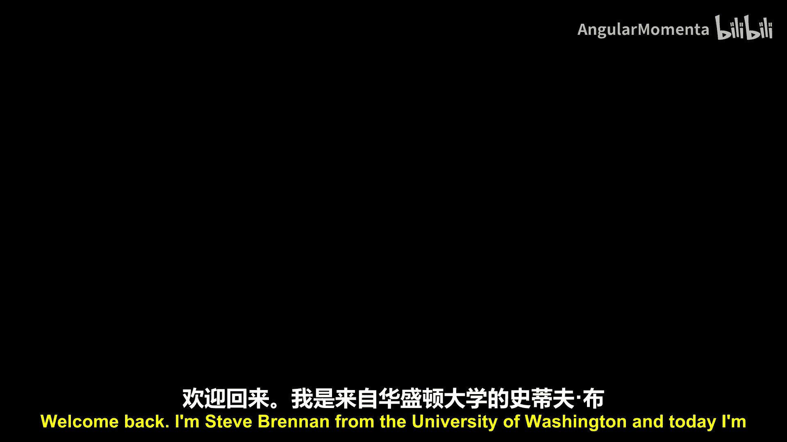
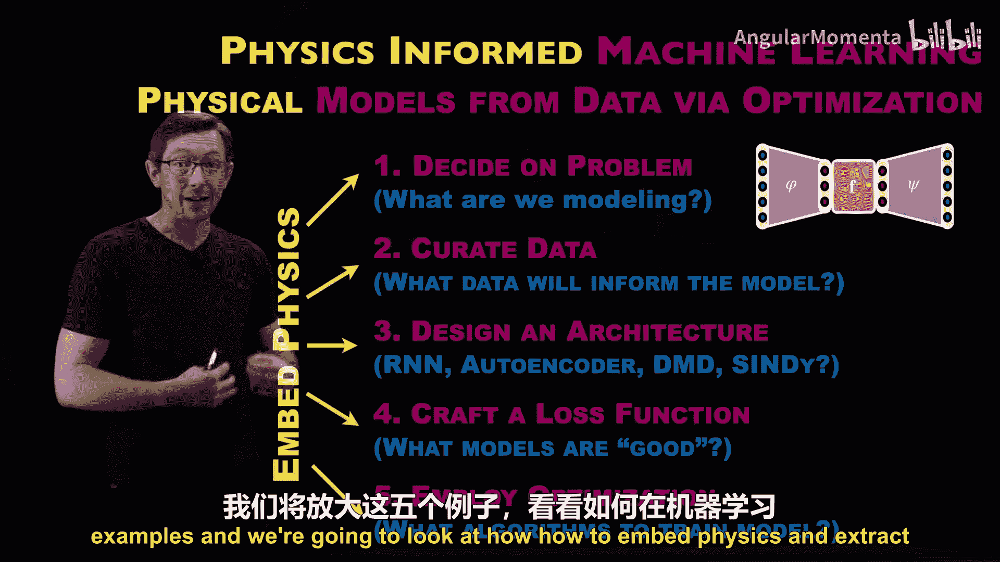
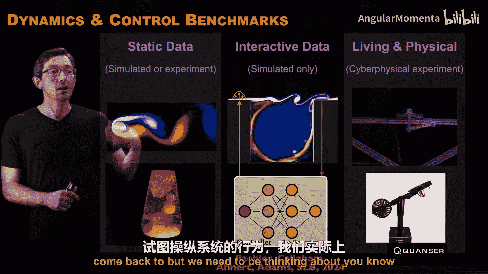
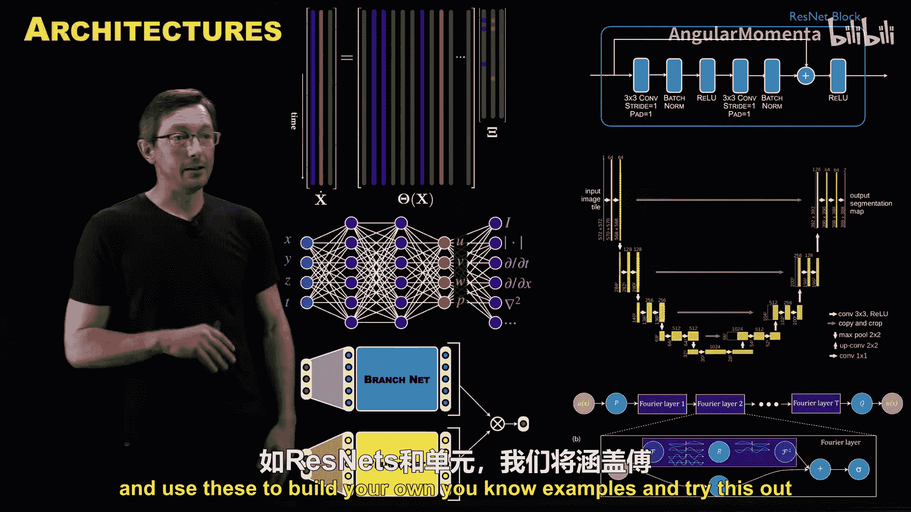
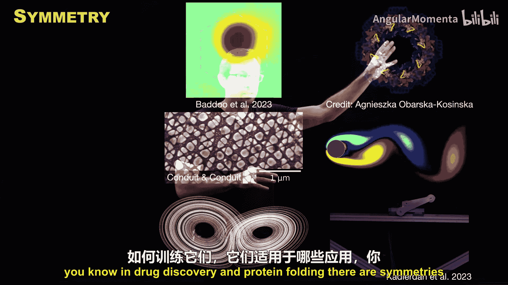
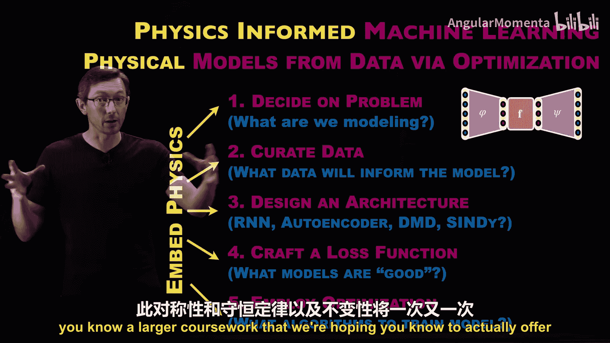

物理信息机器学习：P01-01：物理信息机器学习：科学与工程中人工智能与机器学习的高级概述 🧠

在本节课中，我们将要学习物理信息机器学习（Physics-Informed Machine Learning, PIML）的核心概念与框架。这是一个关于如何利用现有物理知识改进机器学习系统，以及如何使用机器学习发现新物理定律的交叉领域。课程将首先概述机器学习的基本流程，然后详细阐述如何将物理知识融入该流程的每一个阶段。

物理信息机器学习是机器学习中最重要的主题之一。它处于一个关键的交叉点：如何利用已有的物理知识来改进机器学习系统，以及如何使用机器学习来发现人类从未写下过的新物理定律。

我们经常谈论机器学习。我们在新闻和日常生活中看到它的成功案例，其进步速度确实令人震惊。曾经只存在于科幻小说中的事物，如今已成为科学事实。例如，机器学习能让单张静态图像中的蒙娜丽莎“活”起来。我们还有快速发展的生成式人工智能，例如DALL·E 2，你可以输入“吉他怪物”这样的提示词，它就能生成一张怪物弹吉他的精美图像。请注意，吉他本身也是一个怪物，这很酷。

尽管这些技术在创造新艺术、图形、生成文本和翻译语言等经典机器学习任务中非常有用，但一个日益增长的世界是：我们如何将物理和机器学习用于设计全新的飞机？或用于飞机发动机、机翼或机身的新型超材料？或者用于我们人类所拥有的任何其他工程和物理任务？例如预测、建模和理解流体流动与湍流，这对于设计飞机、赛车、运输船以及风力涡轮机，理解气候变化和天气等至关重要。还有机器人和用于自主系统的数字孪生。这只是机器学习，特别是物理信息机器学习在工程和自然科学中众多应用的冰山一角。

如果你想成为这场革命的一部分，如果你想改变世界，如果你想设计新的超材料，让我们能建造更好的飞机、更好的风力涡轮机、更好的机器人算法，并理解气候变化等问题，那么物理信息机器学习将成为你未来工具箱中必不可少的工具。这就是本系列讲座的主题，而本讲是该系列的概述。

---

现在，让我们放大视角。我们之前多次谈到，机器学习本质上是一个**使用优化和回归技术从数据中构建模型**的过程。人类使用优化和回归从数据中构建模型已有数十年，甚至数百年、数千年的历史。我们最早的一些行星模型本质上就是基于观测数据，通过某种近似回归或优化来理解这些模型。但今天，我们拥有更多的数据，以及更先进的优化算法，这是机器学习发展如此迅速的原因之一。

以上是经典机器学习。我们今天和本系列感兴趣的是**物理信息机器学习**，即我们如何**使用相同的优化和回归技术从数据中构建物理模型**，或者至少基于这些现有的优化和回归框架进行构建。

因此，整个系列都聚焦于人工智能、机器学习与物理学的交叉领域。我认为机器学习领域的研究人员常常忘记，我们实际上拥有数百年的物理知识，我们对物理系统如何运作有海量的知识。但很多时候，在构建这些机器学习模型时，我们却抛弃了这些知识。然而，在过去五到十年里，情况开始变得更加清晰：我们确实需要将物理学融入机器学习过程，才能在工程、自然科学和生物学等真正复杂的系统上获得所需的高级性能。

因此，本系列将反复出现两个重要方面，两个大的主题：
1.  我们可以**将物理学强制融入机器学习模型**。本质上，我们可以获取已知或部分已知的物理知识，如对称性、守恒定律、不变量等，并将它们“烘焙”到我们的机器学习模型中，使其性能更佳。这样，如果我们强制模型遵循物理规律，就能用更少的训练数据学习到泛化能力更好的模型。
2.  另一方面，我们常常并且越来越多地能够**使用机器学习技术，通过测量数据发现全新的物理定律**。例如，如果我有来自星系运动、等离子体或某个生物系统的测量数据，我或许能够使用计算机科学其他领域正在开发的这些机器学习方法，来发现我们以前从未写下过、人类由于复杂性或其他方面（如数据的复杂性）而未能发现的新物理模型。这是一个非常令人兴奋的方面，我们可以开始得到描述非常复杂系统的常微分方程或偏微分方程，而这些系统是人类无法用经典方法描述的。

所以，这就是我们将要探讨的两个大主题：我们将强制或“烘焙”物理学到机器学习过程中；同时，我们也将经常使用机器学习来发现新物理。我们会发现，这两者某种程度上是互为补充的问题。

---

这里有一个我非常喜欢的简单例子，用来热身，说明什么是物理信息机器学习。这是我实验室墙上安装的一个钟摆，它来回摆动。末端有一个小型加速度计和一个LED灯，所以你可以拍摄它的视频。传统的机器学习可能会拍摄这个钟摆的视频，并尝试使用自编码器神经网络将视频的维度降低为由这个红色向量给出的最小潜在状态，这样你就可以使用这个最小状态，然后从这些极少的变量中重建视频。我们知道这是一个低维系统，我们认为它可能由一个变量θ（角度）及其角速度来描述。天真的机器学习只会试图找到一些坐标来压缩这些数据，以便也能将其扩展回完整的视频。

而物理信息机器学习试图做一些更复杂的事情。我们不只是试图学习压缩视频的坐标，我们还试图学习这些坐标如何随时间演化的微分方程，比如我们知道的这个阻尼摆方程。你可以从两种角度来思考这个问题：如果我已知这个方程，我可以尝试将其“烘焙”到这个潜在状态和这些红色坐标中，以尝试用我的机器学习模型学习正确的坐标。如果我融入了这些已知的物理知识，我可能会做得更好。或者，我可以尝试纯粹从这些测量数据中学习这个微分方程。

再次聚焦这个例子，我们知道，如果我们要使用教科书方法来做这件事，有两个关键要素：首先，我需要学习一个好的坐标系θ，在这个坐标系中我可以表示这个钟摆运动。例如，θ比末端的X和Y位置要好得多。然后，一旦我学习了那个坐标，我想学习一些运动方程，一些描述系统如何随时间演化的微分方程。

这就是我们所说的物理与机器学习的含义。通常，这意味着学习正确的坐标和学习一些控制方程或物理定律，这些定律通常是描述时间演化的微分方程。同样，我们可以从数据中学习这些，也可以将这些元素“烘焙”到我们的机器学习模型中。

---

好的，现在我们将放大视角，具体讨论构建经典机器学习模型所涉及的阶段。我将把它分解为五个关键阶段，我们通常用这五个阶段来构建任何机器学习模型，然后我将展示如何将物理学“烘焙”到这五个阶段的每一个中。

需要说明，这并非100%准确，大约有80-90%的准确性，但这是一个很好的指导方针，可以帮助我们组织本系列讲座。

以下是构建机器学习模型的五个阶段：

**第一阶段：定义问题**
第一阶段本质上是决定问题：我们要用机器学习模型建模什么？这意味着决定输入和输出是什么，以及我想要建模的关系是什么。例如，我有狗和猫的图片，我想构建一个分类器来将它们标记为狗或猫。我们决定了要建模的问题。

**第二阶段：收集与整理数据**
一旦完成第一阶段，我需要收集和整理用于训练该模型的训练数据。什么数据将为模型提供信息？我如何收集这些数据？同样，在狗和猫的例子中，我需要一堆狗和猫的图片，并且我必须决定：我是否真的有标签？我知道哪些图像是狗，哪些是猫吗？这就是我的数据整理过程。这通常是整个流程中最昂贵的环节之一，有时获取这样的数据集可能需要数百万甚至数千万美元。

**第三阶段：设计架构**
这是很多人（包括我自己）感到兴奋的阶段。在第三阶段，你可以设计某种架构。我们已经知道要建模的问题，知道我们想要学习的输入和输出之间的关系。第三阶段是我们选择架构的地方，比如一种特殊类型的神经网络、SINDy模型或自编码器等。你选择某种架构，是因为你认为它能很好地表示输入和输出之间的函数关系。因此，很多工作都投入到为特定类型问题设计定制架构中。我们知道，如果要做图像分类，我们使用卷积神经网络；如果要建模时间序列，我们使用循环神经网络等。因此，在选择架构方面有很多专门知识。事实上，这是一个用于在扩展回之前压缩输入维度的自编码器架构。

**第四阶段：构建损失函数**
现在我们知道问题，有了数据，并且有了我们认为可能能够训练以建模输入输出关系的候选架构。第四阶段是构建损失函数，即某种目标函数，它告诉你模型是否表现良好。通常，这包括诸如你的神经网络（或任何机器学习架构）的输入输出预测与实际用于训练的数据之间的误差等项。你还可以添加各种其他损失函数，例如添加正则化项以使模型更稀疏或更平滑等。同样，第三和第四阶段是现代机器学习以及物理信息机器学习大量研究存在的领域。

**第五阶段：优化训练模型**
一旦我们有了架构和损失函数，我们本质上就是选择某种优化算法来训练模型。通过训练模型，我们的意思是使用优化来调整架构的参数，以最小化损失函数在数据上的平均值。

这一点非常重要，我再重复一遍：我们的架构是可用于表示你想要建模的输入输出关系的某类函数。这个架构本质上存在可以调整的参数。在神经网络的情况下，就是网络中所有连接的权重。你可以调整这些权重来学习某种输入输出函数。因此，我们使用优化算法（如Adam优化器和其他类型的随机梯度下降优化）来调整架构的参数，以最小化损失函数在训练数据上的平均值。

这就是机器学习的整个过程。我们决定问题，收集数据，选择我们认为可以表示输入输出关系的函数类（我们称之为架构，如特定类型的神经网络），设计或构建一个告诉我们是否做得好的损失函数，然后使用优化来调整架构的参数，以学习那些能最小化损失函数在训练数据上平均值的参数。

我之所以这样将其划分为五个阶段，是因为这五个阶段中的每一个都为将物理学嵌入过程提供了独特的机会，在某些情况下也为发现物理学提供了机会。因此，如果我们对物理学有部分了解，例如我知道我正在尝试建模机翼上的升力、某种材料特性或具有关节和连杆的机械臂，那么在这五个阶段的每一个阶段，我都可以嵌入物理知识并改进这个机器学习过程。我可以约束架构，可以添加自定义损失函数，我可以使用某些比其他方法更尊重物理的优化类型。因此，所有这些阶段都为我们提供了将物理学融入过程的独特而强大的方式。

我们将使用这个图表来组织几乎整个短期模块或训练营，在这个更大的系列讲座中。我们将深入探讨这五个例子中的每一个，并研究如何在机器学习的每个阶段嵌入和提取物理知识。

---

如果你想了解更多，其中一些内容在我和Nathan Kutz合著的教科书《Data-Driven Science and Engineering》中有所涉及，你可以在这里下载免费的PDF。我希望在这段视频发布时，会有其他资源，比如相关笔记等，所以请查看视频描述以获取更多可用资源的链接。

再次强调，我们经常思考架构，这是让很多人感到兴奋的事情之一。尤其是在物理信息机器学习中，人们会对可以尝试的所有酷炫架构感到兴奋。仅就神经网络而言，就存在一个可能的架构“动物园”。我想强调一个重要观点：并非所有机器学习都只是神经网络。还有很多其他非神经网络的架构可以用来从数据中学习模型。但即使在仅看神经网络的领域，也存在这种“动物园”。

很多时候，我们所做的事情类似于炼金术，一种现代炼金术。你有一个问题，通过某种直觉组合，也许是阅读Reddit帖子或看到朋友做了什么，我们对哪些类型的神经网络架构可能或可能不适用于我们的问题有一些想法。然后我们常常最终只是尝试一堆架构，有时它们有效，有时无效。有时你可以（比喻性地）把铅变成金，有时则不能。因此，将机器学习应用于物理系统的一大推动力在于，我们实际上对这些系统有一些先验知识，我们知道很多关于这些系统的信息，也许我们可以开始学习不同神经网络架构如何以及何时适用于给定问题的原理。

这是一个非常重要的观点。显然，我们希望做更好的工程和更好的科学，我们希望使用我们掌握的最佳工具，而如今，机器学习就在这个工具箱中。但还有另一个视角：通过将机器学习应用于我们有时知道答案的物理问题，我们可以比将其应用于我们不知道答案的系统（比如试图治愈癌症）时，对这些机器学习算法和模型有更多的了解。通过将其应用于我们知道答案的系统，我们或许能够从机器学习的这个“炼金术”阶段，过渡到更类似于“化学”的阶段，即对于特定问题，何时以及如何使用这些构建块存在实际的原则和组织。这是我们作为一个社区非常感兴趣的事情。通过将机器学习应用于我们知道答案的物理系统和工程系统，来学习这些机器学习的基本原理，这方面投入了大量的努力。

这实际上是美国国家科学基金会（NSF）资助的动态系统人工智能研究所的主要目标之一。你可以访问网站搜索查看。这个NSF资助的动态系统人工智能研究所，真正专注于理解如何将物理学嵌入机器学习系统，如何使用机器学习系统学习新物理以解决各个应用领域的工程任务，以及如何从那种只是猜测、检查和试错的“炼金术”模式，转变为更有原则的模式。这是与许多人合作的成果，实际上比这个NSF研究所本身更大，旨在学习这些机器学习原理。这是一个非常令人兴奋的领域、主题和领域，现在是进入这个领域的研究人员的绝佳时机，因为存在大量未解决的开放问题和挑战，并且在未来几年，许多价值数十亿美元的行业都可以通过这些技术进行转型。

---

好的，现在我将深入探讨机器学习的这五个领域，并举例说明我们如何将物理学“烘焙”进去。这将是一个非常快速的高层概述，我将有专门的视频深入探讨每个子问题。我们将有整个视频讨论如何将物理学融入第一阶段和第二阶段等等。但让我们先从一个非常高的层次来了解一下。

**第一阶段：定义问题**
机器学习的第一阶段是决定问题。有时这甚至没有被提及，人们认为这是理所当然的。但这是机器学习过程的一个重要部分：选择你实际上认为可以用数据建模什么，你想要建模什么，什么是有用的模型，你为什么想要一个模型？这些都是重要的问题。从根本上说，归根结底，如果你正在对一个物理系统进行建模，比如熔岩灯、钟摆或流体流动，或者材料加工过程等实际上是物理的事物，那么你已经在某种程度上在进行基于物理的机器学习。当你决定尝试对某个物理过程进行建模时，物理学已经在这个过程中了。

例如，如果我要在我的机器学习模型中尝试学习这个钟摆上的力，我们知道 **`F = ma`**。如果我尝试用机器学习模型学习这些力，我已经通过问题陈述将物理学“烘焙”到了过程中。同样，我可以尝试学习哈密顿量或拉格朗日量，可以尝试学习自由能势等等。有很多很多不同的方法，你可以通过巧妙设置问题来融入物理学。

**第二阶段：整理数据**
那么，我将使用什么数据？同样，如果数据来自物理系统，本质上你正在通过数据收集嵌入物理学。有时我开玩笑说，第二阶段是将物理学融入模型的“谷歌方式”。因为其理念是，如果你收集了足够多的自然世界数据，它就必须学习像 **`F = ma`** 这样的物理学，甚至最终可能学习像 **`E = mc²`** 这样的东西，以协调它所收集的所有数据。但我说这是“谷歌方式”的原因是，它非常非常昂贵，依赖于拥有近乎无限的数据量，而作为科学家和工程师，我们通常没有这种奢侈。我们更经常拥有有针对性的、有限的、狭窄的数据集，我们必须用这些数据集来学习能够更广泛外推的物理学。这一点很微妙，我们将有整个视频深入探讨，但我想简要提一下。

例如，我是否要将流场作为我的训练数据？我是否要在不同的流速下获取它们？如果只有一个流速，或者有一个速度范围，这将改变我在模型中捕获的物理特性，这是非常不同的模型。同样，如果我有流体流动、地球物理流体流动的数据（这实际上是瓜达卢佩岛过去的云层形成），在我的数据整理过程中，为了增加物理学，我可以做的一件事是：如果我认为物理学实际上不依赖于旋转角度或平移，如果我认为我的物理学对某种对称性（如平移或旋转）是不变的，我可以用根据该对称性变换的额外副本来增强我的数据。例如旋转，在其他情况下是平移。这是人们经常做的一件非常常见的事情：如果你知道你的系统具有某种对称性或不变性（这是物理学的另一种形式），你可以增强数据，使其具有那些对称性和不变性。

例如，如果我正在构建一个分类器，可以区分普锐斯和福特皮卡，也许还有其他汽车和卡车，我将获取汽车和卡车的图像，我可能会旋转、平移和缩放它们，因为这些都不应该影响分类。所以我可以获取我的数据并增强它，以包含我们认为模型应该对其不变的对称性和不变性。

另外，我将多次谈到的一点是，坐标通常在我们对物理系统进行机器学习时非常重要。这是Mar和Christensen的一幅漫画，我非常喜欢，经常使用。它展示了太阳和地球的两种不同坐标系。右边的是地心说观点，即从我们以地球为中心的视角看事物的样子。在这个坐标系中学习物理学和模型非常困难。而如果我们固定坐标系，将太阳放在中心，就容易得多，数据更有意义，也更容易从数据构建模型。因此，整理数据通常意味着找到正确的坐标系。有时我们学习它，有时我们通过物理学的先验知识来强制实施它，这对学习过程有巨大的影响。

**第三阶段：设计架构**
我们将在这里花费大量时间，可能专门用五到十个小时来讨论市场上所有不同的架构，以及这些架构的不同损失函数。从一个很高的层次来看，我们可能有像拉格朗日神经网络这样的东西。如果你知道你的系统具有这种欧拉-拉格朗日方程框架，如果它是一个像双摆这样的机械系统，你可能会使用像拉格朗日神经网络这样的特定架构，以便你的系统能够守恒能量。

重要的一点是，几乎所有这些架构都有一组相应的自定义损失函数来训练它们。所以第三和第四阶段有时确实会有点混合。

这只是针对物理系统的特定结构的一个例子。我们还有另一种关于什么是“物理”的概念，即简约性。我们喜欢我们的模型尽可能简单来描述数据，但又不能更简单。这就是我们的SINDy自编码器中的方法，你使用自编码器来学习一个好的坐标系，然后你在某类模型中拥有描述数据的最稀疏模型。所以我们将使用低维和稀疏的原则来促进模型尽可能简单来描述数据，但又不能更简单。这种简约性原则已经伴随我们2000年，从亚里士多德到爱因斯坦，这是我们衡量一个系统是否“物理”的方式之一，即其简单性和描述测量数据的能力。这是另一种类型的架构。

然后，这实际上是我最喜欢的架构之一，也是现代物理信息机器学习时代较早的架构之一，由Julia Ling及其合作者提出。他们使用神经网络来尝试为湍流流体流动构建闭合模型。他们的架构与标准的深度神经网络架构不同，他们有一个额外的辅助张量输入层，使他们的网络对伽利略变换具有不变性。同样，我们知道这些流体流动在某些旋转和平移下应该是相同的。因此，通过架构的选择，他们使得他们的模型必须具有那种不变性，并且性能比不将其纳入机器学习过程要好得多。

这只是数百种不同类型的定制架构中的三种，你可以使用它们来将某些类型的物理学注入你的系统。

实际上，我早些时候和我的妻子Bing谈到了这一点。她指出，当你选择一个架构来使你的系统更“物理”，使你的机器学习模型更“物理”时，这被称为**归纳偏置**。这是一种不言而喻的偏置，但它高度引导或影响了下游的机器学习过程。因此，我们将在本节的后面更多地讨论归纳偏置和架构选择。

**第四阶段：构建损失函数**
这是另一个非常丰富的研究领域：如何构建损失函数来促进模型在某些方面更“物理”？我们已经讨论过那些稀疏模型、简约模型，它们尽可能简单地描述数据，这由损失函数中的一个项来量化。L1范数或L0范数量化了稀疏性和简约性。因此，通常物理学是通过训练过程中额外的正则化项或损失函数来促进的。

这方面最著名的例子可能是物理信息神经网络（Physics-Informed Neural Network, PINN），如图所示。这只是一个标准的深度前馈神经网络，用于将一些输入（如空间和时间）映射到一些输出（如流场）。通常，我只会有一个损失函数，平均计算这个模型在一些训练数据上的准确性，这是天真的做法。PINN所做的是，从这个输出数据中，你实际上可以计算偏微分方程中的项，并且可以将系统应该满足的实际物理（偏微分方程）作为另一个损失项添加到你的损失函数中。所以，如果你知道物理学，如果你知道你的系统是无散的，或者满足纳维-斯托克斯方程，或者弹性梁方程，无论是什么方程，如果你知道它，你可以将其作为正则化损失项添加到你的机器学习过程中，这应该能显著提高学习性能。如果你将物理学作为损失函数包含进来，你可以用少得多的数据获得更好的模型性能。同样，我们将有整整一讲专门讨论这个话题，因为它非常重要，包括代码、示例和案例研究等。

**第五阶段：优化**
最后一步，我认为超级重要，虽然不如第三和第四阶段那样普遍用于嵌入物理学，但它非常重要，我和我的合作者团队在这方面做了很多工作，那就是**使用优化来强制实施物理学**。如果我将物理学作为损失函数中的一个项添加，那本质上只是添加了“我们希望物理学得到满足”的建议。但它总是在“战斗”——我们想要低模型误差，我们也想要物理学得到满足，它们有时是相互冲突的目标。所以，仅仅将物理学作为损失函数添加，只是促进了物理学，但并没有强制物理学得到满足。然而，通过优化，你通常可以约束和强制你的物理学以更高的精度、更严格的方式得到满足。

例如，我们在流体流动建模与机器学习方面做了一些工作。我们知道存在某些对称性和属性，比如在这些不可压缩流动中能量是守恒的。那么，我可以做的是构建一个损失函数，其中包含我的模型误差和一些对于守恒能量所必需的约束。或者，不仅仅是将其作为损失函数，我可以做一个约束最小二乘，使得这些约束在构造上始终满足数值精度。

同样，如果现在不完全理解也没关系，我们将深入探讨每个主题，并至少有一个视频，但可能每个主题都有几个小时的资料。其理念是，你可以促进——如果我知道我的系统要具有物理性应该满足的一些约束，比如能量守恒，或某种对称性，我可以将其作为损失函数中的一个项添加，但如果它只是在我的损失函数中，通过优化过程它不会变为零。或者，我可以使用拉格朗日乘子或约束最小二乘等方法，改变我的优化问题，使得这些约束在我每次优化这个函数时都精确满足。这是我们经常做的事情，并且有非常强大的方法来以这种方式强制实施物理学。它稍微复杂一些，能给你更好的物理约束，但构建到优化函数中也需要更多的人力投入。

另一个例子，我们将在本系列讲座中发现一个主题：我们将大量讨论“物理学到底是什么？我们谈论的这个物理学是什么？”通常，物理学通过对称性表现出来。我是双侧对称的，意味着我有镜像对称性，所以如果我在镜子中翻转自己，本质上没有任何变化。许多物理系统具有其他类型的对称性，我们讨论过平移对称性、旋转对称性。这是一个具有六边形势的量子势阱，因此它具有这种有趣的旋转和反射对称群。我稍后会谈到这一点，但有一些方法，比如物理信息动态模式分解（Physics-Informed DMD），你实际上将你的解约束在满足该对称性的某个解流形上。同样，这将是一个完整的短期课程，可能很多都是关于对称性，以及如何将对称性“烘焙”到机器学习中，以及如何使用机器学习从数据中提取对称性。这是一个巨大、非常重要的话题，它将改变我们进行机器学习的方式，目前正在改变，并且只会在未来五到十年继续提高我们的能力。

---

好的，以上就是五个阶段，至少是五个将物理学“烘焙”到机器学习过程中的明确机会。现在，我将给你一个超级快速的预览，看看接下来你将看到什么，至少是接下来几个小时的内容。

首先，我将向你展示这五个阶段的图示示例，以便你能以不同的方式看到它，然后我将给你一些我们接下来要做的事情的预览。

同样，第一阶段是设定问题。我现在将介绍一个具体例子，其中我想要解决的问题是流体流动的模型降阶。问题是：我想获取一个复杂的流体模型，并得到一个更简单的模型，一个能在更小的计算机上更快运行的模型。所以我需要一些数据，需要整理一些测量数据。在这种情况下，也许我有一个模拟，一个昂贵的、全复杂度的流体流动数值模拟。所以我的问题是试图得到一个更简单的描述。我从高维数据开始。

第二阶段是整理数据。我从高维数据开始。

第三阶段是选择架构。在这种情况下，我将选择的架构是这种自编码器架构，因为它具有我想要的属性：从高维到低维，并且这些低维状态Z被选择为最有可能重建高维状态。我还想说，我希望能够学习一个动力系统，即在该低维潜在状态上的某个微分方程。这就是我所说的模型降阶：我想获取我的高维系统，将其压缩到低维状态，并学习该低维状态中的一些动力学、一些微分方程。这样运行这个模拟会快得多，也许能实时运行，并且我能获得系统中发生的大部分物理现象。以上就是前三个阶段。

第四阶段是构建损失函数。我们需要构建某种函数来告诉我模型是否表现良好。记住，我们的架构是某种将输入映射到输出的函数，用于解决问题。它有参数θ，这些参数是可以调整以使该函数更好地拟合数据的可调参数。在这种情况下，我有三个神经网络，每个都有一组参数θ1、θ2和θ3。我可以调整这些参数以使该函数更好地拟合数据，这由损失函数量化。所谓“更好拟合”就是这个意思。

最后，第五阶段是对所有这些θ进行优化，实质上是调整θ以最小化损失函数在训练数据上的平均值。这只是对我们已经说过的话的重述，但以稍微不同的图示方式呈现。

---

好的，现在我们将再次放大视角，预览本系列接下来将看到的内容。

**应用与工程**
我认为这是一个巨大的领域。我们将有很多案例研究和应用，探讨这实际上是如何在各种用例中使用的。我在这里展示的只是众多应用中的一小部分，也是我们将在本系列中探索的一小部分。例如，再次是建模流体流动和湍流。还有形状优化：你如何实际设计一个具有正确升阻比特性和正确结构特性的机翼？这是一个大的多目标优化问题。记住，训练机器学习模型也是一个多目标优化问题，所以它们结合在一起是有道理的。例如建模流体流动，也许设计飞机、汽车或风力涡轮机的形状，设计将用于这些下游工程应用的复合材料或合金，再次是多目标优化，对于材料来说是非常高维的设计空间。

**数字孪生**
我可能有一些物理资产，比如机械臂、飞机或工厂车间，我可能想要一些数字表示、一些我可以设计和优化的数字模型，就像这里的数字孪生。然后，总的来说是机器人技术。机器人技术和自主性是随着新机器学习技术迅速发展的领域。同样，这只是我们将要讨论的应用中相当小的一个子集。其他例子包括药物发现、蛋白质设计，这些系统受物理学支配，蛋白质折叠和化学作用的方式都有物理学，所以这些也是很大的应用领域。其他领域，如气候科学，理解天气现象、模式和气候趋势，再次与湍流相关，但背景非常不同。这方面的应用非常多。

数字孪生在这里是一个非常重要的概念，当我们考虑构建一个从数据训练而来、具有这种混合物理和数据驱动风格的机器学习模型时，这正是数字孪生所追求的。它就像是某个复杂系统（如飞机、工厂车间或材料烘烤过程，如复合材料烘烤过程）的“活”模型。你希望你的物理资产的这个数字孪生尽可能准确，你希望你的模型在收集新数据时能够更新。所以你的机器学习模型需要能够更新，你需要有关于模型有多好或最不确定的地方的不确定性估计，这样你才能知道是否可以信任你的模型，并且在最好的情况下，知道如何去收集更多数据来改进你的模型。所有这些都朝着数字孪生的概念努力，原则上，它应该允许我们进行更好的工程设计，更便宜、更快、更安全。

因此，我们将再次有一个关于数字孪生工程的完整短期课程，讨论如何构建这些数字孪生模型，以及如何将它们用于更好的设计、测试和评估等。我真的很喜欢这篇由Cap等人发表在《自然·计算科学》上的论文中的图表，它很好地表示了物理资产与其数字孪生之间的这种二元性。

同样，物理学和机器学习，如果你要将数字孪生用于像飞机这样的东西，它最好具有物理性，最好将物理学“烘焙”到那个过程中。

**基准系统的重要性**
我们还将讨论基准系统的重要性。经典机器学习、图像科学、自然语言处理等领域的大部分进展，是因为我们拥有非常好的基准问题和数据集，社区可以用来测试他们的方法。因此，研究人员不必创建基准问题和机器学习算法，他们可以专注于机器学习算法的工作。我们越来越发现，我们需要那种用于动力学和控制、物理和工程问题的基准问题。所以我可能需要这些系统的静态数据集——在系统随时间演化的意义上它们不是静态的，但一旦我收集了数据，数据就不会改变，它是一个动力系统的静态数据集，可以是模拟的或实验的。但实际上，我希望为工程目的开发这些基准系统，我们实际上试图操纵系统的行为，我们实际上想用我们的机器学习模型控制流体。所以我需要能够与那个模拟交互，并实际用我的机器学习模型闭合回路。因此，我们也在那种交互式控制框架中开发基准问题。然后，理想情况下，我们会走向实际的活生生的信息物理系统，比如一个实际的实验室设备，你可以实时在上面训练你的机器学习模型。这更接近我们将要达到的数字孪生概念。同样，这将是一个关于所有现有基准的完整短期课程，物理信息机器学习基准需要哪些特征等等。这是一个重要的话题，我们将再次讨论，但我们需要思考如何测试我们的模型，以及什么是基本事实？在某些情况下我们是否有基本事实？

---

**架构**
我们已经讨论了第三阶段的重要性，实际上是架构以及我们用来训练这些架构的损失函数。但我们将涵盖许多非常重要的架构，比如ResNets和U-Nets，我们将涵盖傅里叶神经算子和一般的算子方法，我们将讨论SINDy和简约符号回归建模，我们将讨论物理信息神经网络、深度算子网络等等。这只是我们将要研究的一些架构的快速列举，但我们将花费大量时间，用整个视频甚至整个视频系列深入探讨这些非常重要的主题：如何构建这些损失函数？如何训练它们？它们在哪些应用上有效？我们如何实际编写代码并自己尝试？所以我们将真正深入研究很多这些应用，然后你可以实际使用这些来构建你自己的示例并自己尝试。

---

**物理学的本质**
再次强调，在整个系列中，我们将重新审视“物理学到底是什么？”这个概念。为什么我们想将物理学“烘焙”到我们的系统中？当我们试图从数据中学习物理学时，为什么需要将物理学“烘焙”到我们的系统中？那到底意味着什么？我们在学习什么？一次又一次，我们会发现，像守恒定律、不变量和对称性这样的事物，是我们最终封装物理学的一些方式。因此，我们将再次看到对称性在很多地方出现，例如在药物发现和蛋白质折叠中存在对称性，流体流动和机械系统、材料系统、量子系统中，对称性是物理学的基础。所以对称性、守恒定律和不变量将反复出现。同样，还有简约性或模型简单性的概念。

---

**历史视角**
在这个过程中，我们也不会忽视科学史和物理学史，因为这将为我们在这个现代机器学习时代提供许多可以学习的重要相似之处。例如，占星术和天文学之间的区别是什么？发生了什么变化？炼金术和化学之间的区别是什么？确实，当今机器学习中正在发生很多这样的相似之处，所以当我们进行这种新的物理信息机器学习时，我们可以从科学史中学到很多。

---

好的，这就是主题，这就是课程——物理信息机器学习。我们将有很多关于这些主题的简短、集中的模块。我希望这能融入一个更大的课程体系，我们希望在未来的某个时候在华盛顿大学实际提供学分。我希望你喜欢这个课程，这是我的热情所在，也是机器学习最重要的领域之一，这将日益成为你解决现实世界问题工具箱中非常强大的工具。好的，谢谢。

---

**总结**

在本节课中，我们一起学习了物理信息机器学习（PIML）的高级概述。我们首先明确了PIML的两个核心目标：将已知物理知识融入机器学习模型以提升其性能与泛化能力，以及利用机器学习从数据中发现新的物理定律。接着，我们系统地拆解了构建机器学习模型的五个标准阶段：1) 定义问题，2) 收集与整理数据，3) 设计模型架构，4) 构建损失函数，5) 优化训练。我们重点探讨了如何在这五个阶段的每一个环节中，巧妙地嵌入物理约束（如对称性、守恒定律）或利用物理原理（如简约性）来引导和改善学习过程。最后，我们预览了本系列课程将深入探讨的应用领域（如工程设计、数字孪生）、关键架构（如PINN、傅里叶神经算子）以及核心物理概念（如对称性与不变性）。物理信息机器学习是一个强大且快速发展的交叉领域，有望彻底改变我们解决复杂科学与工程问题的方式。