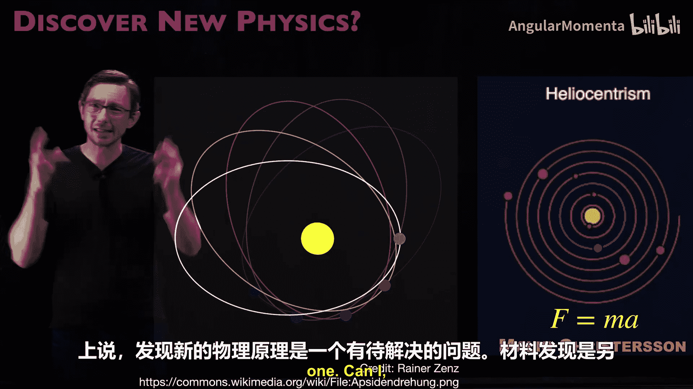
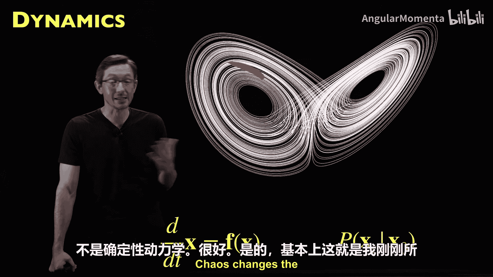
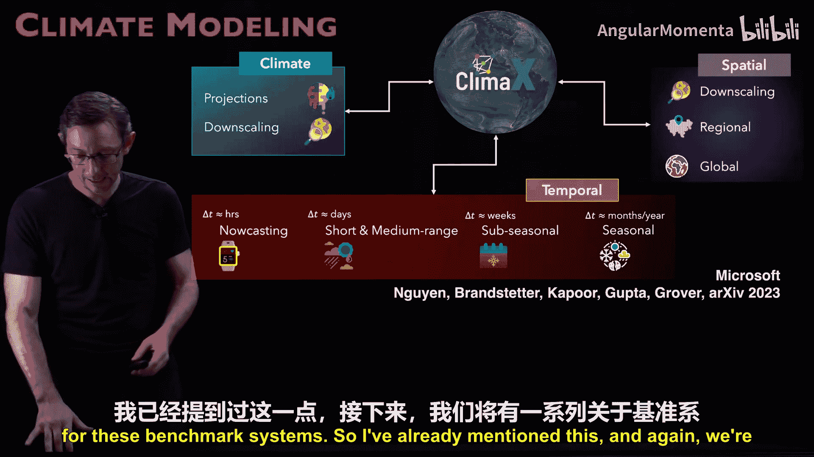
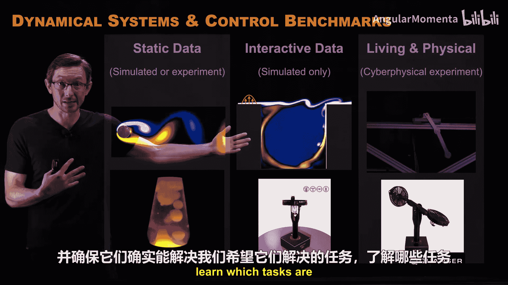
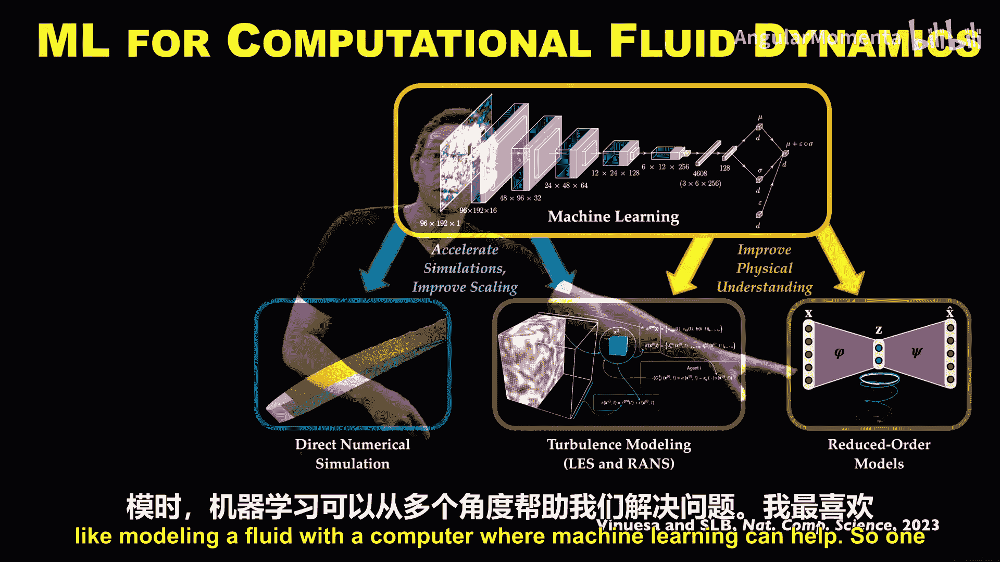
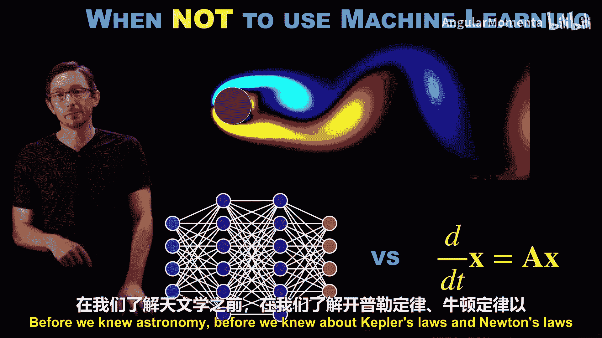

# 002：选择建模对象

欢迎回来。我们刚刚开始这个关于物理信息机器学习的系列讲座。本讲座的核心是探讨当我们了解物理知识时如何改进机器学习，或者如何利用机器学习从数据中学习物理。在上一次讲座中，我们讨论了机器学习的五个主要阶段，并且所有这些阶段都可以通过融入物理知识而受益。我们实际上也可以利用这些阶段来学习物理。因此，今天的讲座将聚焦于机器学习流程的第一个阶段：决定问题，即我们真正想要建模的是什么，或者我们机器学习模型的目标是什么。

起初，我认为制作这个视频会是最简单的。因为决定问题以及在哪里融入物理知识能有多复杂呢？但事实证明，我花了几个小时思考这个问题，每次我以为自己弄明白了，总会有新的想法涌现。这可能确实是所有阶段中最重要的一个。在这个阶段，科学方法、工程流程和设计过程仍然适用，即使你打算使用机器学习来构建模型。因此，这是任何模型构建过程中最基础的一步：决定你要建模的对象是什么、模型的目的是什么、你将如何使用它。在深入探讨“决定问题”这个第一阶段之前，我将先退一步，谈谈它如何与其他阶段相契合。

有时，我们对要解决的问题有清晰的认识。例如，我在做湍流建模，我知道存在一个闭合问题。像雷诺应力这样的东西，我们对其行为没有很好的数学模型，但我有一堆数据，我知道我将尝试用数据更好地建模这些量。

但有时，我并不确切知道问题是什么。我有一个模糊的概念，比如我想造一辆更好的赛车，或者一个更好的机翼。这还不够具体。因此，你必须深入思考：为了改进那个过程或实现那个大目标，我可能使用什么数据？你开始分解问题。也许你对适合这类问题和数据的架构类型有模糊的想法。但一旦你真正开始审视你能获取什么数据、数据的成本高低、数据量有多少以及可能的架构，你可能不得不回过头来完善问题陈述。我们经常发现自己沿着这条路走下去，甚至一直走到训练完模型，然后意识到它没有完全达到你的期望，或者性能不够好，或者不像你想象的那样有用。但在这个过程中你学到了很多，于是你回去完善你的问题陈述，现在你更清楚自己要建模什么了。

因此，我再次强调，在经典的工程和科学中，我们习惯于使用实验和数值模拟来设计新系统，比如iPhone、赛车或飞机。在工程设计和科学发现过程中，我们都习惯于使用模拟和实验。这与机器学习实验的设计并无太大不同。就像你会设计一个实验来回答某个问题，以服务于更大的目标一样，设计这种机器学习实验的方式完全相同。你会有一个假设：我认为我可以建模这个现象，比如升力作为不同机翼形状的函数。然后，你获取数据，实际构建模型，看看是否有效。你可能需要调整实验，可能需要完善问题陈述。所以，你在实验室和数值实验中积累的关于工程设计和科学发现的所有直觉，很多相同的原则在这里也适用。关于这一点，我还有很多要说的。我们将在最后回到这个图表，并重新审视我们学到的一些经验教训，以及关于决定一个好问题与坏问题的一些关键主题。这确实需要一些试错，很像建立一个实验或模拟来开始回答问题，但也许我们可以用数据做得更好。

现在，让我们聚焦于决定问题。在我的第一个视频中我说过，如果你正在建模物理系统的某个方面，你本质上就是在做物理和机器学习的交叉。你的机器学习模型应该捕捉一些物理知识，但这有点模糊。所以我想更深入地探讨我们可能面对的问题类型，以及其中的细微差别，比如学习是否适合解决这些问题，并从中总结一些关于如何正确设置问题陈述的经验教训。

我认为，总的来说，数据科学是从以数据为中心的视角提出和回答问题的过程。很多科学史都是由数据和观察驱动的，这与此并无太大不同。我非常喜欢下面这句引言，我认为它非常适合这个关于“我们建模什么、问题陈述是什么”的部分。这张幻灯片来自我的朋友Nathan Cotz，他喜欢在他的学术研讨会上引用它，我认为这正是我们需要思考的。

人们常常把机器学习看作问题的解决方案。很多时候，我看到人们仅仅因为能够构建机器学习模型就去构建它们。我认为这是错误的方法。毕加索的这句引言一针见血：“计算机是无用的，它们只能给你答案。”这与数据驱动模型的情况如出一辙。数据驱动模型是无用的，它们只能建模你的数据。你必须自己决定什么是正确的模型、什么是正确的保真度、什么是有用的模型以及你将如何在后续使用它。这是人类的工作。一旦你弄清楚了这真正重要的一环，那么训练模型本身可能就不是最具挑战性的部分了。

在查看一些例子之前，我们先过一些原则。首先，我们需要思考为什么一开始就需要一个机器学习模型。这将会是一个昂贵且耗时的过程，数据不便宜，训练模型也常常昂贵且耗时。因此，你最好理解为什么一开始就需要这个机器学习模型，以及你将如何使用它。这将极大地影响所有后续决策。我们讨论的不仅仅是任何普通的机器学习模型，而是真正应用于工程和物理系统的机器学习模型，这些系统受物理定律支配，比如设计材料或飞机，或者建模湍流等。

首先，机器学习真正至关重要并能将我们的能力提升到没有机器学习时无法达到的领域之一，就是学习新物理。有很多系统，我们对它们的工作原理有很好的理解，比如流体流动、摆锤和机械系统，我们有大量的控制方程。但也有许多系统，我们不知道其物理原理。例如，神经科学中，我们实际上没有大脑的控制方程；流行病学系统，甚至气候系统，都存在我们尚不知道如何建模的大块物理知识。但我们有大量数据，所以也许我们可以开始利用这些数据来改进和构建我们的第一性原理物理模型，以学习我们以前从未能够写下的新物理。这是机器学习的一个巨大机遇。然后，你或许可以像使用基于物理的模型一样使用这些模型，但你可以将其应用于更复杂的系统，在这些系统中，人类尚未能像发现F=ma那样发现物理定律。实际上，我的实验室和合作者小组的很多工作都属于利用机器学习发现新物理的范畴。

但这只是机器学习模型的众多用途之一。另一个使用或构建机器学习模型的原因可能是，有些系统或物理你实际上理解得很好，我们知道如何模拟或进行实验，只是成本非常高。比如模拟流体流动，或者模拟材料的所有尺度。原则上，我们有这些物理知识，也许模拟蛋白质折叠或某些生化分子，我们理解第一性原理物理，技术上可以模拟它们，但成本极其高昂。那么，我们能否使用机器学习来增强这些模型，帮助我们构建更快且仍然足够准确的代理模型，用于设计和优化等任务？比如，我们能否加速药物发现、材料设计或流体模拟？即使我们知道物理原理，但因为该物理模拟成本太高。

我在底部添加了第三个小要点，我认为这在后续讲座中会非常重要。机器学习模型通常（并非总是，但经常）本质上是自动可微的。这意味着你可以使用反向传播等方法计算输出对输入的敏感性，反之亦然。我们可以利用机器学习模型的这种自动可微性，将其应用于经典的工程设计和优化循环中。例如，如果我想对机翼或汽车等进行形状优化，我们或许可以利用这种我们已经用于训练神经网络等模型的自动微分技术，来进行更好、更快、更便宜的设计优化。稍后你会听到更多关于这方面的内容，这真的非常重要且有趣。

所以，学习新物理是合理的，有些东西我们还不理解，也许我们可以学习模型来封装或捕捉现有的昂贵物理。机器学习模型可能帮助我们更好地做到这一点，这完全说得通。还有一种介于两者之间的情况，我称之为捕捉多物理场相互作用。很多时候，我们擅长用单一类型的物理建模单尺度物理，比如模拟单一流体、轨道上的行星系统或简单材料。但当你开始增加复杂性时，比如多相流，或者模拟行星运动但涉及潮汐力和海洋等多物理场相互作用，情况就会迅速变得非常复杂。我最喜欢的一个例子来自加州理工学院Tapio Schneider小组的气候科学领域，那就是云物理。云的形成方式、冰晶、凝结、降水等所有这些物理过程，我们认为只是一个简单的东西，实际上是一个令人难以置信的多尺度、多物理场过程，我们远未达到能用第一性原理建模的程度。因此，我们有一些现有的模型，但有些部分的物理我们并不了解。捕捉这些多物理场相互作用，这种超越我们分析能力甚至模拟能力的复杂性，是机器学习实际上可以帮助我们做的事情。模拟或为这些非常复杂的多物理场系统建立实验通常超出了我们的能力范围，机器学习提供了一些帮助的方法。

实现这一点的一些方式包括：如果存在多物理场相互作用，而你理解其中一部分，你可以使用你理解的那部分物理模型，然后用机器学习来建模差异或剩余部分。我们稍后会详细讨论所有这些内容。

最后一点是，当我们拥有机器学习模型时，我们通常有机会用新数据更新这些模型。例如，F=ma不会改变。我在实验室建模一个摆锤时，那个方程不会改变。但随着物理系统随时间老化，也许轴承润滑变差，也许某天有风扇吹而另一天没有，也许在盛夏温度略有不同。如果你使用机器学习，就有机会用新数据、新信息更新这些模型。这对于数据同化、数字孪生等建模可能随时间变化的系统来说，是一个非常令人兴奋的机会。

所有这些都只是我们应该牢记的事情。为什么我们需要一个机器学习模型？是因为我们的物理未知、昂贵、非常复杂，还是可能发生变化？这些都是我们需要思考的。

很好，现在让我们看一些我正在谈论的例子，然后总结一些要点。

物理科学中经常出现的一项任务是超分辨率。超分辨率是图像科学中的一个概念，你有一张低分辨率图像，通过收集大量数据的统计信息，你可能能够学会如何将低分辨率图像填充成高分辨率图像。这对于物理应用非常重要。它可以帮助我们改进实验测量技术：如果我的实验测量保真度有限，我或许可以使用这些技术来提高分辨率。它可以加速数值计算：也许我可以在粗网格上模拟，并利用超分辨率的思想来加速高保真度模拟，获得更高分辨率。如今，人们正在气候模拟和流体模拟中使用这些思想。所以，这是你可能写下的物理类型问题的一个例子。我思考这个问题的方式是：如果我的任务是获取低分辨率数据并填充高分辨率细节，那么我已经知道我的训练数据将需要大量高分辨率-低分辨率数据对来训练那个模型。如果我没有用于训练的高分辨率数据，我就无法做到这一点。

其他你应该思考的事情包括：我知道这是一个物理系统，这是一股流体射流。是否存在执行超分辨率任务的方法，能够真正尊重物理定律，比如尊重质量守恒或动量守恒？如果我取一小块区域进行边界元守恒计算，它是否与物理相符？我能否通过融入这些物理知识来改进超分辨率？这些都是问题。老实说，作为一个社区，我们仍在努力弄清楚这些问题。但如果我们打算进行超分辨率并将这个流场用于某些下游任务，那么我希望这个流场实际上满足纳维-斯托克斯方程，这对于我作为一名工程师来说很重要。

其他任务，我们之前提到过，发现新物理是一个巨大的机遇。例如，如果我测量夜空、行星等数据，我能否真正发现开普勒定律，甚至更好的牛顿第二定律F=ma？我能否从观测数据中发现物理？我们将有一个完整的章节来讨论如何做到这一点，以及如何发现像这样的可解释模型。这里有很多信息，我可能会在描述中或上方添加链接。

这不仅仅是重新发现像F=ma这样我们已经知道的东西。如果我们的数据中存在一些我们无法解释的东西呢？我们能否开始发现新物理来解释数据中的差异？这在广义相对论中就发生过，对吧？水星凌日观测中存在一个微小差异，无法用F=ma解释，但可以用相对论给出的修正来解释。今天有很多这样的例子，也许我正在处理一个球形聚变反应堆中的等离子体，我的模型并不完美，但我有数据。我能否发现改进我的模型的新物理，从而让我能进行更好的控制和设计？所以，发现新物理在某种意义上也是一个问题陈述。

材料发现是另一个重要领域。我想加速材料发现过程吗？我想用机器学习来表征材料吗？我想用机器学习来寻找更好的设计空间进行参数化吗？当你设计一种新材料时，这是一个非常高维的优化空间，有很多可以调整的东西。所以，也许机器学习可以帮助我们学习低维模式，从而简化我们作为人类的搜索过程。机器学习在材料发现方面有很多机会。

另一个我认为非常重要且迷人的领域是计算生物化学或广义的计算化学。例如，理解蛋白质折叠、用于更好药物发现的药物设计、理解燃烧过程和其他化学反应。计算化学，特别是计算生物化学，是一个因机器学习技术而迅速发展的领域。

这里有很多内容需要展开。但同样，你应该思考一些任务：你的机器学习模型的实际用途是什么？通常，研究人员试图做的是加速他们用于模拟这些大分子在许多时间尺度上行为的高保真度代码，这些时间尺度非常快或非常长。他们使用机器学习本质上是为了构建代理模型，以加速这些计算，从而为我们带来更快的药物发现、更快的蛋白质设计等。在这方面已经有一些相当成功的案例，比如开发COVID疫苗（这不是COVID的图片）。开发COVID疫苗就依赖于这类加速计算框架。

所以，这里有很多很多内容。同样，我们知道这个系统受物理定律支配，存在守恒定律、量子力学和支配物理的规则。你希望你的机器学习模型也能尊重这些物理。

数字孪生和差异建模，我们将在很多上下文中详细讨论这一点。但同样，如果我有一个物理资产，出于很多原因，我可能想要一个描述其行为的数字表示。也许我想控制那个物体，我需要一个能让我进行模型预测控制的模型，这将是机器学习模型的一个很好的用途。也许我想了解那个资产如何随时间老化，我希望我的模型能用数据更新，这是机器学习用于数字孪生的另一个很好的用途。差异建模是另一个例子：也许我有一个用于这个机器人的第一性原理物理模型，但它有时似乎与实际不符，因为这个机器人存在非线性轴承颤振、风阻等各种因素，会导致实际设备与理想化物理模型之间存在微小差异。因此，我们或许可以建模这种差异，并闭合回路，使我们的数字孪生更准确。

其他我认为我们将详细讨论并且非常重要的内容，包括形状优化。形状优化是许多领域中非常重要且困难的工程任务。例如，构建人工心脏或心血管流动的手术干预、设计飞机机翼或一级方程式赛车的车身，或者你可能只是想让你横跨太平洋的运输船更省油，从而减少二氧化碳排放。在许多情况下，我们试图优化在流体中运动的物体的形状，以达到某种优化目标。例如，我们可能试图最大化升力并最小化阻力，或者最大化下压力等。有时我们的优化目标相对简单，有时则非常复杂。这是一个非常复杂的多目标优化问题的例子。

你可能会想：从大局来看，我想设计一个更好的机翼。那么，“更好”是什么意思？列出你所说的“更好”的含义：更省油、更灵活等等。你需要定义“更好”的含义。然后，今天设计机翼的挑战是什么？是因为模拟流体流动非常昂贵吗？是缺少某些物理知识吗？是什么阻碍我们今天进行我们想要的优化？这是一个我们可以开始集中精力应用机器学习模型的好地方。例如，如果我们能构建更好、更快的流体模拟器，我们就可以直接将该模块插入到这个形状优化设计流程中。

这里有很多内容需要展开，我们将详细讨论。但总的来说，形状优化是许多行业中的一个巨大问题。想想设计风力涡轮机或子弹头列车，所有这些本质上都是形状优化问题。但同样，这不仅仅是形状优化，不仅仅是拥有高升阻比。你还需要考虑所有其他因素：实际可用的材料是什么？它的重量会是多少？可靠性如何？维护是容易还是困难？在现实世界中，我们处理的是多目标优化问题。同样，原则上机器学习可以帮助我们解决这个问题。我可以构建一个模型，输出许多性能指标或关注量，然后我可以使用这个机器学习模型作为代理，来进行这种复杂的多目标优化。如果我的目标函数发生变化，比如五年后燃料价格与今天大不相同，或者我们有一种在某个维度上性能更好的材料，你可以调整你的目标函数，仍然可以在那个机器学习代理模型上进行优化。

这本质上就是数字孪生的思想。我们将详细讨论，我们将有一个关于使用这些物理和机器学习模型进行数字孪生建模的完整章节。这里的想法是，数字孪生包含不同保真度的模型层次结构。有些是来自传统模拟代码的非常粗略的模拟，有些是真正昂贵的高保真度模型，我们可能让这些机器学习模型处于中间，将这些不同保真度的模型连接起来。因此，在数字孪生中，我们将拥有混合的物理和机器学习模型。这确实意味着你的机器学习模型需要满足物理定律，它们需要能够与物理模型协同工作。同样，我们将详细讨论这一点。当我们谈论形状优化和多目标设计优化时，数字孪生为你提供了很大的灵活性。

同样，我想指出第三个小要点。这是一个人们经常忽略的微妙之处，但却是将机器学习引入这个建模过程中最重要的部分之一。如果我们有一个机器学习模型，比如一个神经网络，来描述这个数字孪生的某个部分，那么我们可以利用该神经网络的自动可微性。我们使用这种可微性来训练模型，通过反向传播损失函数信号来调整模型参数。我们也可以在实际的优化过程中使用它。如果我们试图优化这架飞机，或者优化一个风力涡轮机，如果我的模型是自动可微的（就像大多数机器学习模型一样），我或许能够更轻松、更便宜地进行伴随优化。我们也会详细讨论这一点。但同样，你需要思考你的最终目标是什么：是设计目标吗？是建模目标吗？还是仅仅为了加速模拟以用于某些下游目的？所有这些都很重要。

我们将在下一次关于“数据从何而来”的讲座中讨论这一点，大致是关于数据整理。但粗略地说，如果我实际上在设计一个复杂系统，比如一架新飞机、一辆汽车或一个风力涡轮机，现实中我不只有一个数据源。我将拥有许多不同保真度的数据源，随着我沿着这个金字塔向上，数据可能越来越昂贵。我可能有很多低保真度模拟，较少的高保真度模拟，更少的昂贵实验室测量，最终我实际上会建造这个东西并试飞它，或者在现场收集数据，这些将是最昂贵的。所以，再次强调，这个数字孪生的目标，也许我想做的是构建一个代理模型，它接收这些数据，并能够预测该系统在不同使用场景下的行为。因为这样，我就不必花费大量资金在实际系统中进行调整和进行所有这些测试。如果我的代理模型足够好，我或许可以在这种虚拟世界中完成很多优化工作。这就是我们可能想用机器学习模型做的事情之一。

这种做法的好处示意图是：你拥有所有这些不同来源的数据，有些更昂贵、更准确，有些更便宜但误差更大。你会希望你的代理机器学习模型能够接收所有这些数据，并构建一个兼具两者优点的模型，即成本较低、误差也较低。这就是一个好的机器学习模型可以为我们做的事情。你可以将其用于形状优化、材料设计等任务。

很好，现在让我们更技术性、更数学化一些。我们几乎完全要处理随时间变化的系统。这并非总是如此，例如在材料发现中，这可能不是一个时变过程，尽管制造复合材料需要在高压釜中烘烤，那是一个时变动力学过程。但是，如果我使用机器学习来模拟气候、模拟湍流流体流动、模拟机翼或汽车上的流动，归根结底，它是一个动力系统，是一个微分方程。可能有一个微分方程支配着这个过程。这只是一个洛伦兹系统的示意图，红色的小立方体代表初始条件，当我传播它时，你会看到那些初始条件扩散开来，这是混沌的一个例证。

因此，如果我试图用机器学习对这个系统建模，我有很多选择，而这些我们并不经常讨论。例如，我是试图建模微分方程的右侧吗？也许我可以测量系统的状态，即X、Y和Z坐标随时间的变化。我希望我的机器学习模型构建一个函数F(x)的模型表示，以便我可以积分那个机器学习模型并预测未来吗？我希望它是离散时间的连续微分方程，还是离散时间步进器？这样，如果我在时间T或时间K有一个点，我可以构建一个机器学习模型F，将其向前推进一个离散的ΔT，然后再一个ΔT，如此反复。即使这也是一个你必须做出的选择，而且这两者之间存在巨大差异。整个ResNet架构属于后者，而神经ODE架构属于前者。它们解决的是相关但不同的问题。学习支配你数据的微分方程是一个机器学习问题，有时这就是我们试图做的事情。

或者，也许我知道这是一个机械系统（这个不是），但也许我正在建模的系统是一个机械系统。也许我知道它受F=ma支配，力等于质量乘以加速度。所以我知道我的加速度等于某个势函数梯度的负值。也许我的测量机器学习任务是学习那个势函数V。所以，不是学习微分方程，也许是学习描述系统的势。在计算化学中，也许我正在尝试学习自由能势之类的东西。也许我正在尝试学习哈密顿量，我知道我的系统是哈密顿系统，所以我想学习哈密顿量，或者我想学习拉格朗日量。所有这些都是问题陈述，根据我们对物理的了解，它们各有独特的优缺点。在这个例子中，我认为这是一个很好的例子：将系统建模为随时间向前演化可能有用，但因为系统是混沌的，如果我对初始条件有微小的不确定性，它将在未来被极大地放大。因此，要求对系统未来的行为进行确定性预测可能期望过高。也许我想要的是给定某个初始条件，在未来某个时间处于某个位置的概率。

这又很像天气与气候的区别。如果我想模拟天气，如果我想知道五天后的天气是什么样子，那是一条轨迹，我必须准确预测那条轨迹。但如果我想知道50年后的气候会是什么样子，我关注的是通过这个动力系统的概率分布。所以，我们将更多地讨论所有这些内容，但这确实引出了像不确定性量化和混沌动力学这样的问题，它们需要不同的描述和不同的模型。在某些系统中，我可能试图建模概率而不是确定性动力学。很好，是的，这基本上就是我刚才所说的：混沌改变了你能回答和不能回答的问题类型。所以，如果你知道你的系统是混沌的，那么你设置问题陈述的方式——预测你的系统100年后的精确轨迹——就是一件用任何方法（模拟、实验或机器学习）尝试建模都很愚蠢的事情。相反，也许我们应该尝试学习概率或分布之类的东西。所以你必须思考：对你系统物理的了解确实在很大程度上告诉了你如何用机器学习模型来建模它。

机器学习不是魔法，它不会让你做那些数学上不可能的事情，比如确定性地预测混沌系统远期的未来。同样，气候建模是一个很好的例子。人们正在投入大量精力，利用机器学习来改进气候建模，通过加速流体模拟、改进不确定性估计、传播概率密度等。气候建模问题有很多很多不同的方面。我从微软的ClimaX小组引用了这个图表，你可以看到有所有这些不同的任务：降尺度、临近预报、次季节预测等。所有这些任务都有不同的数据要求、不同的架构，以及你可以要求机器学习模型做的不同事情。因此，了解系统的物理知识对于获得一个好的机器学习模型仍然非常重要。这确实指出了对基准系统的需求。

我已经提到过这一点，我们将有一个关于基准系统的更长的系列。我们需要基准系统，就像图像分类中的ImageNet一样。我们需要类似的基准系统用于动力系统、工程系统、控制系统，以便我们可以测试我们的机器学习模型，确保它们真正解决了我们希望它们解决的任务，并了解哪些任务适合哪些模型，反之亦然，对于流体或机械系统，我们可以提出哪些问题。

我经常思考流体力学，这是我的专业领域。我与KTH的Ricardo和USAa合写了一篇论文，他主导了这项工作，论文主要探讨了机器学习如何帮助我们进行计算流体力学。就像我们讨论过的，我们可以加速模拟，这是我们可能想要的任务。我们可能想要改进湍流建模，那些我们在湍流中不知道如何建模的东西。我们可能想要发现新物理或降阶模型。所有这些都是在用计算机建模流体这类问题时，你可以采用的不同方法，而机器学习可以在其中提供帮助。

我最喜欢的例子之一是这个现在堪称经典的论文（在机器学习领域，一篇八年前的论文就算经典了），由Julia Ling和她的合作者完成，他们建模了湍流闭合问题。有一个湍流模型叫做雷诺平均纳维-斯托克斯方程，如这里所示。这些黄色的雷诺应力项，我们没有非常好的模型来描述它们，我们必须近似它们，这就是闭合问题。我们必须从我们可以测量的东西中近似它们。Julia和她的合作者意识到，这是一个使用机器学习的绝佳机会。这是难以建模但拥有大量数据的东西。因此，我们可以开始集中精力让机器学习模型预测这些量，并且从构造上讲，它将是一个物理模型，因为它建模的是我们知道如何在方程中物理地进入的东西。他们更进一步，实际上约束了他们的架构，以确保他们的预测满足已知物理必须满足的某些对称性。这是我最喜欢的论文之一，我喜欢向我的学生传达的道德故事是：湍流闭合建模、雷诺平均纳维-斯托克斯建模是一个领域，直到20世纪70年代和80年代，我们取得了巨大进展，有很多基于第一性原理物理的分析进展，关于这些项必须意味着什么、它们遵循什么对称性。但在某个时刻，研究人员碰壁了，因为这些是非常难以近似的函数。多年来，人们仅用纸笔无法取得进一步进展。这是一个很好的例子，说明机器学习可以真正提供帮助。许多聪明人将我们带到了某个点，我们对物理有了很多部分了解，比如需要满足的对称性。但实际的表达式非常复杂，以至于他们无法用纸笔以封闭形式写下来。这正是机器学习擅长的完美例子，因为它本质上给了你用足够的数据近似任意复杂函数的能力。所以，对于这些非常复杂的函数，我们可以获得一个非常准确且满足那些对称性的神经网络表示。这是我最喜欢的关于你能做什么的例子之一。

我们已经提到了超分辨率问题。超分辨率原则上可以帮助你使用大涡模拟等方法进行更快的湍流建模，大涡模拟是高保真度流体模拟和气候模拟的主要方法。

好了，谈论机器学习在解决这些问题中有用的例子很有趣，但同样重要甚至更重要的是，谈论何时不应该使用机器学习来解决问题。我经常看到这种情况，我不会点名，也没有任何评判或羞耻感，因为我们都有过这种情况。但很多时候，我们会选择一个系统，那里有一个完美、简单、易于使用的模型。例如，我可以用一个简单的二维线性方程组，使用像动态模态分解这样简单的方法来模拟这个流体流动。你可以争论这是否算机器学习，但简单的机器学习可以描述这个系统。我见过一些论文，研究人员使用一个庞大的深度神经网络来建模这个系统。这个东西可能有数百万个自由参数，训练需要很长时间，需要大量数据。是的，它可以模拟这个流体流动的演化，但这是巨大的过度杀伤。对于这个问题，使用这个工具毫无意义。因此，同样重要的是要问自己：我需要机器学习来解决这个问题吗？我的基于物理的模型足够好吗？线性回归等更简单的方法可行吗？如果线性回归可行，请使用线性回归。

我不知道你是否收到过Peloton健身自行车或那些由人工智能驱动的新型智能健身中心的广告。我不想对此负责，但我猜很多“由AI驱动”实际上只是线性回归。何时使用和不使用机器学习与如何设置问题同样重要。同样，这里有很多相似之处。

在我们了解天文学、开普勒定律、牛顿定律和爱因斯坦相对论之前，在我们真正有描述天文学的物理之前，有很多糟糕的占星术。本质上，人们问了错误的问题。他们试图用数据建模那些无法建模的东西，试图解决错误的问题。比如，我是否应该在这一天结婚？我是否会倒霉？我应该待在家里吗？行星的运动真的会影响这些事情吗？现在知道了F=ma，我并不真的相信这些。但绝对有一些问题，我们拥有的数据确实会影响它们，确实能告诉我们何时发射火箭去火星，确实能告诉我们何时播种以获得基于季节的最大产量。有很多有用的问题可以用这些数据建模，但也有很多愚蠢的问题可以建模。所以，你不想成为水晶能量组，你想用你的机器学习模型做真正的物理。

好的，这基本上只是第一层，这是冰山一角。我们甚至还没有涉及数据、架构、损失函数或优化，但它已经变得很有趣了。但你会发现，决定问题可能是最重要的阶段。即使你从问题开始，并沿着这个流程走下去，你可能也必须回过头来，至少调整问题、调整数据。这不是一个线性的过程，所有这些阶段之间都存在耦合。这两者之间的联系出人意料地紧密。决定问题和拥有什么数据之间有很多联系。你可能不得不根据你能获取的数据来完善问题，反之亦然。

但再次强调，这真的非常重要。你应该思考不要抛弃我们所知道的关于物理和工程设计的一切。就像我们试图解决一个物理问题或理解物理中我们不理解的东西一样，就像我们设计一个工程系统一样，当我们决定用机器学习建模什么问题时，我们需要同样的原则。

好的，谢谢。