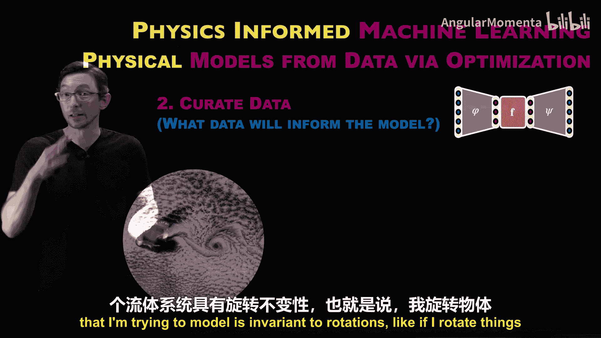
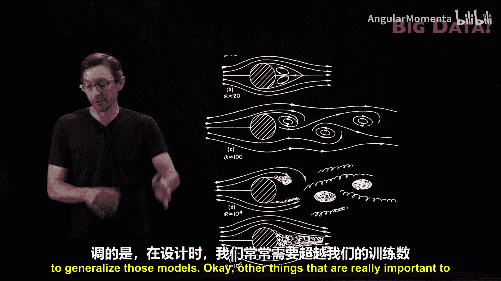
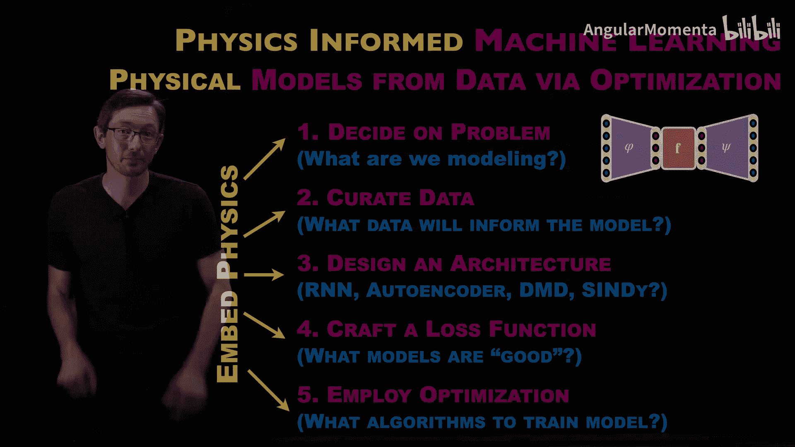

# 003：训练数据遴选

在本节课中，我们将探讨物理信息机器学习的第二阶段：如何遴选和整理用于训练模型的数据。数据是机器学习的基石，而融入物理知识可以极大地影响我们收集、选择和使用数据的方式。我们将讨论数据多样性、坐标系统、仿真与实验数据对比、数据偏见、罕见事件以及数字孪生等关键概念。

## 数据多样性与物理约束

上一节我们介绍了物理信息机器学习的基本框架，本节中我们来看看数据遴选的具体策略。数据的形式多种多样，没有一种放之四海而皆准的方法。关键在于思考如何将物理知识融入数据整理过程。

一个核心观点是：**融入物理知识通常可以减少对数据量的需求**。例如，对于一个昂贵的实验，获取大量数据样本非常困难。传统的机器学习，尤其是大型神经网络，通常需要海量数据。但如果能通过物理知识来约束神经网络，缩小其搜索空间，就常常可以用少得多的数据成功训练模型。这对于数据样本稀少的物理或工程系统至关重要。

## 利用对称性进行数据增强

在数据整理阶段，将物理知识融入模型的一个直接方法是**数据增强**。如果你知道所研究的系统具有某种对称性（如平移不变性或旋转不变性），就可以利用这些对称性来扩充数据。

例如，如果你认为要建模的流体系统具有旋转不变性（即旋转系统不会改变其物理本质），那么原则上你可以通过旋转原始数据来创建新的数据副本，从而丰富数据集。这样，有限的数据就能发挥更大作用，训练出更强大、更通用的模型。这种方法在经典机器学习和物理工程系统的机器学习中已应用多年。

## 坐标系的重要性

测量数据所使用的**坐标系**极其重要，这是人类专业知识和物理直觉能在机器学习过程中发挥巨大作用的地方。

以一个经典图示为例，它展示了太阳系的日心说和地心说模型。地心说以地球为宇宙中心，而日心说以太阳为中心。关键在于：如果我试图训练一个机器学习模型来预测这些彩色点的运动，在地心坐标系下，模型将需要处理复杂得多的曲线，需要更多项来解释物理，训练难度大大增加。而在日心坐标系下，物理规律更简洁，模型训练起来就容易得多。

因此，如果你了解正确的坐标系，选择合适的测量坐标系能为你的机器学习模型提供一个巨大的先发优势。反之，如果你不知道正确的坐标系，可以尝试不同的坐标变换。哪个坐标系下的模型训练更快、误差更低，就可能暗示了哪个是更合适的坐标系。发现正确的坐标变换本身就是一个重要的研究问题。

## 仿真数据与实验数据

你的数据是来自**仿真**还是**实验**，会极大地影响数据的性质及其在机器学习模型中的使用方式。

以下是两者的主要对比：

*   **仿真数据**：通常能提供更丰富的空间信息和高分辨率的空间场，这些在实验中很难获得。但仿真往往计算成本高昂，难以长时间运行或覆盖大量参数。
*   **实验数据**：可能无法提供完整的流场信息，但可以长时间运行，获得长时间序列的数据，尽管空间测量点可能较少。

此外，仿真数据基于已知的物理原理（如 `F = ma` 或纳维-斯托克斯方程）。如果仿真中做了近似或忽略了某些未知物理，这些偏差就会 inherent 地存在于数据中。因此，**实验数据仍然是黄金标准**，它能揭示模型假设的缺陷。例如，一个真实摆锤的运动可能包含线性摩擦、轴承间隙、非线性风阻等细微效应，这些在基于欧拉-拉格朗日方程的简化仿真中很难完全体现。

很多时候，我们会面临**混合数据**的情况：拥有大量基于简化物理的仿真数据，以及少量但更贴近真实物理的实验数据。机器学习可以作为一个通用的数据处理框架，帮助我们**融合来自不同来源、不同模态、不同保真度、不同时空分辨率的数据**。

## 数据代表性、泛化与设计优化

在考虑数据时，需要思考：你的数据在时间、空间和参数上是否足够丰富和具有代表性？你是否在尝试建模一个已经被建模过的东西，从而可能将先验偏见带入模型？

这一点在设计优化中尤为重要。我们常常试图设计一个前所未有的新设备（如性能更优的飞机机翼）。显然，这个最优的设计目标**并不在你的训练数据中**（如果在，你就不需要设计它了）。

想象一个设计参数空间，每个点代表一种设计（如不同的机翼形状），对应不同的性能（如升力和阻力）。我们寻找的是**训练数据分布之外**的、具有更好性能的新设计点。这意味着，对于设计优化，我们需要机器学习模型能够**泛化到训练数据之外**。

大多数机器学习模型擅长在已见过的数据点之间进行**插值**，但要获得革命性的新设计，需要模型能够**外推**。实现外推泛化的一个关键方法，就是将物理知识（如对称性、守恒律）融入模型，并确保模型是简洁的（如使用稀疏性促进的正则化项）。这样，模型就更有可能对未见过的案例做出合理预测。

## 数据偏见与罕见事件

**数据偏见**是另一个需要重点考虑的问题。例如，在药物发现或材料科学中，训练数据通常只包含那些“成功”的样本（如实际有功能的蛋白质）。但存在一个近乎无限的“失败”样本空间，它们不会出现在训练数据中。这种偏见会使模型倾向于发现与传统类似的东西，难以实现真正的创新。

**罕见事件**是数据偏见的另一种形式。例如，海洋中的**畸形波**是破坏性极强但极其罕见的事件。在海洋波浪数据中，99.999% 的数据都不是畸形波。如果直接用这样的数据训练模型，模型很容易通过专注于预测“普通”波浪而获得很高的准确率，完全忽略罕见但重要的畸形波。

处理这类问题，需要采取措施平衡数据（例如人为增加罕见事件的权重），并在机器学习过程中融入物理知识，以确保动力学被准确捕获，从而能在模型中观察到这些罕见事件。

## 微弱信号与隐藏变量

有时，我们需要建模的信号非常**微弱**。例如，水星近日点进动现象，牛顿力学解释了其 99.9% 的运动，而广义相对论只需修正那剩下的 0.1%。如果训练一个仅以最小化误差为目标的机器学习模型，它几乎肯定会选择牛顿定律，因为要捕捉那微小的相对论效应信号非常困难。这凸显了人类逻辑和科学方法在识别和解释微弱信号方面的重要性。

**隐藏变量**在物理和工程系统中是普遍存在的。我们通常无法测量系统中所有重要的变量，而只能基于部分信息建立模型。例如，在研究大脑活动或流体绕机翼流动时，很多状态变量是无法直接测量的。

机器学习为解决这个问题提供了强大工具。例如，对于洛伦兹系统，我们可能只测量到 `x` 坐标的时间序列。通过设计特定的神经网络架构，我们可以学习一个坐标变换，从单个测量中**推断出系统的完整状态**，并学习描述该状态演化的微分方程。这展示了如何利用部分数据和机器学习来填补信息空白。

## 数字孪生与主动学习

**数字孪生**是物理与机器学习结合的一个重要工业应用，旨在为物理资产构建数字模型，以改进优化、设计和控制。数字孪生的生命线是真实世界的数据。

理想的数字孪生构建涉及**多保真度数据源**：从廉价低精度的仿真，到昂贵高精度的仿真和实验，再到最终的实物测试数据。所有这些数据都将用于构建机器学习模型（即数字孪生）。

更先进的概念是**主动学习**。我们不仅希望数字孪生能给出预测（如某机翼设计的升力），还希望它能估计预测的**不确定性**。然后，可以建立一个反馈回路：如果数字孪生对某个有前景的设计不确定性很高，它可以主动请求在该设计点收集更多数据（可能是不同保真度的仿真或实验）。这种数据生成方式更高效、成本更低，是未来设计复杂系统的趋势。

## 总结

本节课我们一起探讨了物理信息机器学习中数据遴选阶段的多个关键方面。我们了解到，融入物理知识可以减少数据需求，通过对称性进行数据增强是有效手段。选择合适的坐标系至关重要，而仿真与实验数据各有优劣，常需结合使用。我们特别强调了数据代表性和泛化能力对于设计优化的重要性，并指出了数据偏见、罕见事件和微弱信号带来的挑战。最后，我们介绍了利用机器学习处理隐藏变量的潜力，以及数字孪生结合主动学习的未来方向。数据整理是一个需要反复迭代的微妙过程，它连接着你要解决的问题和你能获取的数据，是构建成功模型的基础。

接下来，我们将进入更引人入胜的架构、损失函数和优化部分，期待与你共同探索。