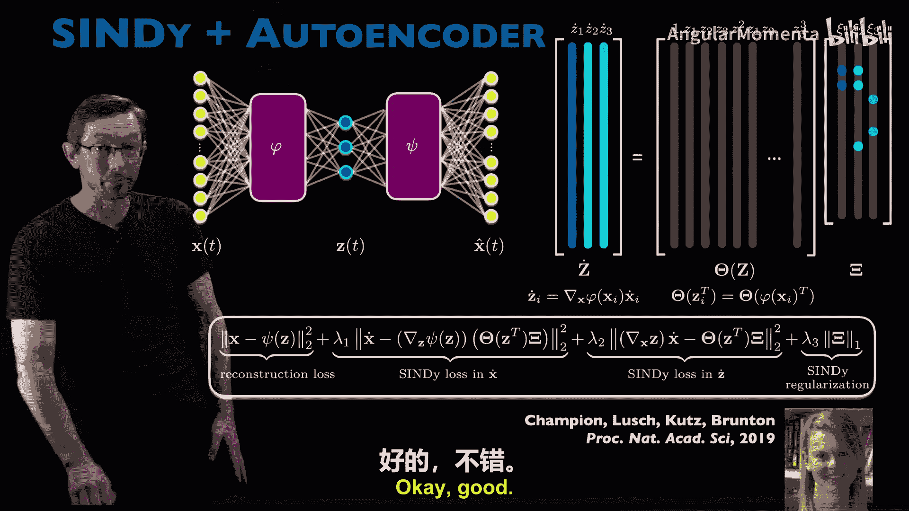
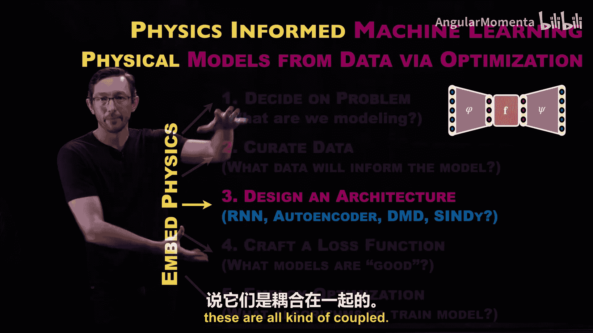

# 004：架构设计 🧠

在本节课中，我们将要学习物理信息机器学习的第三阶段：**架构设计**。我们将探讨如何通过选择或设计特定的机器学习架构，来构建本质上更具物理特性、能发现新物理规律或将已知物理知识嵌入学习过程的模型。架构设计是整个机器学习流程中非常关键且有趣的一环。

## 什么是架构？🔧

上一节我们介绍了物理信息机器学习的整体流程，本节中我们来看看什么是“架构”。在机器学习中，“架构”指的是模型的结构或框架，它定义了模型如何从输入数据映射到输出预测。

本质上，架构定义了我们搜索的函数空间。一个机器学习模型通常接收输入 `X`，并试图构建一个函数 `F` 来预测我们感兴趣的输出 `y`。这个函数 `F` 由可调整的参数 `θ` 参数化。例如，在神经网络中，`θ` 代表所有权重。

**核心公式**：
`y ≈ F(X; θ)`

不同的架构（如全连接网络、自编码器、支持向量机）定义了不同的函数空间。我们的目标是通过优化算法和损失函数，在这些空间中找到最能拟合观测数据 `(X, y)` 的那个函数 `F`。选择架构，就是在约束可能用于描述输入输出关系的函数空间。

## 物理在架构中的体现 🌌

当我们谈论“物理”时，在机器学习的语境下，我们通常希望模型具备以下特性：

1.  **可解释性与泛化性**：像 `F=ma` 这样的物理定律既简单可解释，又能广泛适用于不同场景（如苹果下落和火箭发射）。
2.  **简约性与简单性**：遵循爱因斯坦的名言“一切都应尽可能简单，但不能过于简单”。简约的模型通常能抓住物理核心，避免过拟合，从而更具泛化能力。
3.  **对称性、不变性与守恒律**：这是物理学的基石。例如，物理定律通常具有平移、旋转不变性；许多偏微分方程源于质量、动量或能量守恒。

因此，设计“物理信息”的架构，意味着选择或构建一个函数空间，该空间能天然地**促进、强制执行或便于发现**这些物理特性。

## 架构设计实例 🛠️

以下是几种在物理信息机器学习中常见且有趣的架构示例，每种都通过其结构隐式或显式地融入了物理假设。

### 1. 自编码器与稀疏识别（SINDy）🔍

这是一个将两种架构结合以发现物理的经典范例。

*   **自编码器**：假设物理系统是**低维**的。它通过一个“瓶颈”层，将高维观测数据（如图像序列）压缩到低维潜在空间（如摆的角度和角速度）。
*   **SINDy（稀疏非线性动力学识别）**：假设支配动力学的微分方程是**稀疏且简约**的。它在一个可能包含多项式、三角函数等的庞大函数库中，寻找最少的项来描述潜在变量的动力学。

通过结合两者，我们可以从高维数据中自动发现低维坐标及其简约的支配方程。

**核心思想**：通过架构选择，同时促进模型的**低维性**和**简约性**。

### 2. 定制张量层（如 Galilean 不变网络）🌊

在湍流建模中，Julia Ling 等人设计了一种具有定制输入层的神经网络架构。该架构通过其特殊的张量运算结构，**确保**了无论输入数据来自哪个惯性参考系，其输出的雷诺应力模型都自动满足**伽利略不变性**。

**核心思想**：通过精心设计的架构，将重要的物理**不变性**直接**内建**到模型中，从而减少所需数据量并提升泛化能力。

### 3. 残差网络（ResNet）与 U-Net 🕸️

*   **ResNet**：通过引入“跳跃连接”，其每个残差块的功能近似于一个数值积分器（如欧拉法）。这种架构天然适合处理随时间演化的**动力学系统**数据。
*   **U-Net**：其编码器-解码器结构带有跳跃连接，隐式地假设了真实世界数据（如图像、物理场）具有**多尺度**的空间结构。这使得它在图像分割、超分辨率等任务上非常有效。

**核心思想**：通过架构设计，融入对数据**演化方式**或**空间结构**的物理直觉。

### 4. 傅里叶神经算子（FNO）📐

这种架构直接在傅里叶域进行学习。它基于一个物理观察：许多物理场（如流体速度、温度场）在傅里叶域中具有紧凑且高效的表示，并且天然具有**多尺度**特性。FNO 的傅里叶层隐式地融入了这一物理假设。

**核心思想**：利用对物理场**频谱特性**的先验知识来设计高效的学习架构。

### 5. 图神经网络（GNN）🕸️

GNN 非常适合描述由实体及实体间相互作用构成的系统，如多体系统、分子动力学、网格上的物理模拟。其架构核心是“消息传递”机制，它假设一个实体的状态更新取决于其邻居的状态。

**核心思想**：通过架构直接编码系统的**交互结构**，并假设物理规律在局部是相似的，从而能够高效模拟复杂物理。

## 对称性与等变性：架构设计的核心数学概念 ⚖️

对称性是物理学的核心，也是将物理融入机器学习架构的最有力数学工具之一。这里有两个关键概念：

*   **不变性**：模型输出 `F(x)` 在输入 `x` 经过某种变换 `G`（如旋转、平移）后保持不变。即 `F(G(x)) = F(x)`。例如，图像分类中，“狗”的标签不应因图片旋转而改变。
*   **等变性**：模型输出会随着输入做相同的变换。即 `F(G(x)) = G(F(x))`。例如，在图像分割中，如果输入图像旋转了，分割出的掩膜也应相应旋转。

**核心思想**：通过设计具有**等变性**或**不变性**的架构，我们可以将已知的物理对称性直接构建到模型中。这能**极大减少训练所需的数据量**，并显著提升模型的**泛化性能**。卷积神经网络（CNN）的平移不变性就是一个早期成功例子。现在，研究者们正在为更复杂的对称群（如旋转群）设计等变网络。

## 架构与损失函数的关系 🔗

需要强调的是，架构设计与下一阶段（损失函数设计）紧密耦合。
*   特定的架构通常需要搭配定制的损失函数来训练（例如，自编码器使用重建损失）。
*   一些方法（如物理信息神经网络 PINNs、拉格朗日神经网络）的核心思想虽然主要通过损失函数体现，但也依赖于神经网络架构能够方便地计算导数等特性。

因此，架构和损失函数共同决定了我们如何将物理知识注入机器学习模型。

## 总结 📚

本节课我们一起学习了物理信息机器学习的第三阶段——架构设计。我们了解到：

1.  机器学习**架构**定义了我们搜索的**函数空间**。
2.  通过选择或设计特定的架构，我们可以将物理先验知识（如**低维性、简约性、对称性、守恒律、多尺度结构**）嵌入模型中。
3.  这样的“物理信息”架构能够帮助我们**用更少的数据进行学习**，并得到**泛化能力更强、更可解释**的模型。
4.  **对称性**和**等变性**是连接物理与架构设计的核心数学概念，是当前研究的热点。

在接下来的课程中，我们将深入探讨损失函数设计，并详细研究本节课提到的各种具体架构及其应用案例。