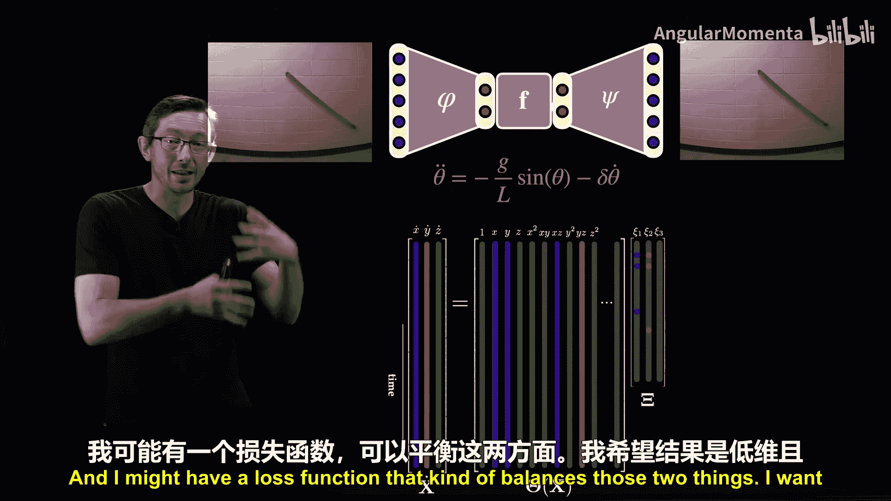
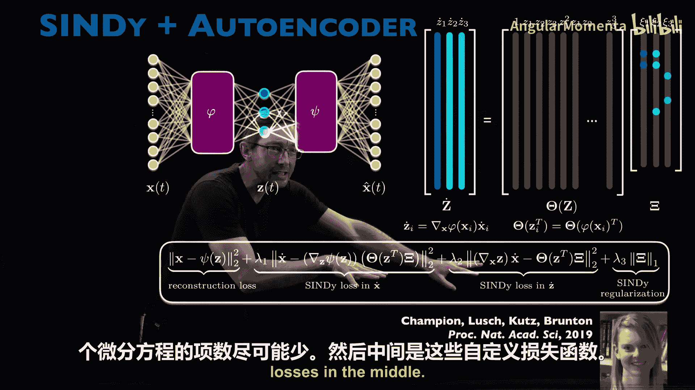
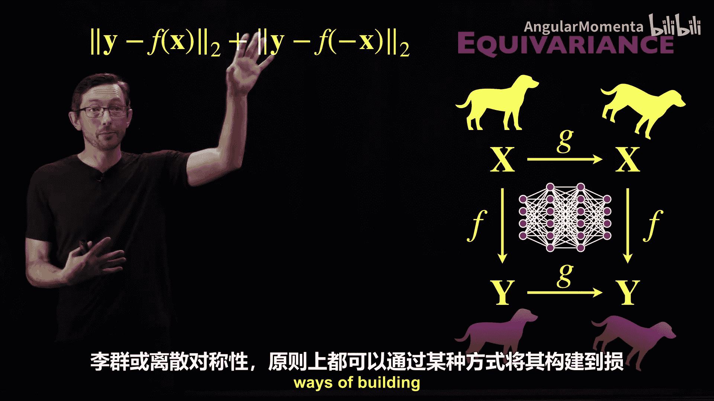

# 005：构建损失函数

在本节课中，我们将学习如何为机器学习模型构建损失函数，以将物理知识嵌入到学习过程中。这是物理信息机器学习中最常用且最直接的方法之一，能有效提升模型的泛化能力、学习效率和样本效率。

## 损失函数的作用

上一节我们讨论了模型架构，本节我们来看看如何通过损失函数来引导模型学习物理规律。损失函数定义了模型预测与目标之间的差距，是训练过程中优化的目标。通过精心设计损失函数，我们可以将已知的物理定律（如守恒律、偏微分方程）作为约束加入，使模型学习结果更符合物理规律。

以下是几种将物理知识融入损失函数的核心方法。

### 1. 物理信息神经网络

物理信息神经网络是一种巧妙的方法，它在标准的数据拟合损失之外，增加了一个基于物理方程的损失项。

*   **核心思想**：假设我们用一个前馈神经网络来预测某个物理场（如流体速度场 `U`、`V`、`W` 和压力场 `P`）。除了让预测值匹配训练数据（数据损失），我们还可以利用现代框架（如 PyTorch、JAX）的自动微分功能，计算网络输出对输入（空间、时间）的偏导数。
*   **物理损失项**：然后，我们增加一个额外的损失项，该损失项衡量网络预测的物理量在多大程度上违反了控制该系统的偏微分方程（例如纳维-斯托克斯方程）。公式表示为：
    `总损失 = 数据损失 + λ * 物理方程残差`
    其中，`λ` 是一个超参数，用于平衡两项损失。
*   **优势与局限**：这种方法允许用更少的数据训练出更符合物理的模型。但需要注意的是，物理损失项只是“促进”而非“强制”方程被精确满足，最终模型是数据拟合与物理约束之间的一个折衷。

### 2. 促进守恒律

类似地，如果我们知道系统必须满足某个守恒律（如质量守恒），可以直接将其作为损失项加入。

*   **具体示例**：对于不可压缩流体，速度场 `U` 的散度必须为零：`∇·U = 0`。我们可以在损失函数中加入一项 `||∇·U_预测||²`，以促进模型预测满足不可压缩条件。
*   **效果**：研究表明，加入此类守恒损失项的模型，能更好地捕捉精细结构，并更准确地保持物理量（如质量）守恒。

### 3. 架构与损失函数的协同

模型的物理特性往往通过架构和损失函数共同实现。以拉格朗日神经网络为例：

*   **架构角色**：网络被设计为学习系统的拉格朗日量 `L`。
*   **损失函数角色**：训练时，损失函数要求由学到的 `L` 通过欧拉-拉格朗日方程推导出的动力学，必须与实际观测数据匹配。这确保了整个架构确实表现为一个拉格朗日系统。

### 4. 通过范数促进简约性与可解释性

物理学长期遵循“简约性”原则，即用尽可能简单的模型描述现象。在机器学习中，我们可以通过损失函数中的特定范数惩罚来促进模型的简约性。

*   **L2范数与低维性**：L2范数（欧几里得距离）常用于促进模型的低维表示。例如，在自编码器中，我们用L2重构误差来学习数据的一个低维潜在空间。
*   **L1范数与稀疏性**：L1范数（曼哈顿距离）能促进解的稀疏性，即让模型中的大多数参数为零。这在学习动力学方程时非常有用。
*   **应用示例**：在一个结合自编码器和动力学学习的模型中，可能会同时使用L2范数损失来确保低维编码的重构质量，并使用L1范数损失来确保学到的微分方程尽可能简洁（项数少）。

### 5. 稀疏识别与模型选择

稀疏识别非线性动力学 方法是一个直观的例子，展示了损失函数中的范数选择如何直接影响模型的物理性。

*   **问题设定**：假设我们有系统状态 `X` 随时间变化的数据，希望找到一个微分方程 `Ẋ = Θ(X)Ξ` 来描述它，其中 `Θ(X)` 是候选函数库（如多项式、三角函数），`Ξ` 是系数矩阵。
*   **损失函数设计**：我们不仅希望模型拟合数据（使用L2损失衡量误差），还希望模型系数 `Ξ` 稀疏（即多数为零）。这可以通过在损失函数中加入L1正则化项来实现：
    `损失 = ||Ẋ - Θ(X)Ξ||₂² + λ||Ξ||₁`
*   **平衡准确与复杂**：超参数 `λ` 控制对复杂性的惩罚力度。通过调整 `λ`，我们可以在“欠拟合”（过于简单）和“过拟合”（过于复杂，如包含81个项）之间找到“金发姑娘区”，即那个用最简单且足够准确的模型描述数据的平衡点。

### 6. 在损失函数中嵌入对称性

物理系统通常具有对称性（如旋转对称、平移对称）。除了通过数据增强来学习对称性，我们也可以将其直接编码进损失函数。

*   **实现方式**：例如，如果系统具有镜像对称性，即输入 `x` 和 `-x` 应产生相同的输出，我们可以在损失函数中添加一项：`||F(x) - F(-x)||²`。这相当于在损失函数中进行“虚拟”数据增强，促使模型学习这种对称性，而无需显式复制训练数据。

## 总结

本节课中，我们一起学习了如何通过精心设计损失函数，将物理知识嵌入机器学习模型。我们探讨了多种方法：
1.  添加基于控制方程的物理损失项。
2.  引入守恒律作为约束。
3.  利用L2和L1范数分别促进模型的低维性和稀疏性，从而获得更简约、可解释且泛化能力强的模型。
4.  将对称性要求直接编码进损失函数。

损失函数为我们提供了“引导”模型学习物理规律的灵活手段。下一节，我们将讨论**优化**过程，它与损失函数紧密相关，是调整模型参数以最小化损失函数的关键步骤。通过约束优化等技术，我们甚至能够更严格地“强制”模型满足物理规律。