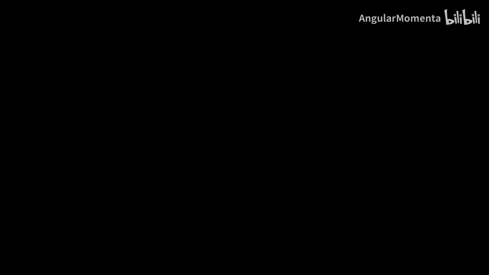
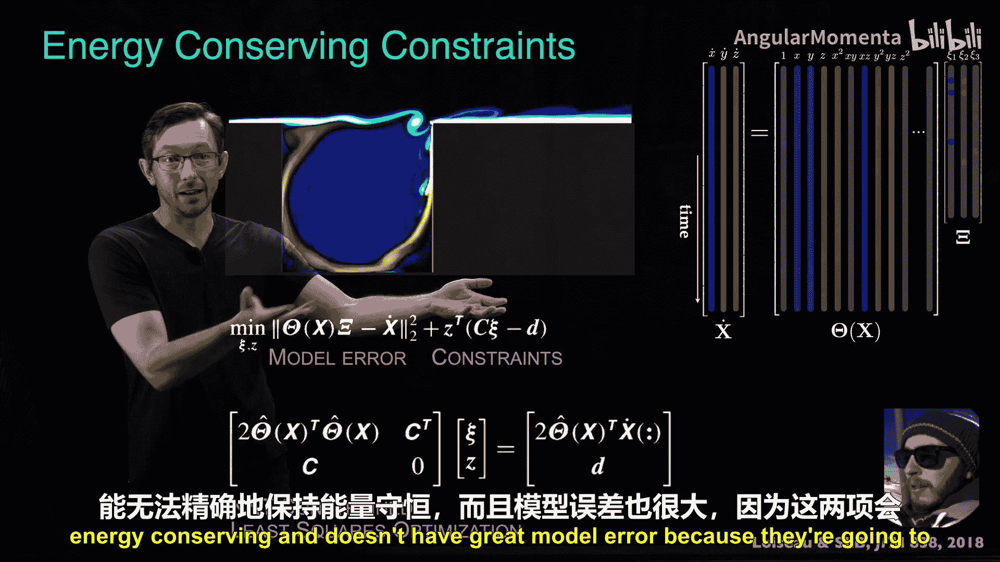
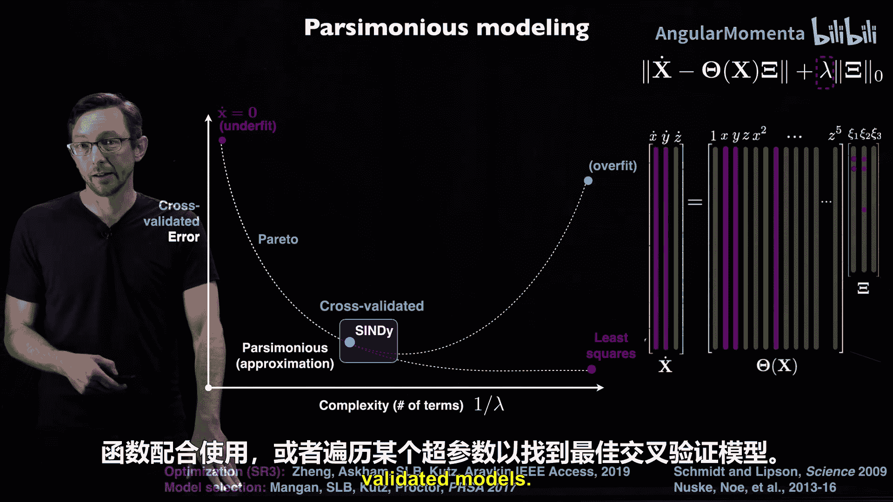

# 006：采用优化算法

在本节课中，我们将探讨物理信息机器学习的第五个阶段：采用优化算法来训练机器学习模型。我们将了解如何将物理知识直接嵌入到优化步骤中，从而获得更符合物理规律的模型。

## 概述

我们已经介绍了机器学习的五个阶段，并讨论了在每个阶段嵌入物理知识的机会。本节将聚焦于第五个阶段——优化算法。一旦确定了模型、问题和训练数据，接下来的架构选择、损失函数构建和优化算法应用这三个步骤通常是紧密相连的。优化算法的任务是调整架构参数，以最小化在数据上平均的损失函数。我们将看到，通过改变优化算法本身，我们可以更严格地将物理约束融入模型。

## 约束优化：以流体建模为例

上一节我们讨论了损失函数，本节我们来看看如何通过优化算法直接施加物理约束。第一个例子来自Jean-Christophe Loiseau的工作，展示了如何将约束优化与机器学习结合，用于流体建模。

在标准的稀疏识别（SINDy）建模方法中，我们试图找到一个稀疏的系数向量 **C**，使得库函数矩阵 **Θ** 的列线性组合能近似表示状态导数（如 **ẋ, ẏ, ż**）。标准的做法是构建一个包含模型误差和稀疏性惩罚项的损失函数进行最小化。

然而，对于不可压缩流体流动，从第一性原理可以推导出一组必须满足的等式约束条件（例如能量守恒）。Jean-Christophe Loiseau指出，与其仅仅将这些约束作为惩罚项加入损失函数，不如直接进行**约束最小二乘优化**。这样，我们可以在**精确满足**这些物理约束的前提下，最小化模型误差。

具体来说，他使用了**KKT（Karush-Kuhn-Tucker）条件**来求解这个约束优化问题。这种方法比在损失函数中添加惩罚项更强大，因为它能保证得到的模型严格满足物理定律（如能量守恒），而不会让误差项和约束惩罚项在优化中相互冲突。

## 物理信息动态模式分解（piDMD）

另一个通过改变优化算法来提升模型性能的领域是物理信息动态模式分解（piDMD），由Peter Baddoo等人提出。

在某些情况下，我们从物理知识中知道系统模型应具有特定的对称性（例如厄米性）。piDMD的核心思想是，在优化过程中直接约束搜索空间，只寻找满足特定对称性（即位于某个**矩阵流形**上）的线性动力系统模型 **A**。

标准的DMD本身也是一种约束优化，它搜索的是**低秩（rank-R）**的矩阵 **A**。piDMD则进一步改变了搜索的矩阵空间，将其约束到具有特定对称性（如厄米、三对角、循环等）的矩阵流形 **ℳ** 上。

对应的数学优化问题称为**Procrustes问题**。通过这种流形约束优化，piDMD能够比标准DMD更准确地捕捉系统的真实本征结构。当无法获得精确解时，也可以将对称性作为惩罚项加入损失函数。

这个方法的通用流程是：
1.  将物理知识（如平移不变性、旋转不变性、能量守恒）解释为数学表达式。
2.  将该数学表达式映射为模型必须满足的特定结构（如矩阵流形或等式约束）。
3.  设计一个优化算法，在满足该结构的约束下求解优化问题。

## 约束优化：子空间与流形

我们讨论了SINDy中的等式约束和piDMD中的流形约束，现在来总结一下这两种约束的几何意义。

在SINDy的例子中，Jean-Christophe Loiseau提出的等式约束在可能的模型函数空间中定义了一个**子空间**，我们希望找到的模型位于这个子空间内。

在piDMD的例子中，对称性约束（如厄米性）则定义了一个**子流形**。所有满足该对称性的矩阵构成了全部矩阵空间中的一个弯曲子集。

这两种都是非常通用的思路。线性约束通常有容易的闭式解（如KKT优化），而许多流形约束问题（如Procrustes问题）也有精确解法。

当然，我们也可以不改变优化算法，而是通过在损失函数中添加一项来“促进”模型接近该子空间或流形。例如，在标准的L2误差损失函数中加入模型预测到该流形投影距离的度量。

然而，直接设计或采用一个约束优化算法，强制解位于该流形或子空间上，通常是更优的方法。它能**保证**解严格满足约束，而损失函数惩罚项只能促使解接近约束，无法保证严格满足。因此，在可能的情况下，应优先采用约束优化。

对称性是编码已知物理知识的主要方式之一。即使我们只观测数据，有时也能发现数据中存在的对称性，这可以指导我们如何约束模型。Sam Otto等人的工作系统地讨论了如何在机器学习中**强制执行、促进和发现**对称性。

## 其他优化算法：符号回归与稀疏性

优化算法的应用远不止于此。以下是另外两个重要的领域。

**符号回归**（或称遗传编程）是另一种有趣的机器学习方法。它使用组合函数树来表示模型（架构），并通过**进化优化算法**（如交叉、变异）来训练这些树，以发现描述数据的微分方程或守恒律等可解释模型。这里，优化算法本身（进化算法）就是引导搜索、融入对简单函数块偏好的关键。

**稀疏性与简约性**是物理建模的核心原则，即“如无必要，勿增实体”。我们希望机器学习模型尽可能简单（低维、稀疏），同时又能充分描述数据。

这通常通过最小化**L2范数**（促进低维）和**L1范数**（促进稀疏）来实现。针对这些目标，存在专门的优化算法。例如，在SINDy中，为了发现最简单的微分方程，我们需要寻找最稀疏的系数向量 **C**。

我们可以使用最小二乘法（有闭式解）、Lasso回归或弹性网络等，它们各自对应不同的优化算法。我们团队也与合作者一起开发了新的优化算法（如SR3），以更高效、更准确地求解这类稀疏优化问题。

此外，我们通常还需要优化**超参数**（如正则化强度λ），通过交叉验证来寻找模型复杂度与误差之间的帕累托最优解，从而得到泛化能力最佳的模型。

## 总结

本节课我们一起学习了如何将物理知识嵌入机器学习流程的优化算法阶段。

*   我们看到了通过**约束优化**（如KKT条件）可以严格保证模型满足物理等式约束（如能量守恒）。
*   我们了解了通过将搜索空间限制在特定的**矩阵流形**上（如piDMD），可以将对称性等物理知识直接编码到优化过程中。
*   我们讨论了与在损失函数中添加惩罚项相比，约束优化通常是**更严格**的物理信息嵌入方式。
*   我们还提到了**符号回归**中的进化算法和**稀疏性促进**中的专用优化算法，它们都是将物理直觉（如简约性）融入优化过程的例子。

归根结底，机器学习最终都归结为一个优化问题：寻找最小化损失函数的解。虽然很多时候我们可以使用现成的优化器（如随机梯度下降），但为了**强制执行**特定的物理约束，或高效处理特定的损失函数（如稀疏惩罚），开发或采用**定制化的优化算法**往往是获得更物理、更可解释模型的关键。这是将物理知识嵌入机器学习中最具挑战性，但也常常是最有效的方法之一。