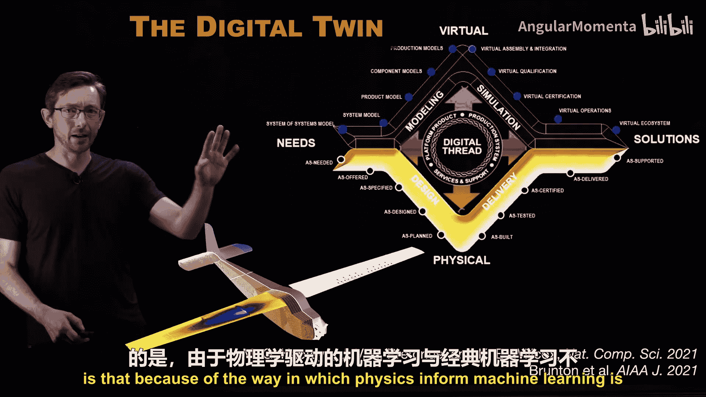
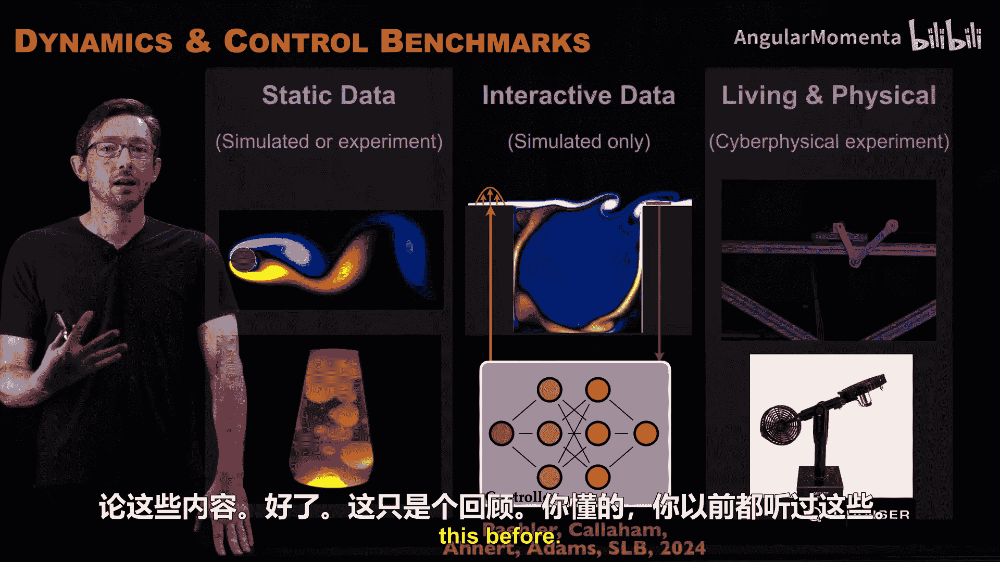

# 007：回顾与总结 🧠

在本节课中，我们将对物理信息机器学习系列讲座进行回顾与总结。我们将梳理构建物理模型的核心流程，并探讨如何将物理知识融入机器学习的各个阶段，以帮助初学者理解这一交叉领域的核心思想。

## 概述

物理信息机器学习，特指利用优化方法从数据中构建物理模型的过程。例如，我们可能拥有一个物理系统（如钟摆的视频、脑电波数据等）的数据，并希望从中学习描述该系统的坐标，以及在该坐标系下描述系统演化的动力学方程。

## 构建机器学习模型的五个阶段

构建任何机器学习模型通常都遵循以下五个主要步骤。在物理信息机器学习中，我们着重探讨如何将物理知识融入每一个阶段。

### 1. 问题定义

第一步是决定我们要建模的问题。例如，我们是否要建模机翼升力与其几何形状之间的函数关系。

### 2. 数据整理

第二步是数据整理。这涉及如何获取用于训练模型的数据。是通过建造不同几何形状的机翼并测试其升力来获取数据，还是运行大量仿真？我们需要考虑数据的可信度、成本以及如何增强数据以体现物理特性（如对称性）。

### 3. 架构设计

第三步是设计模型架构。这一步充满灵活性和创造性，它定义了我们要搜索的函数空间。架构可以是自定义的神经网络（如循环神经网络、自编码器、卷积神经网络），也可以是其他模型，如线性模型、高斯混合模型或决策树。某些架构在融入物理知识或数据有限时尤为重要。

### 4. 损失函数构建

第四步是构建损失函数。当模型在目标任务上表现良好时，损失函数的值应该很小。例如，在预测机翼升力时，损失函数可以衡量预测升力与训练数据集实测升力之间的误差。我们通过调整模型参数（如神经网络权重）来最小化这个损失函数。

### 5. 优化算法

第五步是优化。所有机器学习模型底层都有一个优化算法，用于调整模型中的自由参数，以最小化数据上的平均损失。如果损失函数足够小，模型就有望解决我们设定的问题。

## 融入物理知识的核心阶段

在上述五个阶段中，我们都有机会融入物理知识。虽然问题定义和数据整理阶段可以引入物理概念，但我们讨论物理信息机器学习时，大部分精力集中在后三个阶段：**架构设计**、**损失函数构建**和**优化算法**。

这三个阶段通常紧密相连，界限模糊。一个自定义的物理驱动架构往往需要一个自定义的损失函数来训练，而自定义的损失函数又可能需要一个特定的优化算法。

### 示例一：坐标与动力学发现

假设我们有一段钟摆的视频，我们希望学习一个低维坐标系以及描述在该坐标系下系统演化的微分方程。

*   **架构**：我们可以使用自编码器来学习坐标，使用稀疏库回归（如SINDy）来学习动力学方程。
*   **损失函数**：需要设计一个自定义的损失函数，同时衡量重构误差和动力学方程的稀疏性。
*   **优化**：可能需要使用像SR3这样的专用回归算法来优化这个包含稀疏促进项的损失函数。

这个例子清晰地展示了架构、损失函数和优化算法是如何交织在一起，共同嵌入物理知识的。

### 示例二：符号回归与遗传编程

符号回归通过遗传编程发现可解释的数学模型。

*   **架构**：函数树（一种组合函数结构）定义了模型空间。
*   **损失函数**：用于评估模型在任务上的表现。
*   **优化**：使用进化算法（如变异、交叉）作为自定义的优化算法来“培育”函数。

这同样是一个融合了三个阶段来促进物理发现的例子。

### 示例三：拉格朗日神经网络

对于机械系统等，其方程具有额外的结构（如拉格朗日结构、能量守恒）。

*   **架构**：选择用神经网络来建模拉格朗日量。
*   **损失函数**：构建一个损失函数，要求神经网络输出的拉格朗日量必须满足欧拉-拉格朗日方程。
*   **效果**：这本质上是一个具有物理结构的自定义神经微分方程，通过架构和损失函数的共同作用来保证物理一致性。

## 为何需要物理信息机器学习？🤔

你可能会问，为何要费心嵌入物理知识？以下是一些关键原因：

1.  **数据有限**：在科学和工程领域，获取高质量数据通常成本高昂（如风洞实验、新材料合成）。嵌入已知的物理约束（如对称性、守恒律）可以将模型搜索空间限制在更符合物理规律的子集内，从而**显著减少训练一个良好模型所需的数据量**。
2.  **泛化能力**：工程师常希望模型能用于设计新系统，这要求模型能**泛化到训练数据分布之外**。捕获系统的底层物理规律是实现良好泛化的关键。例如，在流体模型中嵌入能量守恒定律，能提高模型在远离训练数据区域的可靠性。
3.  **科学发现**：机器学习也可用于从数据中**发现新的物理规律**，例如从脑波数据或鱼群运动数据中发现支配其演化的方程。

## 应用与挑战 🛠️

我们将把物理信息机器学习应用于具体的工程领域，如流体力学、材料科学、机器人学和数字孪生。每个应用领域对“物理”的定义、可获取的数据类型以及模型性能要求都有其特殊性，这在构建模型时必须加以考虑。

此外，由于物理信息机器学习与传统机器学习的目标不同，我们需要**新的基准测试问题和数据集**来推动和验证该领域的发展。例如，针对动力系统、闭环流控制或实际实验室硬件测试的基准框架。

## 总结

本节课我们一起回顾了物理信息机器学习的整体框架。我们明确了构建模型的五个阶段，并深入探讨了如何在架构、损失函数和优化这三个核心环节中融入物理知识，以应对数据有限、提升模型泛化能力并助力科学发现。我们看到，这些环节在实践中常常相互交织。后续课程将通过具体案例研究，帮助我们更深入地理解如何为不同的工程和科学问题构建有效的物理信息机器学习模型。