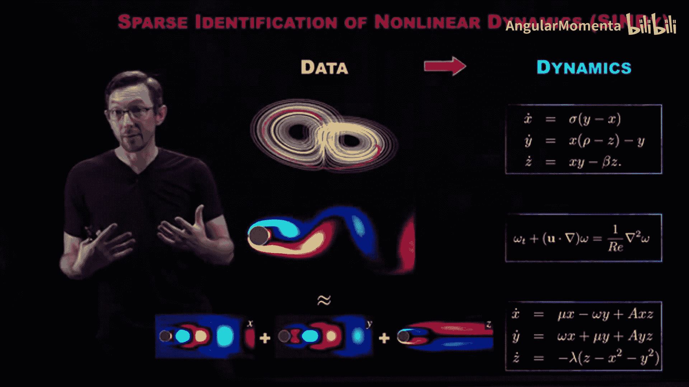
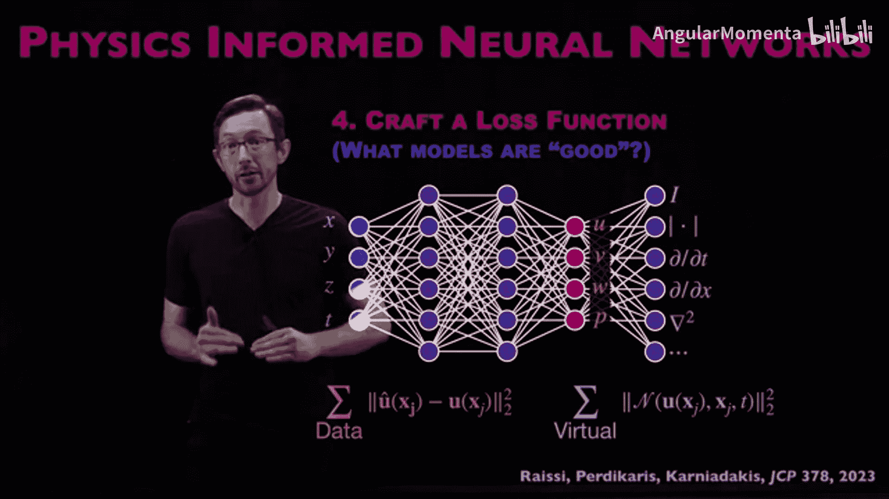
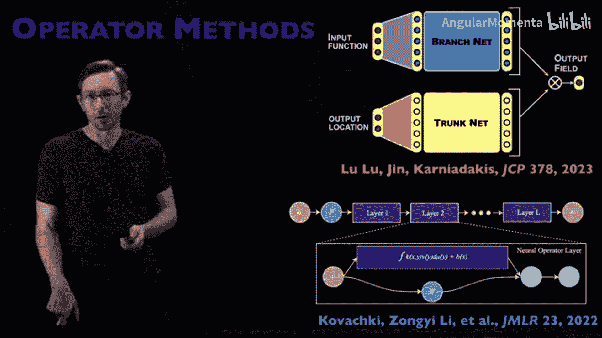
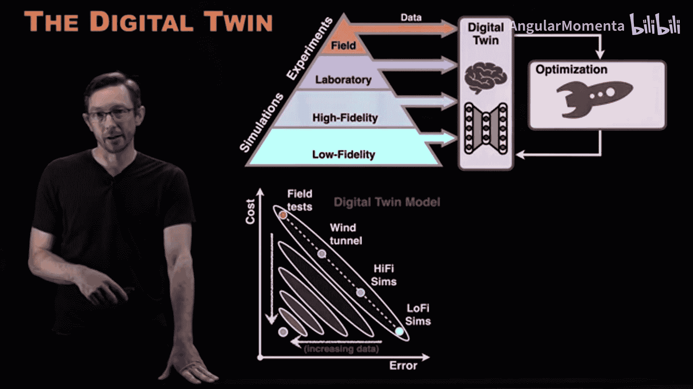

# 008：即将推出的模块与训练营预览 🚀

欢迎回来。我们关于物理信息机器学习的简短入门训练营即将结束。我们认为，向大家展示这门课程的后续发展方向会很有帮助。

本课程是一个更大规模的物理信息机器学习课程的入门部分，时长约四到五小时。在后续课程中，你可以根据自己的兴趣选择不同的主题进行深入学习。

接下来，我将概述一系列我们即将深入探讨的后续模块。这些模块的时长从一小时到十小时不等，但我的目标大致是每个模块四到五小时。

## 课程模块概览

以下是这个物理信息机器学习大型课程的第一个模块。

**1. 简约模型**
这个模块将探讨如何利用数据和机器学习技术，结合我们讨论过的不同架构、损失函数和优化算法，来发现可解释且可泛化的微分方程。同时，我们也会研究如何将这些模型应用于机械系统或流体系统等场景，使其更具物理意义。

**2. 物理信息神经网络**
PINNs是目前最流行、应用最广泛的物理信息机器学习算法之一。我们将详细讨论其设计原理、训练方法、适用场景、局限性以及各种变体。PINNs有很多不同类型，我对这部分内容感到兴奋，因为我一直想更深入地研究相关文献，自己也能学到更多。

**3. 算子方法**
与PINNs相关的是算子方法，例如傅里叶神经算子、深度算子网络、神经隐式流等。许多物理信息机器学习算法都致力于学习这些微分方程的**解算子**。我们将在算子方法上投入相当多的时间。

**4. 对称性**
对称性模块是我个人非常关注的部分，可能会深入探讨。如果时间允许，它甚至可能发展成一门完整的课程。对称性是我们在现实世界中编码物理知识的基础部分，因此也是引导、偏置或约束机器学习模型使其更具物理性的极其重要的方式。我希望能邀请该领域的顶尖专家共同参与。

**5. 数字孪生**
数字孪生在工程设计和优化中是一个非常重要的主题，而具有物理意义的机器学习模型在数字孪生框架中扮演着核心角色。降阶建模、从数据中发现模型、确保这些模型包含物理规律和对称性，对于未来设计和优化复杂工程系统的数字孪生革命至关重要。这部分内容理想情况下至少需要五小时，但根据我们的目标，很容易扩展到十小时甚至一门完整的课程。

**6. 案例研究与基准测试**
最后一部分是案例研究和基准测试。我们将花大量时间深入研究实际的物理示例，如流体力学、材料发现、机器人等，探讨简约模型或特定工程领域的研究。许多专家都有很棒的案例可以分享。同时，我们迫切需要基准问题来测试这些物理信息机器学习算法，因此也会投入大量时间梳理文献中现有的基准、它们各自适用于哪些问题类型，以及未来五年我们需要什么样的新基准问题。

以上六个模块是我目前明确计划的内容。每个模块都将是一次深度探索，有些较长，有些较短，有些最终可能发展成一门完整的课程。它们都围绕着如何在真实的工程、科学发现、设计与优化中应用物理信息机器学习这一核心理念展开。这让我非常兴奋，因为其中很多内容要么是我过去喜欢或研究很多的，要么是我渴望学习的。希望你们也同样感到兴奋。

## 核心框架回顾

好的，再次强调，这个物理信息机器学习课程的整体框架基于一个理念：**机器学习不是魔法，它只是利用优化从数据中构建模型的过程**。

构建机器学习模型有一些标准阶段，你可以在每个阶段中嵌入物理知识。正如我们之前所见，有时你可以在多个阶段嵌入物理。因此，这些模块将深入探讨这一过程的不同方面。例如，当我们讨论PINNs时，主要是在讨论**设计损失函数**；当我们讨论算子网络时，可能更多地涉及**架构设计**等。所有这些模块都会包含机器学习建模过程的某些元素，大多数会包含多个元素。

此外，当我谈论物理信息机器学习时，我们主要讨论以下两个对偶问题：

1.  **将部分已知或已知的物理知识融入机器学习算法**。这里的“已知物理”含义广泛，可能是一个偏微分方程、一个守恒定律，也可能是系统具有的某种对称性或不变量。我们可以在机器学习模型中强制或促进这些物理规律，从而通常能用更少的数据获得更好的模型，并且这些模型的泛化能力往往更强。这在工程设计中至关重要。
2.  **为更复杂的系统发现新的物理规律**。对于许多我们尚无法写出像 **F=ma** 这样简洁物理定律的复杂系统（如神经科学、人类新陈代谢等），或许我们可以利用丰富的测量数据和新兴的机器学习工具来开始发现新的物理规律。

我们将通过案例研究、基准问题等多种形式，重点探讨这种“融入与发现”的对偶范式。

## 模块深入预览

以上讨论的很多内容与我和Nathan Kutz合著的《**Data-Driven Science and Engineering**》一书中的章节相关。当然，并非全部，有些内容会出现在其他讲义中。随着讲义的编写，我会在描述中提供链接。但如果你想开始学习这些方法，这本书是一个很好的起点，其中包含了许多数学基础。

接下来，我将对每个模块进行一页幻灯片的更深入预览，让大家先睹为快。当然，你也可以选择现在停止观看，直接等待这些模块上线。

**1. 简约建模与模型发现**
大多数动力系统（如流体、大脑、金融市场、气候、流行病学等）都随时间演化，并遵循常微分方程或偏微分方程。简约建模模块的重点是，如何利用日益丰富的系统测量数据和机器学习算法，**纯粹从数据中学习微分方程**。这是一个非常激动人心的领域。

**2. 物理信息神经网络**
除了用于训练神经网络的标准损失函数外，如果你知道你的神经网络试图预测或重建的物理场（如流体速度场）受某个偏微分方程支配，你通常可以添加一个定制的损失函数，在训练过程中封装这种物理知识。这样做有很多好处：易于添加物理信息损失、通常可以用更少的数据进行训练，并且能实现一些很酷的应用。

**3. 算子网络**
神经网络通常被视为**通用函数逼近器**。但还有一种观点认为，神经网络不仅可以建模输入-输出函数，还可以建模作用于函数的**算子**。微分方程的解就是一个算子。我们将深入探讨像深度算子网络、傅里叶神经算子这样的架构，研究它们的可解释性、外推失败原因、所需训练数据量以及泛化扩展等问题。

**4. 对称性**
对称性是编码物理知识的基础。我们将深入讨论对称性，特别是“**等变性**”这一概念。如果一个神经网络 **F** 将数据 **X** 映射到 **Y**，那么该网络对于某个对称群 **G** 是等变的，当且仅当先应用 **G** 再应用 **F**，与先应用 **F** 再应用 **G** 的结果相同。这是一个数学概念，但具有深刻的物理意义（如平移不变性、旋转不变性）。相关的数学（流形理论、李群）非常优美，也是数学物理史的核心。

**5. 数字孪生**
这是机器学习在工程设计中“落地”的关键。它涉及如何构建模型的模型（其中一些可能是基于物理的，一些是机器学习的，一些是混合的），如何用新数据更新这些模型，如何利用它们设计和优化新的工程系统，以及如何将主动学习和不确定性量化融入模型。如果我们希望将机器学习应用于飞机设计等工程系统，那么将已知的物理知识构建到这些机器学习模型中至关重要。

**6. 案例研究与基准测试**
我不仅希望大家了解对称性和PINNs的理论，更希望我们一起看看这些方法如何实际改变机器人系统、材料系统、流体系统或制造系统。我们将通过案例研究，探讨不同方法的重要性、数据类型和质量上的细微差别、在不同场景中“物理”的具体含义，以及哪些方法适合数字孪生建模。

同时，我们也将一路研究基准系统，以测试这些不同的算法并观察它们的效果。

## 总结

以上就是关于这个更大规模的物理信息机器学习课程的预览。

我们刚刚完成了入门和概述模块。希望不久之后，就能推出关于这些超级有趣主题的深度探索模块和短期课程。可能还会有更多内容，这些是目前已经在规划和筹备中的。

我非常期待与大家一起学习这些内容，并在这个过程中共同成长。希望你们也同样兴奋。

谢谢，我们很快再见。