# 009：深度学习探索动力学坐标

## 概述

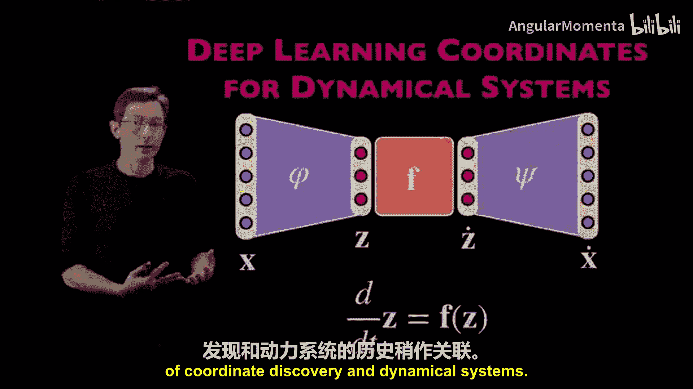

在本节课中，我们将学习一个新兴的机器学习领域：如何同时为复杂系统学习坐标系和动力学。具体来说，我们将探讨如何使用深度学习来发现坐标系，使得在这些坐标下，系统的动力学能够获得简单或简约的表示。

## 核心目标与挑战

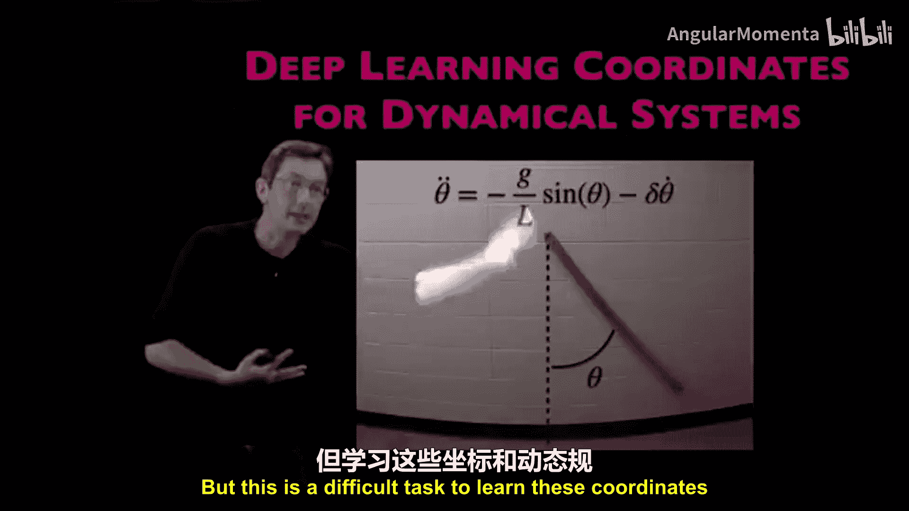

上一节我们介绍了课程的核心目标。本节中，我们来看看实现这一目标所面临的主要挑战。

在建模动力学系统 **`ẋ = f(x)`** 时，我们通常会遇到几个关键挑战：
1.  **模型未知**：我们常常不知道描述系统演化的模型 **`f(x)`**。
2.  **非线性**：即使是非线性程度不高，也会严重阻碍我们基于有限测量进行模拟、预测和控制的能力。找到合适的坐标变换可以极大地简化非线性动力学。
3.  **高维性**：现实世界的数据（如视频、流体模拟）往往维度极高。我们需要利用数据中存在的模式，找到低维表示（即自编码器的潜在坐标），从而发现动力学并处理非线性问题。

## 从线性到非线性：自编码器的演进

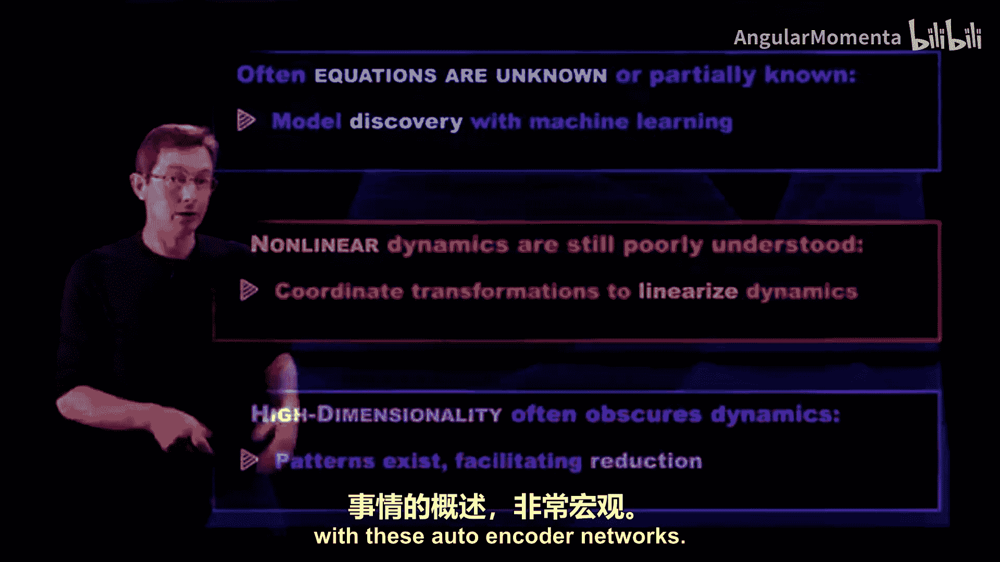

上一节我们讨论了高维数据中的低维模式。本节中，我们来看看如何利用自编码器网络来发现这些模式。

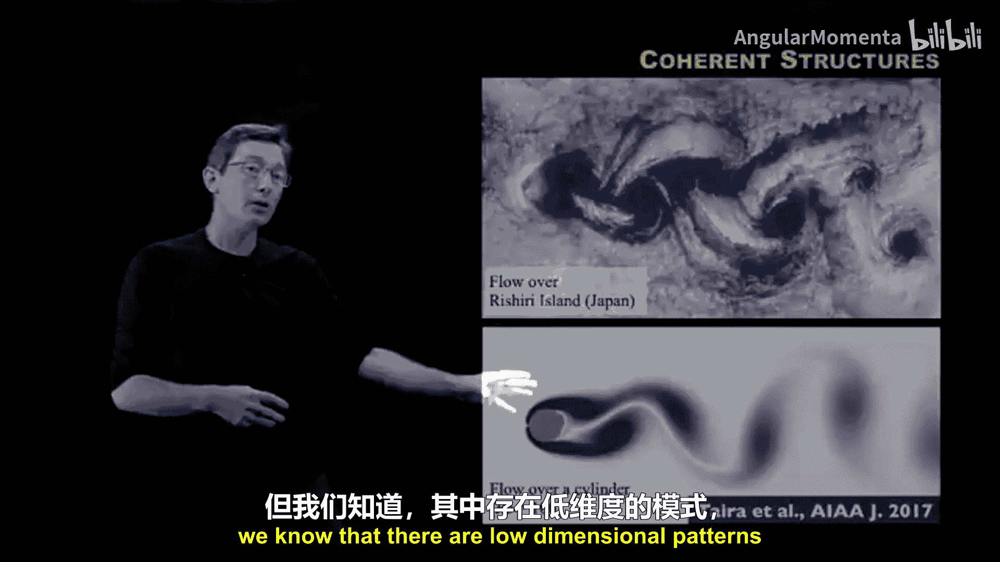

奇异值分解（SVD）、主成分分析（PCA）或本征正交分解（POD）是发现线性低维子空间的经典方法。我们可以将其视为一个浅层的线性自编码器网络：
*   **编码器**：将高维状态 **`X`** 映射到低维潜在变量 **`Z`**。
*   **解码器**：将 **`Z`** 映射回 **`X`**，目标是尽可能多地保留原始信息。

然而，线性子空间可能不足以有效表示复杂数据。因此，我们将其推广为**深度非线性自编码器**。

以下是深度自编码器与线性自编码器（如SVD）的关键区别：
*   **结构**：编码器 **`Φ`** 和解码器 **`Ψ`** 由多个具有非线性激活函数的隐藏层构成。
*   **表示能力**：它学习的是一个由 **`Z`** 参数化的**非线性流形**，而非线性子空间，从而能以更少的维度更高效地表示数据。
*   **训练**：通过定义损失函数（如重构误差）并固定潜在变量 **`Z`** 的维度，我们可以训练网络学习输入数据的潜在特征。

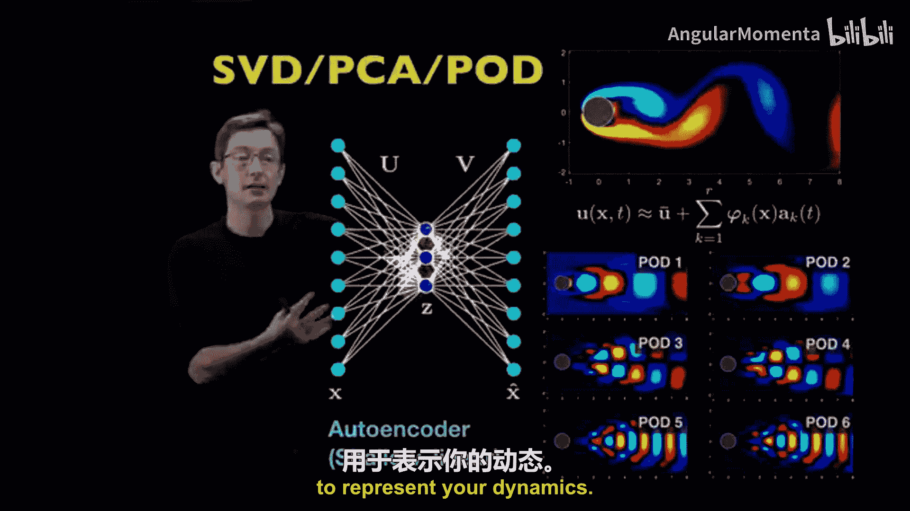

但我们的目标不止于此。我们不仅要高效地表示数据，还要能准确、高效地预测潜在空间中的动力学演化。这意味着我们需要同时学习编码器、解码器以及描述系统随时间演化的动力学模型 **`F`**。

## 坐标系的重要性：一个经典案例

在深入具体方法前，理解坐标系选择对动力学简化的重要性至关重要。

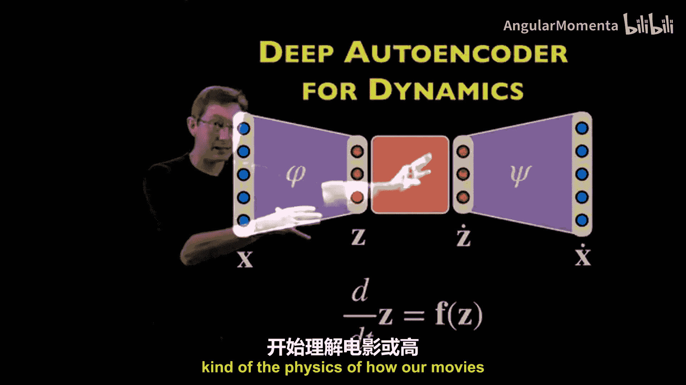

地心说与日心说模型是坐标系重要性的绝佳例证。在地心坐标系中，行星的轨迹是复杂的本轮运动，难以用简单定律描述。而在日心坐标系中，所有行星围绕太阳运动的轨迹变得简单，从而易于发现开普勒定律等基本物理规律。

这个例子表明，拥有正确的坐标系是学习简单动力学模型 **`F`** 的关键。历史上，物理学的进步往往伴随着坐标系的革新。

## 方法一：学习稀疏非线性动力学（SINDy-AE）

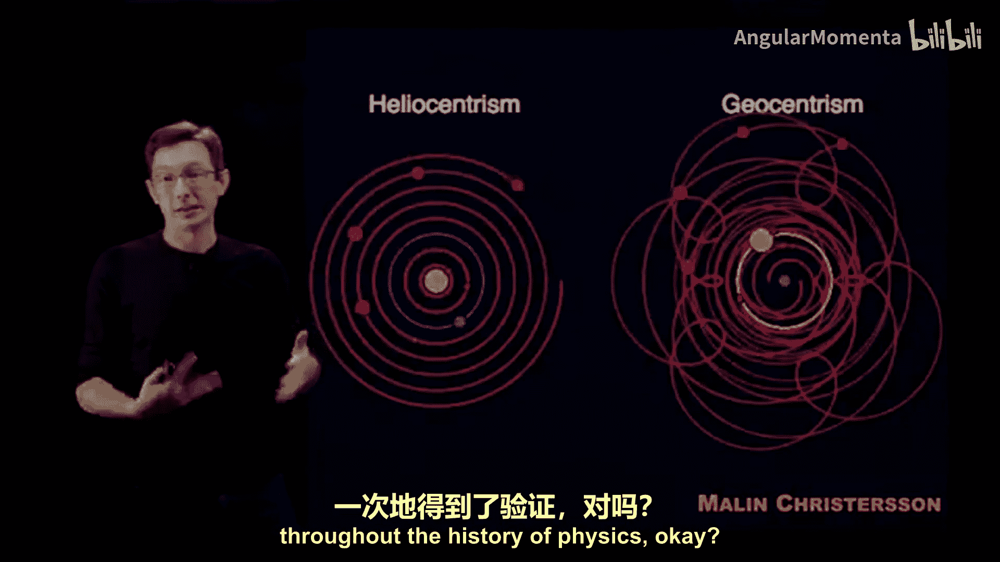

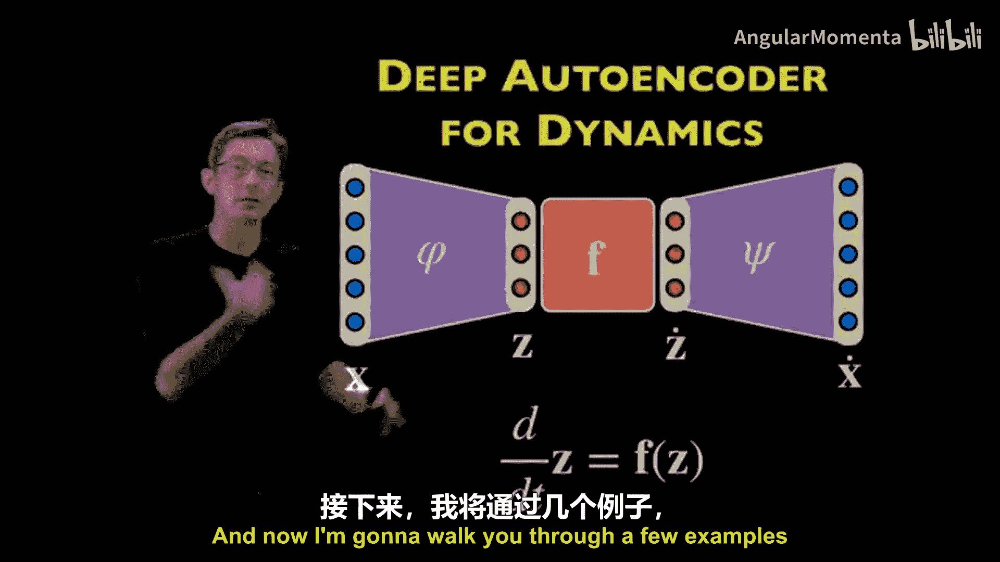

上一节我们强调了坐标系的重要性。本节中，我们来看看第一种具体方法：学习潜在空间中稀疏的非线性动力学。

Kathleen Champion 等人开发了一种结合自编码器与**稀疏非线性动力学辨识**（SINDy）的网络。其核心思想如下：

1.  **网络结构**：使用深度神经网络作为编码器 **`Φ`** 和解码器 **`Ψ`**。
2.  **动力学建模**：在潜在空间 **`Z`** 中，动力学 **`Ż = f(z)`** 被建模为一个稀疏的候选非线性函数库的线性组合。
3.  **损失函数**：除了标准的自编码器重构损失，还引入了额外的SINDy相关损失：
    *   **稀疏性正则化（L1项）**：迫使动力学方程中的项尽可能少，确保模型简洁、可解释。
    *   **动力学一致性损失**：确保通过网络不同部分（如从 **`X`** 到 **`Ż`**，或从 **`Ż`** 解码回 **`Ẋ`**）计算的时间导数保持一致，防止网络通过无意义地压缩 **`Z`** 来作弊。

这种方法能够为复杂系统（如摆的视频）学习到非常简约的动力学模型。

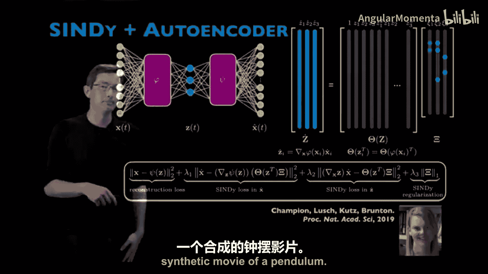

## 方法二：学习线性化动力学（Deep Koopman）

如果我们的目标不仅是简化，而是完全**线性化**动力学呢？这引出了基于**库普曼算子理论**的方法。

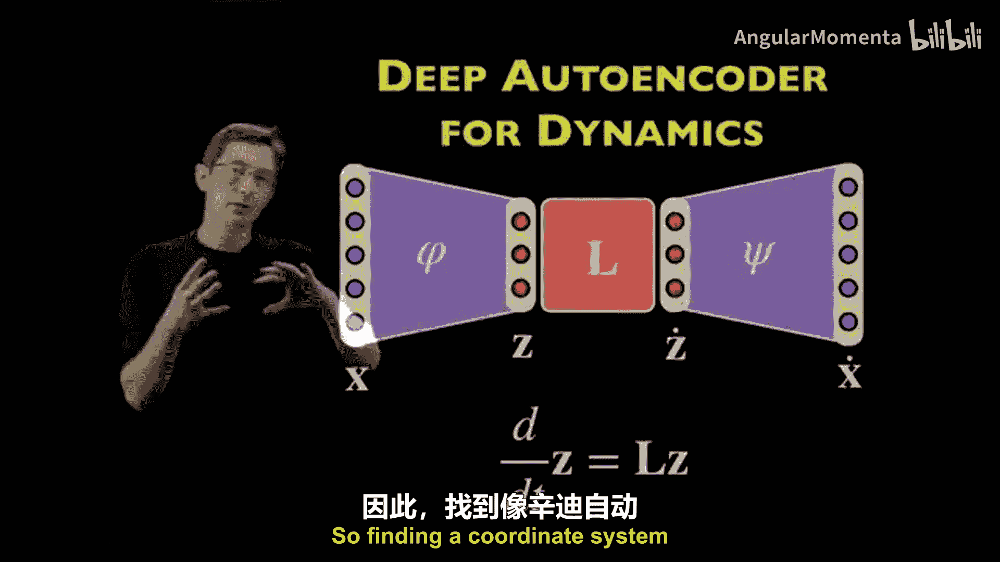

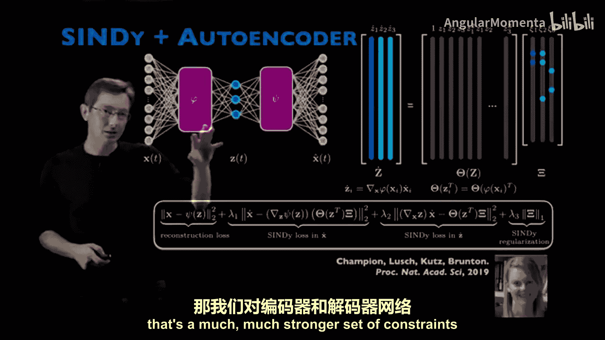

**为什么追求线性化？**
线性动力学具有解析解，并且可以使用成熟的线性代数工具（如MATLAB或Python的一行代码）进行最优估计和控制，优势巨大。

**核心思想与挑战：**
库普曼理论指出，对于许多非线性系统，存在一个（可能是非线性的）坐标变换 **`Φ`**，使得在新坐标 **`Z = Φ(x)`** 下，动力学是线性的：**`Ż = L z`**，其中 **`L`** 是一个矩阵。

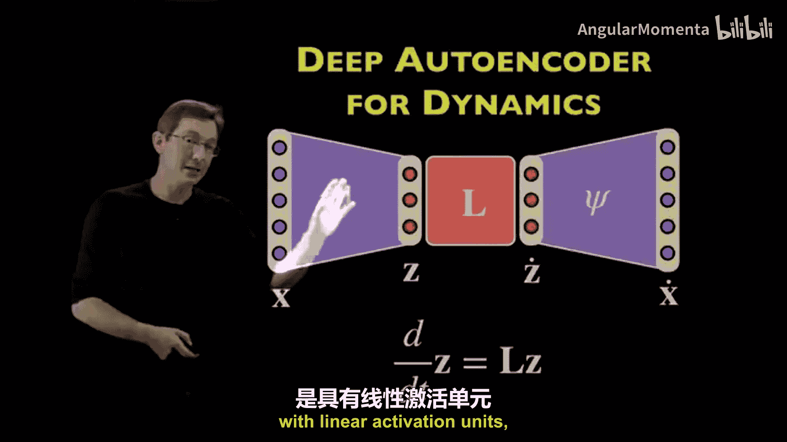

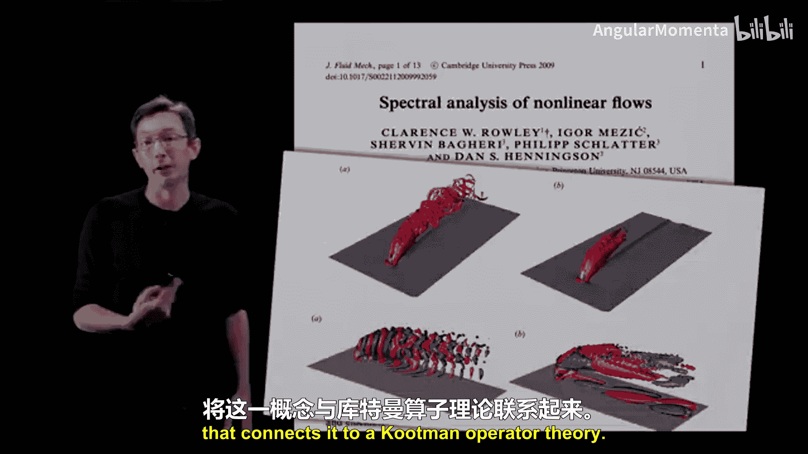

然而，找到这样一个线性化坐标变换 **`Φ`** 对编码器网络施加了极强的约束，因此训练通常更困难、成本更高。但好处是，一旦通过昂贵的离线训练找到 **`Φ`**，就可以在线快速、高效地使用这个线性模型进行预测和控制。

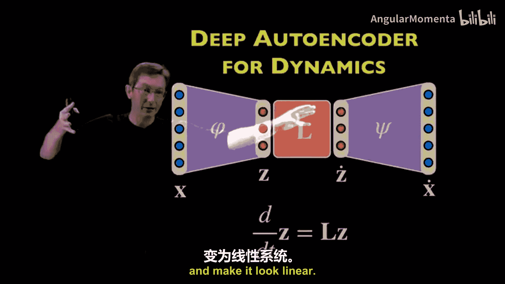

**与经典方法的联系：**
如果 **`Φ`** 和 **`Ψ`** 是线性的，那么这种线性动力学自编码器就等价于**动态模态分解**（DMD）。DMD是一种在流体力学等领域广泛使用的线性建模技术。因此，深度库普曼自编码器可以看作是DMD的**非线性推广**，它学习一个非线性坐标系，使得原始非线性系统在其中看起来是线性的。

## 架构变体：收缩式 vs 扩张式

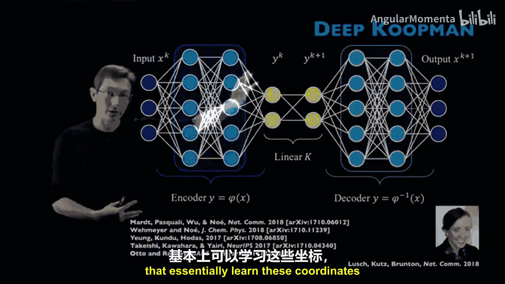

在库普曼框架下，社区主要发展出两种不同的架构哲学：

以下是两种主要的库普曼网络架构：
*   **收缩式自编码器**：将高维状态 **`X`** **压缩**到低维潜在空间 **`Z`**，并在 **`Z`** 中建立线性模型。这更符合物理直觉，即在高维系统中存在少数主导的相干结构，且低维空间通常更具可解释性。
*   **扩张式方法**：将状态 **`X`** **提升**到更高维的潜在空间 **`Z̃`**，并在该高维空间中用线性矩阵 **`K`** 建模动力学，最后映射回 **`X`**。这与机器学习中的核方法等思想一致，因为在更高维空间中非线性过程可能显得更线性。

两种方法各有优势，都是有效的探索路径。

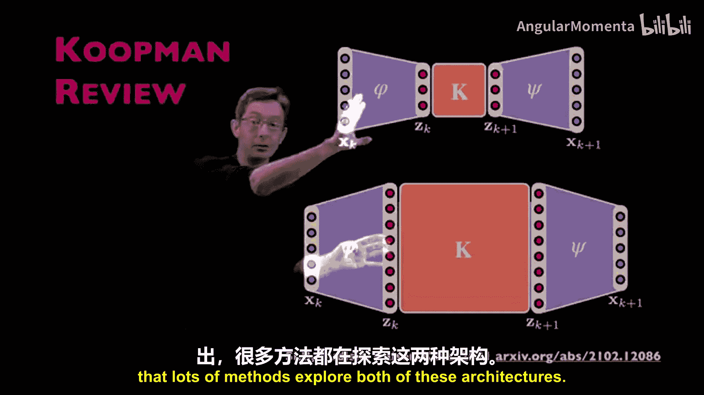

## 扩展与应用

上述方法不仅限于常微分方程（ODE）系统，还可以扩展到更复杂的场景。

**1. 偏微分方程（PDE）的线性化：**
对于时空演化系统（如描述激波形成的非线性Burgers方程），也存在使其线性化的经典变换（如Cole-Hopf变换）。利用适用于PDE的库普曼网络，我们可以仅从数据中自动学习这种线性化变换，而无需知晓任何控制方程。

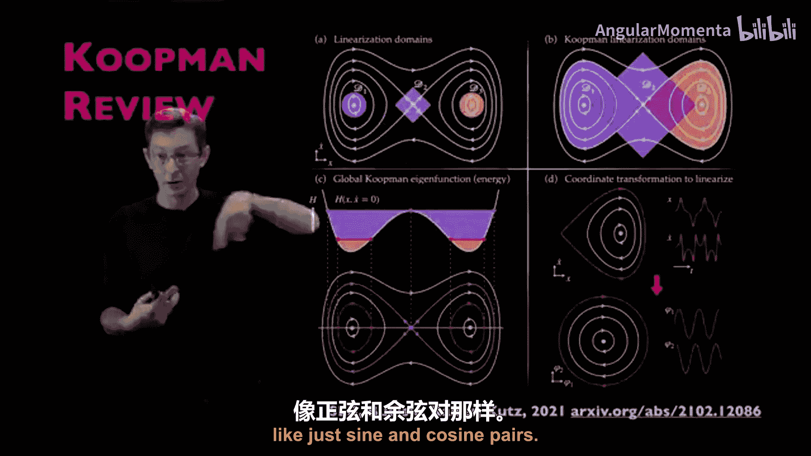

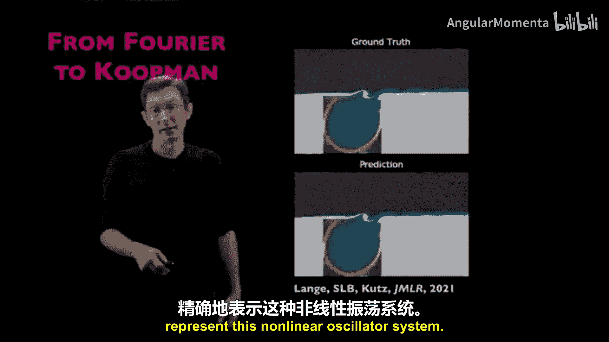

**2. 非线性格林函数：**
通过类似的非线性自编码器网络，我们可以学习非线性边值问题的“类格林函数”。这在处理大变形非线性梁理论或机翼设计等线性近似失效的领域有广泛应用。

## 总结与展望

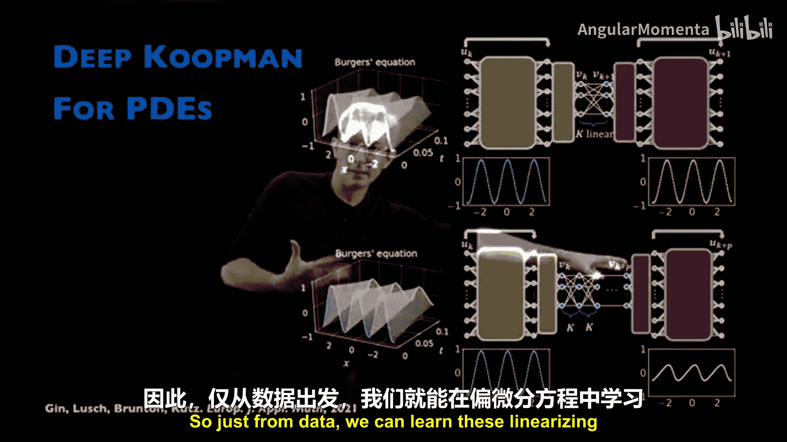

本节课中，我们一起学习了如何利用深度学习**联合学习坐标系和动力学模型**。这是物理信息机器学习或物理发现中最令人兴奋的领域之一。

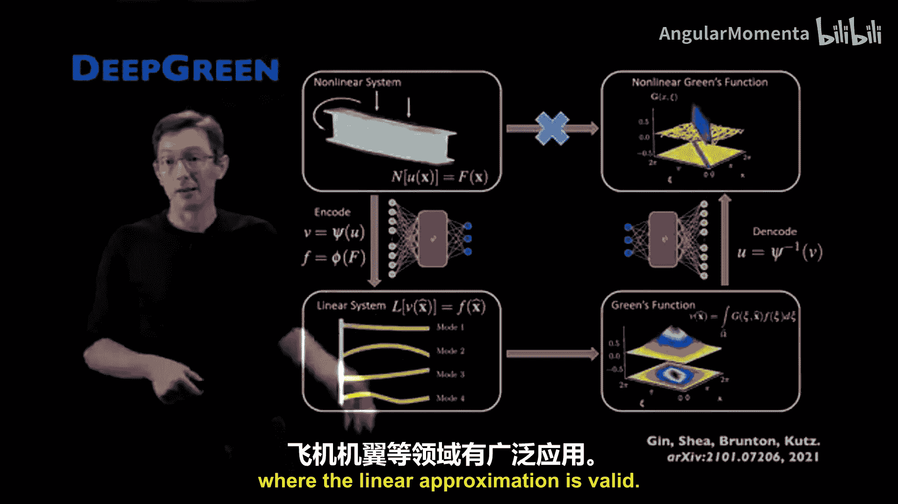

我们探讨了两种主要思路：
1.  学习使动力学 **`F`** **稀疏且非线性**的坐标嵌入（SINDy-AE方法）。
2.  学习使动力学 **`F`** **完全线性**的坐标嵌入（Deep Koopman方法）。

这两种思路正在被广泛研究，并应用于各种复杂系统。未来的研究方向包括在网络上施加更多物理约束，例如：
*   **对称性**：使嵌入尊重系统的已知对称性。
*   **守恒律**：将动量或能量守恒等定律嵌入网络结构。

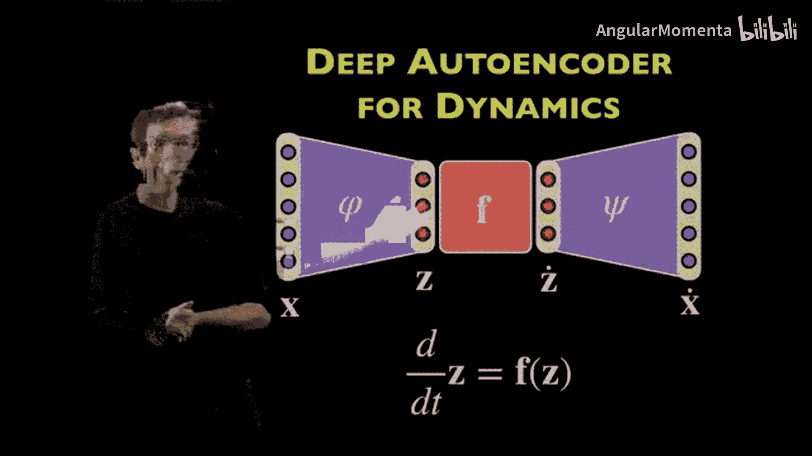

这个领域充满了机遇，鼓励大家尝试并思考如何为特定问题设计合适的网络架构和约束条件。