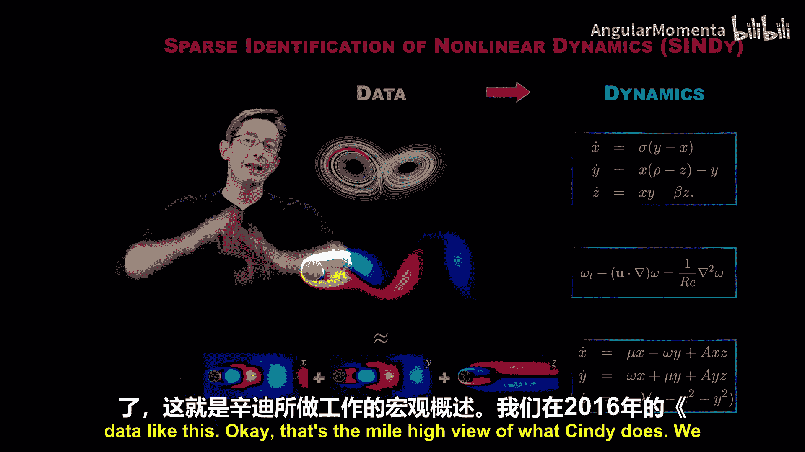
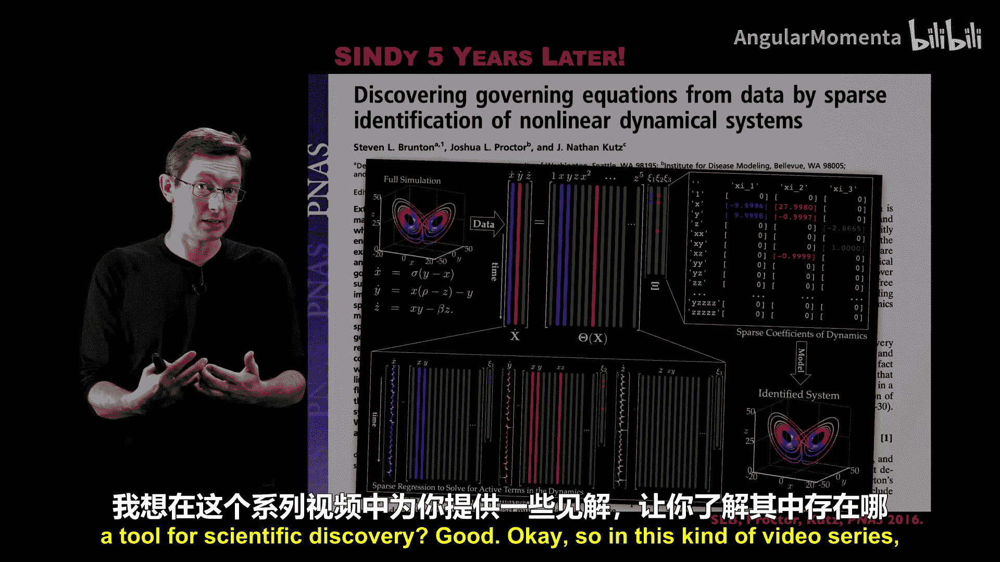
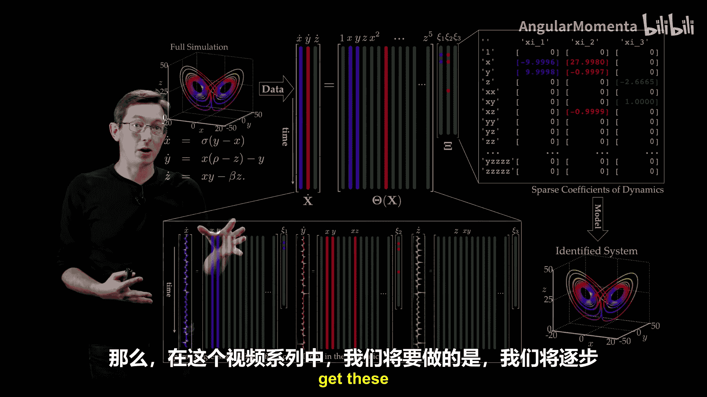
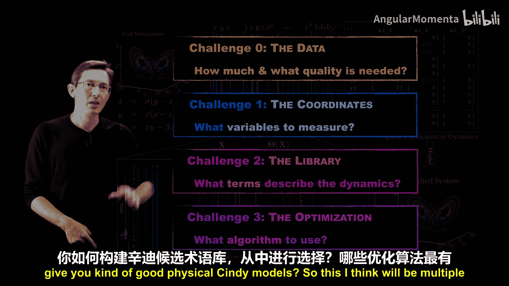
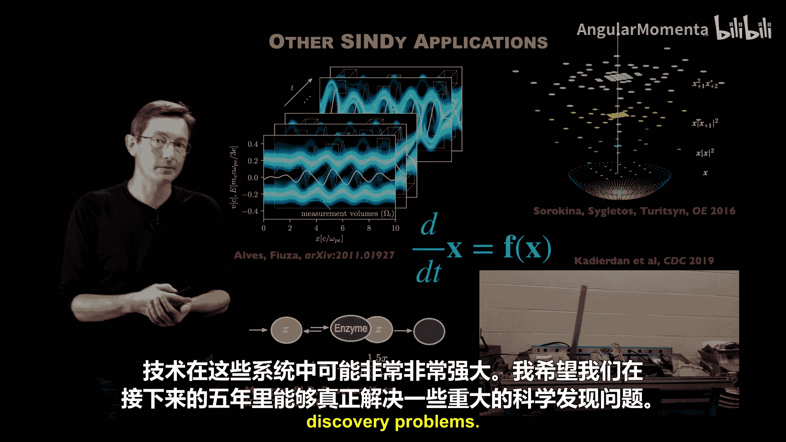
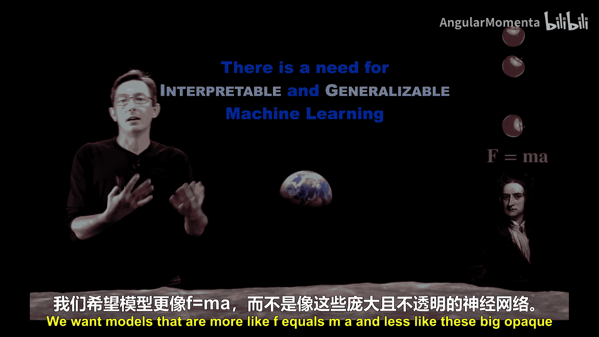
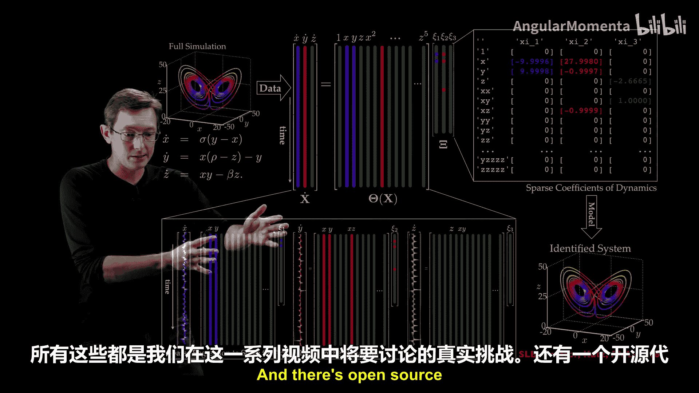
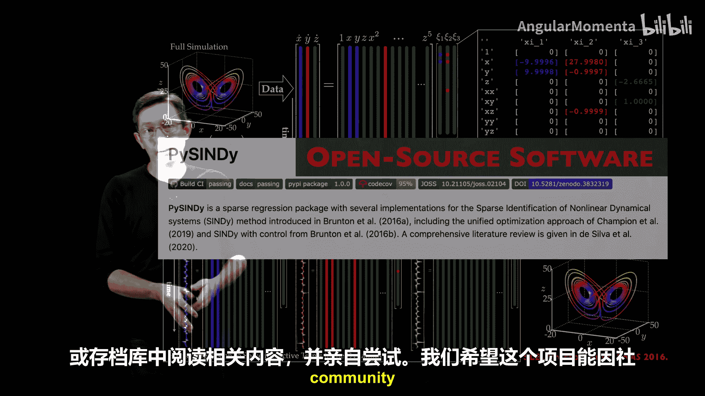
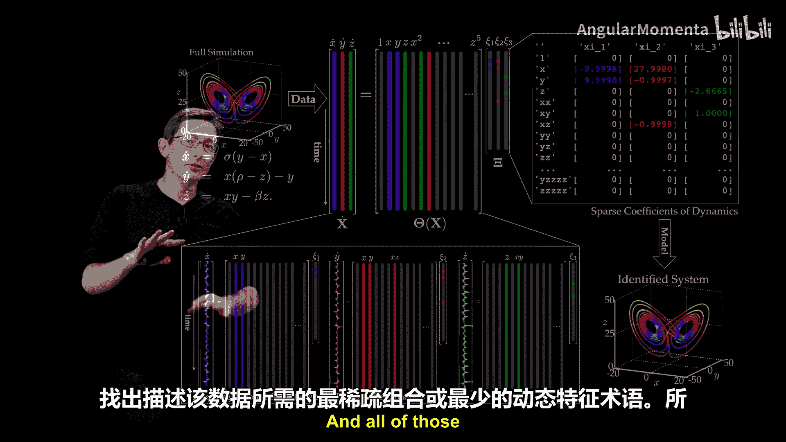

# 010：非线性动力学的稀疏辨识

## 概述

在本节课中，我们将要学习一种名为“非线性动力学稀疏辨识”的算法。该算法旨在从时间序列数据中，提取出可解释且可泛化的动力学系统模型。我们将从算法的高层概述开始，逐步深入到其核心步骤、常见挑战以及实际应用。

## 算法核心思想

非线性动力学稀疏辨识是一种从时间序列数据中提取可解释、可泛化动力学系统模型的流程。这里的“可解释”意味着模型结构清晰、项数少；“可泛化”意味着模型在训练数据之外的新场景下依然有效。

本质上，你可以将其视为一种从时间序列数据中提取动力学系统模型的机器学习算法。这些模型可以是常微分方程形式：

`dx/dt = f(x)`

也可以是偏微分方程形式：

`∂u/∂t = N(u)`

其中，`x` 是描述系统所需的最小状态变量，`u` 是随空间和时间演化的时空场。

## 动机：为何需要稀疏模型？

上一节我们介绍了算法的目标，本节中我们来看看为何要追求模型的稀疏性。在从数据中发现模型时，我们必须优先考虑那些可解释和可泛化的模型。例如，牛顿第二定律 `F = ma` 就是一个典范：它只有三个项，易于分析和解释；并且它从地球上苹果下落的现象中总结出来，却可以泛化到设计登月任务中。

我们希望得到的模型更像 `F = ma`，而不是庞大、不透明的黑箱神经网络。物理建模的一个基本原则是，正确的物理模型通常是尽可能简单但又不失准确性的。用数学工具实现这一原则，就是要求模型是低维的（用尽可能少的自由度描述）和稀疏的（动力学方程中只包含描述观测动态所必需的最少项数）。这就是非线性动力学稀疏辨识算法背后的核心理念。

## 算法流程详解

基于上述理念，非线性动力学稀疏辨识算法的具体流程如下。我们以经典的洛伦兹系统为例进行说明。

假设我们只有洛伦兹系统的时间序列数据 `x(t)`, `y(t)`, `z(t)`，并且可以计算出其导数 `ẋ`, `ẏ`, `ż`。我们的目标是发现其背后的动力学方程。

最简单的方法是尝试用线性模型，即一个3x3矩阵 `A` 来拟合，使 `[ẋ, ẏ, ż]^T ≈ A * [x, y, z]^T`。但这无法捕捉洛伦兹系统的丰富动力学。

非线性动力学稀疏辨识的做法是，构建一个包含非线性项在内的候选动力学项库。以下是构建候选库的步骤：

1.  **构建数据矩阵**：将状态数据排列成矩阵 `X = [x, y, z]`。
2.  **构建候选库矩阵**：基于状态数据 `X`，计算一系列候选函数项（例如多项式项）。例如，可以包含常数项、线性项 `x, y, z`、二次项 `x², xy, y², xz, yz, z²`，甚至更高阶项。所有这些项构成了一个矩阵 `Θ(X)`，其每一列对应一个候选函数在每一时间点上的取值。
3.  **构建回归问题**：我们希望找到一组稀疏的权重向量 `Ξ`，使得 `[ẋ, ẏ, ż] ≈ Θ(X) Ξ`。这意味着时间导数可以被候选库中少数几项的线性组合很好地近似。

接下来是寻找稀疏解的关键步骤。以下是常用的稀疏优化方法：

*   **序列阈值最小二乘法**：一种迭代算法，通过不断剔除小权重对应的项来促进稀疏性。
*   **LASSO回归**：在最小二乘损失函数中加入L1正则化项，以促使权重向量稀疏。
*   **稀疏促进正则化**：使用其他形式的正则化（如L0）来直接惩罚非零项的数量。

当对这个库进行稀疏优化时，你本质上就学习了动力学系统的结构和参数。对于洛伦兹系统，算法会发现 `ẋ` 方程是 `x` 和 `y` 的线性组合，`ẏ` 方程包含 `x`、`y` 的线性项和一个非线性项 `xz`，`ż` 方程包含 `z` 和 `xy` 项。这正是真实的洛伦兹方程。

## 扩展到偏微分方程

非线性动力学稀疏辨识同样可以应用于发现偏微分方程。如果你拥有时空数据（如流体流过圆柱的涡量场 `ω(x, y, t)`），你可以构建一个包含空间偏导数（如 `∂ω/∂x`, `∂²ω/∂x²`）和非线性乘积项（如 `ω * ∂ω/∂x`）的候选库。

然后，通过稀疏回归寻找 `∂ω/∂t` 的稀疏表示。应用此方法，可以从数据中重新发现纳维-斯托克斯方程等经典偏微分方程，甚至发现前所未有的新模型。

## 面临的挑战与展望

尽管非线性动力学稀疏辨识功能强大，但在实际应用中仍面临几个关键挑战：

*   **坐标挑战**：如何知道我们测量的是否是能够产生稀疏动力学系统的“正确”变量？例如，测量大脑活动时，什么才是合适的动态变量？
*   **库函数挑战**：即使变量正确，如何设计候选函数库？动力学可能是多项式、三角函数或其他特殊函数。库的设计需要足够丰富以包含真实动态，但又不能过于庞大导致难以求解。
*   **优化挑战**：采用何种优化算法来可靠地找到稀疏解？如何将已知的物理约束（如对称性、守恒律）融入优化过程，以确保发现的模型不仅稀疏而且物理上合理？
*   **数据挑战**：算法依赖于高质量数据。需要多大量、多快采样频率、多低噪声水平的数据才能可靠地发现模型？这是更基础但至关重要的问题。

在接下来的课程中，我们将详细探讨这些挑战，并展示该算法在流体动力学等多个领域的成功应用案例。

## 总结

本节课中我们一起学习了非线性动力学稀疏辨识算法。该算法通过构建候选动力学项库并施加稀疏性约束，能够从时间序列数据或时空数据中自动发现可解释、可泛化的常微分方程或偏微分方程模型。其核心优势在于追求模型的简洁性与物理可解释性。理解算法流程及其面临的挑战，是将此工具成功应用于新科学问题发现的关键。