# 011：训练数据与模型消歧

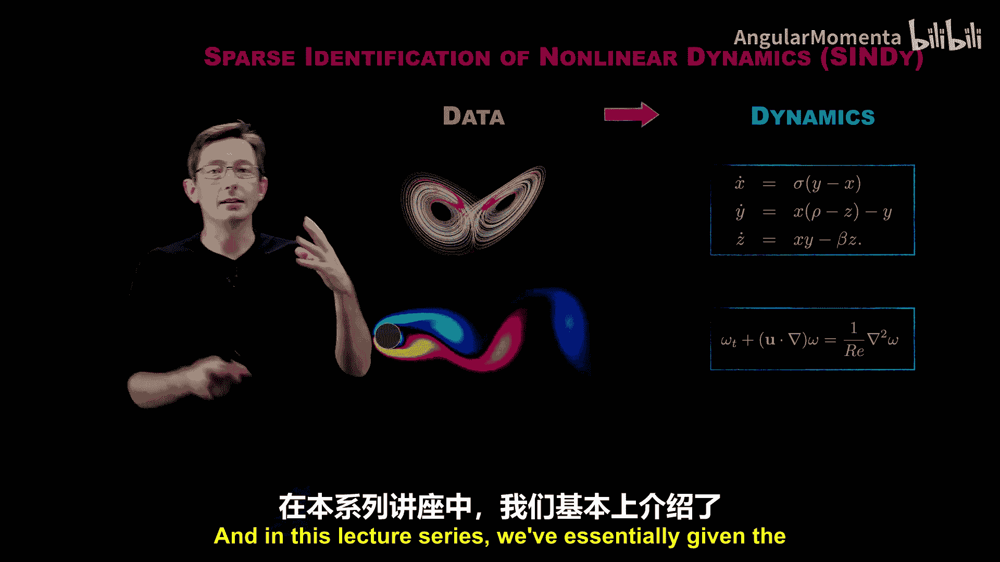

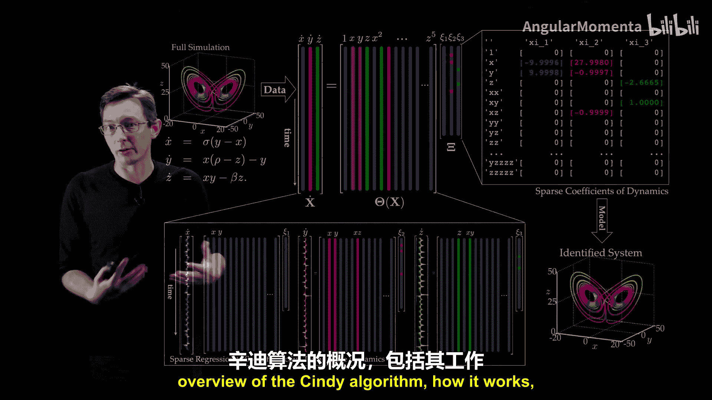

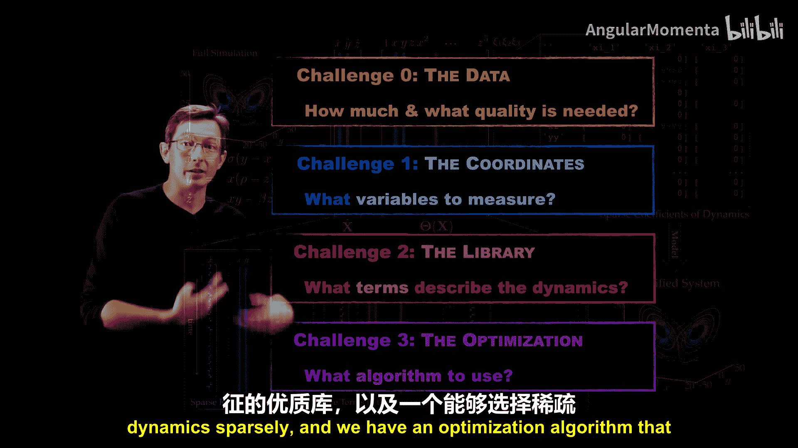

在本节课中，我们将深入学习稀疏辨识非线性动力学（SINDy）算法中关于数据的关键挑战。我们将探讨为了获得一个良好的SINDy模型，需要何种质量与数量的数据，并介绍处理噪声数据与模型消歧的核心方法。

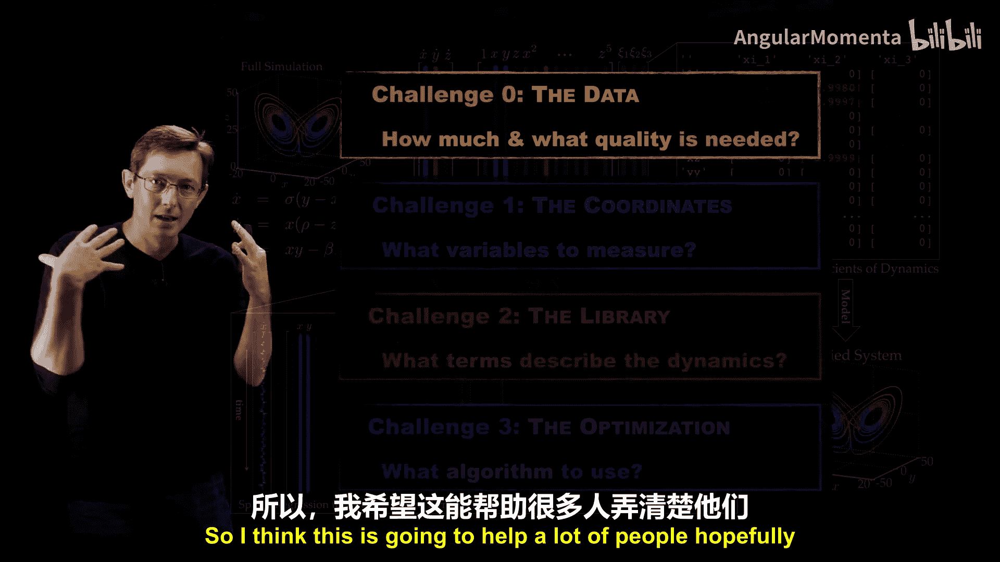

上一节我们介绍了SINDy算法的基本框架和主要挑战。本节中，我们将聚焦于第一个挑战：数据。

## 数据质量与采样率

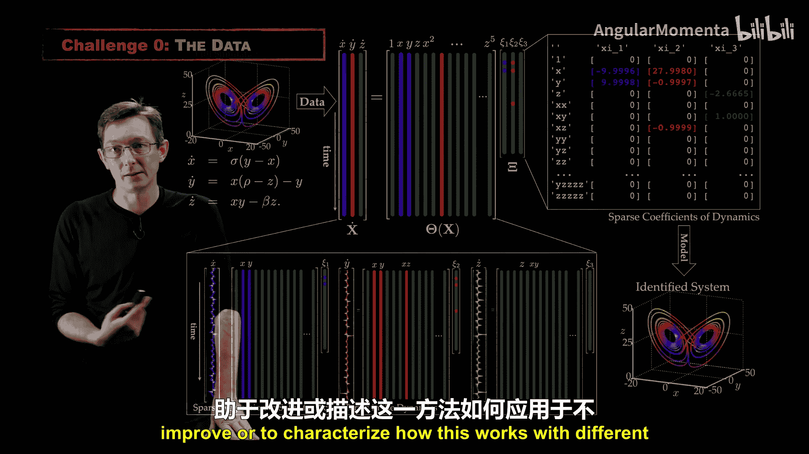

SINDy算法本质上是一个回归问题，需要从数据中近似时间导数 `ẋ`、`ẏ`、`ż`。如果测量数据含有噪声，近似导数将变得非常困难。因此，数据质量至关重要。

研究表明，如果数据足够干净且采样率足够高，即使观测时间非常短，也能成功辨识出非线性动力学系统。例如，对于洛伦兹系统，即使只观测到其动态轨迹中一个“叶瓣”的一小部分，只要数据干净且采样快，也能辨识出完整的模型。

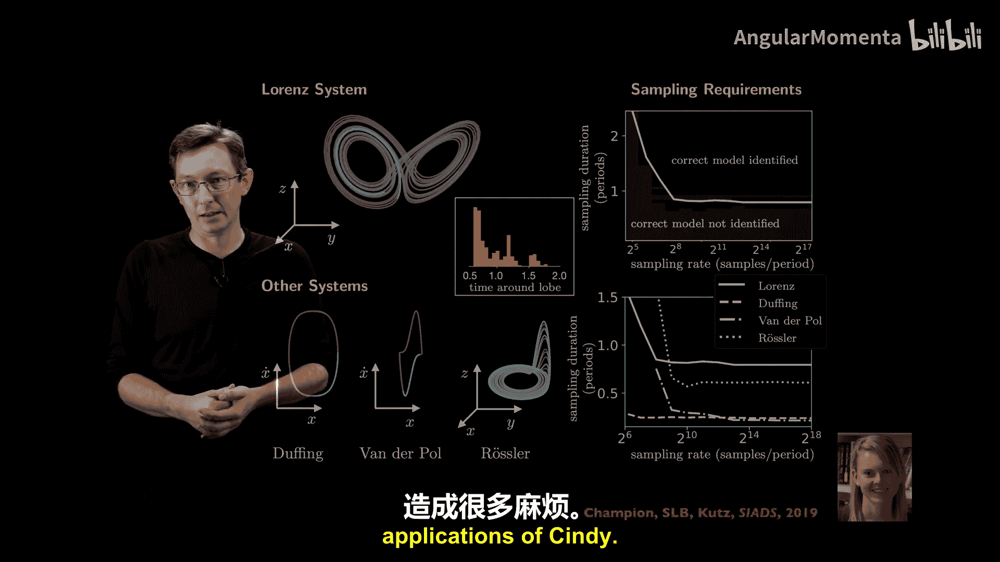

然而，如果采样率低或测量噪声大，上述结论将不再成立。在实际应用中，数据噪声是SINDy面临的主要问题之一。

## 处理噪声数据

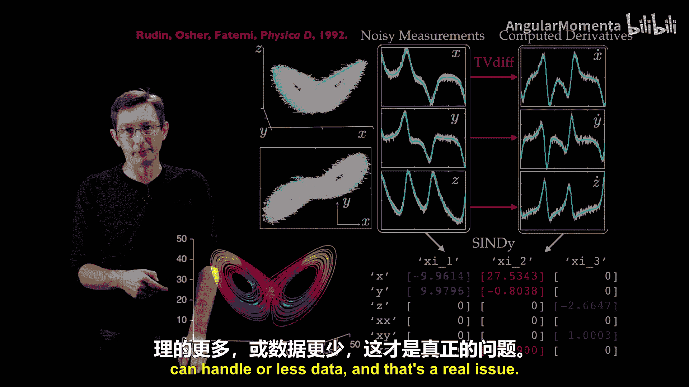

在实际应用中，我们通常无法获得干净的 `x`、`y`、`z` 测量值，更不用说它们的导数了。我们拥有的往往是带有噪声的时间序列数据。

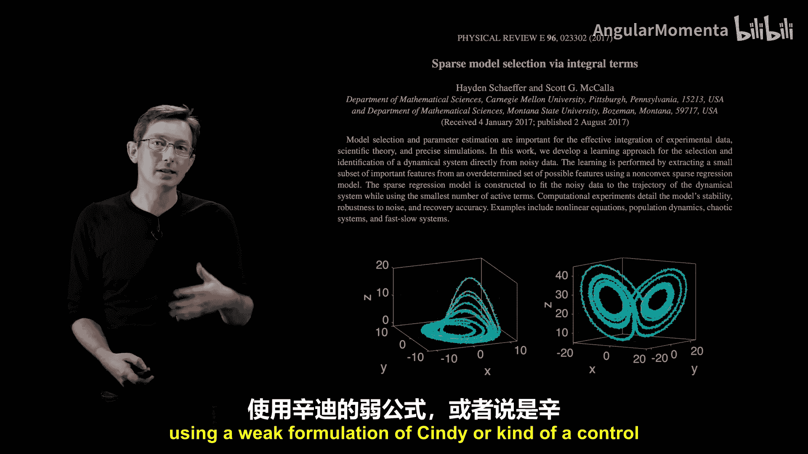

在原始的SINDy论文中，我们展示了即使使用噪声数据，也可以通过基于全变分正则化的导数近似方法，获得相对干净的导数估计，从而得到相当准确的SINDy模型。Sam Rudy在其PDE-FIND版本中则使用了多项式拟合策略。

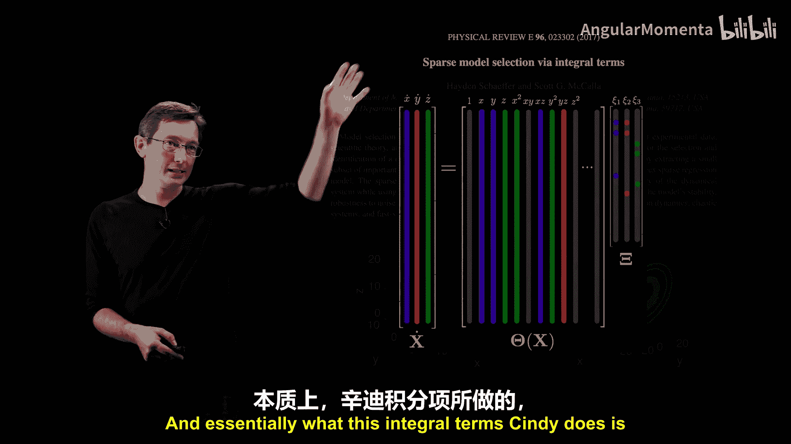

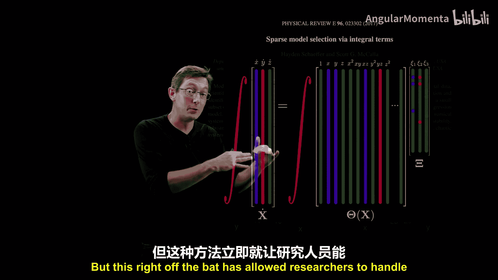

一个重要的创新是使用SINDy的**弱形式**或**控制体积**版本。其基本思想是将优化问题的两边进行积分，通过在许多样本上平均来抵消噪声的影响。这种方法使研究者能够处理系统中更大量的噪声。

以下是几篇应用此方法处理噪声数据并发现新偏微分方程的重要论文：
*   Roman Grigoriev小组的工作：他们通过对时空数据（如流体流动、等离子体）在小的控制体积上进行积分，成功地从高噪声实验数据中辨识出准确的PDE模型。
*   Alves和Fiuza的工作：他们从等离子体系统的动力学模型数据出发，利用SINDy的弱形式发现了描述该系统的粗粒度PDE模型，并应用于识别典型的不稳定性动力学。

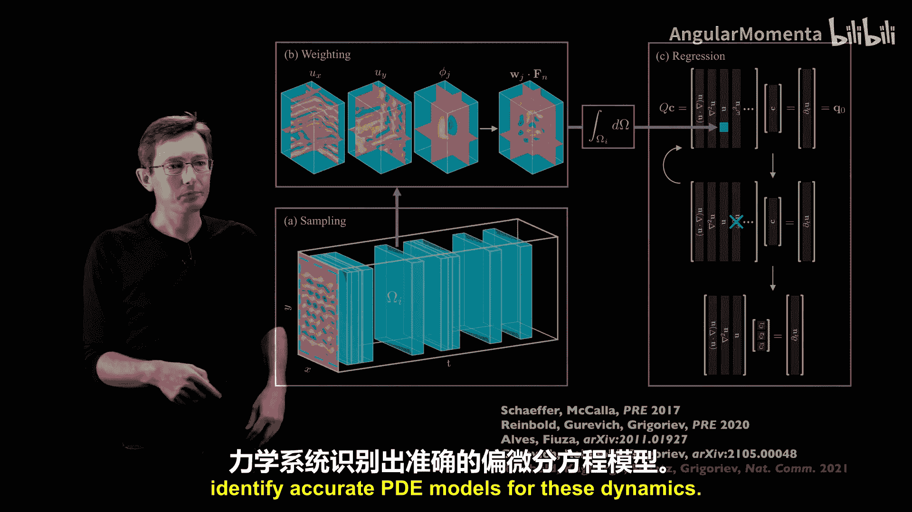

这些进展使得从嘈杂的实验或数值测量中发现全新的、此前未被写下的PDE成为可能，为科学发现打开了新的大门。

## 数据数量与模型消歧

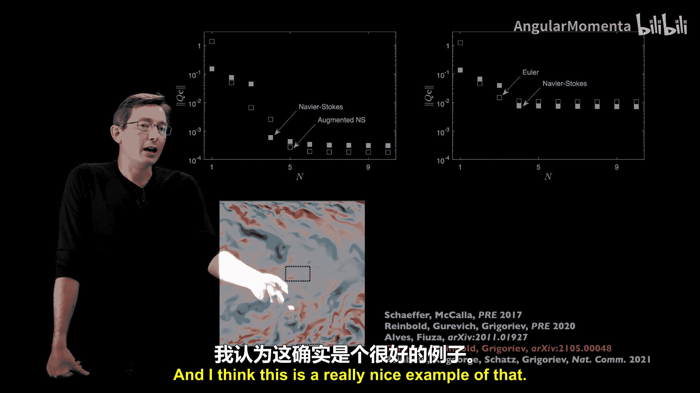

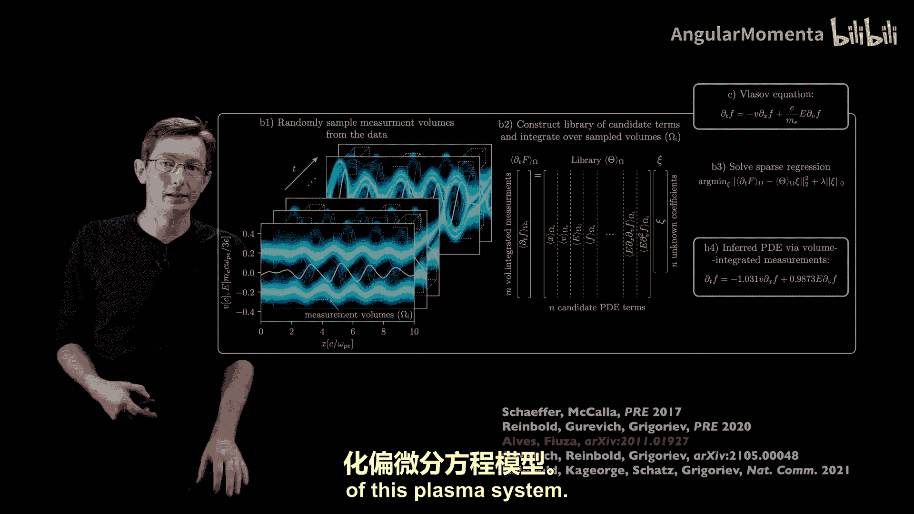

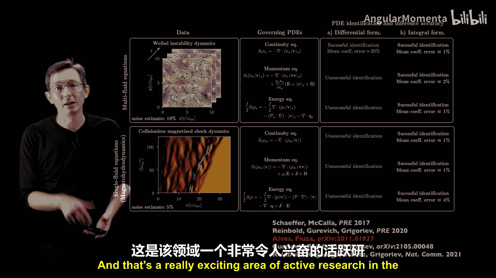

SINDy需要解决一个回归问题，其目标是找到系数矩阵 `C` 中最稀疏的列向量。为了得到正确的稀疏系数 `C`，库矩阵 `Θ` 必须具有良好的条件数。

获得良好条件数 `Θ` 矩阵的方法是添加更多能够激发系统瞬态过程的数据。这些数据点有助于消除动力学中哪些项是活跃的歧义。

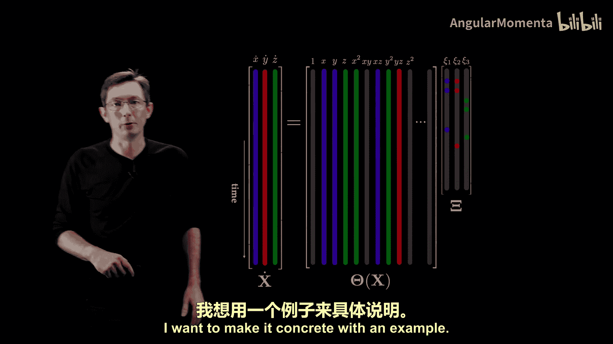

例如，假设我们测量到一个在吸引子上做圆周运动的振荡器。描述此行为的最简单稀疏模型是一个简单的线性振荡器。然而，立方Hopf范式同样可以描述极限环行为。

区分这两种模型的唯一方法是收集吸引子之外的更多初始条件数据。如果所有初始条件都产生完美的圆周运动，则系统是线性振荡器；如果观察到所有轨迹都收缩包裹到极限环上，则系统更可能是立方Hopf范式。如果没有这些额外的瞬态数据，库矩阵中某些项（如线性项和立方项）可能近乎平行，导致条件数极差，无法区分这些项。

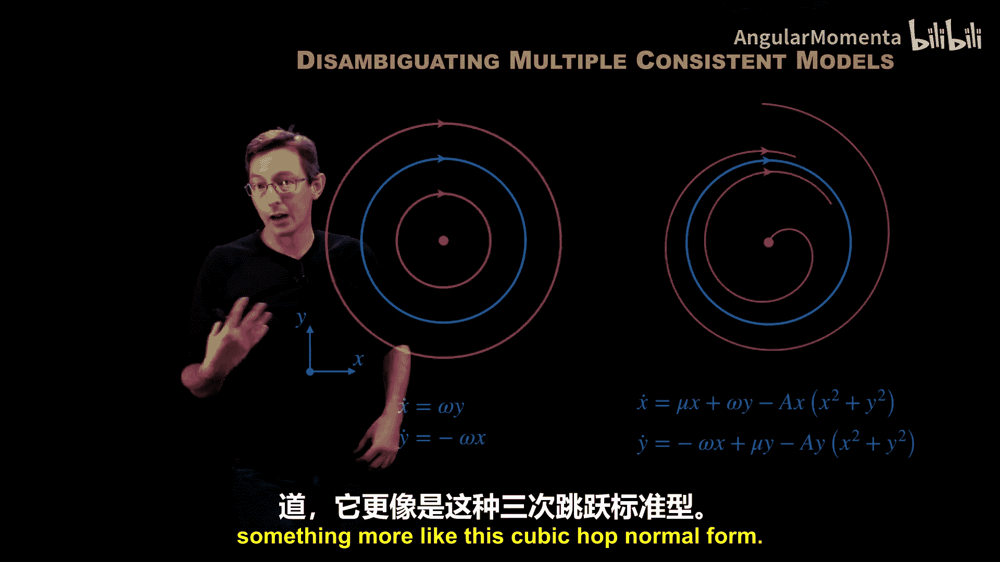

在偏微分方程建模中也能看到同样的情况。例如，对于一个从左向右传播的单个孤波，多个PDE都可以产生行波现象。要区分是简单的线性波动方程还是更复杂的非线性方程，就需要测量具有不同振幅的波，并观察它们是否以不同速度传播。额外的、能激发不同非线性项的数据对于模型消歧至关重要。

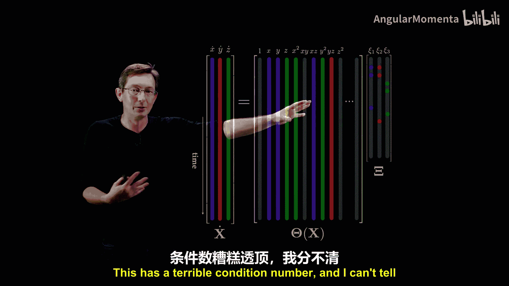

## 总结

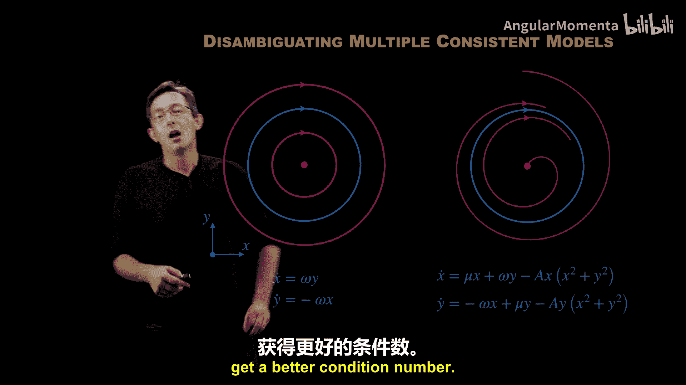

本节课我们一起学习了SINDy算法中关于数据的关键考量。我们了解到：
1.  **高质量、高采样率**的数据可以极大减少所需的观测时间。
2.  对于**噪声数据**，可以使用正则化导数近似、多项式拟合，特别是**SINDy的弱形式（积分形式）** 来有效处理，从而应用于真实实验数据。
3.  为了获得唯一且正确的稀疏模型，需要**足够数量且多样化**的数据（如不同初始条件、不同参数下的瞬态数据）来改善库矩阵的条件数，实现**模型消歧**。

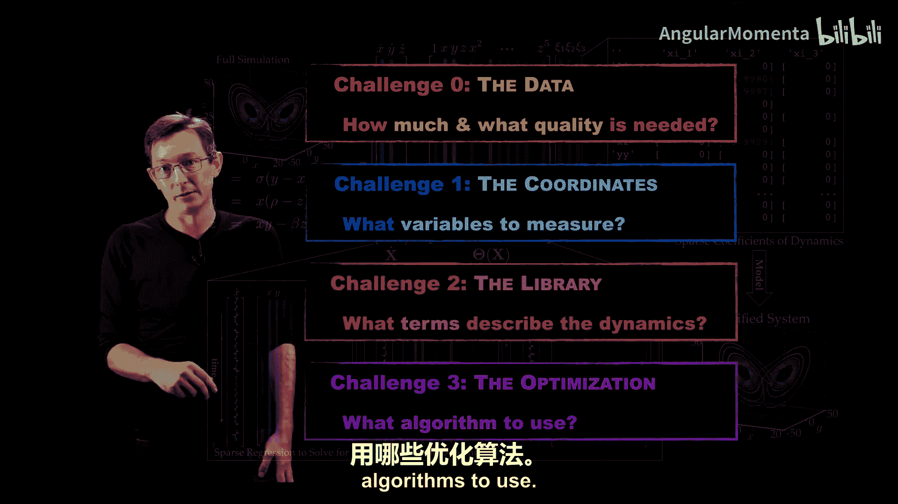

在接下来的课程中，我们将讨论如何选择测量变量、如何构建有效的函数库以及使用何种优化算法。