物理信息机器学习：P12-12：稀疏非线性动力学模型与SINDy，第三部分：简约模型的有效坐标

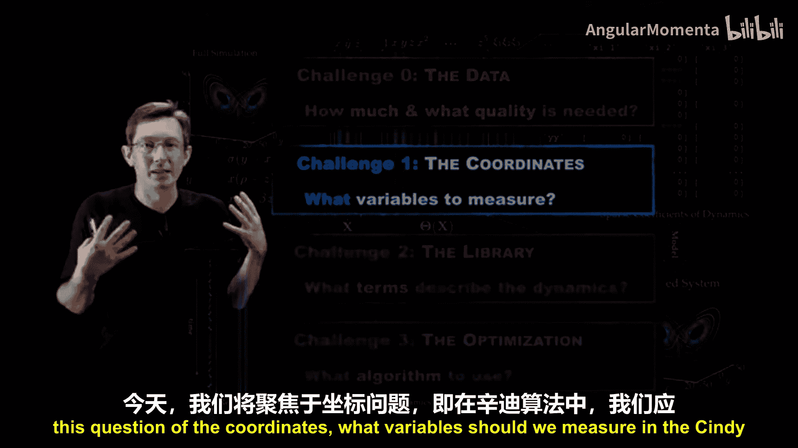

在本节课中，我们将要学习SINDy算法的一个关键挑战：如何为模型选择正确的坐标变量。我们将探讨当数据维度过高或过低时，如何通过坐标变换来获得一个允许稀疏非线性动力学模型的有效表示。

---

欢迎回来。我们正在讨论SINDy算法，它允许我们从时间序列数据中发现稀疏非线性模型。在本系列视频中，我们已经概述了SINDy算法，并指出了四个关键挑战。

上一节我们讨论了数据本身的挑战，包括数据的数量和质量。本节中，我们将聚焦于坐标问题：在SINDy算法中，我们应该测量哪些变量？

让我们回顾这张示意图，它很好地阐释了SINDy的核心思想。我们首次用它来说明SINDy：假设你有一个复杂系统（如洛伦兹模型）的数据，你测量了变量X、Y和Z，计算了它们的导数，构建了一个函数库，然后找到了描述X点、Y点和Z点所需的最少数量的候选项。

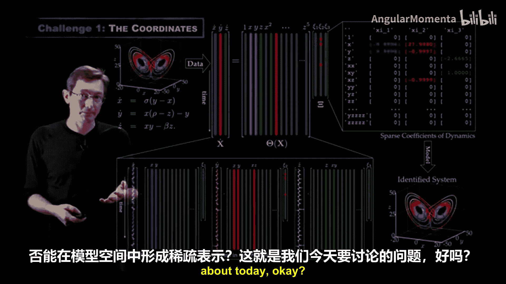

但这里有一个巨大的、我们通常一笔带过的假设：我们如何知道X、Y和Z就是需要测量的正确变量？对于洛伦兹系统，我们知道测量X、Y和Z是正确的，但这需要大量的先验知识。如果数据在坐标中稍有旋转或扭曲，我们可能无法得到一个稀疏的非线性表示，而可能需要一个包含库中所有项的密集模型。

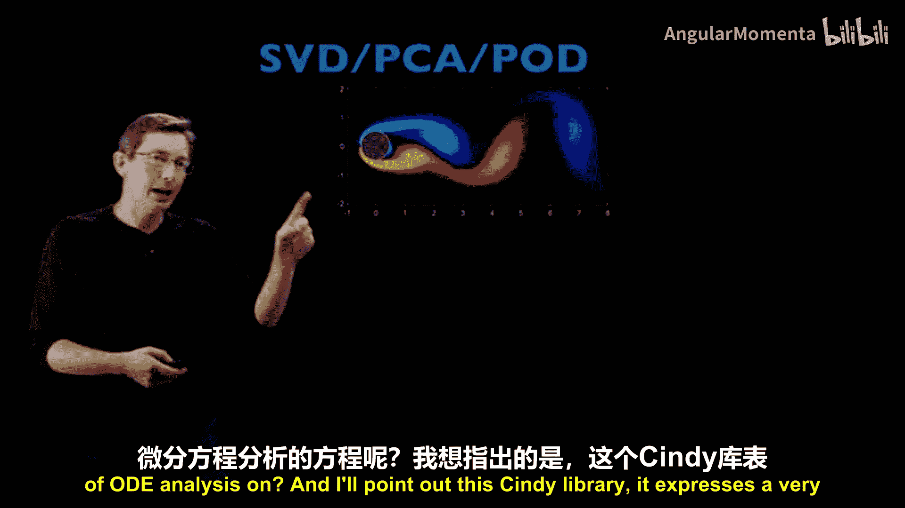

因此，一个关键问题是：我们如何从一开始就知道应该测量哪些正确的变量？在许多情况下，作为专家科学家或工程师，我们对所研究的系统有所了解。我强烈建议将SINDy作为一种引导式模型发现的工具，它并非完全自动化。你是专家，你知道你的数据在告诉你什么，你知道可能从系统中得到什么样的模型，并且可能对测量的变量、单位以及是否存在物理关系有所了解。因此，作为研究人员，你通常能很好地判断是否处于正确的坐标系中。

但也可能存在我们确实一无所知的情况。例如，如果我们测量大脑活动并希望获得其模式的SINDy模型，或者测量疾病在大陆上的传播，我们如何知道我们测量的是正确的变量？我们如何知道这些变量是否允许在模型空间中得到稀疏表示？这就是我们今天要讨论的问题。

现在，如果我有一个像流体流动这样的高维系统，我已经展示过你可以发现描述它的偏微分方程（纳维-斯托克斯方程）。这没问题。但如果我想要一个常微分方程，以便进行ODE分析呢？

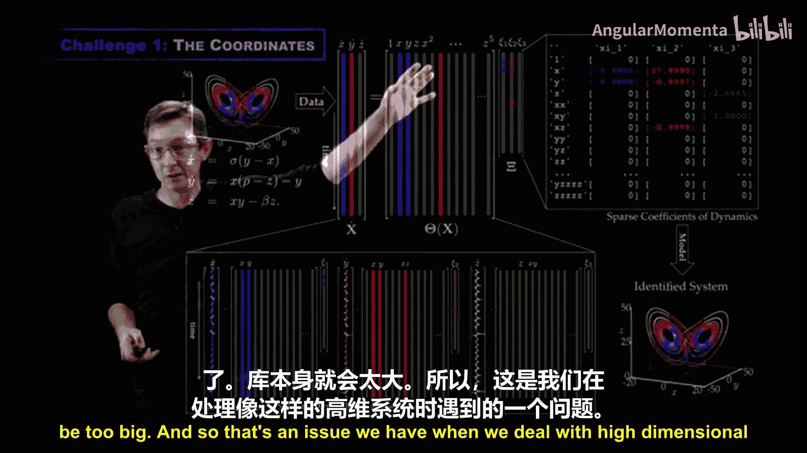

这个SINDy函数库表达了一个非常大的可能模型空间。例如，在这个包含X、Y和Z的五阶多项式的集合中，我认为库中有81个项。这意味着矩阵 **Ξ** 的每一列都有81个系数，因此可以编码许多可能的模型结构。例如，如果我想要一个恰好包含两项（即 **Θ** 的两个列向量）的模型，那么我有 `81选2` 种可能的两项模型。如果动力学中包含三项，则有 `81选3` 种可能，这个数字会迅速变得非常庞大。

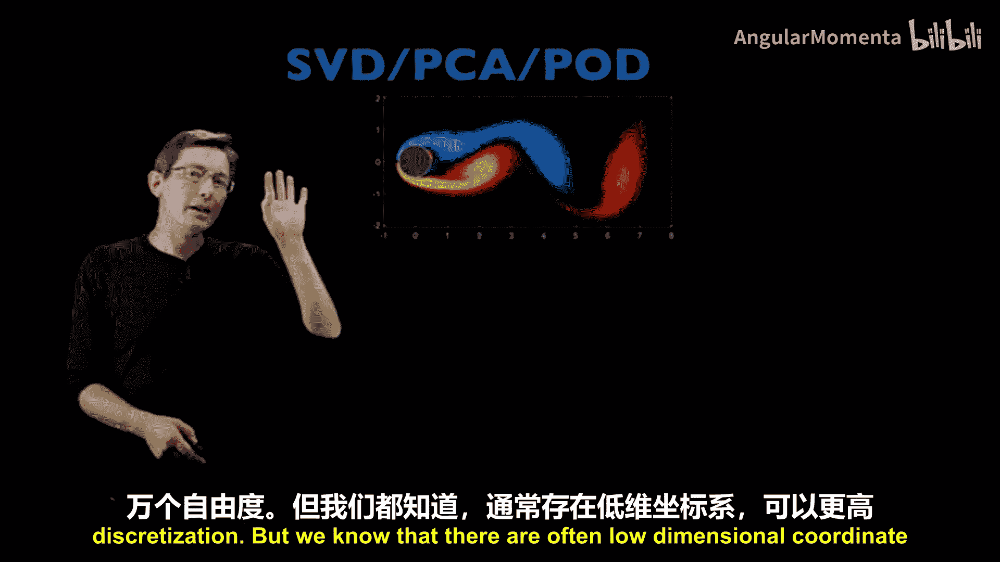

如果我们定义稀疏性为模型包含 **Θ** 中10个或更少的项，那么可能的模型数量是 `81选10` + `81选9` + ...，这超过了千万亿个模型。SINDy算法的部分威力在于，它允许你通过稀疏优化，高效地从这千万亿个模型的巨大空间中，找出真正描述你动力学的正确结构。

但这里有一个问题。不同结构的可能模型空间是巨大的，但这个库本身随状态向量X、Y、Z的维度扩展得非常糟糕。我将在下一讲关于库的讲座中讨论这个库的扩展问题，但现在我希望你记住这一点：我们无法为100个变量构建一个五阶库，那将过于庞大。

这就是我们处理像流体流动这样的高维系统时面临的问题。当我在计算机上模拟这个流体流动时，我将其模拟为一个离散化的常微分方程组，可能包含1万或10万个自由度，具体取决于离散化程度。

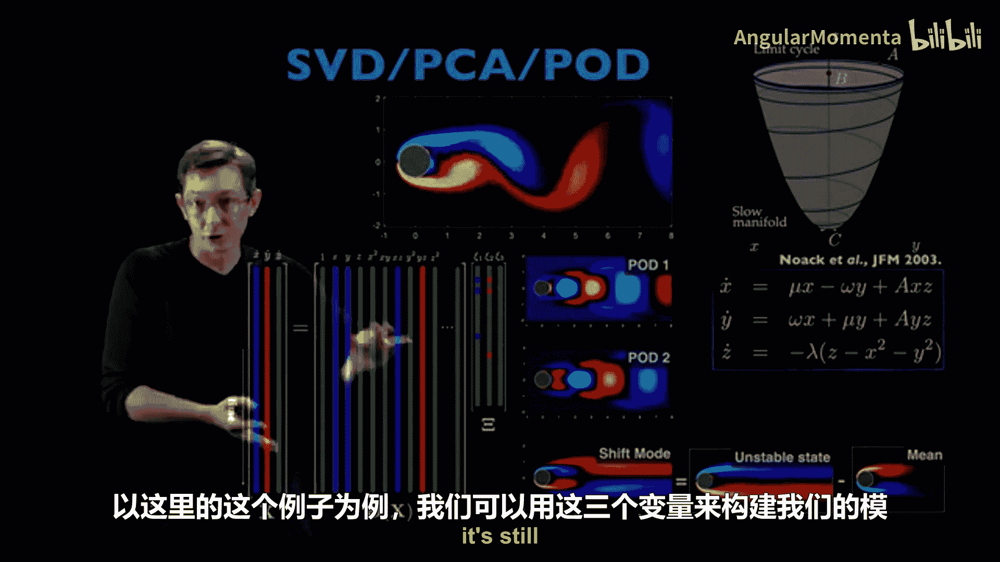

然而，我们知道通常存在低维坐标系，可以更有效地描述这些数据。因此，即使在我的计算机上模拟需要1万或10万个自由度，我们知道存在这些低维模式来描述大部分行为。如果我在这三个模态的振幅构成的坐标系中写出动力学方程，这些模态的振幅允许一个非常简单的微分方程。

因此，为SINDy获取正确坐标的一种方法是：如果我有一个像流体流动或等离子体流动这样的时空系统，我通常可以采用奇异值分解（也称为主成分分析或本征正交分解）来获得一个低维基，我可以用这三个模态的振幅X、Y和Z来表示这些动力学。这些振幅通常是表示我动力学的非常好的坐标系。

所以，如果你对系统一无所知，但它是高维的，你可能想尝试的第一件事就是进行SVD，以获得一个低维基，在那里你可以构建一个高效的库并开始识别模型。

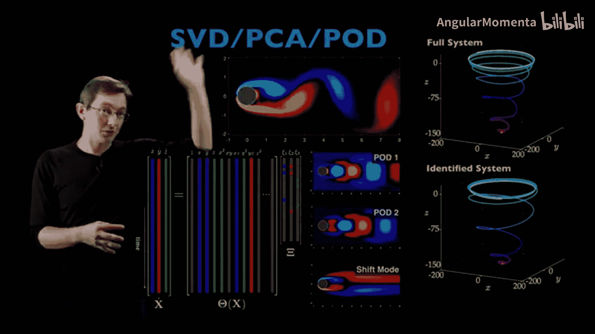

当我们对圆柱绕流这个例子这样做时，我们可以在那三个变量中构建我们的模型库，这仍然是可处理的，这个库不会太大而无法工作。

我们可以识别出一个在这个坐标系中具有正确结构和正确动力学的模型。因此，如果你有高维时空数据，这只是一个普遍的好主意：首先尝试SVD，看看是否能给你一个好的坐标系来构建模型。

我们有很多理论基础来解释为什么我们认为这在流体力学、等离子体物理和许多时空系统中可能是一个好主意。因为奇异值分解是一个正交基，它针对你的特定数据进行了优化，以尽可能少的自由度尽可能好地表示它，这对我们的建模有好处。我们还知道，如果我采用这个展开（伽辽金展开）并将其代入控制方程纳维-斯托克斯方程，当我展开时，我会得到一个关于这些模态振幅的非线性常微分方程。这给了我们希望，存在一个描述这种演化的微分方程，我们可以使用SINDy算法发现它。长话短说，尝试SVD。它在很多情况下确实有效，尤其是在流体力学中，效果非常好。

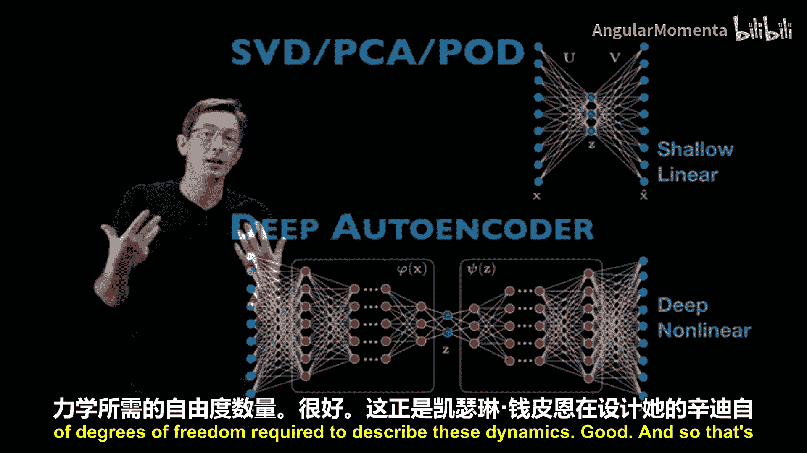

现在，奇异值分解在现代神经网络语言中可以被视为一个浅层线性自编码器。它本质上可以构建成一个具有高维输入和输出以及由这个Z变量给出的单个低维潜在层的神经网络，其中你的网络损失函数试图最小化输入和输出之间的误差，同时知道你将维度压缩到只有几个自由度，然后再提升回来。当然，你永远不会真的想用这种方式计算SVD，但你可以将SVD视为一个浅层线性自编码器。

这意味着如果你的SVD坐标对你来说不太适用，如果它们对于构建SINDy模型不够好，你可以将其推广到一个深度非线性自编码器。因此，深度自编码器不是只有一个隐藏层，而是有许多编码器层和解码器层，并且还具有非线性激活函数。这允许你做的不是构建一个正交的线性子空间，而是设计一个由Z参数化的非线性流形。通常，这允许我们大幅减少描述这些动力学所需的自由度数量。

这正是Kathleen Champion在设计她的SINDy自编码器框架时所采用的策略。我认为这是实验室里我最喜欢的论文之一。这是与Kathleen Champion（Nathan Kutz和我的博士生）、Bethany Lush（我们的博士后）以及Nathan和我本人的合作成果。本质上，Kathleen在这里所做的是将自编码器学习良好坐标系的能力与潜在空间Z中的稀疏非线性模型相结合。

这非常酷。自编码器学习描述你数据的良好坐标系或流形，并且你可以在这个神经网络训练的损失函数中添加额外的约束，使得该潜在层上的动力学是SINDy框架下的稀疏非线性模型。本质上，这些额外的损失项使我们能够训练这个模型，以找到良好的坐标和SINDy模型。

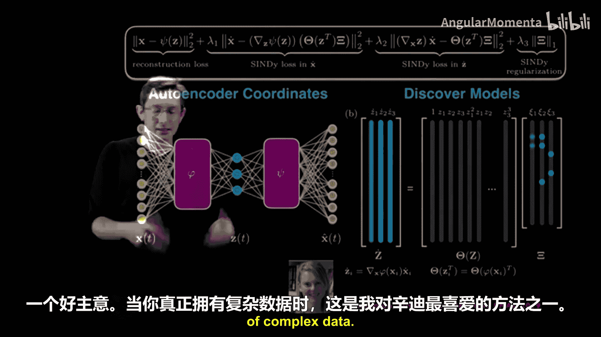

我将在下一讲关于库的内容中再次讨论这一点，但我想在这里提一下：通常多项式并不是描述你动力学的正确项，也许你需要正弦和余弦、贝塞尔函数或一些奇异的非线性项。然而，通常通过应用正确的坐标变换，你可以将你的系统转换到一个坐标系中，在那里多项式是建模你动力学的更好库。这与经典动力系统中的范式理论密切相关，范式理论本质上指出，通过连续的坐标变换，你基本上可以消除泰勒展开中的项，并为你的动力学获得稀疏多项式模型。因此，有很多理论基础支持这是一个好主意，这也是当我面对复杂数据时，最喜欢的SINDy方法之一。

在这个例子中，你可以取一个非常复杂的高维系统（这可能是在空间和时间序列测量中具有100个自由度的演化数据），通过自编码器，你可以学习一个坐标变换，使得动力学是稀疏的。在这个案例中，我相信发现的模型实际上是一个不同的稀疏模型，但如果你旋转这个模型，你就能恢复原始的洛伦兹系统。这非常酷。在上方，我们只有高维数据，而在其下方存在一些洛伦兹动力学，因此我们可以学习坐标变换，从而得到一个稀疏模型，该模型与真实的洛伦兹动力学之间只差一个旋转。我认为这非常酷，我们稍后会更多地讨论这个。

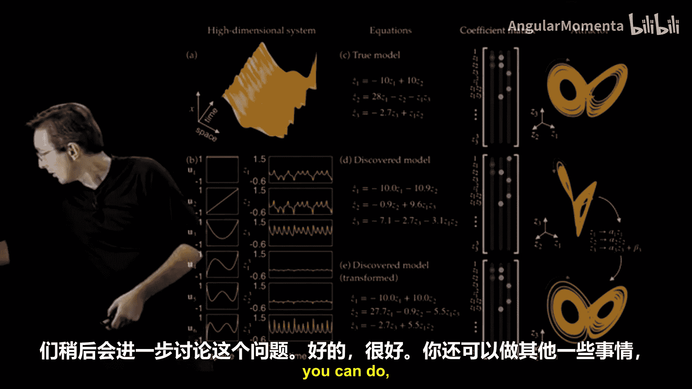

好的，你还可以做其他几件事。到目前为止，我一直在讨论如果你有非常高维的测量数据，如何通过线性SVD坐标或非线性自编码器来压缩它们。

但是，如果你的测量数据太少怎么办？这也是非常常见的情况。也许我有一个复杂系统，但我只有一个或两个标量测量值，例如大脑中有一个电极，我能从那种数据中得到什么？

这篇论文真正改变了我对这些稀疏模型的看法。这是与JC Lazo和Barrett Noack的合作成果。我们当时正在建模像绕过三个圆柱的流动这样的流体系统。我们不想假设我们拥有各处完整速度场的全部测量数据，这是一个相当大的假设。如果我驾驶一架波音飞机，我并没有机翼后方完整的尾流速度测量数据，我可能只有沿机翼的一些压力测量值，或者我可能能够测量我的升力和阻力。

JC展示的是，如果你只有这三个圆柱上的升力和阻力测量值，并且你的测量足够干净以计算导数，你实际上可以在那些升力和阻力坐标（这些内在坐标）中构建非常准确的SINDy模型。这是模拟（直接数值模拟）中三个翼型上的升力，这是地面实况，而我们的SINDy模型用蓝色虚线表示，几乎完美吻合。SINDy模型的一个优点是，因为它使用回归，它可以找到稀疏模型来近似你通常不会想到去建模的奇怪变量（如升力和阻力）上的动力学。在这些坐标中建模还有很多相关的好处，我将在关于稀疏流体建模的视频中讨论。

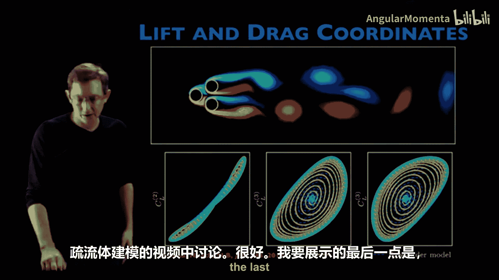

好的，我在这里要展示的最后一点是：如果你再次遇到测量数据太少的情况，即存在一些你没有测量的变量或潜在状态，你该如何处理？这源于五年前我们最初的SINDy论文中一位审稿人的评论。我们收到了一些非常有见地的审稿意见，其中一条是这样的：在我们的洛伦兹系统中，我们假设可以访问X、Y和Z并计算它们的导数。但如果我们只能访问X呢？如果存在隐藏变量Y和Z，在这个测量中无法获得，我们能用SINDy做什么？

这实际上开启了我们合作小组中关于潜在动力学和时间延迟坐标的全新研究方向，这是一个引人入胜的故事。这里有很多内容，我只是给你一个高层次的概述。

假设我们测量的是一个有限的子集，无法访问完整状态。例如，我们只有X的测量值。在某些条件下（由非线性混沌系统的Takens延迟嵌入定理或线性动力系统的可观测性给出），你基本上可以构建这个标量测量X的时间延迟坐标矩阵。这是一个汉克尔矩阵，其中每一列是你的状态在过去或未来时间的增广向量：X在时间1，时间2，时间3，...，到时间Q。你可以构建这个大矩阵，计算其奇异值分解，并基本上发现本征时间延迟坐标或这些短时间轨迹，它们允许你将这个X测量嵌入到由V的这些行给出的更高维空间中。这是一个经典的延迟嵌入，这不是我们发明的，自80年代以来就存在对汉克尔矩阵进行SVD的做法。

但当你尝试将SINDy应用于这个系统时，会发生一些非常有趣的事情。你基本上可以尝试在这些V坐标和时间延迟坐标中设计一个SINDy模型。

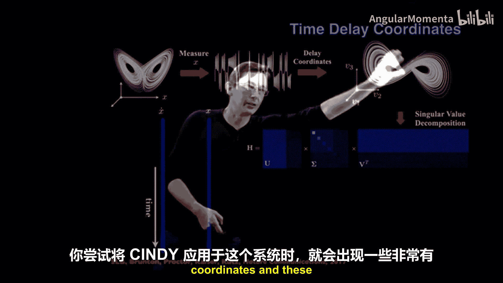

当我们寻找最稀疏的模型，并允许自己包含非线性项和线性项时，我们发现最稀疏的模型往往是线性的，千真万确，没有二次项，没有三次项，只有线性项。这与库普曼算子理论有深刻的联系。我们偶然发现了这种联系：时间延迟坐标本质上提供了一个几乎最优的坐标系，以获得一个库普曼线性系统，一个稀疏的库普曼线性系统。我们已经写了四五篇后续论文来探索其结构、为什么有效、如何工作，并将其应用于混沌系统和确定性系统，我们学到了很多。我会在描述中放一些这些论文和视频的链接。

这个模型允许你做诸如预测甚至非常混沌的动力学这样的事情。例如，你可以预测何时即将切换到洛伦兹吸引子的另一侧，你甚至可以根据其何时表现得像一个线性系统以及何时即将切换来为你的吸引子着色。我们了解到这一点是因为我们试图处理具有潜在变量的系统上的SINDy，结果发现时间延迟坐标加上SINDy可以给你一个非常非常准确的库普曼线性模型。关于这个有很多论文和一个小时长的视频，所以我不会在这里停留太久，只是长话短说：你通常可以通过延迟嵌入来处理潜在测量。

这实际上是Kathleen Champion探索了很多的东西：对于非混沌系统，你通常可以使用延迟嵌入和SINDy回归过程得到一个完美封闭的模型。

好的，我们一直在讨论这个SINDy概述，特别是这些关键挑战。现在我们已经涵盖了挑战零（数据）和挑战一（坐标），在接下来的视频中，我们将讨论库的问题：如何实际构建那个 **Θ** 矩阵，使其条件良好，能够描述你系统的动力学，同时又不会太大；以及我们首先使用什么优化算法来实际找到那些稀疏模型。所有这些内容即将到来。谢谢。

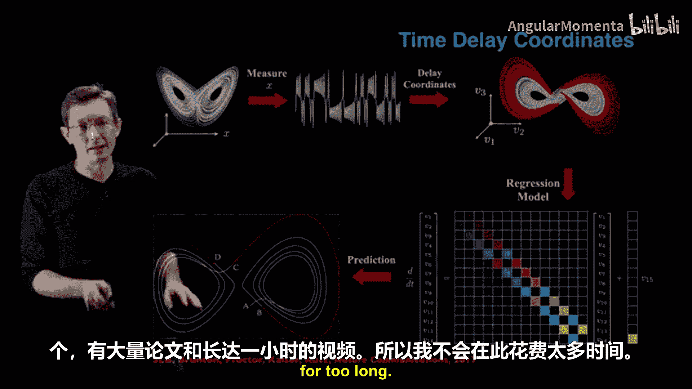

---

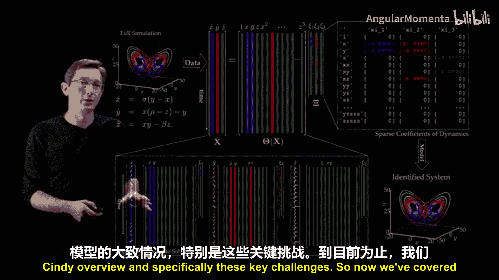

本节课中，我们一起学习了为SINDy算法选择有效坐标的重要性。我们探讨了处理高维数据时使用SVD或深度自编码器进行降维的方法，以及处理测量不足时利用内在物理量（如升力/阻力）或时间延迟嵌入技术来构建有效模型坐标的策略。理解并选择合适的坐标是获得简约、可解释动力学模型的关键一步。