# 013：候选非线性函数库

在本节课中，我们将深入探讨稀疏辨识非线性动力学算法中的一个核心环节：如何构建候选非线性函数库。我们将学习如何设计这个函数库，以有效地从时间序列数据中提取出尽可能简单且可解释的动力学模型。

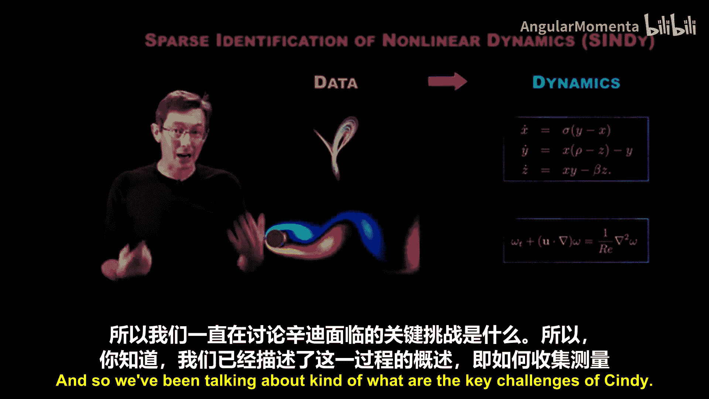

## 概述

SINDy算法的核心目标，是获取复杂系统的时间序列数据，并从中提取出可解释、可推广的动力学系统模型。这些模型可以是常微分方程或偏微分方程，其核心特征是尽可能简单，即动力学方程中的项数尽可能少。

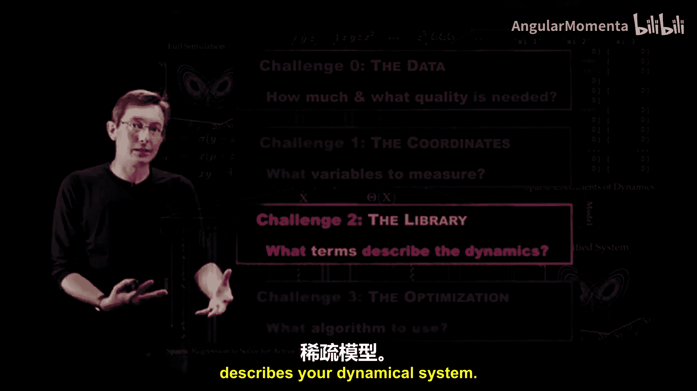

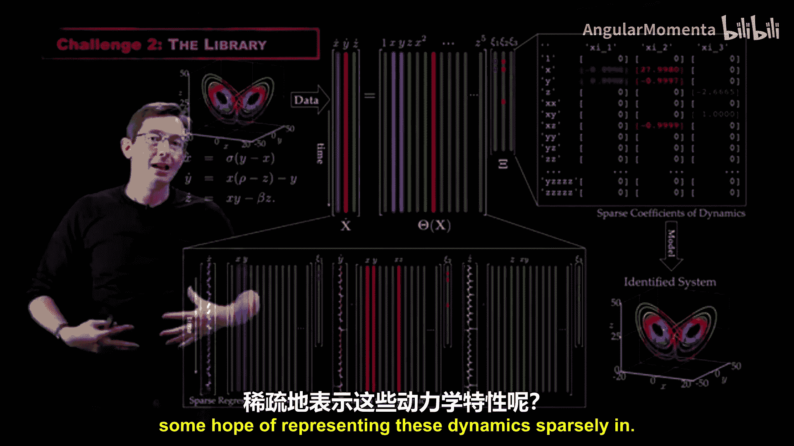

上一节我们介绍了SINDy算法的整体流程和关键挑战。本节中，我们将聚焦于如何构建候选函数库矩阵 **Θ**。这是算法中极具创造性的部分，设计良好的函数库能大大提高我们找到正确稀疏模型的成功率。

## 构建函数库的基本策略

构建函数库矩阵 **Θ** 是SINDy算法的关键步骤。最终，SINDy是一个广义线性回归问题，目标是找到 **Θ** 矩阵列的一个稀疏组合，来描述测量数据的时间导数。因此，大量的工作都投入在构建这个矩阵上。

以下是设计函数库时的一些基本建议和策略。

### 从简单开始：多项式函数库

在许多物理系统中，多项式是一个很好的起点。例如，在流体力学中，纳维-斯托克斯方程具有二次非线性项。因此，在建模流体系统时，通常从在函数库中添加线性和二次项开始。

对于新系统，建议遵循以下步骤：
1.  **尝试线性项**：计算动态模态分解模型，评估其在重构 **Ẋ** 和未来预测方面的准确性。如果模型准确有效，那么你已经获得了一个良好的线性动力学模型。
2.  **添加二次项**：如果线性模型拟合不佳，尝试添加二次项。如果线性加二次项模型有效，则问题解决。
3.  **逐步增加复杂度**：如果二次项仍不足，则继续添加三次项等，逐步增加复杂度，直到模型能够准确描述系统。不建议一开始就使用五阶多项式基，因为那可能过于复杂。

### 超越多项式：其他基函数

对于某些系统，多项式并非描述动力学的合适基函数。你可能需要考虑其他类型的函数。

*   **三角函数**：如果你处理的是摆或已知存在于周期性构型空间的系统，变量具有 **2π** 周期性，那么应该加入 **sin** 和 **cos** 等周期基函数。
*   **其他函数**：理论上，你可以向函数库中添加任何函数，如贝塞尔函数等。

**重要提示**：在组合不同函数库之前，建议先单独尝试它们。因为需要时刻关注矩阵的条件数。如果矩阵病态，将很难准确求解稀疏系数，尤其是在数据含有噪声时。要避免函数库过大或列之间过于线性相关。例如，**sin(x)** 可能与 **x**、**x³**、**x⁵** 的线性组合非常相似，如果多项式和正弦函数出现在同一个函数库中，可能导致病态问题。

## 扩展函数库以纳入物理效应

函数库的灵活性允许我们纳入更多物理效应，例如外部强迫或控制变量。

### 纳入控制输入

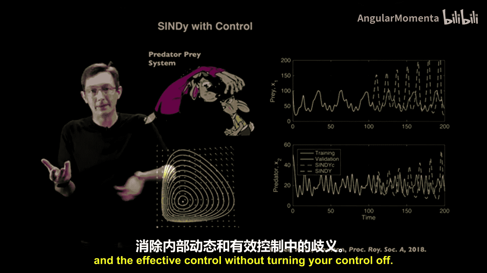

通常，动力学系统不仅是状态变量的函数，还可能存在外部强迫、控制变量或时间依赖性。你可以通过添加额外的列将这些因素纳入函数库。

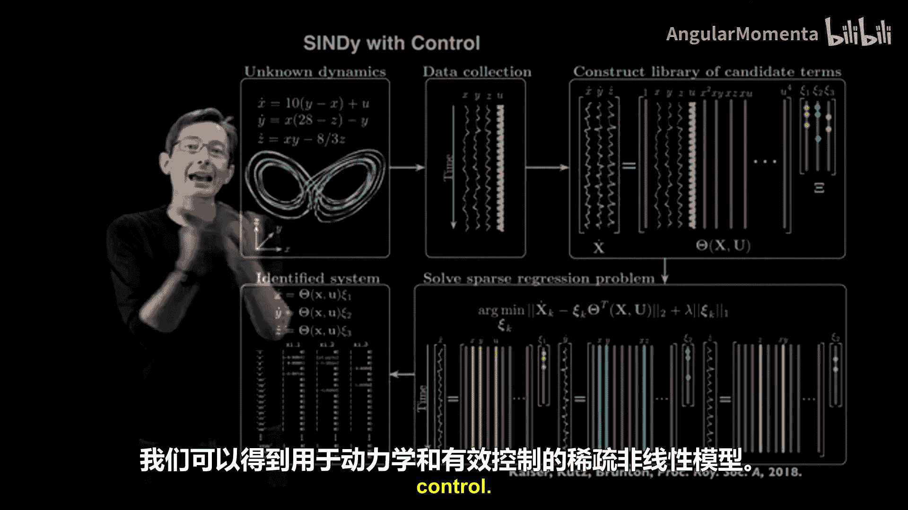

在SINDy with Control的工作中，可以将右侧的函数库进行扩展，使其不仅包含状态 **X** 的函数，还包含控制输入 **U** 的非线性函数以及交叉项。这对于区分系统内部动力学和外部控制效应至关重要。

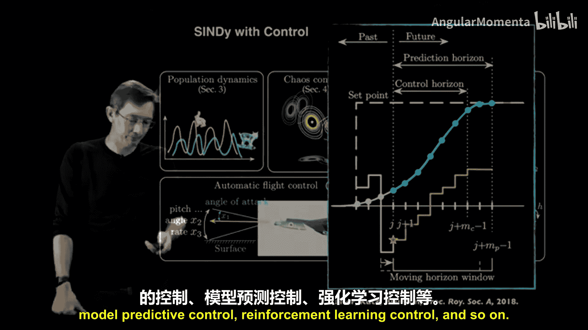

**示例：捕食者-猎物系统**
考虑一个简单的捕食者-猎物系统。假设系统存在一个未受迫的自然动力学。如果在某个时间点（例如第100年）引入人为控制（如捕猎），而建模时未考虑这个控制变量，那么在新的控制策略下，模型预测（黄色曲线）将完全错误。反之，如果在函数库中加入与控制相关的项，则模型（蓝色曲线）几乎能完美预测未来的动态。

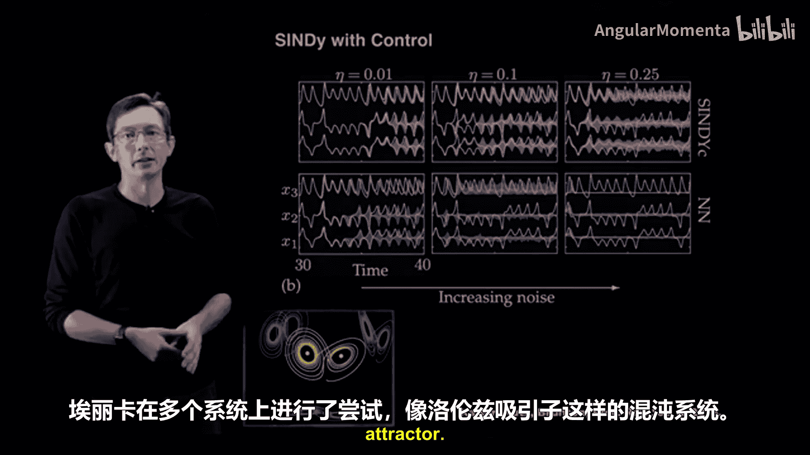

这表明，如果你正在主动控制系统，必须在SINDy函数库中考虑这一点，否则将得到错误的动力学模型。这种方法允许我们在不关闭控制的情况下，同时辨识内部动力学和控制效果。

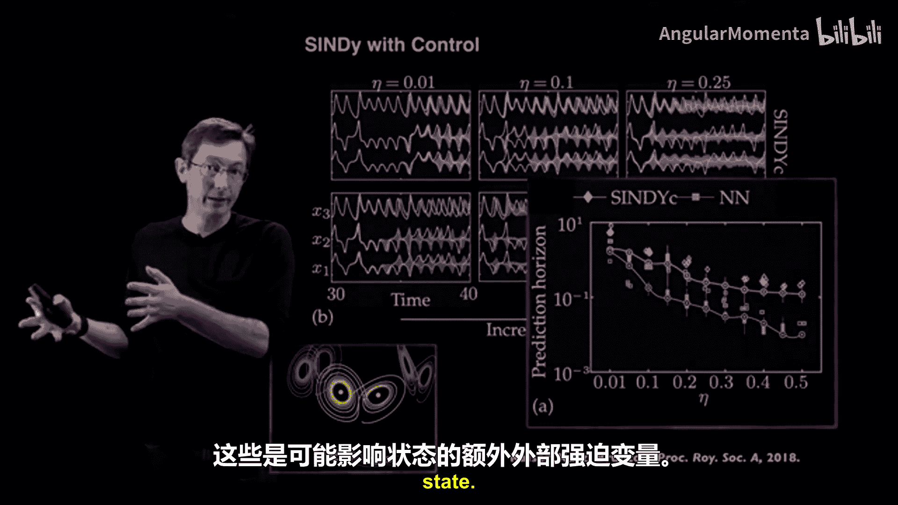

基于这些稀疏SINDy模型，可以开发模型预测控制器等，用于基于模型的各类控制策略。

### 纳入参数与分岔

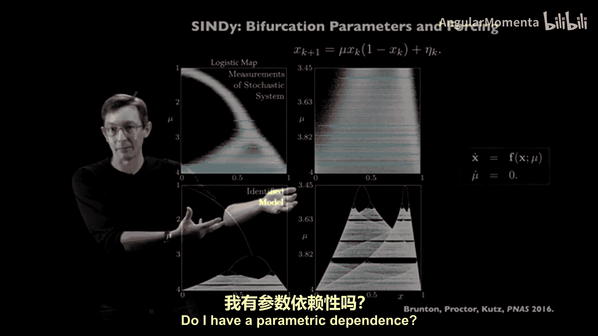

在原始论文中，我们展示了除了控制变量，还可以将参数（分岔参数或调节参数）纳入模型。

通过将参数（如 **μ**）作为列加入SINDy函数库，我们可以学习参数化系统的形式。例如，对于带有分岔参数 **μ** 的混沌逻辑斯蒂映射，通过在不同 **μ** 值下测量数据，并在函数库中包含 **μ** 以及与 **μ** 的交叉项，我们可以从少量含噪测量中学习映射的形式，然后利用学到的模型，在其他参数值下无噪声地填充整个分岔图。

这一切都取决于函数库的设计：你需要根据测量的数据，思考应该在函数库中加入什么，是否存在参数依赖，以及它可能如何影响系统。

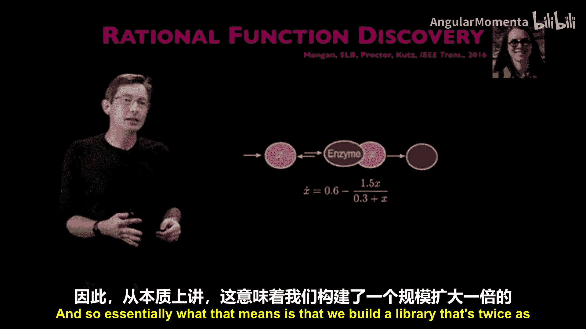

## 处理更复杂的动力学形式

SINDy研究的另一个重要方向是扩展该框架以处理更广泛的动力学系统类别。

### 隐式SINDy与有理函数系统

之前展示的方法允许你在固定基函数（如多项式、三角函数）中辨识稀疏模型。但如果动力学是有理函数形式（即分子和分母都是多项式），用标准SINDy建模将非常困难，因为有理动力学不易表达为 **Θ** 矩阵列的稀疏组合。

**思路**：对于形如 **Ẋ = f(x)/g(x)** 的有理函数，我们可以在等式两边乘以未知的分母 **g(x)**，得到一个隐式方程：**g(x)Ẋ - f(x) = 0**。然后，可以将其写成类似原始SINDy问题的形式：**Θ(X, Ẋ)C = 0**。此时，函数库 **Θ** 必须更大，需要包含描述 **f** 的项，以及描述 **f** 乘以 **Ẋ** 的项。

然而，这带来了一个严峻的优化问题：因为使 **ΘC = 0** 的最稀疏向量 **C** 是零向量，这显然不是一个好模型。研究发现，我们需要的不是在 **Θ** 的零空间中寻找最稀疏的 **C**。虽然存在相应的优化方法，但对于含噪数据，这个问题通常是病态的。

### 鲁棒的隐式SINDy

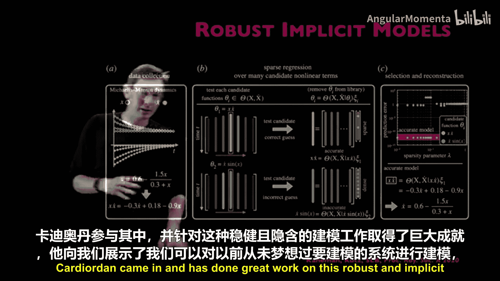

最近的工作对上述隐式SINDy建模过程进行了改进，使其更加鲁棒。

核心思想是：如果你知道动力学中肯定存在某个特定项，可以将其移到等式的右侧。这样，回归问题就不再是等于零，从而避免了零空间问题。具体做法是，遍历所有可能存在于模型中的候选项，逐一将其移到右侧并尝试建模。其中必有一种方式能产生一个既准确又稀疏的模型。

这种方法解决了原始隐式SINDy的许多问题，具有与标准SINDy相似的鲁棒性，能够处理中等程度的噪声，并且可以并行计算。利用这种方法，甚至可以成功建模像BZ化学反应这样复杂的、含有有理项的四变量耦合偏微分方程系统，这是原有框架难以企及的。

## 应对维数灾难与病态问题

在构建SINDy函数库时，我们还需要面对维数灾难和矩阵病态等挑战。

### 维数灾难

SINDy的一个关键优势在于，其函数库表达了大量可能的模型结构。对于包含五、六项的模型，可能存在数百万种组合，稀疏优化程序能以高概率从中搜索出正确的稀疏模型。

然而，**Θ** 矩阵的列数也存在维数灾难。例如，对于3个变量和5阶多项式，大约有81项，尚可接受。但对于10个变量和10阶多项式，函数库将变得极其庞大（可能达到数百万列），矩阵会过于病态，无法进行伪逆运算和稀疏优化。

因此，存在一个根本性的维数灾难。我们希望函数库能够良好地扩展，既希望列数尽可能少，又希望保持表示大模型空间的灵活性，这是一对相互竞争的目标。一个重要的动机是减少状态 **X** 的维度。如果你能找到用更少自由度描述系统的方法，将有助于改善函数库的扩展性。

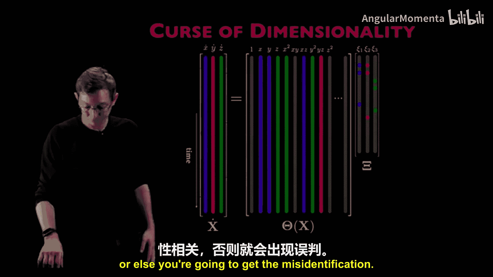

### 矩阵条件数与精确恢复

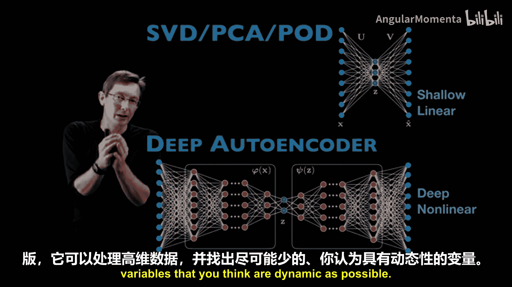

关于 **Θ** 矩阵的条件数，有一个更广义的概念称为“受限等距性质”相关的条件。它给出了基于 **Θ** 的广义条件数，何时可以期望精确恢复稀疏模型的条件。

关键在于：如果真实的稀疏模型列集与函数库中其他列高度相关或几乎线性相关，那么稀疏辨识将变得非常困难。因此，我们需要改善矩阵的条件数，保持其尽可能小（添加的列越多，线性相关性可能越高），同时通过采样更多初始条件来增加数据丰富性，以提高这些列线性独立的可能性。

这是一个技术细节，但非常重要。你关心的真实稀疏模型结构，不能与你不在乎的模型列近乎线性相关，否则会导致错误辨识。

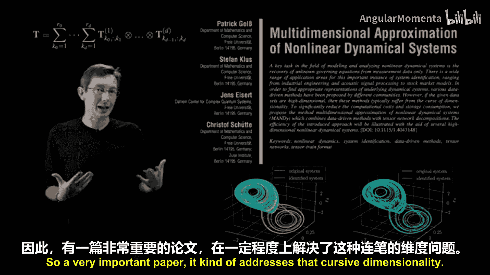

### 应对高维问题的先进方法

以下是几种应对高维和病态问题的先进方法：

1.  **降维**：对高维数据使用奇异值分解获取主成分，或使用深度自编码器网络，将数据压缩到更少的动态变量中，以保持函数库较小。
2.  **张量列车方法**：通过张量列车公式将广义线性模型 **Ẋ = Θ(X)C** 压缩成张量表示，允许使用更紧凑的模型表示更大的多项式空间，从而规避一些病态问题和维数灾难。
3.  **融入物理先验知识（如对称性）**：可以将对物理系统的先验知识（如对称性）融入到函数库中。如果你知道系统具有某种对称性（如奇对称性或 **2π** 周期对称性），可以构建反映这种对称性的函数库元素。这能立即排除大量不符合对称性的项，显著缩小函数库规模，从而用更少的数据、在条件数更好的情况下辨识出更好的模型。

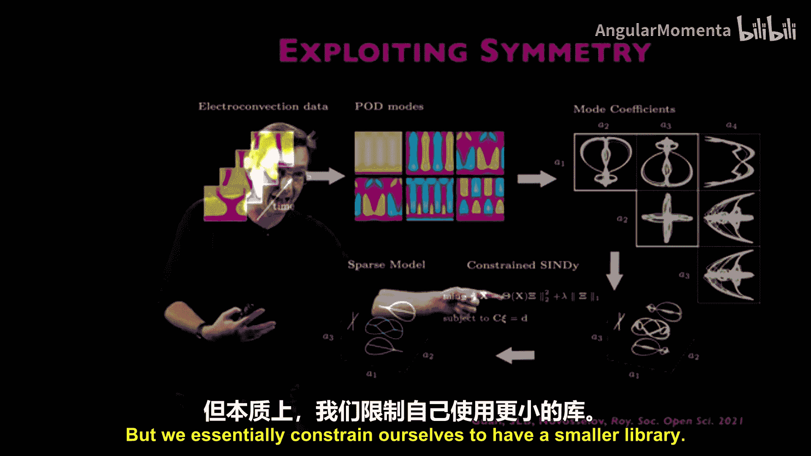

这是SINDy中最令人喜爱的部分之一：在设计候选项函数库、强制执行对称性和物理约束、以及融入你对试图发现的动力学的专家直觉方面，具有极大的灵活性和自由度。

## 总结

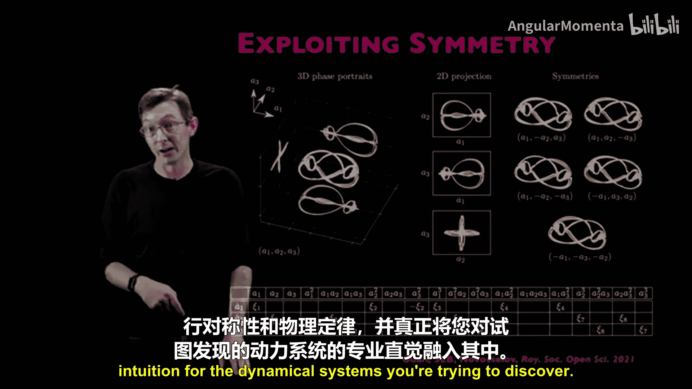

本节课我们一起深入探讨了SINDy算法中构建候选非线性函数库的关键问题。我们学习了从简单的多项式基开始，逐步增加复杂度的基本策略，并探讨了如何将控制输入、系统参数等外部效应纳入函数库。我们还了解了处理有理函数等复杂动力学形式的隐式SINDy方法及其鲁棒性改进。最后，我们讨论了函数库面临的维数灾难和病态问题，并介绍了几种先进的应对策略，包括降维、张量列车表示以及融入对称性等物理先验知识。设计一个良好的函数库是成功应用SINDy进行科学发现的核心，它允许研究者将领域知识灵活地融入到数据驱动的建模过程中。

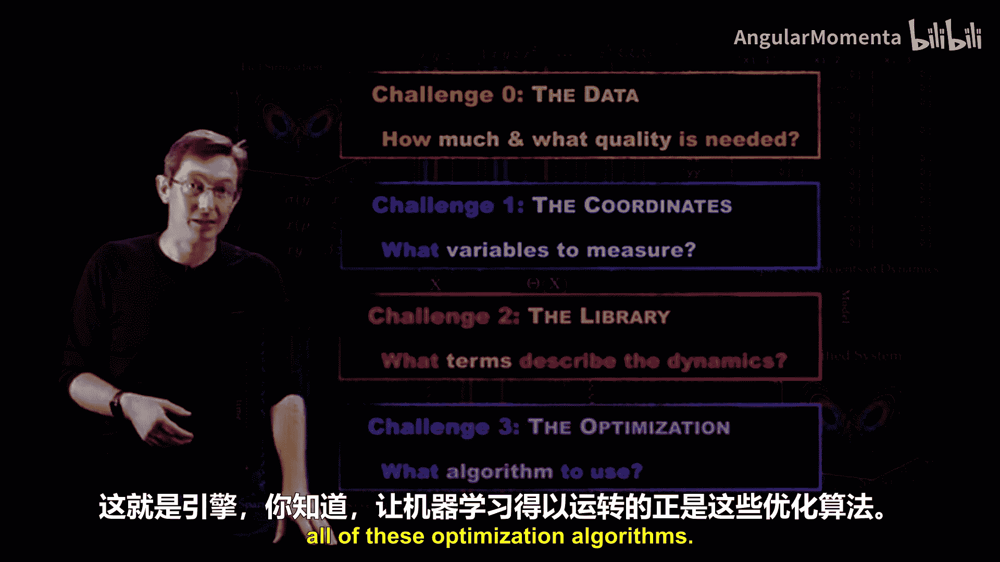

在下一讲中，我们将探讨SINDy的另一个关键挑战：优化问题。