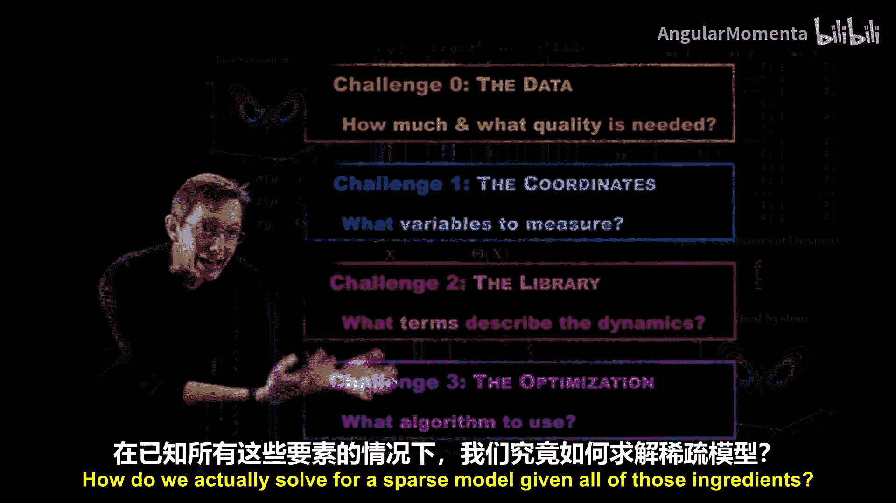
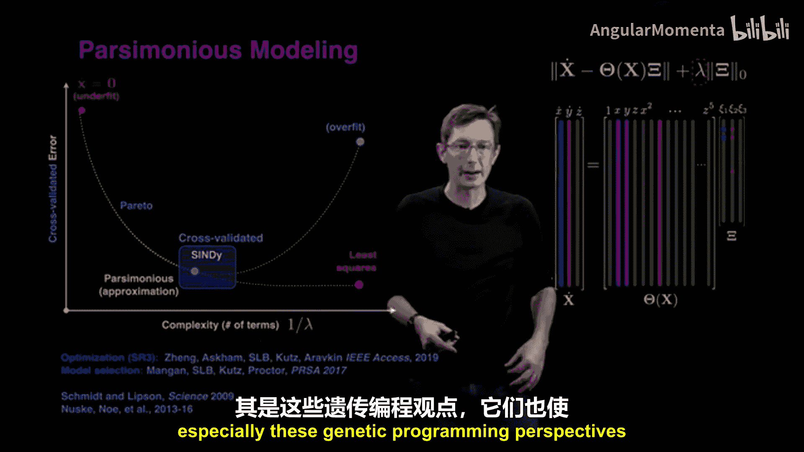
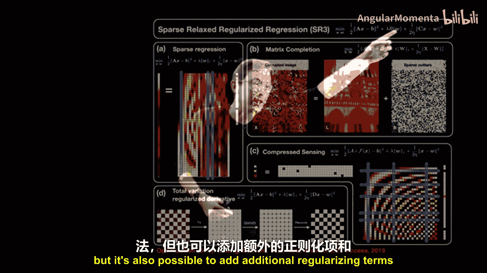
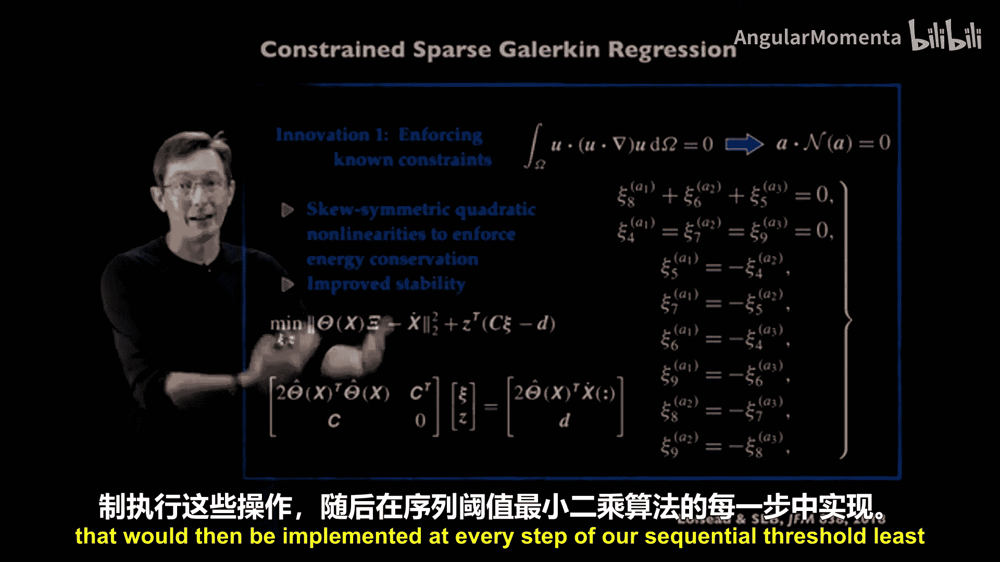
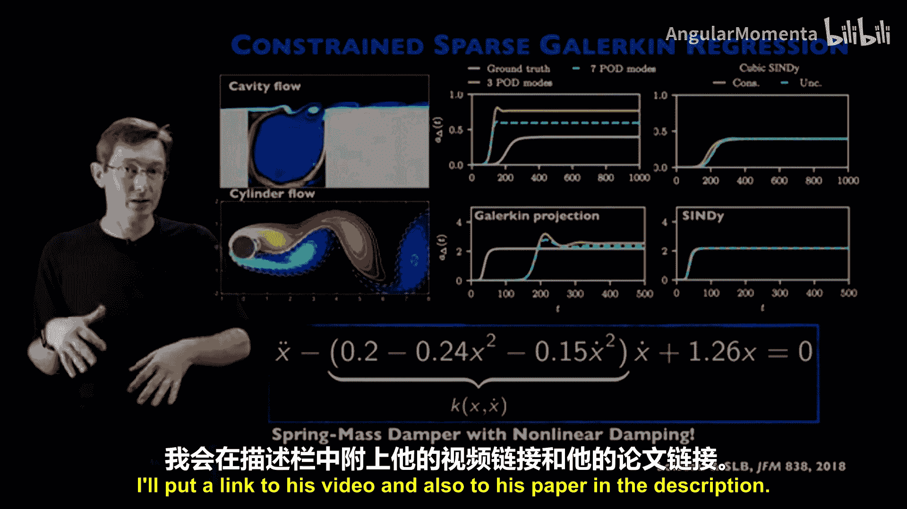
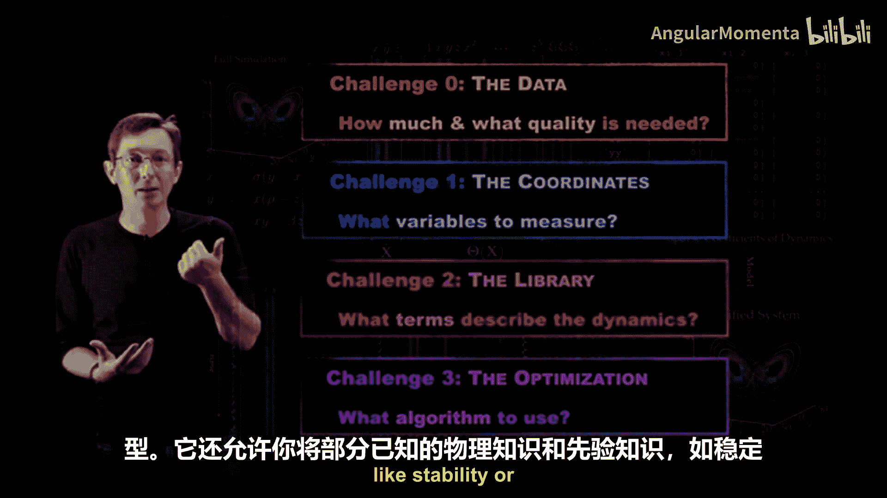

# 014：优化算法

在本节课中，我们将要学习SINDy算法中的核心环节——优化算法。我们将探讨如何从候选函数库中，通过稀疏回归技术，找到能够准确描述系统动力学的、最简洁的模型。

## 概述

上一节我们介绍了构建候选函数库的方法。本节中，我们来看看如何通过优化算法，从庞大的候选库中识别出真正起作用的少数几个项，从而得到一个稀疏、可解释且可推广的动力学模型。

## SINDy算法流程回顾

首先，让我们快速回顾SINDy的整体流程。该流程旨在从时间序列数据中发现可解释的动力学系统模型。

1.  收集系统状态数据 **X**。
2.  近似计算状态变量的导数 **Ẋ**。
3.  构建候选非线性函数库 **Θ(X)**。
4.  通过稀疏回归求解系数矩阵 **Ξ**，以识别出描述 **Ẋ** 动力学的活跃项。

整个SINDy过程可以表述为一个广义线性回归问题：
**Ẋ = Θ(X) Ξ**

我们的目标是找到一个尽可能稀疏（即非零元素尽可能少）的系数矩阵 **Ξ**，同时保证模型对数据有良好的拟合。

## 从最小二乘回归到稀疏回归

最简单的求解方法是普通最小二乘回归，例如使用伪逆求解：
`Ξ = pinv(Θ(X)) * Ẋ`
这种方法会使 **Ξ** 中几乎所有项都非零，虽然可能获得较好的拟合，但我们认为这是对训练数据的过拟合。基于我们对物理学的认知，真实的动力学模型通常只由少数几个关键项支配。

因此，我们需要一种**稀疏惩罚回归**方法。它在保证良好拟合的同时，促使系数向量 **Ξ** 尽可能稀疏。在原论文中，我们将其类比为Lasso算法，但实践中我们发现其他算法通常效果更好。

## 序列阈值最小二乘法

我们开发了一种名为**序列阈值最小二乘法**的自定义算法。其步骤简单有效：

以下是STLSQ算法的基本步骤：
1.  对全部候选项进行最小二乘回归，得到初始系数向量。
2.  将系数绝对值小于某个阈值 **λ** 的项设为零（硬阈值化）。
3.  仅对剩余的非零项再次进行最小二乘回归，更新其系数。
4.  重复步骤2和3，直到模型结构（非零项集合）不再变化。

该算法快速、准确，并且通常比Lasso等算法具有更好的模型收敛性。

## 模型复杂度与拟合误差的权衡

在回归过程中，我们始终在平衡模型的拟合误差和模型的稀疏性（由非零项的数量衡量）。我们希望在保持良好拟合误差的同时，使非零项尽可能少。

这种平衡由一个关键参数 **λ**（阈值）控制。**λ** 越大，对稀疏性的惩罚越强，模型越简单，但误差可能越高。**λ** 趋近于0时，则恢复为最小二乘解，模型复杂但误差低。

通过调节 **λ**，我们可以得到一系列从欠拟合到过拟合的模型。理想情况下，会存在一个帕累托最优的“拐点”，此处的模型在复杂度和泛化能力之间达到最佳平衡。最小二乘法在训练数据上表现良好，但在验证数据上可能因过拟合而表现不佳。我们期望通过交叉验证选出的SINDy模型就位于这个“拐点”附近。

核心要点：
*   我们通常使用序列阈值最小二乘法。
*   通过调整阈值参数 **λ**，可以选择模型的稀疏度。
*   当不了解真实物理时，获取帕累托曲线上的几个模型进行比较，可以帮助我们理解系统。

## 先进的优化算法：SR3

与优化专家合作，我们证明了序列阈值最小二乘法实际上是 **L0** 稀疏优化问题的一种形式化松弛。基于此，我们提出了一个更通用的稀疏优化算法——**稀疏松弛正则化回归**。

SR3引入了一个辅助变量 **W**，将优化问题分解，让 **Ξ** 尽可能稀疏，同时让 **W** 接近 **Ξ** 并保证拟合优度。这种分裂和松弛技术使算法具有更好的收敛性。SR3框架还可以方便地加入额外的正则化项和对系数的先验约束。

## 融入先验物理知识：约束优化

在许多物理系统中，我们拥有先验知识。例如，在不可压缩流体流动中，我们知道能量是守恒的，并且这种守恒源于二次非线性项的特定对称性。

我们可以将这些知识作为**等式约束**融入到优化过程中。例如，要求某些系数彼此相等或互为相反数。由于序列阈值最小二乘法的每一步都涉及最小二乘求解，因此可以很容易地在每一步中满足这些等式约束（例如通过KKT条件）。

对于Navier-Stokes方程，可以推导出一组保证能量守恒的等式约束条件。在SINDy优化中强制实施这些约束，可以**从构造上保证**模型是能量守恒的。将此应用于流体系统建模时，约束SINDy模型相比传统降阶模型，在定量精度上取得了显著提升。

此外，我的博士生Alan Kaptanoglu近期的工作将**全局稳定性条件**也融入了SINDy优化，从而能够得到构造上保证全局稳定的线性加二次模型。

## 处理系统突变：快速模型恢复

许多动力系统会随时间发生突变。我们开发了适用于**突变系统**的SINDy变体。当系统参数发生微小变化时，该算法可以快速学习对原有SINDy模型的小幅修正，这比从头学习一个全新模型要快得多。这种能力对于控制系统的实时应用至关重要。

## 总结

本节课中，我们一起学习了SINDy算法中的优化部分。我们了解到：
1.  **序列阈值最小二乘法**是求解稀疏系数矩阵的有效且常用的方法。
2.  通过调节阈值参数 **λ**，可以在模型复杂度与拟合精度之间进行权衡，并利用交叉验证选择最优模型。
3.  **SR3** 算法提供了更强大、更灵活的优化框架。
4.  优化算法允许我们将**先验物理知识**（如守恒律、对称性、稳定性）以约束形式融入模型，从而得到更物理、更精确的结果。
5.  针对系统突变，有专门的快速模型恢复算法。

稀疏优化现已是一类成熟的算法。选择合适的优化算法，结合正确的坐标、数据和函数库，能够帮助我们稳健地发现隐藏在数据背后的简洁物理规律。