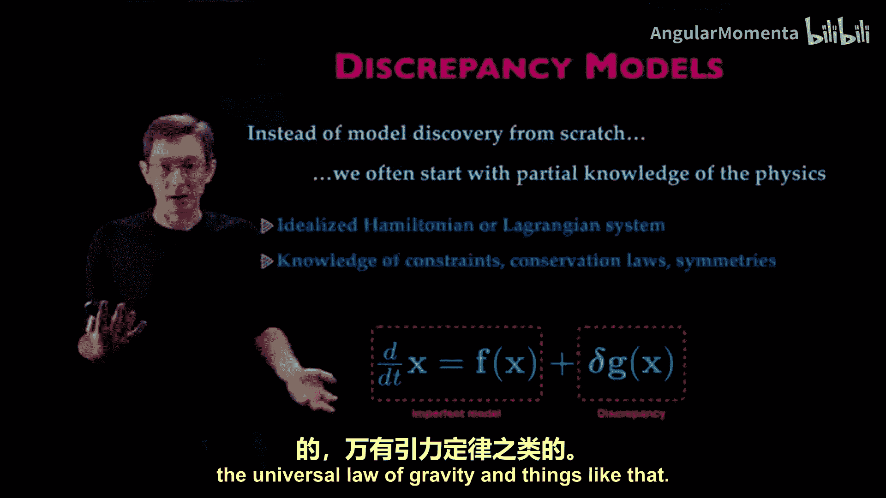
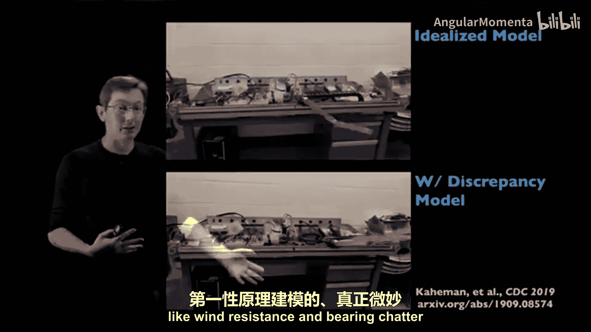
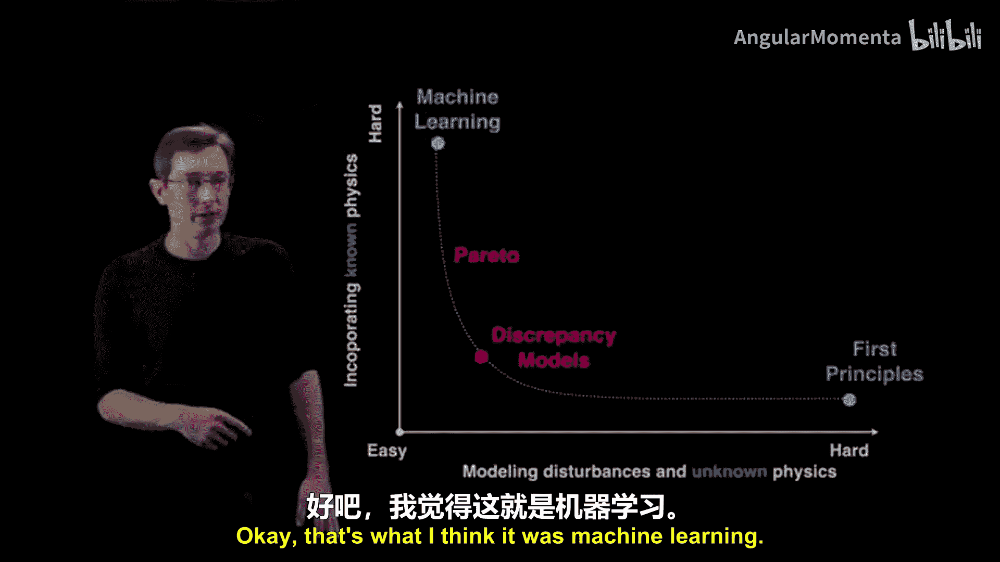
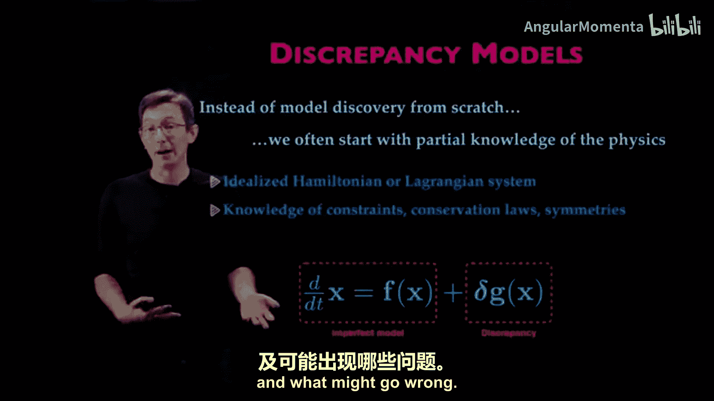
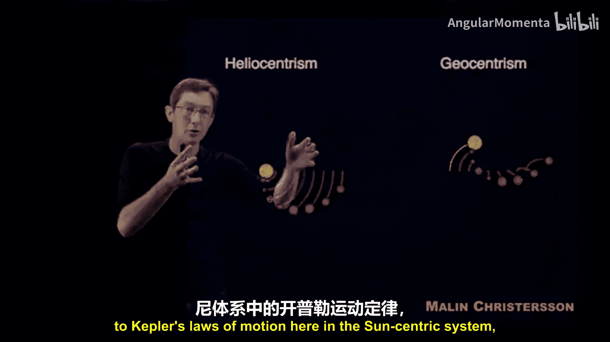
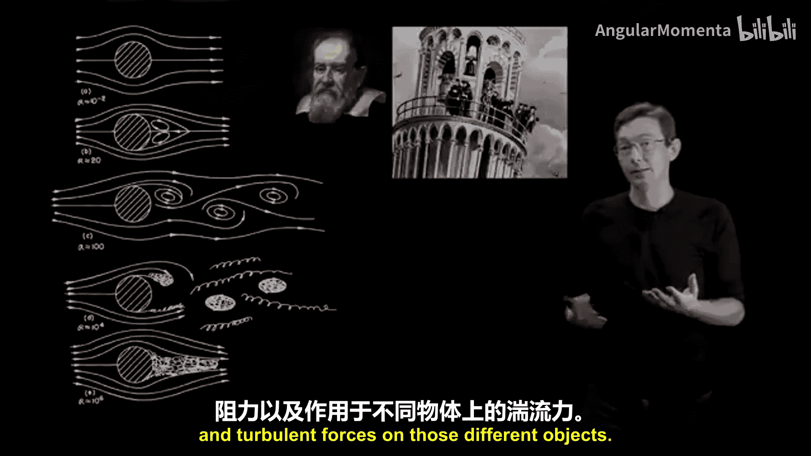
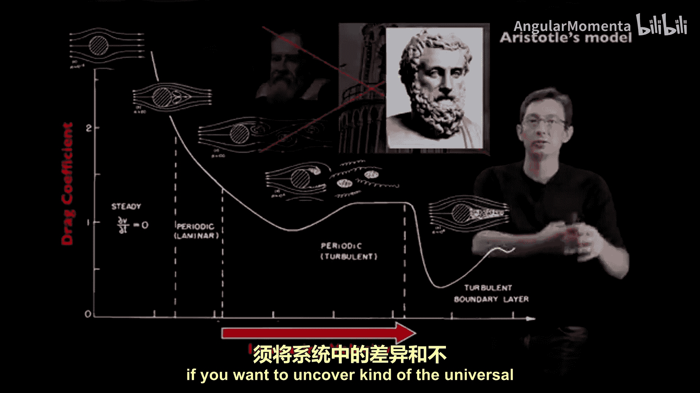
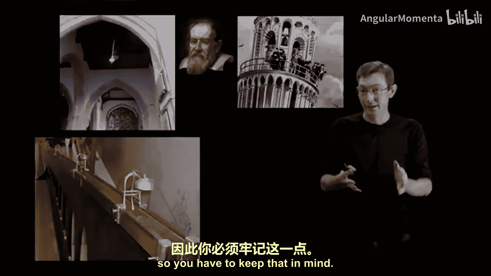
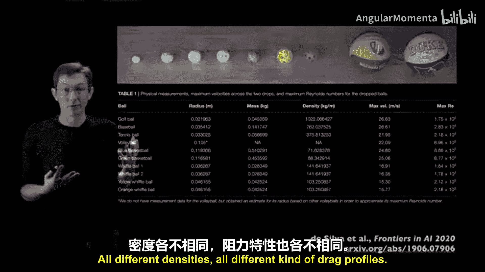

# 015：基于物理信息机器学习的差异建模

## 概述

在本节课中，我们将学习一种名为“差异建模”的机器学习方法，用于对动力学系统进行建模。我们将探讨如何结合已知的物理原理与机器学习，以更高效、更准确地描述复杂系统。

---

## 从零学习与差异建模

上一节我们介绍了使用现代机器学习工具对动力学系统进行建模。本节中，我们来看看一种更现实的建模视角：差异建模。

通常，当我们尝试使用新的机器学习技术来学习动力学系统时，我们会进行端到端的学习。我们假设对系统一无所知，并试图从零开始学习一切。这种方法可以展示机器学习的能力，证明其能够学习这些复杂系统。

然而，与其在没有任何先验知识的情况下从零开始发现模型，更现实的情况是你从对物理的部分知识开始。你可能有一个理想化的模型，例如双摆或自动驾驶汽车的哈密顿量或拉格朗日量。你可能知道系统必须满足的某些约束或对称性，例如守恒定律。你并不确切知道动力学，但你拥有这种部分的物理知识作为起点。

因此，我认为更合理的做法通常是尝试学习差异。你从这个不完美的模型开始，并可能希望将机器学习的重点放在对差异的建模上。这是模型与数据不匹配的部分。我认为这是一种更现实的方法，用于处理自主系统和机器人，快速、动态地学习：从一个不完美或理想化的模型开始，然后将机器学习的努力集中在差异上。

今天，我将讨论如何做到这一点，并探讨何时应该进行端到端学习，何时应该让机器学习模型捕捉差异，以及何时不应该。这与历史上的概念有关，例如万有引力定律。

---

## 差异建模实例：双摆控制

以下是一个我非常喜欢的例子，由Kair Dan Kayman（与Nathan Cutzon和我一起工作的博士生）完成。这是我在华盛顿大学机械工程实验室的一个双摆装置。

你可以看到这里的设置，他试图做的是将其摆动起来并稳定这个倒置的双摆。这是一个相对简单的机械系统，在纸上，你可以推导出拉格朗日量或哈密顿量，并可以从这些框架推导出运动方程。

但事实证明，当你使用那个理想化的哈密顿量或拉格朗日量模型进行控制设计时，该模型存在缺陷，使得准确有效地摆动和稳定系统变得非常困难。

这些缺陷是什么样的？例如关节中的非线性轴承颤振或风阻。这些通常不在我们的第一性原理物理中进行建模，或者至少很难做到。但是，当你使用机器学习技术加入一个差异模型时，当你用实验数据对你的理想化模型进行差异建模时，你就可以开始在这个差异模型中捕捉那些细微的影响，然后你就可以执行相当出色的控制任务，比如摆动并稳定这个双摆。

---

## 差异建模的优势：结合两种方法的优点

我们可以从两个维度来看待这个问题：从易到难。

*   **X轴**：建模扰动和未知物理。这是你知道的轴承颤振和风阻出现的地方，用第一性原理物理（纸笔、教科书物理）来建模这些非常困难。
*   **Y轴**：整合已知物理的难度。例如，在那个双摆中，我知道系统被约束在角坐标θ1和θ2中，我可以用笛卡尔坐标X、Y来写它。但我需要知道系统强制执行一些约束，这些轴承约束。这对于机器学习来说通常很难学习。很难学习哈密顿能量是守恒的，或者系统被约束在一个圆环或某些环面构型空间上。

因此，我认为这是一组非常有趣的坐标轴，可以说明为什么需要这些混合差异模型。有些事情机器学习很容易做到，比如它们可以通过收集数据来学习那些轴承颤振和风阻模型。第一性原理模型可以学习哈密顿能量应该守恒，并且系统被约束在环面上。

所以你希望两全其美。你不想用第一性原理做所有事情，也不想用机器学习做所有事情。你希望在这两者之间找到一个最佳平衡点，在那里你能获得两者的最佳效果。

希望这条曲线实际上更像一条帕累托最优曲线，这里有一个最佳拐点，我们的差异模型就位于此处。我们用第一性原理获得尽可能多的信息，并尽可能多地融入先验知识，然后第一性原理模型无法捕捉的所有东西，比如风阻，我们将用机器学习来建模这种差异。

那个机器学习可以是任何东西。它可以是一个深度神经网络。它可以是一个动态模态分解模型，非线性动力学的稀疏识别，一个高斯过程模型。这不仅仅是深度神经网络，而是某种数据密集型或数据驱动的模型，这就是我认为的机器学习。所以这是一个两全其美的最佳平衡点。

---

## 差异建模的应用场景

你可以将此应用于许多系统。我向你展示了双摆的摆动，这是我们波音先进研究中心的一个机械臂系统。同样，随着这个系统老化，关节移动的方式和电机行为的方式会随时间变化，因此当你构建数字孪生并希望整合老化或不同环境等因素时，这些差异模型也非常重要。

---

## 核心思想总结

简单总结一下，这个想法是：你将在第一性原理物理擅长的地方使用它，在我们的不完美模型中强制执行诸如约束、守恒定律和对称性之类的东西；你将使用机器学习擅长的地方，即从数据中建模那些真正棘手、难以量化的部分；你将把它们结合起来，希望得到一些易于训练且满足基本物理原理的东西。

---

## 历史视角与哲学思考

现在，在这一点上，这是这个想法的核心内容。但我想退一步，谈谈这在历史上是如何体现的，以及我们作为工程师可以学到的一些关键要点和注意事项，关于如何以及何时应用机器学习来建模动力学系统，以及可能出现什么问题。

我有时会展示这部电影，我非常喜欢Moin Christen的这个可视化。它展示了地心太阳系和日心太阳系这两种世界观之间的差异。

当然，你可以看到，如果你把地球放在太阳系的中心（这是人们一千多年来所认为的），动力学非常非常复杂。很难得到一个简单、理想化的模型来描述这里的行为。当你有正确的坐标系时，得到一个简单模型要容易得多。

但我想在这里指出的是，从亚里士多德模型（抱歉，是托勒密的地心系统中的“本轮套均轮”模型）到日心系统中开普勒的运动定律和哥白尼体系，我们花了很长时间。我要指出的是，托勒密的体系，它处于错误的坐标系中，是错误的物理。实际上，在很长一段时间里，它比开普勒的模型更准确，而开普勒的模型拥有正确的物理，将太阳置于太阳系的中心。

在某种程度上，存在这些差异、未测量的变量（我们当时还不知道的行星）以及我们无法预测的力，使得开普勒实际正确的理想化物理模型不如托勒密的模型拟合得好。我认为这对于我们作为机器学习工程师在学习动力学系统时是一个非常重要的点。很容易对数据过拟合。托勒密模型本质上是太阳系数据的傅里叶变换，它极其准确，比正确的模型更准确，因为存在差异，因为有尚未被测量的行星。

因此，你必须思考你试图测量和建模的核心部分是什么。

另一个我非常喜欢思考的例子是伽利略的落球实验。在某种意义上，伽利略和这个著名的落球实验，他扔下两个不同密度的球，它们以相同的速率下落，并同时击中地面。

这是一个设计非常巧妙的实验，我认为关于这个故事有很多历史性的复述或小虚构。如果你看伽利略的落球实验，这本质上应该证明存在一种普遍的万有引力定律，一个引力常数，并且物体无论密度如何都以相同的速率下落。

但我们知道这并不完全正确。我们所有人都知道，如果你扔下一个沙滩球和一个保龄球，它们确实以不同的速率下落，因为存在这些额外的力。不仅仅是重力作用在这些物体上，你还有流体力、阻力、粘性阻力以及这些不同物体上的湍流力。例如，如果你增加下落物体的速度，随着流体力的变化和分叉，你会经历所有这些不同的阻力状态，根据非常非常复杂的物理。

因此，在某种程度上，伽利略的落球实验试图说这些球以完全相同的速率下落，因为存在一个恒定的重力加速度，这忽略了一堆差异物理。那些落球中存在差异，模型没有捕捉到，你必须忽略它们，如果你想揭示那种恒定的重力加速度。

事实上，伽利略不仅仅是通过从比萨斜塔上扔球来发现这一点的。他做了非常仔细的实验。抱歉，让我退一步说。

如果你实际收集数据，你不是扔密度大的球，而是扔沙滩球、篮球、威浮球和高尔夫球，你很可能不会得出伽利略的恒定加速度。你更可能得出亚里士多德的模型，即球下落或穿过空气的速率在某种程度上与其质量或密度成正比。如果我扔一个棒球，它会比扔一个沙滩球飞得远得多，因为沙滩球的阻力在某种程度上与其密度有关。所以，这再次成为一千多年来的主流模型，因为它更符合数据。

因此，在某种程度上，如果你想揭示那种普遍的理想化模型（这正是伽利略所做的），你必须将系统中起作用的差异和不同类型的物理力分离开来。

在某种意义上，伽利略所做的不仅仅是从比萨斜塔上扔球。他还做了其他非常仔细的实验，观察摆如何在非常受控的静止环境中振荡，观察球如何沿着不同坡度的斜坡滚动，这样他就可以控制阻力类型和那些差异，并控制那些额外的影响。我认为这再次是一个极其重要的警示故事，对于我们作为机器学习工程师来说，当我们有一个新系统时，比如我们试图学习球如何在空中移动或下落，我们想学习物理。

我们更有可能学到亚里士多德的模型，这不是真正的底层物理，因为它由于那些差异项、由于现实世界的复杂性和流体阻力而更符合数据。

所以这是一个你必须问自己的非常重要的哲学问题：我想学习哪一个？这是一个公平的问题。我想学习在一个完美的世界中存在恒定的重力加速度，所有球都应该以相同的速率下落吗？还是我想学习完整的、棘手的湍流阻力物理，并获得真实球如何下落的更准确模型？这是一个公平的问题。在不同的情况下，你会想学习不同的模型。所以你必须记住这一点。

---

## 现代实验验证与模型选择

有一组实验被进行，这是与Brian De Silva（当时是Nathan Cutzon和我的博士生）以及Nathan的一些合作者一起完成的工作。他们基本上做了这个实验。他们拿走了所有这些不同的球，并从一座五层停车场的屋顶扔下它们，观察并跟踪它们落到地面的运动。所以你有高尔夫球、网球、棒球、威浮球、篮球，所有不同的密度，所有不同的阻力特性。

如果你看数据，这是高度，这是它们从大约40米高处下落时的频闪测量，你看到它们都以不同的速率下落。同样，原始数据更像亚里士多德模型，即下落速率在某种程度上取决于它们的密度。

如果你绘制高度随时间的变化图，你会看到它们都采取不同的轨迹，这些虚线是物理的不同模型。这是没有摩擦的理想化重力，然后白色和黄色的虚线是具有某种基于速度的阻力模型，这只是在对数图上的相同数据。

所以你看到数据实际上并不支持这些模型中的某一个，它到处都是。所以我们可以做许多实验，这是使用我们的非线性动力学稀疏识别算法，你输入一组可以描述加速度的候选项，仅通过回归，你试图看看哪些项最能描述数据。

对于这些不同的球经过多次下落，你会得到不同的项出现和消失。你会得到虚假项，这个x不应该在那里，这个v²不应该在那里，所以根据伽利略的说法，这是错误的物理。

现在，如果你添加一个组稀疏性惩罚。也就是说，相同的物理必须成立，相同的项必须存在于所有球的所有下落中。如果你添加组稀疏性，你基本上就排除了所有这些虚假项，并学习了实际的动力学：x的双点（加速度）等于一个大小为9.8的常数（重力），并且存在一种与速度成正比的阻力或耗散项。这是非常简单的基于速度的阻力模型。

因此，必须非常小心地约束你的机器学习算法以学习正确的物理，因为实际数据并不支持这一点。数据表明存在密度依赖项，如果你只看威浮球下落，还有其他物理更可能描述你的数据。

我只是发现这对我自己非常有启发性，我知道我们经常讨论这个问题，在我们的团队中。这确实开始引发一个问题：你想要什么样的模型？

你想要一个实际上捕捉了这些不同类型球之间所有变化的模型吗？这个模型确实包含一个密度项，并捕捉了这些球的湍流阻力尾流。还是你想要更像伽利略的简单、理想化的物理？这与差异建模的问题以及你如何建模、如何控制学习过程有关。

所以，当你用机器学习建模系统时，思考你想要什么样的模型，这是一个非常重要的想法。你想要一个可以分析、从中学习并能很好推广的理想化模型吗？还是你想要一个仅仅通过蛮力更准确地拟合你的数据的模型？你想要伽利略还是亚里士多德？

---

## 总结

本节课中，我们一起学习了差异建模的核心概念。我们了解到，结合已知物理原理与机器学习对差异进行建模，是一种更高效、更现实的系统建模方法。我们通过双摆控制实例看到了其优势，并从历史案例（如托勒密体系与伽利略实验）中认识到，在设计机器学习模型时，必须审慎思考我们究竟希望模型捕捉何种层面的物理规律——是追求普遍、简洁的理想化模型，还是追求对复杂现实数据的高精度拟合。这取决于具体的应用场景和目标。