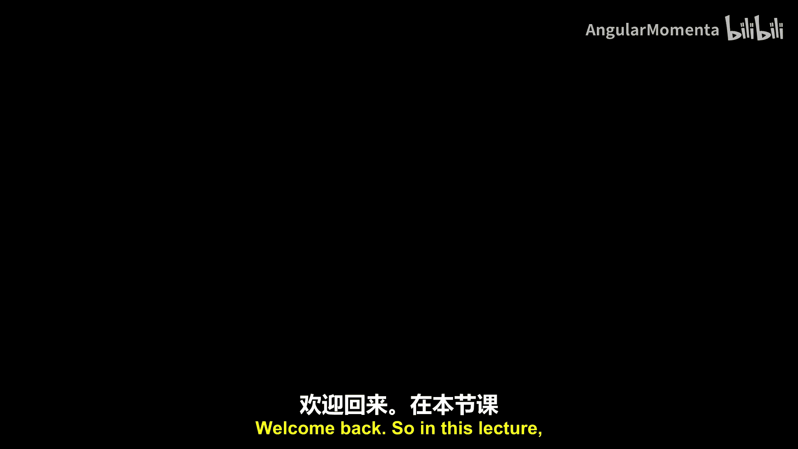
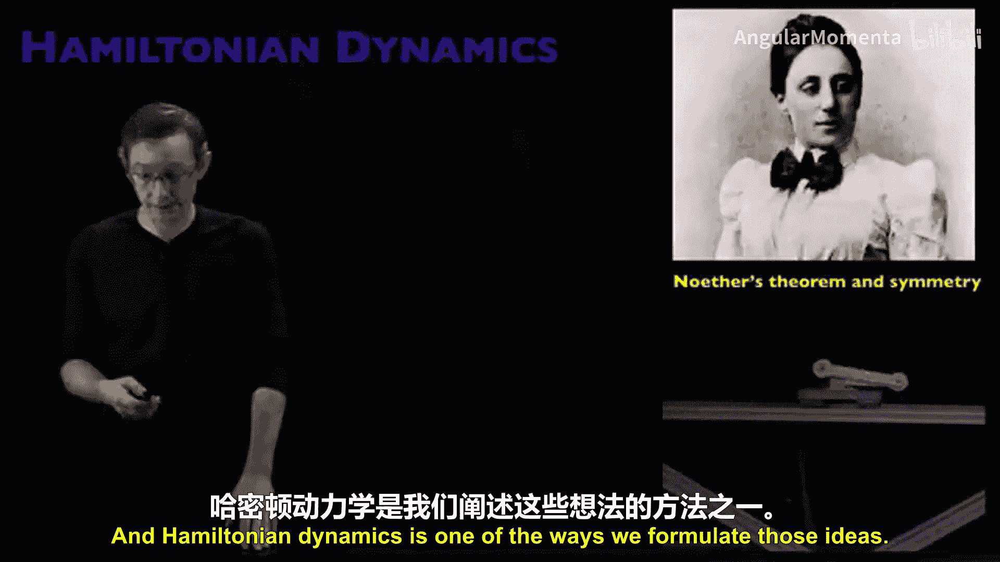
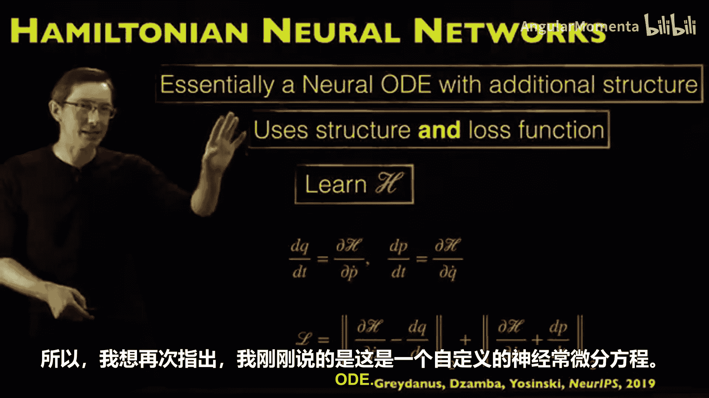
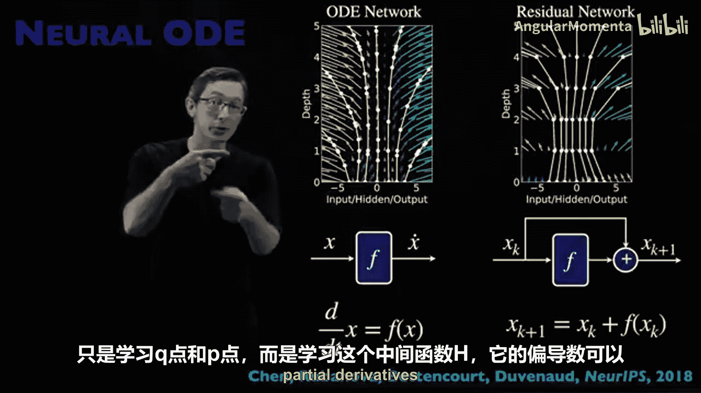

# 016：哈密顿神经网络 🧠⚛️

在本节课中，我们将学习一种名为“哈密顿神经网络”的自定义神经网络架构。这种架构利用了许多动力系统固有的哈密顿结构，从而能够从嘈杂的观测数据中更好地学习系统动力学。

## 概述

哈密顿动力学在现实世界中无处不在，例如弹簧上的质量块、单摆、双摆等机械系统，以及许多流体流动。哈密顿系统通常与能量守恒的机械系统相关。本节课介绍的这篇2019年NeurIPS论文，巧妙地将我们已知数百年的哈密顿动力学结构（一种特定的对称性）融入到特定的神经网络架构和损失函数中。这使得我们能够用更少、更嘈杂的数据学习到更好的模型。

## 哈密顿动力学背景 📜

在深入神经网络之前，有必要了解哈密顿动力学本身并非机器学习领域的新概念。从伯努利、牛顿、欧拉、拉格朗日到哈密顿，我们对机械系统及其微分方程的理解经历了数百年的发展。哈密顿动力学在其当前形式下已存在至少150年。

哈密顿系统通常被认为是能量守恒或无耗散的系统。能量守恒是埃米·诺特定理中讨论的众多不变性和对称性之一，该定理深刻揭示了对称性如何影响特定系统的动力学。将物理原理融入机器学习是我们的核心目标，而对称性正是“物理性”最基本的概念之一。

## 数值积分中的结构重要性 🔄

有些系统（如单摆）很容易进行时间积分，其动力学是确定性和非混沌的。然而，像双摆这样的混沌哈密顿系统则非常难以数值积分。

传统的龙格-库塔积分方案通常会在这些系统上失败，因为它们的设计并非为了守恒系统的能量等守恒量。在理想的无摩擦情况下，双摆的能量应该守恒。但如下图所示，基准解（地面真值）的能量保持在常数60，而采用自适应步长的四阶龙格-库塔法（ODE45）的能量会迅速发散。

因此，存在一类专门的手工积分器，称为**辛积分器**或**变分积分器**，它们能保持哈密顿结构（辛结构）或满足欧拉-拉格朗日方程的结构。这些积分器在守恒系统感兴趣的量方面表现要好得多。

核心观点是：**哈密顿动力学或欧拉-拉格朗日动力学的结构至关重要**。如果不尊重这些结构，只是朴素地向前积分，会得到糟糕的结果；但如果将结构融入其中，则会得到好得多的结果。这正是哈密顿神经网络的核心思想——尝试将这种辛结构“烘焙”到神经网络架构中。

## 哈密顿神经网络架构 🏗️

哈密顿神经网络的基本思想非常巧妙。假设我们有一个系统，其状态由位置变量 **Q** 和动量变量 **P** 描述。

*   **朴素方法（基线）**：构建一个前馈神经网络，直接根据 **Q** 和 **P** 预测导数 **Q̇** 和 **Ṗ**。这类似于神经ODE中的常规做法。
*   **哈密顿神经网络方法**：不直接学习动力学 **Q̇** 和 **Ṗ**，而是学习一个**哈密顿函数 H**（同样使用一个以 **Q** 和 **P** 为输入的大型神经网络）。然后，通过以特定方式取 **H** 的偏导数，使其满足**哈密顿方程**，从而间接得到 **Q̇** 和 **Ṗ**。

这种方法在原则上融入了哈密顿结构，因此模型应该能更好地守恒能量，并且能够从更嘈杂、更粗糙的数据中学习，最终得到非常清晰、保守的相图轨迹。

## 哈密顿方程与损失函数 ⚖️

哈密顿方程的形式如下，它定义了系统必须满足的辛结构：

**Q̇ = +∂H/∂P**
**Ṗ = -∂H/∂Q**

其中，**Q** 是广义位置坐标向量（如摆角），**P** 是对应的广义动量向量。对于一个哈密顿系统，其支配 **Q** 和 **P** 的微分方程必须满足这种结构（注意第二个方程前的负号是关键）。

哈密顿神经网络学习函数 **H**，然后构建一个自定义损失函数来确保上述方程成立。该损失函数本质上要求：

*   预测的 **Q̇** 应尽可能等于 **∂H/∂P**。
*   预测的 **Ṗ** 应尽可能等于 **-∂H/∂Q**。

损失函数可以形式化地表示为：
`Loss = ||Q̇ - ∂H/∂P||² + ||Ṗ - (-∂H/∂Q)||²`

通过现代机器学习框架的自动微分功能，我们可以高效地计算这些偏导数。

因此，**哈密顿神经网络可以看作是一种自定义的神经ODE，它增加了额外的结构约束**。我们既通过架构选择（学习 **H** ）来融入物理，也通过损失函数（促进辛结构）来融入物理。

## 性能表现与展望 📊

在质量-弹簧系统、理想摆和真实摆等相对简单的玩具问题上，哈密顿神经网络（下图中黄色线）在跟踪真实守恒能量方面，比朴素的基线神经网络（蓝色线）表现要好得多。

这验证了我们的预期：如果希望算法守恒已知的守恒量（如总能量），融入哈密顿结构是至关重要的。

一个有趣的课后挑战是：将哈密顿神经网络应用于**双摆**这样的混沌系统。在混沌系统中，准确跟踪总能量非常困难，这将是一个更有挑战性的测试案例，可以更深入地验证该方法的有效性。

## 总结

本节课我们一起学习了**哈密顿神经网络**。这是一种通过架构设计和损失函数，巧妙地将哈密顿力学（辛）结构融入机器学习模型的优雅方法。对于我们在科学和自然界中观察到的许多机械系统和物理系统而言，这种结构至关重要。实验表明，仅仅在损失函数中融入这种辛结构，就能对学习效果产生巨大的积极影响。

这是一个非常酷的想法，并且存在相关的扩展，例如**拉格朗日神经网络**，它基于欧拉-拉格朗日方程而非哈密顿方程，具有一些关键优势，我们将在另一个视频中介绍。