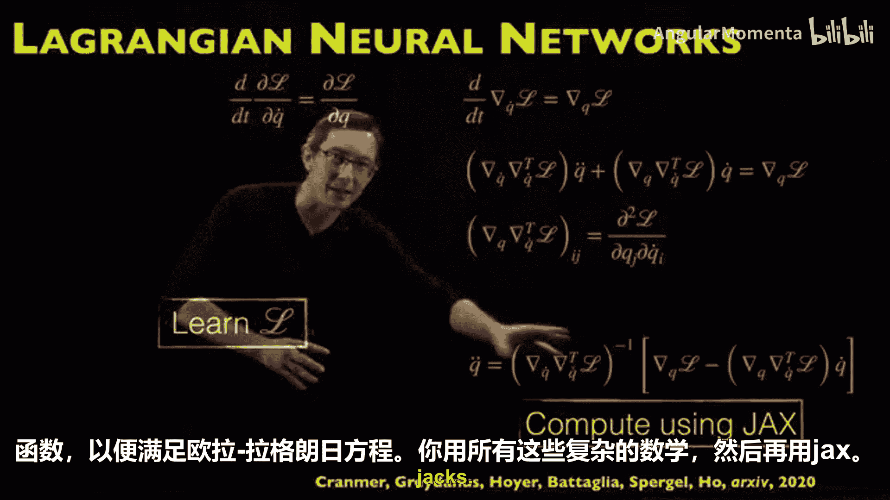
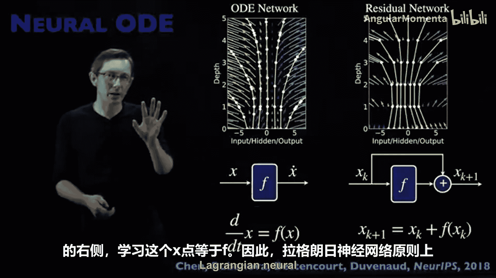
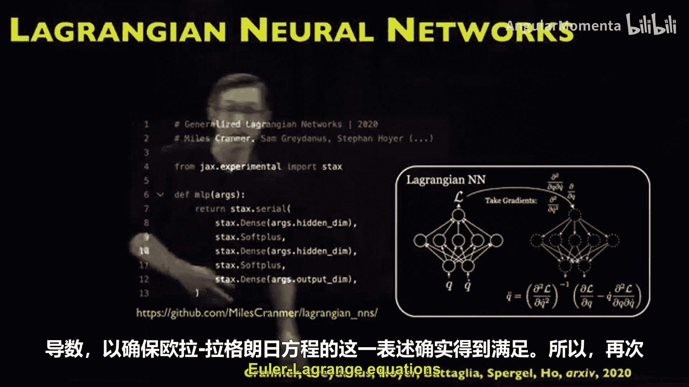

# 017：拉格朗日神经网络

在本节课中，我们将学习一种名为“拉格朗日神经网络”的巧妙神经网络架构。这种架构将欧拉-拉格朗日方程的结构融入神经网络，从而在估计、预测和建模机械系统（如双摆）时，显著提升其性能。这是一种我非常喜欢的定制神经网络，因为它巧妙地将物理学原理融入了网络架构和损失函数中，并展现出卓越的性能。

## 从哈密顿神经网络到拉格朗日神经网络

上一节我们介绍了哈密顿神经网络。如果你已知一个系统具有哈密顿结构（例如能量守恒），那么哈密顿神经网络不是简单地学习状态向量（位置 **Q** 和动量 **P**）的时间导数 **Q̇** 和 **Ṗ**，而是学习一个中间的哈密顿函数 **H**。通过对其求特定偏导，可以得到 **Q̇** 和 **Ṗ**。这是一种强制运动方程满足哈密顿或辛结构的巧妙方法。

拉格朗日神经网络是哈密顿神经网络思想的一种延伸或变体，但它具有一些关键优势，我们将在本节中探讨。

## 物理学的两种视角：拉格朗日与哈密顿

在物理学中，对于机械系统或经典力学，描述运动方程有两种本质上等效的视角：
*   **拉格朗日视角**：写出拉格朗日量 **L**，并建立欧拉-拉格朗日方程。这是一种物理学的变分方法。
*   **哈密顿视角**：写出哈密顿量 **H**，并建立哈密顿方程。

在大多数情况下，这两种视角是等效的，是同一图景的对偶版本。虽然存在一些细微差别，但可以认为它们是高度互补的。本文采用了拉格朗日视角。

## 朴素方法的局限性

如果我们采用朴素的方法，即直接使用前馈网络学习 **Q̈** 作为 **Q** 和 **Q̇** 的函数方程，对于已知具有能量守恒或某种对称性的系统，这种朴素方法通常无法保持该守恒量或对称性。

以双摆为例，能量可能会逐渐耗散或爆发。而如果强制网络满足拉格朗日量和欧拉-拉格朗日方程的结构，则更有可能保持系统的能量或已知的对称性。

因此，如果你知道系统具有某些对称性、守恒量或拉格朗日结构，这是一种将物理知识融入神经网络架构的极其简单而强大的方法。

## 与变分积分器的类比

在数值积分领域，也存在类似的思想。对于双摆这样的系统，如果使用朴素积分器（如四阶龙格-库塔法 ODE45），能量这个本应守恒的量会迅速发散。

然而，存在一类称为“变分积分器”的数值积分器，它们专门设计用于尊重给定特定拉格朗日量的欧拉-拉格朗日方程结构。这类积分器在保持能量守恒方面表现要好得多。

变分积分器在科学计算中广泛应用，例如预测行星、小行星等混沌系统的运动，这些系统也由欧拉-拉格朗日方程支配。

我介绍这一点，是因为它与我们使用拉格朗日神经网络的做法直接平行。朴素的方法（如龙格-库塔法）效果不佳，需要将欧拉-拉格朗日结构融入积分器才能取得好效果。神经网络也是如此：如果我们融入欧拉-拉格朗日结构，它就更有可能保持对称性和守恒量。

## 拉格朗日神经网络的核心思想

拉格朗日神经网络的核心思想如下：

它不直接学习支配状态变量（如摆的 **θ** 和 **θ̇**）的微分方程，而是使用神经网络学习一个称为拉格朗日量 **L** 的中间函数。

然后，它利用自动微分（如 JAX）以正确的方式计算该拉格朗日量所需的偏导数，从而恢复欧拉-拉格朗日方程。并在损失函数中强制要求该方程必须成立。

因此，拉格朗日神经网络是一种巧妙的选择：**架构上选择对拉格朗日量建模，损失函数上确保该拉格朗日量满足欧拉-拉格朗日方程**。你学习的拉格朗日量使得欧拉-拉格朗日方程被满足，这是一种将拉格朗日动力学融入神经网络的聪明方式。

## 相对于哈密顿神经网络的优势

与最接近的思想——哈密顿神经网络相比，拉格朗日神经网络有一些关键优势。

这是一个微妙但非常重要的点：在哈密顿神经网络中，你需要知道正确的变量选择，即位置 **Q** 及其对应的共轭动量 **P**。有时这很容易，但在某些拉格朗日或哈密顿动力学情况下，计算这些共轭动量变量 **P** 可能很麻烦。

哈密顿神经网络需要所谓的“正则坐标”，而拉格朗日神经网络不需要这些正则坐标。因此，拉格朗日神经网络对于任意选择的 **Q** 和 **Q̇** 都更灵活，在难以计算共轭动量的复杂情况下更可能适用。

## 实现原理与损失函数

拉格朗日神经网络学习系统的拉格朗日函数 **L**，然后利用自动微分计算必要的偏导数。

我们知道，学习到的拉格朗日量应满足欧拉-拉格朗日方程。这是物理学中最基本、最普遍的方程之一，它概括了最小作用量原理。该原理在量子力学、广义相对论、经典力学、光学、电磁学中几乎总是成立的。

通过数学推导（详见原论文），我们可以得到 **Q̈** 应该等于一个由拉格朗日量 **L**、**Q** 和 **Q̇** 构成的表达式。在现代机器学习框架（如 JAX 或 PyTorch）中，可以利用自动微分相对容易地计算这个右侧表达式。

然后，可以将这个可计算的右侧项与真实的 **Q̈** 之间的差异纳入损失函数。具体来说，可以计算 **Q̈** 减去由 JAX 计算出的所有项，并取其范数。如果这个损失项很小，就意味着你的欧拉-拉格朗日方程得到了满足。

这是一个非常巧妙的想法：我们选择学习拉格朗日量的架构，并添加一个自定义损失函数，以确保欧拉-拉格朗日方程得到满足，所有这些复杂的数学计算都可以借助 JAX 完成。

## 与神经ODE的关系

拉格朗日神经网络是神经ODE的一个定制版本。神经ODE就像是残差网络的连续时间版本，它用神经网络学习微分方程右侧的函数 **f**，即 **Ẋ = f(X)**。

原则上，拉格朗日神经网络很像神经ODE，只是多了一个中间步骤：我们先学习一个拉格朗日量。

## 代码实现与总结

你可以下载相关代码，实际运行和测试它。代码实现起来实际上相当容易。以下是关键部分：构建一个简单的前馈神经网络（例如，三个全连接层加激活函数）来学习拉格朗日量 **L**。然后使用 JAX 计算关于 **Q** 和 **Q̇** 的所有偏导数，以确保欧拉-拉格朗日方程公式得到满足。

本质上，它是一个带有额外结构的神经ODE：增加了学习拉格朗日量的中间步骤，以及一个自定义损失函数来确保学习到的拉格朗日量确实满足你数据上的欧拉-拉格朗日方程。

令人惊讶的是，我们可以用几行 JAX 代码实现这个操作。这原本可能很混乱，但借助 JAX 或 PyTorch 等现代机器学习工作流，它变得相对容易。

**总结**：本节课我们一起学习了拉格朗日神经网络。这是我最喜欢的物理启发式神经网络架构之一，因为它融入了物理学中最基本的思想之一——最小作用量原理。它通过两个阶段将拉格朗日物理学融入网络：一是通过架构选择对拉格朗日量本身进行建模；二是通过自定义损失函数，强制要求学习到的拉格朗日量 **L** 在你数据的轨迹上满足欧拉-拉格朗日方程。

这是一个非常酷的想法，我强烈建议你下载代码亲自尝试，看看能添加多少噪声数据它仍然有效，或者尝试将其扩展到非确定性或非经典力学系统。这是一篇非常出色的论文，也是对哈密顿神经网络的一次精彩改进，具有关键优势。