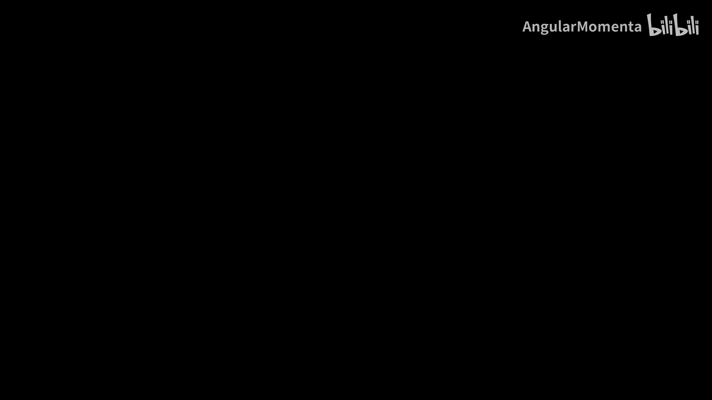
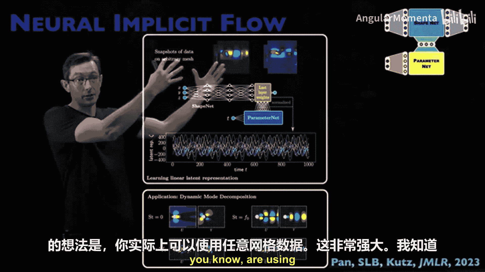
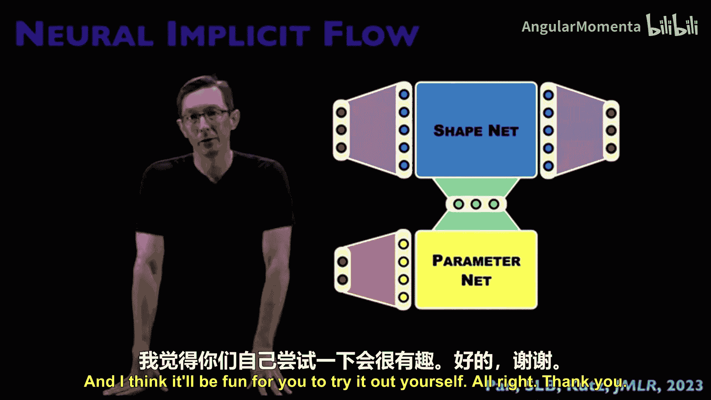

# 018：神经隐式流 🧠

在本节课中，我们将要学习一种名为“神经隐式流”的神经网络算子学习方法。该方法由邵攀博士在其博士后期间与我和Nathan Cutz共同开发，并于2023年发表在JMLR期刊上。我们将探讨其架构、工作原理、应用场景以及优势。

## 架构概览 🏗️

神经隐式流的架构与深度算子网络有相似之处。它包含两个主要部分：形状网络和参数网络。这种分离设计使得网络能够处理不同类型的任务。

## 网络组件详解

上一节我们介绍了神经隐式流的整体架构，本节中我们来看看其核心组件——形状网络和参数网络的具体功能。

形状网络的功能类似于物理信息神经网络。它负责对感兴趣的输出场（如速度场）进行建模，将其表示为空间坐标的函数。其核心公式可以表示为：
`U = ShapeNet(x)`
其中，`U`是输出场，`x`是空间坐标。

参数网络则负责参数化形状网络。它将系统参数（如流体流动的马赫数、雷诺数）或时间等外部变量作为输入，并输出用于调制形状网络的参数。这可以表示为：
`params = ParameterNet(μ, t)`
其中，`μ`是系统参数，`t`是时间。

这种设计的巧妙之处在于，它将主要与空间相关的部分（形状网络）和主要与外生变量相关的部分（参数网络）分离开来。

## 工作原理与应用示例 💡

理解了网络组件后，我们来看看神经隐式流是如何工作的，以及它能做什么。

神经隐式流通过在不同参数值和不同时间点的PDE解上训练这些网络来工作。训练完成后，它可以预测在新的参数`μ`和新的时间`T`下的PDE解。

以下是神经隐式流的几个关键应用方向：

*   **数据压缩**：该方法可用于压缩大型湍流数据集。通过训练形状网络和参数网络的权重来存储数据，其存储开销远小于原始流场数据，实现了高效的神经压缩。
*   **稀疏传感与全场重建**：该方法可以与QDMe等稀疏传感器布置技术结合。通过使用稀疏测量数据作为参数网络的输入，可以推断出整个流场在所有空间点上的数据。
*   **处理任意网格数据**：这是神经隐式流的一大优势。由于形状网络只是一个关于空间坐标的函数，因此可以处理来自不规则网格、甚至随时间或参数变化的网格的数据，这对于实际工程应用至关重要。

## 性能表现与网络定制 ⚙️

神经隐式流在基准测试中表现出色。例如，在模拟衰减各向同性湍流等物理过程时，它比许多其他MLP架构或傅里叶神经网络更能忠实捕捉真实的物理特性。

此外，形状网络的设计具有很高的灵活性。开发者可以根据对空间函数表示的理解来定制它。

以下是几种形状网络的构建方式：
*   使用类似于带有SIREN层的残差网络结构。
*   构建类似于U-Net的结构。
*   通过将时间依赖性和参数依赖性卸载到参数网络，形状网络可以专注于使用ResNet或U-Net等结构来最好地表示空间函数。

## 总结与展望 🚀

本节课中我们一起学习了神经隐式流方法。我们了解到，它是一种将形状网络与参数网络分离的算子学习方法，能够用于PDE解预测、大数据压缩、基于稀疏测量的全场重建，并且具有处理任意网格数据的强大能力。

这是一个非常新颖且令人兴奋的研究领域。所有算子学习方法都相对较新，存在许多可以改进、扩展和分析的空间。例如，可以考虑如何将已知的物理对称性先验知识融入到此类架构中，或者对网络间的潜在表示进行诊断分析。鼓励大家下载代码进行尝试，探索其边界并思考如何将其扩展应用到自己的研究问题中。

